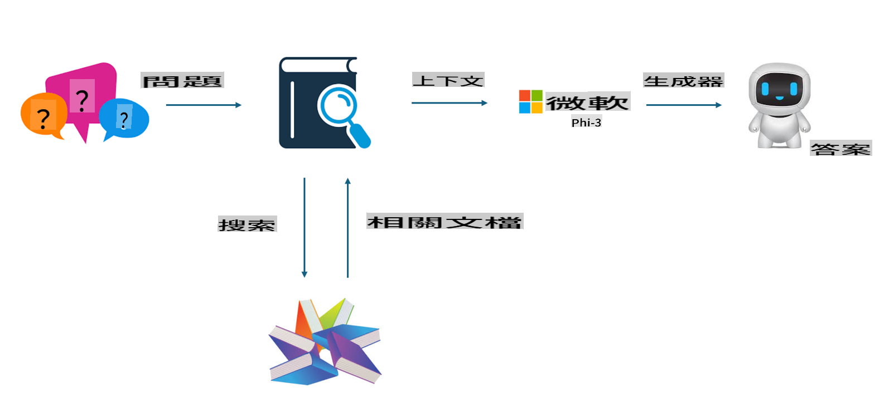

## Finetuning vs RAG

## Retrieval Augmented Generation

RAG adalah pengambilan data + pembuatan teks. Data terstruktur dan tidak terstruktur dari perusahaan disimpan dalam database vektor. Saat mencari konten yang relevan, ringkasan dan konten terkait ditemukan untuk membentuk konteks, lalu digabungkan dengan kemampuan pelengkapan teks dari LLM/SLM untuk menghasilkan konten.

## Proses RAG

## Fine-tuning
Fine-tuning adalah pengembangan lanjutan dari suatu model. Tidak perlu memulai dari algoritma model, tetapi data harus terus-menerus dikumpulkan. Jika Anda menginginkan terminologi dan ekspresi bahasa yang lebih presisi dalam aplikasi industri, fine-tuning adalah pilihan yang lebih baik. Namun, jika data Anda sering berubah, fine-tuning bisa menjadi rumit.

## Cara Memilih
Jika jawaban kita membutuhkan pengenalan data eksternal, RAG adalah pilihan terbaik.

Jika Anda perlu menghasilkan pengetahuan industri yang stabil dan presisi, fine-tuning akan menjadi pilihan yang baik. RAG mengutamakan pengambilan konten yang relevan, tetapi mungkin tidak selalu memahami nuansa khusus.

Fine-tuning memerlukan kumpulan data berkualitas tinggi, dan jika hanya mencakup data dalam skala kecil, dampaknya tidak akan signifikan. RAG lebih fleksibel.  
Fine-tuning adalah kotak hitam, semacam metafisika, dan sulit untuk memahami mekanisme internalnya. Tetapi RAG memungkinkan sumber data lebih mudah ditemukan, sehingga lebih efektif dalam menyesuaikan halusinasi atau kesalahan konten dan memberikan transparansi yang lebih baik.

It seems like "mo" could refer to a specific language or abbreviation, but it's not clear which one you're referring to. Could you clarify or provide more context? For example, are you referring to Māori, Mongolian, or another language?