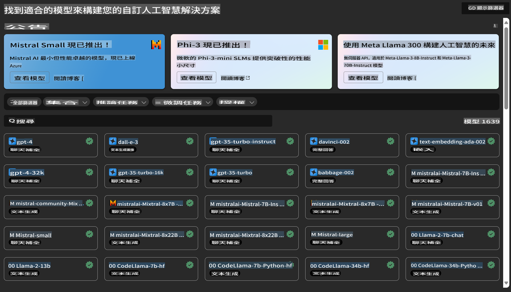
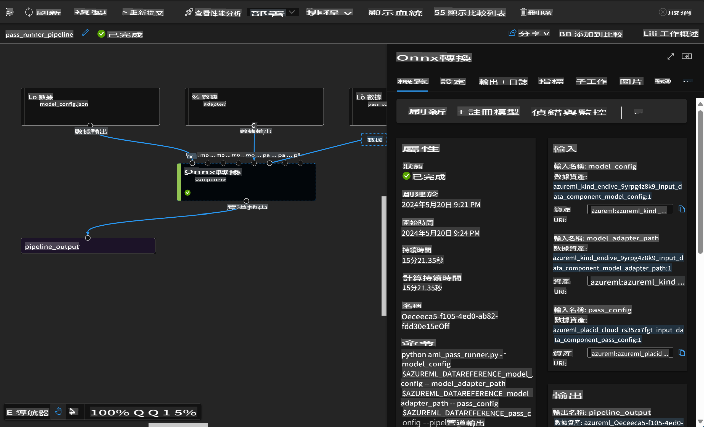

# **Azure Machine Learning 서비스를 소개합니다**

[Azure Machine Learning](https://ml.azure.com?WT.mc_id=aiml-138114-kinfeylo)은 머신 러닝(ML) 프로젝트 수명 주기를 가속화하고 관리하기 위한 클라우드 서비스입니다.

ML 전문가, 데이터 과학자, 엔지니어들은 일상적인 워크플로에서 이를 활용하여 다음과 같은 작업을 수행할 수 있습니다:

- 모델을 학습시키고 배포합니다.
- 머신 러닝 운영(MLOps)을 관리합니다.
- Azure Machine Learning에서 모델을 생성하거나 PyTorch, TensorFlow, scikit-learn과 같은 오픈 소스 플랫폼에서 만든 모델을 사용할 수 있습니다.
- MLOps 도구를 통해 모델을 모니터링하고, 재학습하며, 다시 배포할 수 있습니다.

## Azure Machine Learning은 누구를 위한 것인가요?

**데이터 과학자와 ML 엔지니어**

일상적인 워크플로를 가속화하고 자동화할 수 있는 도구를 사용할 수 있습니다.  
Azure ML은 공정성, 설명 가능성, 추적 가능성, 감사 가능성을 위한 기능을 제공합니다.

**애플리케이션 개발자**

모델을 애플리케이션이나 서비스에 매끄럽게 통합할 수 있습니다.

**플랫폼 개발자**

강력한 Azure Resource Manager API로 지원되는 도구 세트를 활용할 수 있습니다.  
이를 통해 고급 ML 도구를 구축할 수 있습니다.

**기업**

Microsoft Azure 클라우드 환경에서 작업하며, 친숙한 보안 및 역할 기반 액세스 제어의 이점을 누릴 수 있습니다.  
프로젝트를 설정하여 보호된 데이터와 특정 작업에 대한 액세스를 제어할 수 있습니다.

## 팀 전체를 위한 생산성

ML 프로젝트는 다양한 기술 집합을 가진 팀이 구축하고 유지해야 하는 경우가 많습니다.

Azure ML은 다음을 가능하게 하는 도구를 제공합니다:
- 공유된 노트북, 컴퓨팅 리소스, 서버리스 컴퓨팅, 데이터, 환경을 통해 팀과 협업합니다.
- 공정성, 설명 가능성, 추적 가능성, 감사 가능성을 갖춘 모델을 개발하여 계보 및 감사 규정 준수 요구 사항을 충족합니다.
- ML 모델을 빠르고 쉽게 대규모로 배포하고, MLOps를 통해 효율적으로 관리 및 운영합니다.
- 내장된 거버넌스, 보안, 규정 준수를 통해 어디서든 머신 러닝 작업을 실행합니다.

## 호환 가능한 플랫폼 도구

ML 팀의 누구든지 선호하는 도구를 사용하여 작업을 수행할 수 있습니다.  
빠른 실험 실행, 하이퍼파라미터 튜닝, 파이프라인 구축, 추론 관리 등에서 다음과 같은 익숙한 인터페이스를 사용할 수 있습니다:
- Azure Machine Learning Studio
- Python SDK (v2)
- Azure CLI (v2)
- Azure Resource Manager REST APIs

모델을 세밀하게 조정하고 개발 주기 동안 협업하면서 Azure Machine Learning Studio UI에서 자산, 리소스, 메트릭을 공유하고 찾을 수 있습니다.

## **Azure ML에서의 LLM/SLM**

Azure ML은 LLMOps 및 SLMOps를 결합하여 기업 전반의 생성형 인공지능 기술 플랫폼을 구축할 수 있는 다양한 LLM/SLM 관련 기능을 추가했습니다.

### **모델 카탈로그**

기업 사용자는 Model Catalog를 통해 다양한 비즈니스 시나리오에 맞는 모델을 배포하고, 이를 Model as Service로 제공하여 기업 개발자나 사용자가 접근할 수 있도록 합니다.

Azure Machine Learning Studio의 Model Catalog는 생성형 AI 애플리케이션을 구축할 수 있는 다양한 모델을 발견하고 활용할 수 있는 허브입니다.  
모델 카탈로그는 Azure OpenAI 서비스, Mistral, Meta, Cohere, Nvidia, Hugging Face, Microsoft가 학습시킨 모델 등 다양한 제공업체의 수백 가지 모델을 제공합니다.  
Microsoft가 아닌 제공업체의 모델은 Microsoft의 제품 약관에 정의된 Non-Microsoft Products로 간주되며, 모델과 함께 제공된 약관이 적용됩니다.

### **잡 파이프라인**

머신 러닝 파이프라인의 핵심은 완전한 머신 러닝 작업을 다단계 워크플로로 분할하는 것입니다.  
각 단계는 개별적으로 개발, 최적화, 구성 및 자동화할 수 있는 관리 가능한 구성 요소입니다.  
단계들은 잘 정의된 인터페이스를 통해 연결됩니다.  
Azure Machine Learning 파이프라인 서비스는 파이프라인 단계 간의 모든 종속성을 자동으로 조율합니다.

SLM/LLM의 파인튜닝에서는 파이프라인을 통해 데이터, 학습, 생성 프로세스를 관리할 수 있습니다.

### **프롬프트 플로우**

Azure Machine Learning 프롬프트 플로우의 이점  
Azure Machine Learning 프롬프트 플로우는 사용자가 아이디어 구상에서 실험, 그리고 궁극적으로는 LLM 기반의 프로덕션 애플리케이션으로 전환할 수 있도록 다양한 이점을 제공합니다:

**프롬프트 엔지니어링 민첩성**

- **인터랙티브한 작성 경험**: Azure Machine Learning 프롬프트 플로우는 흐름 구조를 시각적으로 표현하여 사용자가 프로젝트를 쉽게 이해하고 탐색할 수 있도록 합니다. 또한 노트북과 유사한 코딩 경험을 제공하여 효율적인 흐름 개발 및 디버깅을 지원합니다.  
- **프롬프트 튜닝을 위한 변형**: 사용자는 여러 프롬프트 변형을 생성하고 비교하여 반복적인 개선 과정을 촉진할 수 있습니다.  
- **평가**: 내장된 평가 흐름을 통해 사용자는 프롬프트와 흐름의 품질 및 효과를 평가할 수 있습니다.  
- **포괄적인 리소스**: Azure Machine Learning 프롬프트 플로우는 개발의 출발점이 되는 내장 도구, 샘플, 템플릿 라이브러리를 포함하여 창의성을 자극하고 프로세스를 가속화합니다.

**LLM 기반 애플리케이션을 위한 기업 준비성**

- **협업**: Azure Machine Learning 프롬프트 플로우는 팀 협업을 지원하여 여러 사용자가 프롬프트 엔지니어링 프로젝트에서 함께 작업하고, 지식을 공유하며, 버전 관리를 유지할 수 있도록 합니다.  
- **올인원 플랫폼**: Azure Machine Learning 프롬프트 플로우는 개발, 평가, 배포, 모니터링에 이르는 전체 프롬프트 엔지니어링 프로세스를 간소화합니다. 사용자는 흐름을 Azure Machine Learning 엔드포인트로 쉽게 배포하고, 실시간으로 성능을 모니터링하여 최적의 운영과 지속적인 개선을 보장할 수 있습니다.  
- **Azure Machine Learning 기업 준비 솔루션**: 프롬프트 플로우는 Azure Machine Learning의 강력한 기업 준비 솔루션을 활용하여 안전하고 확장 가능하며 신뢰할 수 있는 기반을 제공합니다. 이를 통해 흐름을 개발, 실험, 배포할 수 있습니다.

Azure Machine Learning 프롬프트 플로우를 통해 사용자는 프롬프트 엔지니어링 민첩성을 발휘하고, 효과적으로 협업하며, 성공적인 LLM 기반 애플리케이션 개발 및 배포를 위한 기업 등급 솔루션을 활용할 수 있습니다.

Azure ML의 컴퓨팅 파워, 데이터, 다양한 구성 요소를 결합하여 기업 개발자들은 손쉽게 자신만의 인공지능 애플리케이션을 구축할 수 있습니다.

It seems like "mo" might refer to a specific language or abbreviation, but it's not clear which one you are referring to. Could you please clarify or specify the language you would like the text translated into? For example, are you referring to Māori, Mongolian, or something else? Let me know so I can assist you accurately!