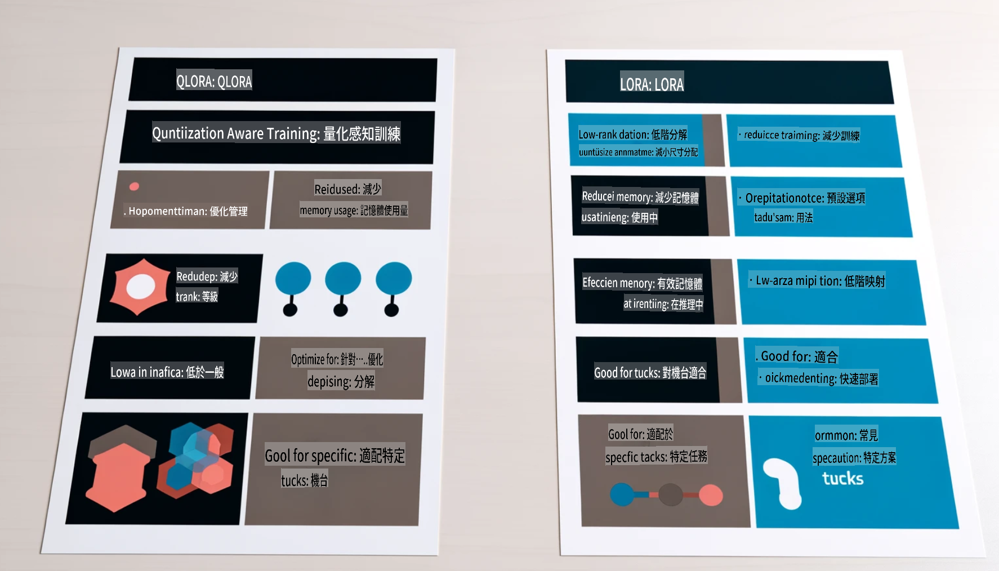

# **Let Phi-3 become an industry expert**

Phi-3 моделийг салбарт нэвтрүүлэхийн тулд тухайн салбарын бизнесийн өгөгдлийг Phi-3 моделд нэмэх шаардлагатай. Үүний тулд бидэнд хоёр өөр сонголт бий: RAG (Retrieval Augmented Generation) болон Fine Tuning.

## **RAG vs Fine-Tuning**

### **Retrieval Augmented Generation**

RAG бол өгөгдөл хайлт + текст үүсгэх хослол юм. Аж ахуйн нэгжийн бүтцэт болон бүтцэд ороогүй өгөгдлийг вектор өгөгдлийн санд хадгална. Холбогдох контентыг хайх үед холбогдох хураангуй болон агуулгыг олж, түүгээрээ контекст үүсгэн LLM/SLM-ийн текст үүсгэх чадвартай хослуулан контент гаргаж өгдөг.

### **Fine-tuning**

Fine-tuning нь тодорхой моделийг сайжруулахад суурилдаг. Энэ нь моделийн алгоритмаас эхлэх шаардлагагүй боловч өгөгдлийг тасралтгүй хуримтлуулах хэрэгтэй. Хэрэв салбарын хэрэглээнд илүү нарийвчилсан нэр томьёо, хэлний илэрхийлэл хэрэгтэй бол fine-tuning илүү тохиромжтой сонголт болно. Гэхдээ өгөгдөл байнга өөрчлөгдөж байдаг бол fine-tuning төвөгтэй болж болно.

### **Яаж сонгох вэ**

1. Хэрэв бидний хариулт гадаад өгөгдлийг оруулах шаардлагатай бол RAG хамгийн сайн сонголт.

2. Хэрэв тогтвортой, нарийн мэргэжлийн мэдлэг гаргах шаардлагатай бол fine-tuning илүү тохиромжтой. RAG нь холбогдох контентыг олоход түлхүү анхаардаг боловч мэргэжлийн нарийн мэдрэмжийг үргэлж хангаж чадахгүй.

3. Fine-tuning нь өндөр чанартай өгөгдлийн багц шаарддаг ба хэрэв зөвхөн бага хэмжээний өгөгдөл байгаа бол тийм ч их ялгаа гарахгүй. Харин RAG илүү уян хатан.

4. Fine-tuning бол хар хайрцаг мэт ойлгомжгүй процесс, дотоод механизмийг ойлгоход төвөгтэй. Харин RAG нь өгөгдлийн эх сурвалжийг олоход хялбар болгож, алдаа эсвэл хий үзэгдлийг засахад илүү ойлгомжтой болгодог.

### **Хэрэглэх тохиолдлууд**

1. Босоо салбарууд тодорхой мэргэжлийн үг хэллэг, илэрхийлэл шаарддаг бол ***Fine-tuning*** хамгийн сайн сонголт.

2. Янз бүрийн мэдлэгийн цэгүүдийг нэгтгэсэн QA системд ***RAG*** хамгийн сайн сонголт.

3. Автоматжуулсан бизнесийн урсгалын хослолд ***RAG + Fine-tuning*** хамгийн сайн сонголт.

## **RAG хэрхэн ашиглах вэ**

Вектор өгөгдлийн сан бол өгөгдлийг математик хэлбэрээр хадгалсан цуглуулга юм. Вектор өгөгдлийн сангууд нь машин сургалтын моделд өмнөх оруулгуудыг санахад хялбар болгож, хайлт, зөвлөмж, текст үүсгэх зэрэг хэрэгцээнд ашиглах боломжийг олгодог. Өгөгдлийг яг тохирсон биш харин ижил төстэй хэмжигдэхүүн дээр үндэслэн тодорхойлох боломжтой тул компьютерийн моделд өгөгдлийн контекстыг ойлгоход тусалдаг.

Вектор өгөгдлийн сан нь RAG-ийг хэрэгжүүлэх гол түлхүүр юм. Бид өгөгдлийг text-embedding-3, jina-ai-embedding гэх мэт вектор моделуудаар дамжуулан вектор хэлбэрт шилжүүлж хадгалах боломжтой.

RAG програм бүтээх талаар илүү ихийг мэдэхийг хүсвэл: [https://github.com/microsoft/Phi-3CookBook](https://github.com/microsoft/Phi-3CookBook?WT.mc_id=aiml-138114-kinfeylo) 

## **Fine-tuning хэрхэн ашиглах вэ**

Fine-tuning-д ихэвчлэн ашиглагддаг алгоритмууд нь Lora болон QLora юм. Аль нь тохиромжтойг хэрхэн сонгох вэ?
- [Энэ жишээ notebook-оос илүү ихийг сураарай](../../../../code/04.Finetuning/Phi_3_Inference_Finetuning.ipynb)
- [Python FineTuning жишээ скрипт](../../../../code/04.Finetuning/FineTrainingScript.py)

### **Lora ба QLora**

LoRA (Low-Rank Adaptation) болон QLoRA (Quantized Low-Rank Adaptation) нь хоёулаа томоохон хэлний моделиудыг (LLMs) Parameter Efficient Fine Tuning (PEFT) ашиглан тохируулах техникүүд юм. PEFT техникүүд нь уламжлалт аргуудаас илүү үр ашигтайгаар моделийг сургахад зориулагдсан.  
LoRA бол дангаараа тохируулах техник бөгөөд жин шинэчлэх матрицад бага зэрэглэлтэй ойролцоо тооцоолол ашигласнаар санах ойн хэрэглээг бууруулдаг. Энэ нь сургалтын хурд хурдан бөгөөд уламжлалт тохиргооны аргуудтай ойролцоо гүйцэтгэлийг хадгалдаг.  

QLoRA нь LoRA-г өргөтгөсөн хувилбар бөгөөд санах ойн хэрэглээг цаашид бууруулахын тулд тоончлолын техникийг ашигладаг. QLoRA нь урьдчилан сургагдсан LLM-ийн жингийн параметрүүдийг 4-битийн нарийвчлалтай тоончилж, LoRA-аас илүү санах ойд хэмнэлттэй болгодог. Гэсэн хэдий ч QLoRA сургалт нь нэмэлт тоончлол, тоонгүйжүүлэлтийн алхмуудын улмаас LoRA сургалтаас ойролцоогоор 30%-иар удаан байдаг.  

QLoRA нь тоончлолоос үүдэлтэй алдааг засахын тулд LoRA-г нэмэлт болгон ашигладаг. QLoRA нь харьцангуй жижиг, өргөн боломжтой GPU-үүд дээр хэдэн тэрбум параметртэй аварга моделийг тохируулах боломжийг олгодог. Жишээлбэл, QLoRA нь 70B параметртэй моделийг 36 GPU шаардлагатай байхад зөвхөн 2 GPU ашиглан тохируулах боломжтой.

It seems you have requested a translation to "mo," but it's unclear what language or dialect "mo" refers to. Could you clarify the language or provide more context? For example, are you referring to Māori, Mongolian, or another language? Let me know, and I'd be happy to assist!