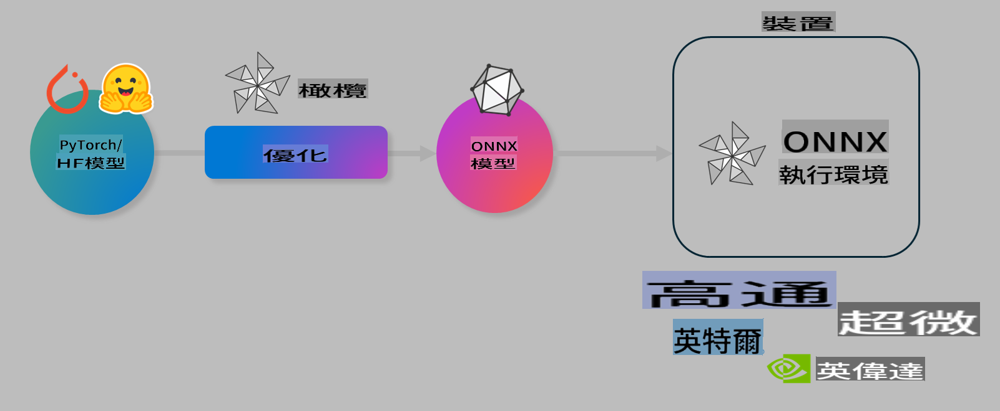

# Lab. Optimize AI models for on-device inference

## مقدمة

> [!IMPORTANT]
> يتطلب هذا المختبر وجود **Nvidia A10 أو A100 GPU** مع تثبيت التعريفات وأدوات CUDA (الإصدار 12+).

> [!NOTE]
> هذا المختبر مدته **35 دقيقة** وسيمنحك مقدمة عملية حول المفاهيم الأساسية لتحسين النماذج للاستخدام على الأجهزة باستخدام OLIVE.

## أهداف التعلم

بنهاية هذا المختبر، ستتمكن من استخدام OLIVE للقيام بـ:

- ضغط نموذج ذكاء اصطناعي باستخدام طريقة AWQ للضغط.
- تحسين نموذج ذكاء اصطناعي لمهمة محددة.
- إنشاء مكونات LoRA (نموذج محسّن) لتحقيق استدلال فعال على الأجهزة باستخدام ONNX Runtime.

### ما هو Olive

Olive (*O*NNX *live*) هي أداة لتحسين النماذج مع واجهة CLI مرافقة تمكنك من تشغيل النماذج على ONNX runtime +++https://onnxruntime.ai+++ بجودة وأداء عالٍ.



مدخلات Olive تكون عادة نموذج PyTorch أو Hugging Face، والمخرجات هي نموذج ONNX محسّن يتم تشغيله على جهاز (هدف النشر) يعمل على ONNX runtime. تقوم Olive بتحسين النموذج ليعمل مع معالج الذكاء الاصطناعي للجهاز (NPU، GPU، CPU) الذي توفره شركات مثل Qualcomm، AMD، Nvidia أو Intel.

تنفذ Olive ما يسمى بـ *workflow*، وهي سلسلة منظمة من مهام تحسين النماذج الفردية المعروفة بـ *passes* - تشمل الأمثلة: ضغط النموذج، التقاط الرسوم البيانية، الضغط الكمي، وتحسين الرسوم البيانية. كل مهمة تحتوي على مجموعة من المعلمات التي يمكن ضبطها لتحقيق أفضل المقاييس مثل الدقة والكمون، ويتم تقييمها بواسطة أداة التقييم المناسبة. تستخدم Olive استراتيجية بحث تعتمد على خوارزمية للبحث التلقائي عن أفضل ضبط للمهام، سواء بشكل فردي أو كمجموعة.

#### فوائد Olive

- **تقليل الإحباط والوقت** الذي يُهدر في التجربة والخطأ مع تقنيات تحسين الرسوم البيانية والضغط والضغط الكمي. فقط حدد قيود الجودة والأداء ودع Olive تجد النموذج الأفضل لك تلقائيًا.
- **أكثر من 40 مكونًا مدمجًا لتحسين النماذج** تغطي أحدث التقنيات في الضغط الكمي، الضغط، تحسين الرسوم البيانية، والتحسين.
- **واجهة CLI سهلة الاستخدام** للمهام الشائعة لتحسين النماذج. على سبيل المثال: olive quantize، olive auto-opt، olive finetune.
- تغليف النماذج ونشرها مدمج.
- يدعم إنشاء نماذج لـ **Multi LoRA serving**.
- إنشاء سير العمل باستخدام YAML/JSON لتنظيم مهام تحسين النماذج والنشر.
- تكامل مع **Hugging Face** و **Azure AI**.
- آلية **التخزين المؤقت المدمجة** لتوفير التكاليف.

## تعليمات المختبر
> [!NOTE]
> يرجى التأكد من إعداد Azure AI Hub والمشروع الخاص بك وإعداد وحدة A100 كما هو موضح في المختبر 1.

### الخطوة 0: الاتصال بحوسبة Azure AI

ستتصل بحوسبة Azure AI باستخدام ميزة الاتصال عن بُعد في **VS Code.**

1. افتح تطبيق سطح المكتب **VS Code**:
1. افتح **command palette** باستخدام **Shift+Ctrl+P**.
1. في command palette ابحث عن **AzureML - remote: Connect to compute instance in New Window**.
1. اتبع التعليمات الظاهرة على الشاشة للاتصال بالحوسبة. سيتضمن ذلك اختيار اشتراك Azure الخاص بك، مجموعة الموارد، المشروع، واسم الحوسبة التي أعددتها في المختبر 1.
1. بمجرد الاتصال بوحدة Azure ML Compute، سيتم عرض ذلك في **الزاوية السفلية اليسرى من Visual Code** `><Azure ML: Compute Name`.

### الخطوة 1: استنساخ هذا المستودع

في VS Code، يمكنك فتح نافذة طرفية جديدة باستخدام **Ctrl+J** واستنساخ هذا المستودع:

في الطرفية، يجب أن ترى المطالبة

```
azureuser@computername:~/cloudfiles/code$ 
```
استنساخ الحل 

```bash
cd ~/localfiles
git clone https://github.com/microsoft/phi-3cookbook.git
```

### الخطوة 2: فتح المجلد في VS Code

لفتح VS Code في المجلد المناسب، قم بتنفيذ الأمر التالي في الطرفية، والذي سيفتح نافذة جديدة:

```bash
code phi-3cookbook/code/04.Finetuning/Olive-lab
```

بدلاً من ذلك، يمكنك فتح المجلد من خلال تحديد **File** > **Open Folder**.

### الخطوة 3: التبعيات

افتح نافذة طرفية في VS Code داخل وحدة Azure AI Compute (نصيحة: **Ctrl+J**) ونفذ الأوامر التالية لتثبيت التبعيات:

```bash
conda create -n olive-ai python=3.11 -y
conda activate olive-ai
pip install -r requirements.txt
az extension remove -n azure-cli-ml
az extension add -n ml
```

> [!NOTE]
> سيستغرق تثبيت جميع التبعيات حوالي ~5 دقائق.

في هذا المختبر، ستقوم بتنزيل وتحميل النماذج إلى كتالوج نماذج Azure AI. للوصول إلى كتالوج النماذج، ستحتاج إلى تسجيل الدخول إلى Azure باستخدام:

```bash
az login
```

> [!NOTE]
> عند تسجيل الدخول، سيُطلب منك اختيار اشتراكك. تأكد من تعيين الاشتراك إلى الاشتراك المخصص لهذا المختبر.

### الخطوة 4: تنفيذ أوامر Olive

افتح نافذة طرفية في VS Code داخل وحدة Azure AI Compute (نصيحة: **Ctrl+J**) وتأكد من تفعيل بيئة `olive-ai` الخاصة بـ Conda:

```bash
conda activate olive-ai
```

بعد ذلك، قم بتنفيذ أوامر Olive التالية في سطر الأوامر.

1. **فحص البيانات:** في هذا المثال، ستقوم بتحسين نموذج Phi-3.5-Mini ليصبح متخصصًا في الإجابة على الأسئلة المتعلقة بالسفر. يعرض الكود أدناه السجلات القليلة الأولى من مجموعة البيانات، والتي تكون بصيغة JSON lines:

    ```bash
    head data/data_sample_travel.jsonl
    ```
    
1. **ضغط النموذج:** قبل تدريب النموذج، قم أولاً بضغطه باستخدام الأمر التالي الذي يستخدم تقنية تسمى الضغط الكمي النشط (AWQ) +++https://arxiv.org/abs/2306.00978+++. يقوم AWQ بضغط أوزان النموذج مع مراعاة التفعيلات الناتجة أثناء الاستدلال. هذا يعني أن عملية الضغط تأخذ في الاعتبار توزيع البيانات الفعلي في التفعيلات، مما يؤدي إلى الحفاظ بشكل أفضل على دقة النموذج مقارنةً بطرق الضغط التقليدية.

    ```bash
    olive quantize \
       --model_name_or_path microsoft/Phi-3.5-mini-instruct \
       --trust_remote_code \
       --algorithm awq \
       --output_path models/phi/awq \
       --log_level 1
    ```
    
    يستغرق **حوالي 8 دقائق** لإكمال الضغط الكمي AWQ، مما سيؤدي إلى **تقليل حجم النموذج من ~7.5GB إلى ~2.5GB**.
   
   في هذا المختبر، نعرض لك كيفية إدخال النماذج من Hugging Face (على سبيل المثال: `microsoft/Phi-3.5-mini-instruct`). However, Olive also allows you to input models from the Azure AI catalog by updating the `model_name_or_path` argument to an Azure AI asset ID (for example:  `azureml://registries/azureml/models/Phi-3.5-mini-instruct/versions/4`). 

1. **Train the model:** Next, the `olive finetune` لتحسين النموذج المضغوط. ضغط النموذج *قبل* تحسينه بدلاً من بعده يعطي دقة أفضل لأن عملية التحسين تعوض بعض الفقد الناتج عن الضغط.

    ```bash
    olive finetune \
        --method lora \
        --model_name_or_path models/phi/awq \
        --data_files "data/data_sample_travel.jsonl" \
        --data_name "json" \
        --text_template "<|user|>\n{prompt}<|end|>\n<|assistant|>\n{response}<|end|>" \
        --max_steps 100 \
        --output_path ./models/phi/ft \
        --log_level 1
    ```
    
    يستغرق **حوالي 6 دقائق** لإكمال التحسين (مع 100 خطوة).

1. **التحسين:** بعد تدريب النموذج، يمكنك الآن تحسينه باستخدام أمر Olive `auto-opt` command, which will capture the ONNX graph and automatically perform a number of optimizations to improve the model performance for CPU by compressing the model and doing fusions. It should be noted, that you can also optimize for other devices such as NPU or GPU by just updating the `--device` and `--provider` - ولكن لأغراض هذا المختبر سنستخدم CPU.

    ```bash
    olive auto-opt \
       --model_name_or_path models/phi/ft/model \
       --adapter_path models/phi/ft/adapter \
       --device cpu \
       --provider CPUExecutionProvider \
       --use_ort_genai \
       --output_path models/phi/onnx-ao \
       --log_level 1
    ```
    
    يستغرق **حوالي 5 دقائق** لإكمال التحسين.

### الخطوة 5: اختبار سريع لاستدلال النموذج

لاختبار استدلال النموذج، قم بإنشاء ملف Python في مجلدك باسم **app.py** ونسخ ولصق الكود التالي:

```python
import onnxruntime_genai as og
import numpy as np

print("loading model and adapters...", end="", flush=True)
model = og.Model("models/phi/onnx-ao/model")
adapters = og.Adapters(model)
adapters.load("models/phi/onnx-ao/model/adapter_weights.onnx_adapter", "travel")
print("DONE!")

tokenizer = og.Tokenizer(model)
tokenizer_stream = tokenizer.create_stream()

params = og.GeneratorParams(model)
params.set_search_options(max_length=100, past_present_share_buffer=False)
user_input = "what is the best thing to see in chicago"
params.input_ids = tokenizer.encode(f"<|user|>\n{user_input}<|end|>\n<|assistant|>\n")

generator = og.Generator(model, params)

generator.set_active_adapter(adapters, "travel")

print(f"{user_input}")

while not generator.is_done():
    generator.compute_logits()
    generator.generate_next_token()

    new_token = generator.get_next_tokens()[0]
    print(tokenizer_stream.decode(new_token), end='', flush=True)

print("\n")
```

قم بتنفيذ الكود باستخدام:

```bash
python app.py
```

### الخطوة 6: تحميل النموذج إلى Azure AI

تحميل النموذج إلى مستودع نماذج Azure AI يجعله قابلًا للمشاركة مع أعضاء فريق التطوير الآخرين ويتعامل أيضًا مع التحكم في إصدارات النموذج. لتحميل النموذج، قم بتشغيل الأمر التالي:

> [!NOTE]
> قم بتحديث `{}` placeholders with the name of your resource group and Azure AI Project Name. 

To find your resource group `"resourceGroup" واسم مشروع Azure AI، ثم قم بتشغيل الأمر التالي 

```
az ml workspace show
```

أو بالانتقال إلى +++ai.azure.com+++ وتحديد **management center** **project** **overview**.

قم بتحديث الأقواس `{}` بأسماء مجموعة الموارد واسم مشروع Azure AI الخاص بك.

```bash
az ml model create \
    --name ft-for-travel \
    --version 1 \
    --path ./models/phi/onnx-ao \
    --resource-group {RESOURCE_GROUP_NAME} \
    --workspace-name {PROJECT_NAME}
```
يمكنك بعد ذلك رؤية النموذج الذي تم تحميله ونشره في https://ml.azure.com/model/list

It seems like "mo" could refer to a specific language or dialect, but it's not clear which one you're referring to. Could you please clarify or provide more details about the language you want the text translated into? For example, is it Maori, Mongolian, or something else? Let me know so I can assist you better!