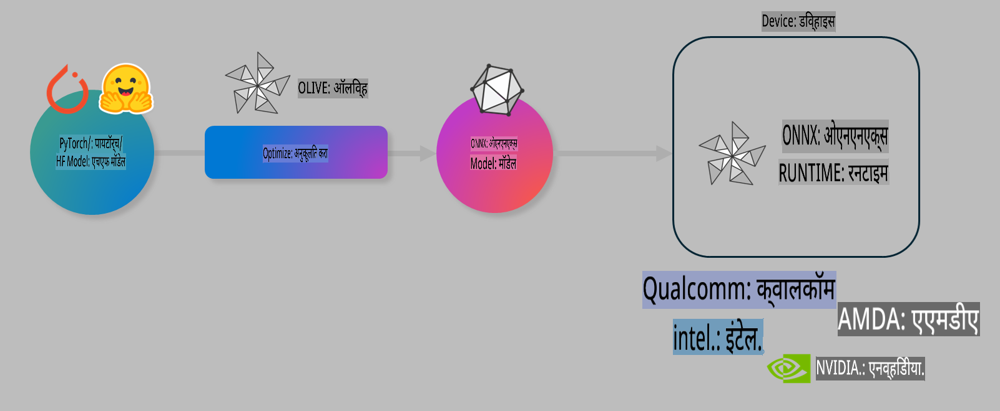

# लॅब. ऑन-डिव्हाइस इन्फरन्ससाठी AI मॉडेल्स ऑप्टिमाइझ करा

## परिचय 

> [!IMPORTANT]
> या लॅबसाठी **Nvidia A10 किंवा A100 GPU** आवश्यक आहे, त्यासोबत संबंधित ड्रायव्हर्स आणि CUDA टूलकिट (आवृत्ती 12+) स्थापित असणे आवश्यक आहे.

> [!NOTE]
> हा **35-मिनिटांचा** लॅब आहे, जो तुम्हाला OLIVE वापरून ऑन-डिव्हाइस इन्फरन्ससाठी मॉडेल ऑप्टिमायझेशनच्या मुख्य संकल्पनांमध्ये प्रत्यक्ष अनुभव देईल.

## शिकण्याची उद्दिष्टे

या लॅबच्या शेवटी, तुम्ही OLIVE वापरून खालील गोष्टी करू शकाल:

- AWQ क्वांटायझेशन पद्धतीचा वापर करून AI मॉडेल क्वांटाइज करा.
- विशिष्ट कार्यासाठी AI मॉडेल फाइन-ट्यून करा.
- ONNX Runtime वर कार्यक्षम ऑन-डिव्हाइस इन्फरन्ससाठी LoRA अडॅप्टर्स (फाइन-ट्यून केलेले मॉडेल) तयार करा.

### OLIVE म्हणजे काय

Olive (*O*NNX *live*) हे एक मॉडेल ऑप्टिमायझेशन टूलकिट आहे, ज्यामध्ये CLI समाविष्ट आहे. याचा उपयोग ONNX runtime +++https://onnxruntime.ai+++ साठी मॉडेल्स तयार करण्यासाठी होतो.



Olive साठी इनपुट सहसा PyTorch किंवा Hugging Face मॉडेल असतो, आणि आउटपुट एक ऑप्टिमाइझ केलेले ONNX मॉडेल असते, जे ONNX runtime चालवणाऱ्या डिव्हाइसवर (डिप्लॉयमेंट टार्गेट) चालवले जाते. Olive मॉडेलला हार्डवेअर विक्रेत्यांनी (उदा. Qualcomm, AMD, Nvidia, Intel) प्रदान केलेल्या AI अॅक्सेलेटर (NPU, GPU, CPU) साठी ऑप्टिमाइझ करते.

Olive एक *workflow* अंमलात आणते, जी वैयक्तिक मॉडेल ऑप्टिमायझेशन कार्यांची क्रमबद्ध मालिका असते, ज्यांना *passes* म्हणतात - उदाहरणार्थ: मॉडेल संकुचन, ग्राफ कॅप्चर, क्वांटायझेशन, ग्राफ ऑप्टिमायझेशन. प्रत्येक pass मध्ये काही पॅरामीटर्स असतात, जे सर्वोत्तम मेट्रिक्स (उदा. अचूकता आणि विलंब) मिळवण्यासाठी ट्यून केले जाऊ शकतात. Olive एक शोध धोरण वापरते, जे प्रत्येक pass किंवा passes च्या संचाला स्वयंचलितपणे ट्यून करते.

#### OLIVE चे फायदे

- ग्राफ ऑप्टिमायझेशन, संकुचन आणि क्वांटायझेशनसाठी मॅन्युअल प्रयोगांमधील त्रुटी आणि वेळ वाचवा. तुमच्या गुणवत्ता आणि कार्यक्षमतेच्या मर्यादा परिभाषित करा आणि Olive तुम्हाला सर्वोत्तम मॉडेल शोधून देईल.
- **40+ अंगभूत मॉडेल ऑप्टिमायझेशन घटक**, जे क्वांटायझेशन, संकुचन, ग्राफ ऑप्टिमायझेशन आणि फाइन-ट्यूनिंगमधील अत्याधुनिक तंत्रज्ञान समाविष्ट करतात.
- **सोपे CLI** सामान्य मॉडेल ऑप्टिमायझेशन कार्यांसाठी. उदाहरणार्थ: `olive quantize`, `olive auto-opt`, `olive finetune`.
- मॉडेल पॅकेजिंग आणि डिप्लॉयमेंट समाविष्ट.
- **मल्टी LoRA सर्व्हिंग** साठी मॉडेल तयार करण्यास समर्थन.
- YAML/JSON वापरून कार्यप्रवाह तयार करा, जे मॉडेल ऑप्टिमायझेशन आणि डिप्लॉयमेंट कार्ये समन्वित करतात.
- **Hugging Face** आणि **Azure AI** समाकलन.
- **कॅशिंग** यंत्रणा अंतर्भूत, जी **खर्च वाचवते**.

## लॅब सूचना
> [!NOTE]
> कृपया सुनिश्चित करा की तुम्ही Azure AI Hub आणि प्रकल्प तयार केला आहे आणि Lab 1 प्रमाणे A100 compute सेटअप केला आहे.

### पायरी 0: Azure AI Compute शी कनेक्ट करा

तुम्ही **VS Code** च्या रिमोट वैशिष्ट्याचा वापर करून Azure AI compute शी कनेक्ट व्हाल.

1. तुमचे **VS Code** डेस्कटॉप अॅप्लिकेशन उघडा:
1. **Shift+Ctrl+P** वापरून **command palette** उघडा.
1. कमांड पॅलेटमध्ये **AzureML - remote: Connect to compute instance in New Window** शोधा.
1. स्क्रीनवरील सूचनांचे अनुसरण करा, ज्यामध्ये तुम्ही Azure Subscription, Resource Group, Project आणि Compute नाव निवडाल, जे तुम्ही Lab 1 मध्ये सेट केले आहे.
1. एकदा Azure ML Compute node शी कनेक्ट झाल्यावर, हे **Visual Code च्या खालच्या डाव्या कोपऱ्यात** दिसेल `><Azure ML: Compute Name`

### पायरी 1: हे रिपॉझिटरी क्लोन करा

VS Code मध्ये, **Ctrl+J** वापरून नवीन टर्मिनल उघडा आणि हे रिपॉझिटरी क्लोन करा:

टर्मिनलमध्ये तुम्हाला प्रॉम्प्ट दिसेल:

```
azureuser@computername:~/cloudfiles/code$ 
```
सोल्यूशन क्लोन करा 

```bash
cd ~/localfiles
git clone https://github.com/microsoft/phi-3cookbook.git
```

### पायरी 2: VS Code मध्ये फोल्डर उघडा

संबंधित फोल्डरमध्ये VS Code उघडण्यासाठी, टर्मिनलमध्ये खालील कमांड चालवा, ज्यामुळे नवीन विंडो उघडेल:

```bash
code phi-3cookbook/code/04.Finetuning/Olive-lab
```

पर्यायी पद्धत म्हणून, **File** > **Open Folder** निवडून फोल्डर उघडा. 

### पायरी 3: Dependencies

VS Code मधील Azure AI Compute Instance मध्ये टर्मिनल उघडा (टीप: **Ctrl+J**) आणि खालील कमांड्स वापरून dependencies स्थापित करा:

```bash
conda create -n olive-ai python=3.11 -y
conda activate olive-ai
pip install -r requirements.txt
az extension remove -n azure-cli-ml
az extension add -n ml
```

> [!NOTE]
> सर्व dependencies स्थापित होण्यासाठी **~5 मिनिटे** लागतील.

या लॅबमध्ये तुम्ही Azure AI Model catalog वर मॉडेल्स डाउनलोड आणि अपलोड कराल. मॉडेल कॅटलॉगमध्ये प्रवेश करण्यासाठी, Azure मध्ये लॉगिन करण्यासाठी खालील कमांड वापरा:

```bash
az login
```

> [!NOTE]
> लॉगिन करताना तुम्हाला तुमची सबस्क्रिप्शन निवडण्यास सांगितले जाईल. कृपया लॅबसाठी प्रदान केलेली सबस्क्रिप्शन निवडा.

### पायरी 4: Olive कमांड्स चालवा

VS Code मधील Azure AI Compute Instance मध्ये टर्मिनल उघडा (टीप: **Ctrl+J**) आणि `olive-ai` कॉन्डा एन्व्हायर्नमेंट सक्रिय असल्याचे सुनिश्चित करा:

```bash
conda activate olive-ai
```

त्यानंतर, खालील Olive कमांड्स कमांड लाइनमध्ये चालवा.

1. **डेटा तपासा:** या उदाहरणात, तुम्ही Phi-3.5-Mini मॉडेल फाइन-ट्यून करणार आहात, ज्यामुळे ते प्रवासाशी संबंधित प्रश्नांची उत्तरे देण्यासाठी विशेषीकृत होईल. खालील कोड डेटासेटमधील काही प्रारंभिक नोंदी JSON lines स्वरूपात दाखवतो:

    ```bash
    head data/data_sample_travel.jsonl
    ```
    
1. **मॉडेल क्वांटाइज करा:** मॉडेल ट्रेन करण्यापूर्वी, खालील कमांड वापरून ते क्वांटाइज करा, जे Active Aware Quantization (AWQ) +++https://arxiv.org/abs/2306.00978+++ नावाच्या तंत्राचा वापर करते. AWQ मॉडेलच्या वेट्सना क्वांटाइज करते, ज्यामध्ये इन्फरन्स दरम्यान तयार होणाऱ्या अॅक्टिव्हेशन्सचा विचार केला जातो. त्यामुळे पारंपरिक वेट क्वांटायझेशन पद्धतींशी तुलना करता मॉडेल अचूकता चांगल्या प्रकारे जपली जाते.

    ```bash
    olive quantize \
       --model_name_or_path microsoft/Phi-3.5-mini-instruct \
       --trust_remote_code \
       --algorithm awq \
       --output_path models/phi/awq \
       --log_level 1
    ```
    
    AWQ क्वांटायझेशन पूर्ण होण्यासाठी **~8 मिनिटे** लागतात, ज्यामुळे मॉडेलचा आकार **~7.5GB वरून ~2.5GB** पर्यंत कमी होतो.
    
    या लॅबमध्ये, आम्ही तुम्हाला Hugging Face वरून मॉडेल्स इनपुट कसे करायचे हे दाखवत आहोत (उदा.: `microsoft/Phi-3.5-mini-instruct`). However, Olive also allows you to input models from the Azure AI catalog by updating the `model_name_or_path` argument to an Azure AI asset ID (for example:  `azureml://registries/azureml/models/Phi-3.5-mini-instruct/versions/4`). 

1. **Train the model:** Next, the `olive finetune` कमांड क्वांटाइज केलेले मॉडेल फाइन-ट्यून करते. फाइन-ट्यूनिंगच्या आधी मॉडेल क्वांटाइज केल्याने अचूकता चांगली मिळते, कारण फाइन-ट्यूनिंग प्रक्रियेमुळे क्वांटायझेशनमुळे झालेल्या नुकसानीची भरपाई होते.

    ```bash
    olive finetune \
        --method lora \
        --model_name_or_path models/phi/awq \
        --data_files "data/data_sample_travel.jsonl" \
        --data_name "json" \
        --text_template "<|user|>\n{prompt}<|end|>\n<|assistant|>\n{response}<|end|>" \
        --max_steps 100 \
        --output_path ./models/phi/ft \
        --log_level 1
    ```
    
    फाइन-ट्यूनिंग पूर्ण होण्यासाठी (100 स्टेप्ससह) **~6 मिनिटे** लागतात.

1. **ऑप्टिमायझेशन:** मॉडेल प्रशिक्षित झाल्यानंतर, Olive च्या `auto-opt` command, which will capture the ONNX graph and automatically perform a number of optimizations to improve the model performance for CPU by compressing the model and doing fusions. It should be noted, that you can also optimize for other devices such as NPU or GPU by just updating the `--device` and `--provider` arguments वापरून मॉडेल ऑप्टिमाइझ करा - परंतु या लॅबच्या उद्देशासाठी आपण CPU वापरणार आहोत.

    ```bash
    olive auto-opt \
       --model_name_or_path models/phi/ft/model \
       --adapter_path models/phi/ft/adapter \
       --device cpu \
       --provider CPUExecutionProvider \
       --use_ort_genai \
       --output_path models/phi/onnx-ao \
       --log_level 1
    ```
    
    ऑप्टिमायझेशन पूर्ण होण्यासाठी **~5 मिनिटे** लागतात.

### पायरी 5: मॉडेल इन्फरन्स जलद चाचणी

मॉडेल इन्फरन्स चाचणीसाठी, तुमच्या फोल्डरमध्ये **app.py** नावाची Python फाइल तयार करा आणि खालील कोड कॉपी-पेस्ट करा:

```python
import onnxruntime_genai as og
import numpy as np

print("loading model and adapters...", end="", flush=True)
model = og.Model("models/phi/onnx-ao/model")
adapters = og.Adapters(model)
adapters.load("models/phi/onnx-ao/model/adapter_weights.onnx_adapter", "travel")
print("DONE!")

tokenizer = og.Tokenizer(model)
tokenizer_stream = tokenizer.create_stream()

params = og.GeneratorParams(model)
params.set_search_options(max_length=100, past_present_share_buffer=False)
user_input = "what is the best thing to see in chicago"
params.input_ids = tokenizer.encode(f"<|user|>\n{user_input}<|end|>\n<|assistant|>\n")

generator = og.Generator(model, params)

generator.set_active_adapter(adapters, "travel")

print(f"{user_input}")

while not generator.is_done():
    generator.compute_logits()
    generator.generate_next_token()

    new_token = generator.get_next_tokens()[0]
    print(tokenizer_stream.decode(new_token), end='', flush=True)

print("\n")
```

कोड चालवण्यासाठी खालील कमांड वापरा:

```bash
python app.py
```

### पायरी 6: मॉडेल Azure AI वर अपलोड करा

मॉडेल Azure AI मॉडेल रिपॉझिटरीवर अपलोड केल्याने ते तुमच्या विकास कार्यसंघाच्या इतर सदस्यांसोबत शेअर करता येते आणि मॉडेलचे व्हर्जन कंट्रोल देखील होते. मॉडेल अपलोड करण्यासाठी खालील कमांड चालवा:

> [!NOTE]
> `{}` ` placeholders with the name of your resource group and Azure AI Project Name. 

To find your resource group ``resourceGroup` आणि Azure AI प्रकल्पाचे नाव अपडेट करा आणि खालील कमांड चालवा:

```
az ml workspace show
```

किंवा +++ai.azure.com+++ ला जाऊन **management center** > **project** > **overview** निवडा.

`{}` प्लेसहोल्डर्सला तुमच्या resource group आणि Azure AI प्रकल्पाच्या नावाने अपडेट करा.

```bash
az ml model create \
    --name ft-for-travel \
    --version 1 \
    --path ./models/phi/onnx-ao \
    --resource-group {RESOURCE_GROUP_NAME} \
    --workspace-name {PROJECT_NAME}
```
त्यानंतर, तुम्ही तुमचे अपलोड केलेले मॉडेल पाहू शकता आणि तुमचे मॉडेल येथे डिप्लॉय करू शकता: https://ml.azure.com/model/list

**अस्वीकृती**:  
हे दस्तऐवज मशीन-आधारित AI भाषांतर सेवा वापरून भाषांतरित केले गेले आहे. आम्ही अचूकतेसाठी प्रयत्नशील असलो तरी, कृपया लक्षात घ्या की स्वयंचलित भाषांतरांमध्ये त्रुटी किंवा अचूकतेचा अभाव असू शकतो. मूळ भाषेतील मूळ दस्तऐवज अधिकृत स्रोत मानला जावा. महत्त्वाच्या माहितीकरिता, व्यावसायिक मानव-भाषांतराचा सल्ला घेणे शिफारसीय आहे. या भाषांतराच्या वापरामुळे उद्भवलेल्या कोणत्याही गैरसमजुती किंवा चुकीच्या अर्थ लावण्यास आम्ही जबाबदार राहणार नाही.