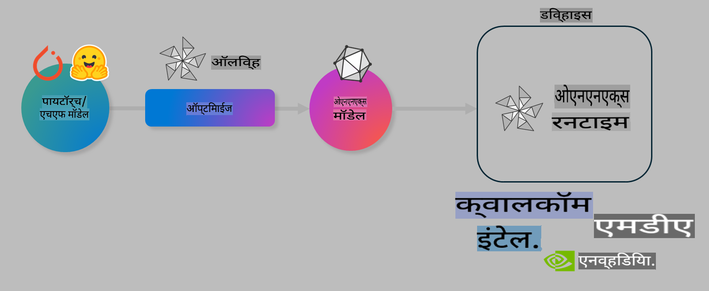

# प्रयोगशाळा. ऑन-डिव्हाइस इनफरन्ससाठी एआय मॉडेल्स ऑप्टिमाइझ करा

## परिचय 

> [!IMPORTANT]
> या प्रयोगशाळेसाठी **Nvidia A10 किंवा A100 GPU** आणि त्यासोबतचे ड्रायव्हर्स आणि CUDA टूलकिट (आवृत्ती 12+) आवश्यक आहेत.

> [!NOTE]
> ही एक **35-मिनिटांची** प्रयोगशाळा आहे, जी तुम्हाला OLIVE वापरून ऑन-डिव्हाइस इनफरन्ससाठी मॉडेल्स ऑप्टिमाइझ करण्याच्या मुख्य संकल्पनांचा प्रत्यक्ष अनुभव देईल.

## शिकण्याची उद्दिष्टे

या प्रयोगशाळेच्या शेवटी, तुम्ही OLIVE वापरून खालील गोष्टी करू शकाल:

- AWQ क्वांटायझेशन पद्धती वापरून एआय मॉडेल क्वांटायझ करणे.
- विशिष्ट कार्यासाठी एआय मॉडेल फाइन-ट्यून करणे.
- ONNX Runtime वर कार्यक्षम ऑन-डिव्हाइस इनफरन्ससाठी LoRA अ‍ॅडॉप्टर्स (फाइन-ट्यून केलेले मॉडेल) तयार करणे.

### Olive म्हणजे काय

Olive (*O*NNX *live*) हे एक मॉडेल ऑप्टिमायझेशन टूलकिट आहे, ज्यासोबत CLI येते, जे तुम्हाला ONNX runtime +++https://onnxruntime.ai+++ साठी मॉडेल्स तयार करण्यास सक्षम करते.



Olive साठी इनपुट सहसा PyTorch किंवा Hugging Face मॉडेल असते आणि आउटपुट एक ऑप्टिमाइझ केलेले ONNX मॉडेल असते, जे ONNX runtime चालवणाऱ्या डिव्हाइस (डिप्लॉयमेंट टार्गेट) वर कार्यान्वित होते. Olive डिप्लॉयमेंट टार्गेटच्या AI अ‍ॅक्सेलेरेटर (NPU, GPU, CPU) साठी मॉडेल ऑप्टिमाइझ करते, जे Qualcomm, AMD, Nvidia किंवा Intel सारख्या हार्डवेअर विक्रेत्याने प्रदान केलेले असते.

Olive एक *workflow* चालवते, जे वैयक्तिक मॉडेल ऑप्टिमायझेशन टास्क्सच्या क्रमबद्ध मालिकेचे प्रतिनिधित्व करते, ज्याला *passes* म्हणतात - उदा. मॉडेल कॉम्प्रेशन, ग्राफ कॅप्चर, क्वांटायझेशन, ग्राफ ऑप्टिमायझेशन. प्रत्येक पाससाठी विशिष्ट मेट्रिक्स (उदा. अचूकता आणि विलंब) साध्य करण्यासाठी ट्यून करता येणाऱ्या पॅरामीटर्सचा संच असतो, ज्यांचे मूल्यांकन संबंधित इव्हॅल्युएटरद्वारे केले जाते. Olive एक शोध धोरण वापरते, जे प्रत्येक पास किंवा पासेसच्या संचाला स्वयंचलितपणे ट्यून करण्यासाठी शोध अल्गोरिदम वापरते.

#### Olive चे फायदे

- ग्राफ ऑप्टिमायझेशन, कॉम्प्रेशन आणि क्वांटायझेशनसाठी वेगवेगळ्या तंत्रांवर मॅन्युअल प्रयोग करण्याच्या चाचण्या आणि चुका यामध्ये लागणारा **त्रास आणि वेळ कमी करा.** तुमच्या गुणवत्ता आणि कार्यक्षमता मर्यादा परिभाषित करा आणि Olive तुमच्यासाठी सर्वोत्तम मॉडेल शोधू द्या.
- **40+ अंगभूत मॉडेल ऑप्टिमायझेशन घटक** जे क्वांटायझेशन, कॉम्प्रेशन, ग्राफ ऑप्टिमायझेशन आणि फाइन-ट्यूनिंगमधील अत्याधुनिक तंत्रांचा समावेश करतात.
- **सोपे CLI** सामान्य मॉडेल ऑप्टिमायझेशन टास्क्ससाठी. उदा. olive quantize, olive auto-opt, olive finetune.
- मॉडेल पॅकेजिंग आणि डिप्लॉयमेंट अंतर्भूत.
- **मल्टी LoRA सर्व्हिंग** साठी मॉडेल्स तयार करण्यास समर्थन.
- YAML/JSON वापरून वर्कफ्लोज तयार करा, जे मॉडेल ऑप्टिमायझेशन आणि डिप्लॉयमेंट टास्क्स ऑर्केस्ट्रेट करतात.
- **Hugging Face** आणि **Azure AI** चे एकत्रीकरण.
- खर्च वाचवण्यासाठी अंगभूत **कॅशिंग** यंत्रणा.

## प्रयोगशाळेच्या सूचना
> [!NOTE]
> कृपया सुनिश्चित करा की तुम्ही Azure AI Hub आणि प्रकल्प तयार केला आहे आणि Lab 1 नुसार तुमचे A100 संगणक सेटअप केले आहे.

### Step 0: Azure AI Compute शी कनेक्ट करा

तुम्ही **VS Code** मधील रिमोट वैशिष्ट्य वापरून Azure AI compute शी कनेक्ट कराल.

1. तुमचा **VS Code** डेस्कटॉप अ‍ॅप्लिकेशन उघडा:
1. **Shift+Ctrl+P** वापरून **कमांड पॅलेट** उघडा.
1. कमांड पॅलेटमध्ये **AzureML - remote: Connect to compute instance in New Window** शोधा.
1. Compute शी कनेक्ट होण्यासाठी ऑन-स्क्रीन सूचना फॉलो करा. यामध्ये तुम्ही Lab 1 मध्ये सेट केलेल्या Azure Subscription, Resource Group, Project आणि Compute नाव निवडणे समाविष्ट असेल.
1. एकदा तुम्ही Azure ML Compute नोडशी कनेक्ट झाल्यावर, हे **Visual Code च्या डाव्या खालच्या कोपऱ्यात** प्रदर्शित होईल `><Azure ML: Compute Name`

### Step 1: हे रेपो क्लोन करा

VS Code मध्ये, **Ctrl+J** वापरून नवीन टर्मिनल उघडा आणि हे रेपो क्लोन करा:

टर्मिनलमध्ये तुम्हाला खालीलप्रमाणे प्रोम्प्ट दिसेल:

```
azureuser@computername:~/cloudfiles/code$ 
```
सोल्युशन क्लोन करा

```bash
cd ~/localfiles
git clone https://github.com/microsoft/phi-3cookbook.git
```

### Step 2: VS Code मध्ये फोल्डर उघडा

संबंधित फोल्डरमध्ये VS Code उघडण्यासाठी, टर्मिनलमध्ये खालील कमांड कार्यान्वित करा, ज्यामुळे नवीन विंडो उघडेल:

```bash
code phi-3cookbook/code/04.Finetuning/Olive-lab
```

पर्यायी, तुम्ही **File** > **Open Folder** निवडून फोल्डर उघडू शकता.

### Step 3: Dependencies

Azure AI Compute Instance मधील VS Code मध्ये टर्मिनल विंडो उघडा (टीप: **Ctrl+J**) आणि डिपेंडन्सी इन्स्टॉल करण्यासाठी खालील कमांड्स चालवा:

```bash
conda create -n olive-ai python=3.11 -y
conda activate olive-ai
pip install -r requirements.txt
az extension remove -n azure-cli-ml
az extension add -n ml
```

> [!NOTE]
> सर्व डिपेंडन्सी इन्स्टॉल होण्यासाठी ~5 मिनिटे लागतील.

या प्रयोगशाळेत तुम्ही Azure AI Model catalog मध्ये मॉडेल्स डाउनलोड आणि अपलोड कराल. मॉडेल कॅटलॉग ऍक्सेस करण्यासाठी, तुम्हाला Azure मध्ये लॉगिन करणे आवश्यक आहे:

```bash
az login
```

> [!NOTE]
> लॉगिनच्या वेळी तुम्हाला तुमची सबस्क्रिप्शन निवडण्यास सांगितले जाईल. या प्रयोगशाळेसाठी प्रदान केलेली सबस्क्रिप्शन निवडण्याचे सुनिश्चित करा.

### Step 4: Olive कमांड्स चालवा

Azure AI Compute Instance मधील VS Code मध्ये टर्मिनल विंडो उघडा (टीप: **Ctrl+J**) आणि सुनिश्चित करा की `olive-ai` कोंडा एन्व्हायर्नमेंट अ‍ॅक्टिव्हेटेड आहे:

```bash
conda activate olive-ai
```

यानंतर, खालील Olive कमांड्स कमांड लाइनमध्ये चालवा.

1. **डेटा तपासा:** या उदाहरणात, तुम्ही Phi-3.5-Mini मॉडेल फाइन-ट्यून करणार आहात, जे प्रवासाशी संबंधित प्रश्नांची उत्तरे देण्यासाठी विशेषीकृत आहे. खालील कोड डेटासेटमधील पहिल्या काही रेकॉर्ड्स प्रदर्शित करतो, जे JSON lines फॉरमॅटमध्ये आहेत:
   
    ```bash
    head data/data_sample_travel.jsonl
    ```
1. **मॉडेल क्वांटायझ करा:** मॉडेल ट्रेन करण्यापूर्वी, तुम्ही खालील कमांडसह क्वांटायझेशन करता, ज्यामध्ये Active Aware Quantization (AWQ) +++https://arxiv.org/abs/2306.00978+++ नावाची तंत्रिका वापरली जाते. AWQ मॉडेलच्या वेट्सना क्वांटायझ करते, इनफरन्स दरम्यान तयार होणाऱ्या अ‍ॅक्टिव्हेशन्सचा विचार करून. यामुळे पारंपरिक वेट क्वांटायझेशन पद्धतींच्या तुलनेत मॉडेलची अचूकता अधिक चांगल्या प्रकारे टिकून राहते.
    
    ```bash
    olive quantize \
       --model_name_or_path microsoft/Phi-3.5-mini-instruct \
       --trust_remote_code \
       --algorithm awq \
       --output_path models/phi/awq \
       --log_level 1
    ```
    
    AWQ क्वांटायझेशन पूर्ण होण्यासाठी **~8 मिनिटे** लागतात, ज्यामुळे **मॉडेलचा आकार ~7.5GB वरून ~2.5GB पर्यंत कमी होतो.**
   
   या प्रयोगशाळेत, आम्ही तुम्हाला Hugging Face मधून मॉडेल्स इनपुट करण्याचे दाखवत आहोत (उदा.: `microsoft/Phi-3.5-mini-instruct`). However, Olive also allows you to input models from the Azure AI catalog by updating the `model_name_or_path` argument to an Azure AI asset ID (for example:  `azureml://registries/azureml/models/Phi-3.5-mini-instruct/versions/4`). 

1. **Train the model:** Next, the `olive finetune` कमांड क्वांटायझ केलेले मॉडेल फाइन-ट्यून करते. क्वांटायझेशन *नंतर* फाइन-ट्यूनिंग करण्याऐवजी आधी केल्याने चांगली अचूकता मिळते, कारण फाइन-ट्यूनिंग प्रक्रियेदरम्यान क्वांटायझेशनमुळे होणारा तोटा काही प्रमाणात भरून निघतो.
    
    ```bash
    olive finetune \
        --method lora \
        --model_name_or_path models/phi/awq \
        --data_files "data/data_sample_travel.jsonl" \
        --data_name "json" \
        --text_template "<|user|>\n{prompt}<|end|>\n<|assistant|>\n{response}<|end|>" \
        --max_steps 100 \
        --output_path ./models/phi/ft \
        --log_level 1
    ```
    
    फाइन-ट्यूनिंग (100 स्टेप्ससह) पूर्ण होण्यासाठी **~6 मिनिटे** लागतात.

1. **ऑप्टिमाइझ करा:** मॉडेल ट्रेन झाल्यावर, तुम्ही Olive च्या `auto-opt` command, which will capture the ONNX graph and automatically perform a number of optimizations to improve the model performance for CPU by compressing the model and doing fusions. It should be noted, that you can also optimize for other devices such as NPU or GPU by just updating the `--device` and `--provider` arguments वापरून मॉडेल ऑप्टिमाइझ करता - परंतु या प्रयोगशाळेसाठी आपण CPU वापरणार आहोत.

    ```bash
    olive auto-opt \
       --model_name_or_path models/phi/ft/model \
       --adapter_path models/phi/ft/adapter \
       --device cpu \
       --provider CPUExecutionProvider \
       --use_ort_genai \
       --output_path models/phi/onnx-ao \
       --log_level 1
    ```
    
    ऑप्टिमायझेशन पूर्ण होण्यासाठी **~5 मिनिटे** लागतात.

### Step 5: मॉडेल इनफरन्स जलद चाचणी

मॉडेल इनफरन्स चाचणीसाठी, तुमच्या फोल्डरमध्ये **app.py** नावाची Python फाइल तयार करा आणि खालील कोड कॉपी-पेस्ट करा:

```python
import onnxruntime_genai as og
import numpy as np

print("loading model and adapters...", end="", flush=True)
model = og.Model("models/phi/onnx-ao/model")
adapters = og.Adapters(model)
adapters.load("models/phi/onnx-ao/model/adapter_weights.onnx_adapter", "travel")
print("DONE!")

tokenizer = og.Tokenizer(model)
tokenizer_stream = tokenizer.create_stream()

params = og.GeneratorParams(model)
params.set_search_options(max_length=100, past_present_share_buffer=False)
user_input = "what is the best thing to see in chicago"
params.input_ids = tokenizer.encode(f"<|user|>\n{user_input}<|end|>\n<|assistant|>\n")

generator = og.Generator(model, params)

generator.set_active_adapter(adapters, "travel")

print(f"{user_input}")

while not generator.is_done():
    generator.compute_logits()
    generator.generate_next_token()

    new_token = generator.get_next_tokens()[0]
    print(tokenizer_stream.decode(new_token), end='', flush=True)

print("\n")
```

कोड चालवण्यासाठी:

```bash
python app.py
```

### Step 6: मॉडेल Azure AI मध्ये अपलोड करा

मॉडेल Azure AI मॉडेल रिपॉझिटरीमध्ये अपलोड केल्याने मॉडेल तुमच्या विकास टीमच्या इतर सदस्यांसोबत शेअर करता येते आणि मॉडेलचे व्हर्जन नियंत्रणही होते. मॉडेल अपलोड करण्यासाठी खालील कमांड चालवा:

> [!NOTE]
> `{}`` placeholders with the name of your resource group and Azure AI Project Name. 

To find your resource group `"resourceGroup" आणि Azure AI प्रकल्पाचे नाव अपडेट करा आणि खालील कमांड चालवा:

```
az ml workspace show
```

किंवा +++ai.azure.com+++ वर जा आणि **management center** > **project** > **overview** निवडा.

`{}` प्लेसहोल्डर्स तुमच्या Resource Group आणि Azure AI Project Name ने अपडेट करा.

```bash
az ml model create \
    --name ft-for-travel \
    --version 1 \
    --path ./models/phi/onnx-ao \
    --resource-group {RESOURCE_GROUP_NAME} \
    --workspace-name {PROJECT_NAME}
```
तुम्ही तुमचे अपलोड केलेले मॉडेल पाहू शकता आणि https://ml.azure.com/model/list येथे तुमचे मॉडेल डिप्लॉय करू शकता.

**अस्वीकरण**:  
हे दस्तऐवज मशीन-आधारित AI भाषांतर सेवांचा वापर करून अनुवादित केले गेले आहे. आम्ही अचूकतेसाठी प्रयत्नशील असलो तरी, कृपया लक्षात ठेवा की स्वयंचलित भाषांतरे त्रुटी किंवा अचूकतेच्या कमतरतेसह येऊ शकतात. मूळ भाषेतील मूळ दस्तऐवज हा अधिकृत स्रोत मानला पाहिजे. महत्त्वाच्या माहितीसाठी व्यावसायिक मानव अनुवादाची शिफारस केली जाते. या भाषांतराच्या वापरामुळे होणाऱ्या कोणत्याही गैरसमजुतींसाठी किंवा चुकीच्या अर्थ लावण्यास आम्ही जबाबदार राहणार नाही.