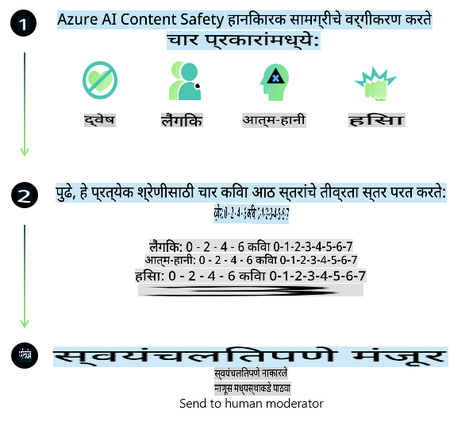
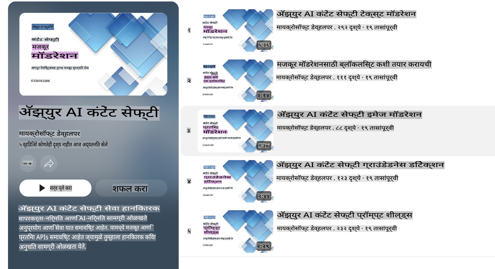

# Phi मॉडेल्ससाठी AI सुरक्षा
Phi मॉडेल्सची मालिका [Microsoft Responsible AI Standard](https://query.prod.cms.rt.microsoft.com/cms/api/am/binary/RE5cmFl) नुसार विकसित करण्यात आली आहे. हा स्टँडर्ड कंपनीच्या सहा प्रमुख तत्त्वांवर आधारित आहे: जबाबदारी, पारदर्शकता, निष्पक्षता, विश्वासार्हता आणि सुरक्षा, गोपनीयता आणि समावेशकता, जी [Microsoft च्या Responsible AI तत्त्वां](https://www.microsoft.com/ai/responsible-ai) चा पाया आहेत.

मागील Phi मॉडेल्सप्रमाणेच, या मॉडेल्ससाठी बहुआयामी सुरक्षा मूल्यमापन आणि सुरक्षा प्रशिक्षणानंतरचा दृष्टिकोन स्वीकारला गेला आहे, ज्यामध्ये या प्रकाशनाच्या बहुभाषिक क्षमता विचारात घेऊन अतिरिक्त उपाययोजना करण्यात आल्या आहेत. आमच्या सुरक्षा प्रशिक्षण आणि मूल्यमापनासाठीचा दृष्टिकोन, ज्यामध्ये अनेक भाषा आणि जोखमींच्या श्रेणींमध्ये चाचण्या समाविष्ट आहेत, [Phi Safety Post-Training Paper](https://arxiv.org/abs/2407.13833) मध्ये स्पष्ट करण्यात आला आहे. जरी Phi मॉडेल्सना या दृष्टिकोनाचा फायदा होतो, तरीही विकासकांनी त्यांच्या विशिष्ट उपयोग प्रकरण आणि सांस्कृतिक व भाषिक संदर्भाशी संबंधित जोखमींचे मॅपिंग, मोजमाप आणि कमी करण्यासाठी जबाबदार AI सर्वोत्तम पद्धतींचा अवलंब करावा.

## सर्वोत्तम पद्धती

इतर मॉडेल्सप्रमाणेच, Phi मॉडेल्स कधीकधी अन्यायकारक, अविश्वसनीय किंवा आक्षेपार्ह वर्तन करू शकतात.

SLM आणि LLM च्या काही मर्यादित वर्तनांमध्ये खालील बाबींची जाणीव ठेवणे आवश्यक आहे:

- **सेवेची गुणवत्ता:** Phi मॉडेल्स प्रामुख्याने इंग्रजी मजकुरावर प्रशिक्षण दिले गेले आहेत. इंग्रजी व्यतिरिक्त इतर भाषांमध्ये कामगिरी कमी होऊ शकते. प्रशिक्षण डेटामध्ये कमी प्रतिनिधित्व असलेल्या इंग्रजी प्रकारांना मानक अमेरिकन इंग्रजीच्या तुलनेत कमी कामगिरीचा अनुभव येऊ शकतो.
- **हानीचे प्रतिनिधित्व आणि पूर्वग्रहांचे दृढीकरण:** हे मॉडेल्स लोकांच्या गटांचे जास्त किंवा कमी प्रतिनिधित्व करू शकतात, काही गटांचे प्रतिनिधित्व मिटवू शकतात किंवा अपमानकारक किंवा नकारात्मक पूर्वग्रह दृढ करू शकतात. सुरक्षा प्रशिक्षणानंतरही, विविध गटांचे भिन्न स्तरांचे प्रतिनिधित्व किंवा प्रशिक्षण डेटामध्ये नकारात्मक पूर्वग्रहांचे उदाहरण यामुळे या मर्यादा अद्याप अस्तित्वात असू शकतात.
- **अयोग्य किंवा आक्षेपार्ह सामग्री:** हे मॉडेल्स इतर प्रकारची अयोग्य किंवा आक्षेपार्ह सामग्री तयार करू शकतात, ज्यामुळे संवेदनशील संदर्भांसाठी वापरण्यासाठी अतिरिक्त उपाययोजना केल्याशिवाय त्यांचा उपयोग अयोग्य ठरू शकतो.
- **माहितीची विश्वासार्हता:** भाषा मॉडेल्स अर्थहीन सामग्री तयार करू शकतात किंवा अशी सामग्री तयार करू शकतात जी ऐकायला योग्य वाटते पण प्रत्यक्षात चुकीची किंवा कालबाह्य असते.
- **कोडसाठी मर्यादित व्याप्ती:** Phi-3 प्रशिक्षण डेटाचा बहुतेक भाग Python वर आधारित आहे आणि "typing, math, random, collections, datetime, itertools" सारख्या सामान्य पॅकेजेस वापरतो. जर मॉडेल Python स्क्रिप्ट्स तयार करत असेल ज्यामध्ये इतर पॅकेजेस किंवा इतर भाषांमधील स्क्रिप्ट्स वापरल्या जात असतील, तर वापरकर्त्यांनी सर्व API उपयोग मॅन्युअली सत्यापित करण्याची शिफारस केली जाते.

विकसकांनी जबाबदार AI सर्वोत्तम पद्धतींचा अवलंब करावा आणि त्यांच्या विशिष्ट उपयोग प्रकरणासाठी संबंधित कायदे आणि नियमांचे (उदा. गोपनीयता, व्यापार, इ.) पालन होत असल्याची खात्री करावी.

## जबाबदार AI विचार

इतर भाषा मॉडेल्सप्रमाणेच, Phi मालिकेतील मॉडेल्स कधीकधी अन्यायकारक, अविश्वसनीय किंवा आक्षेपार्ह वर्तन करू शकतात. खालील मर्यादित वर्तनांबाबत सतर्क राहणे आवश्यक आहे:

**सेवेची गुणवत्ता:** Phi मॉडेल्स प्रामुख्याने इंग्रजी मजकुरावर प्रशिक्षण दिले गेले आहेत. इंग्रजी व्यतिरिक्त इतर भाषांमध्ये कामगिरी कमी होऊ शकते. प्रशिक्षण डेटामध्ये कमी प्रतिनिधित्व असलेल्या इंग्रजी प्रकारांना मानक अमेरिकन इंग्रजीच्या तुलनेत कमी कामगिरीचा अनुभव येऊ शकतो.

**हानीचे प्रतिनिधित्व आणि पूर्वग्रहांचे दृढीकरण:** हे मॉडेल्स लोकांच्या गटांचे जास्त किंवा कमी प्रतिनिधित्व करू शकतात, काही गटांचे प्रतिनिधित्व मिटवू शकतात किंवा अपमानकारक किंवा नकारात्मक पूर्वग्रह दृढ करू शकतात. सुरक्षा प्रशिक्षणानंतरही, विविध गटांचे भिन्न स्तरांचे प्रतिनिधित्व किंवा प्रशिक्षण डेटामध्ये नकारात्मक पूर्वग्रहांचे उदाहरण यामुळे या मर्यादा अद्याप अस्तित्वात असू शकतात.

**अयोग्य किंवा आक्षेपार्ह सामग्री:** हे मॉडेल्स इतर प्रकारची अयोग्य किंवा आक्षेपार्ह सामग्री तयार करू शकतात, ज्यामुळे संवेदनशील संदर्भांसाठी वापरण्यासाठी अतिरिक्त उपाययोजना केल्याशिवाय त्यांचा उपयोग अयोग्य ठरू शकतो.  
**माहितीची विश्वासार्हता:** भाषा मॉडेल्स अर्थहीन सामग्री तयार करू शकतात किंवा अशी सामग्री तयार करू शकतात जी ऐकायला योग्य वाटते पण प्रत्यक्षात चुकीची किंवा कालबाह्य असते.

**कोडसाठी मर्यादित व्याप्ती:** Phi-3 प्रशिक्षण डेटाचा बहुतेक भाग Python वर आधारित आहे आणि "typing, math, random, collections, datetime, itertools" सारख्या सामान्य पॅकेजेस वापरतो. जर मॉडेल Python स्क्रिप्ट्स तयार करत असेल ज्यामध्ये इतर पॅकेजेस किंवा इतर भाषांमधील स्क्रिप्ट्स वापरल्या जात असतील, तर वापरकर्त्यांनी सर्व API उपयोग मॅन्युअली सत्यापित करण्याची शिफारस केली जाते.

विकसकांनी जबाबदार AI सर्वोत्तम पद्धतींचा अवलंब करावा आणि त्यांच्या विशिष्ट उपयोग प्रकरणासाठी संबंधित कायदे आणि नियमांचे (उदा. गोपनीयता, व्यापार, इ.) पालन होत असल्याची खात्री करावी. विचार करण्यायोग्य महत्त्वाचे क्षेत्रे:

**संसाधनांचे वाटप:** मॉडेल्स अशा परिस्थितीसाठी उपयुक्त नसतील ज्याचा कायदेशीर स्थिती किंवा संसाधनांचे वाटप किंवा जीवनातील संधींवर (उदा. घर, रोजगार, क्रेडिट, इ.) परिणाम होऊ शकतो, जोपर्यंत अधिक मूल्यांकन आणि पूर्वग्रह कमी करण्याच्या तंत्रांचा वापर केला जात नाही.

**उच्च-जोखीम परिस्थिती:** जिथे अन्यायकारक, अविश्वसनीय किंवा आक्षेपार्ह आउटपुट अत्यंत महागडे किंवा हानिकारक ठरू शकतात अशा उच्च-जोखीम परिस्थितींमध्ये मॉडेल्स वापरण्याची उपयुक्तता तपासणे आवश्यक आहे. यामध्ये संवेदनशील किंवा तज्ञांच्या डोमेनमध्ये सल्ला देणे समाविष्ट आहे, जिथे अचूकता आणि विश्वासार्हता महत्त्वाची आहे (उदा. कायदेशीर किंवा आरोग्यविषयक सल्ला). वापराच्या संदर्भानुसार अॅप्लिकेशन स्तरावर अतिरिक्त सुरक्षा उपाय अंमलात आणावेत.

**भ्रामक माहिती:** मॉडेल्स चुकीची माहिती तयार करू शकतात. विकसकांनी पारदर्शकतेच्या सर्वोत्तम पद्धतींचे अनुसरण करावे आणि अंतिम वापरकर्त्यांना हे सूचित करावे की ते AI प्रणालीशी संवाद साधत आहेत. अॅप्लिकेशन स्तरावर, विकसक अभिप्राय यंत्रणा तयार करू शकतात आणि उत्तरांना विशिष्ट उपयोग प्रकरण, संदर्भात्मक माहितीशी जोडण्यासाठी Retrieval Augmented Generation (RAG) तंत्र वापरू शकतात.

**हानिकारक सामग्रीची निर्मिती:** विकसकांनी त्यांच्या संदर्भासाठी आउटपुट्सचे मूल्यांकन करावे आणि त्यांच्या उपयोग प्रकरणासाठी योग्य उपलब्ध सुरक्षा वर्गीकरण किंवा सानुकूल उपायांचा वापर करावा.

**गैरवापर:** फसवणूक, स्पॅम किंवा मालवेअर निर्मितीसारख्या इतर प्रकारच्या गैरवापराची शक्यता असू शकते आणि विकसकांनी याची खात्री करावी की त्यांच्या अॅप्लिकेशन्सने लागू कायदे आणि नियमांचे उल्लंघन केले नाही.

### फाइनट्यूनिंग आणि AI सामग्री सुरक्षा

मॉडेल फाइन-ट्यून केल्यानंतर, [Azure AI Content Safety](https://learn.microsoft.com/azure/ai-services/content-safety/overview) उपायांचा लाभ घेण्याची आम्ही जोरदार शिफारस करतो. हे उपाय मॉडेल्सद्वारे तयार केलेल्या सामग्रीचे निरीक्षण करतात, संभाव्य जोखमी, धमक्या आणि गुणवत्ता समस्यांची ओळख पटवतात आणि त्यांना ब्लॉक करतात.

[Azure AI Content Safety](https://learn.microsoft.com/azure/ai-services/content-safety/overview) मजकूर आणि प्रतिमा सामग्री दोन्हींसाठी समर्थन करते. हे क्लाउडमध्ये, डिस्कनेक्ट कंटेनरमध्ये आणि एज/एम्बेडेड डिव्हाइसेसवर तैनात केले जाऊ शकते.

## Azure AI Content Safety चे विहंगावलोकन

Azure AI Content Safety हे सर्वांसाठी एकसारखे उपाय नाही; ते व्यवसायांच्या विशिष्ट धोरणांशी जुळवून घेण्यासाठी सानुकूलित केले जाऊ शकते. याशिवाय, त्याच्या बहुभाषिक मॉडेल्समुळे ते एकाच वेळी अनेक भाषा समजू शकते.

- **Azure AI Content Safety**
- **Microsoft Developer**
- **5 व्हिडिओ**

Azure AI Content Safety सेवा अॅप्लिकेशन्स आणि सेवांमधील हानिकारक वापरकर्त्यांनी तयार केलेली आणि AI-निर्मित सामग्री शोधते. यामध्ये मजकूर आणि प्रतिमा API समाविष्ट आहेत जे हानिकारक किंवा अयोग्य सामग्री ओळखण्यास अनुमती देतात.

[AI Content Safety Playlist](https://www.youtube.com/playlist?list=PLlrxD0HtieHjaQ9bJjyp1T7FeCbmVcPkQ)

**अस्वीकरण**:  
हे दस्तऐवज मशीन-आधारित AI भाषांतर सेवा वापरून भाषांतरित केले गेले आहे. आम्ही अचूकतेसाठी प्रयत्नशील असलो तरी, कृपया लक्षात घ्या की स्वयंचलित भाषांतरांमध्ये त्रुटी किंवा अचूकतेचा अभाव असू शकतो. मूळ भाषेतील मूळ दस्तऐवज हा अधिकृत स्रोत मानला जावा. महत्त्वाच्या माहितीकरिता व्यावसायिक मानवी भाषांतराची शिफारस केली जाते. या भाषांतराचा वापर केल्यामुळे उद्भवलेल्या कोणत्याही गैरसमज किंवा चुकीच्या अर्थासाठी आम्ही जबाबदार नाही.