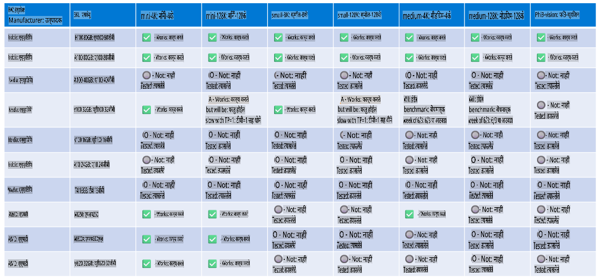

# Phi हार्डवेअर समर्थन

Microsoft Phi ONNX Runtime साठी ऑप्टिमाइझ केले गेले आहे आणि Windows DirectML ला समर्थन देते. हे विविध हार्डवेअर प्रकारांवर उत्तम प्रकारे कार्य करते, ज्यामध्ये GPU, CPU आणि मोबाइल डिव्हाइस देखील समाविष्ट आहेत.

## डिव्हाइस हार्डवेअर  
विशेषतः, समर्थित हार्डवेअर यामध्ये समाविष्ट आहे:

- GPU SKU: RTX 4090 (DirectML)  
- GPU SKU: 1 A100 80GB (CUDA)  
- CPU SKU: Standard F64s v2 (64 vCPUs, 128 GiB मेमरी)  

## मोबाइल SKU  

- Android - Samsung Galaxy S21  
- Apple iPhone 14 किंवा त्यापुढील A16/A17 प्रोसेसर  

## Phi हार्डवेअर तपशील

- आवश्यक किमान कॉन्फिगरेशन.  
- Windows: DirectX 12 समर्थित GPU आणि किमान 4GB एकत्रित RAM  

CUDA: NVIDIA GPU Compute Capability >= 7.02 सह  



## अनेक GPUs वर onnxruntime चालवणे

सध्या उपलब्ध Phi ONNX मॉडेल्स केवळ 1 GPU साठी आहेत. Phi मॉडेलसाठी मल्टी-GPU समर्थन शक्य आहे, परंतु ORT 2 GPUs सह वापरल्यास 2 स्वतंत्र ORT इन्स्टन्सच्या तुलनेत जास्त थ्रूपुट मिळेल याची हमी नाही. कृपया [ONNX Runtime](https://onnxruntime.ai/) वर ताज्या अपडेट्स पाहा.

[Build 2024 the GenAI ONNX Team](https://youtu.be/WLW4SE8M9i8?si=EtG04UwDvcjunyfC) येथे त्यांनी Phi मॉडेल्ससाठी मल्टी-GPU ऐवजी मल्टी-इन्स्टन्स सक्षम केले असल्याचे जाहीर केले.  

सध्या, यामुळे तुम्हाला CUDA_VISIBLE_DEVICES एन्व्हायर्नमेंट व्हेरिएबल वापरून एक onnxruntime किंवा onnxruntime-genai इन्स्टन्स चालवता येते, असे:  

```Python
CUDA_VISIBLE_DEVICES=0 python infer.py
CUDA_VISIBLE_DEVICES=1 python infer.py
```

Phi चा अधिक शोध घेण्यासाठी [Azure AI Foundry](https://ai.azure.com) येथे भेट द्या.  

**अस्वीकरण**:  
हे दस्तऐवज मशीन-आधारित एआय अनुवाद सेवांचा वापर करून अनुवादित केले गेले आहे. आम्ही अचूकतेसाठी प्रयत्नशील असलो तरी, कृपया लक्षात घ्या की स्वयंचलित अनुवादांमध्ये चुका किंवा अचूकतेचा अभाव असू शकतो. मूळ भाषेतील मूळ दस्तऐवज अधिकृत स्रोत मानला जावा. महत्त्वाच्या माहितीसाठी, व्यावसायिक मानव अनुवादाची शिफारस केली जाते. या अनुवादाचा वापर करून उद्भवलेल्या कोणत्याही गैरसमजुतींसाठी किंवा चुकीच्या अर्थांसाठी आम्ही जबाबदार नाही.