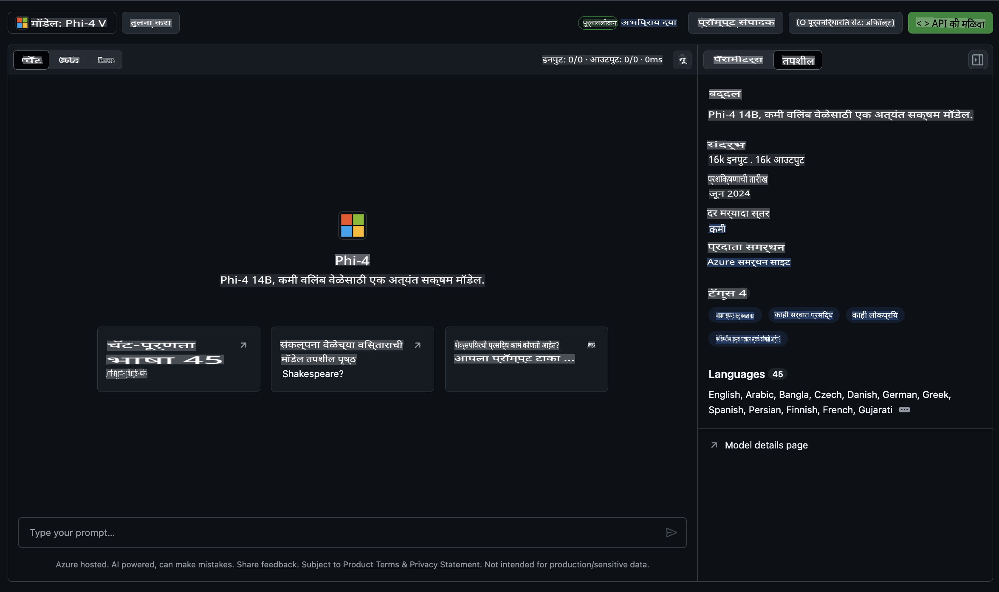

## GitHub मॉडेल्समधील Phi कुटुंब

[GitHub Models](https://github.com/marketplace/models) मध्ये आपले स्वागत आहे! Azure AI वर होस्ट केलेल्या AI मॉडेल्सचा शोध घेण्यासाठी सर्वकाही तयार आहे.


GitHub Models वर उपलब्ध असलेल्या मॉडेल्सबद्दल अधिक माहितीसाठी [GitHub Model Marketplace](https://github.com/marketplace/models) पहा.

## उपलब्ध मॉडेल्स

प्रत्येक मॉडेलसाठी स्वतंत्र प्लेग्राउंड आणि नमुना कोड उपलब्ध आहे.



### GitHub Model Catalog मधील Phi कुटुंब

- [Phi-4](https://github.com/marketplace/models/azureml/Phi-4)

- [Phi-3.5-MoE instruct (128k)](https://github.com/marketplace/models/azureml/Phi-3-5-MoE-instruct)

- [Phi-3.5-vision instruct (128k)](https://github.com/marketplace/models/azureml/Phi-3-5-vision-instruct)

- [Phi-3.5-mini instruct (128k)](https://github.com/marketplace/models/azureml/Phi-3-5-mini-instruct)

- [Phi-3-Medium-128k-Instruct](https://github.com/marketplace/models/azureml/Phi-3-medium-128k-instruct)

- [Phi-3-medium-4k-instruct](https://github.com/marketplace/models/azureml/Phi-3-medium-4k-instruct)

- [Phi-3-mini-128k-instruct](https://github.com/marketplace/models/azureml/Phi-3-mini-128k-instruct)

- [Phi-3-mini-4k-instruct](https://github.com/marketplace/models/azureml/Phi-3-mini-4k-instruct)

- [Phi-3-small-128k-instruct](https://github.com/marketplace/models/azureml/Phi-3-small-128k-instruct)

- [Phi-3-small-8k-instruct](https://github.com/marketplace/models/azureml/Phi-3-small-8k-instruct)

## सुरुवात कशी करावी

तुमच्यासाठी तयार असलेले काही सोपे उदाहरण आहेत. तुम्ही ती samples डिरेक्टरीमध्ये पाहू शकता. जर तुम्हाला थेट तुमच्या आवडत्या भाषेत उडी मारायची असेल, तर खालील भाषांमध्ये उदाहरणे उपलब्ध आहेत:

- Python  
- JavaScript  
- C#  
- Java  
- cURL  

उदाहरणे चालवण्यासाठी आणि मॉडेल्स वापरण्यासाठी एक विशेष Codespaces Environment देखील उपलब्ध आहे. 


## नमुना कोड

खाली काही उपयोगाच्या प्रकरणांसाठी कोड स्निपेट्स दिली आहेत. Azure AI Inference SDK बद्दल अधिक माहितीसाठी, संपूर्ण दस्तऐवज आणि उदाहरणे पहा.

## सेटअप

1. वैयक्तिक प्रवेश टोकन तयार करा  
टोकनला कोणत्याही परवानग्या देण्याची गरज नाही. लक्षात ठेवा की टोकन Microsoft सेवेला पाठवले जाईल.

खालील कोड स्निपेट्स वापरण्यासाठी, तुमच्या टोकनला क्लायंट कोडसाठी की म्हणून सेट करण्यासाठी एक environment variable तयार करा.

जर तुम्ही bash वापरत असाल:  
```
export GITHUB_TOKEN="<your-github-token-goes-here>"
```  
जर तुम्ही powershell वापरत असाल:  
```
$Env:GITHUB_TOKEN="<your-github-token-goes-here>"
```  
जर तुम्ही Windows command prompt वापरत असाल:  
```
set GITHUB_TOKEN=<your-github-token-goes-here>
```  

## Python उदाहरण

### Dependencies इंस्टॉल करा  
Azure AI Inference SDK pip च्या मदतीने इंस्टॉल करा (आवश्यक: Python >=3.8):  

```
pip install azure-ai-inference
```  

### बेसिक कोड उदाहरण चालवा  

हे उदाहरण chat completion API ला बेसिक कॉल दाखवते. GitHub AI मॉडेल inference endpoint आणि तुमचा GitHub टोकन वापरण्यात येतो. हा कॉल synchronous आहे.  

```python
import os
from azure.ai.inference import ChatCompletionsClient
from azure.ai.inference.models import SystemMessage, UserMessage
from azure.core.credentials import AzureKeyCredential

endpoint = "https://models.inference.ai.azure.com"
model_name = "Phi-4"
token = os.environ["GITHUB_TOKEN"]

client = ChatCompletionsClient(
    endpoint=endpoint,
    credential=AzureKeyCredential(token),
)

response = client.complete(
    messages=[
        UserMessage(content="I have $20,000 in my savings account, where I receive a 4% profit per year and payments twice a year. Can you please tell me how long it will take for me to become a millionaire? Also, can you please explain the math step by step as if you were explaining it to an uneducated person?"),
    ],
    temperature=0.4,
    top_p=1.0,
    max_tokens=2048,
    model=model_name
)

print(response.choices[0].message.content)
```  

### मल्टी-टर्न संभाषण चालवा  

हे उदाहरण chat completion API सोबत मल्टी-टर्न संभाषण दाखवते. जर तुम्ही chat application साठी मॉडेल वापरत असाल, तर तुम्हाला त्या संभाषणाचा इतिहास व्यवस्थापित करावा लागेल आणि मॉडेलला ताज्या संदेश पाठवावे लागतील.  

```
import os
from azure.ai.inference import ChatCompletionsClient
from azure.ai.inference.models import AssistantMessage, SystemMessage, UserMessage
from azure.core.credentials import AzureKeyCredential

token = os.environ["GITHUB_TOKEN"]
endpoint = "https://models.inference.ai.azure.com"
# Replace Model_Name
model_name = "Phi-4"

client = ChatCompletionsClient(
    endpoint=endpoint,
    credential=AzureKeyCredential(token),
)

messages = [
    SystemMessage(content="You are a helpful assistant."),
    UserMessage(content="What is the capital of France?"),
    AssistantMessage(content="The capital of France is Paris."),
    UserMessage(content="What about Spain?"),
]

response = client.complete(messages=messages, model=model_name)

print(response.choices[0].message.content)
```  

### आउटपुट स्ट्रीम करा  

चांगल्या वापरकर्ता अनुभवासाठी, मॉडेलच्या प्रतिसादाचे स्ट्रीमिंग करा जेणेकरून पहिला टोकन लवकर दिसेल आणि दीर्घ प्रतिसादासाठी प्रतीक्षा करावी लागू नये.  

```
import os
from azure.ai.inference import ChatCompletionsClient
from azure.ai.inference.models import SystemMessage, UserMessage
from azure.core.credentials import AzureKeyCredential

token = os.environ["GITHUB_TOKEN"]
endpoint = "https://models.inference.ai.azure.com"
# Replace Model_Name
model_name = "Phi-4"

client = ChatCompletionsClient(
    endpoint=endpoint,
    credential=AzureKeyCredential(token),
)

response = client.complete(
    stream=True,
    messages=[
        SystemMessage(content="You are a helpful assistant."),
        UserMessage(content="Give me 5 good reasons why I should exercise every day."),
    ],
    model=model_name,
)

for update in response:
    if update.choices:
        print(update.choices[0].delta.content or "", end="")

client.close()
```  

## GitHub Models साठी मोफत वापर आणि दर मर्यादा  

  

[प्लेग्राउंड आणि मोफत API वापरासाठी दर मर्यादा](https://docs.github.com/en/github-models/prototyping-with-ai-models#rate-limits) तुम्हाला मॉडेल्ससह प्रयोग करण्यास आणि तुमचे AI application प्रोटोटाइप करण्यास मदत करण्यासाठी आहेत. त्या मर्यादांपलीकडे वापरासाठी आणि तुमचे application स्केल करण्यासाठी, तुम्हाला Azure खात्यातून संसाधने पुरवावी लागतील आणि तिथून प्रमाणीकरण करावे लागेल, तुमच्या GitHub personal access token ऐवजी. तुमच्या कोडमध्ये काहीही बदल करण्याची गरज नाही. Azure AI मध्ये मोफत टियर मर्यादांपलीकडे जाण्याबद्दल अधिक जाणून घेण्यासाठी या लिंकचा वापर करा.  

### प्रकटीकरणे  

मॉडेलसोबत संवाद साधताना लक्षात ठेवा की तुम्ही AI सोबत प्रयोग करत आहात, त्यामुळे सामग्रीत चुका होऊ शकतात.  

या वैशिष्ट्याला विविध मर्यादा आहेत (प्रत्येक मिनिटातील विनंत्या, प्रत्येक दिवसातील विनंत्या, प्रति विनंती टोकन, आणि एकाच वेळी केलेल्या विनंत्या) आणि हे उत्पादन वापरासाठी डिझाइन केलेले नाही.  

GitHub Models Azure AI Content Safety वापरते. GitHub Models अनुभवाचा भाग म्हणून हे फिल्टर्स बंद करता येत नाहीत. जर तुम्ही paid service च्या माध्यमातून मॉडेल्स वापरण्याचा निर्णय घेतला, तर तुमच्या आवश्यकता पूर्ण करण्यासाठी तुमचे content filters configure करा.  

ही सेवा GitHub च्या Pre-release Terms अंतर्गत आहे.  

**अस्वीकृति**:  
हे दस्तऐवज मशीन-आधारित AI भाषांतर सेवा वापरून भाषांतरित केले गेले आहे. आम्ही अचूकतेसाठी प्रयत्नशील असलो तरी, कृपया लक्षात घ्या की स्वयंचलित भाषांतरे त्रुटी किंवा अचूकतेचा अभाव असू शकतात. मूळ भाषेतील मूळ दस्तऐवज अधिकृत स्रोत मानला जावा. महत्त्वाच्या माहितीकरिता, व्यावसायिक मानवी भाषांतराची शिफारस केली जाते. या भाषांतराचा वापर केल्याने होणाऱ्या कोणत्याही गैरसमज किंवा चुकीच्या अर्थ लावण्यास आम्ही जबाबदार राहणार नाही.