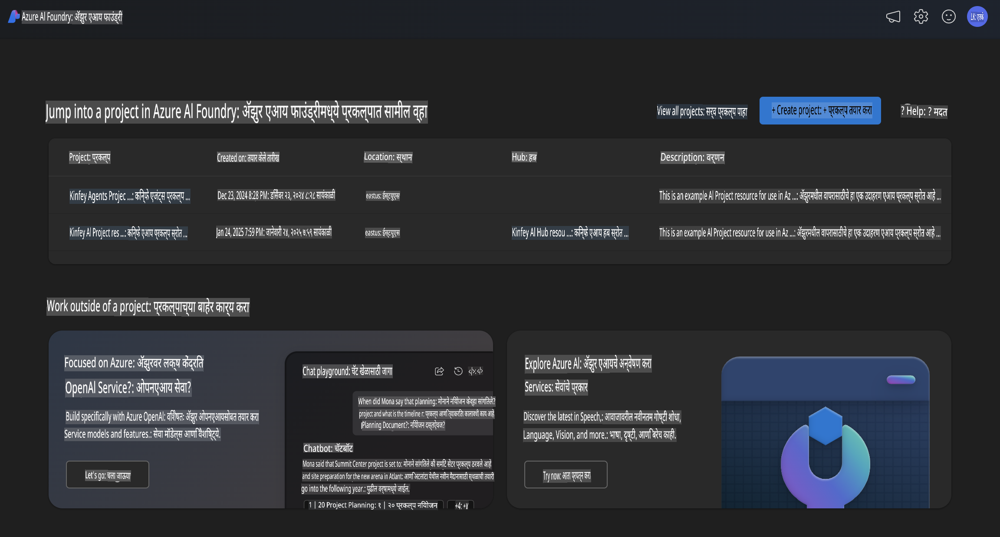
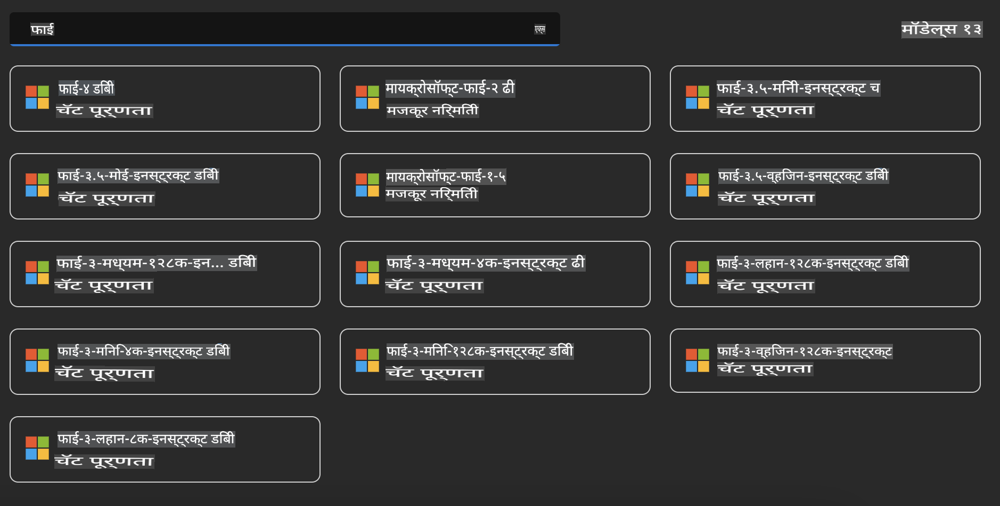
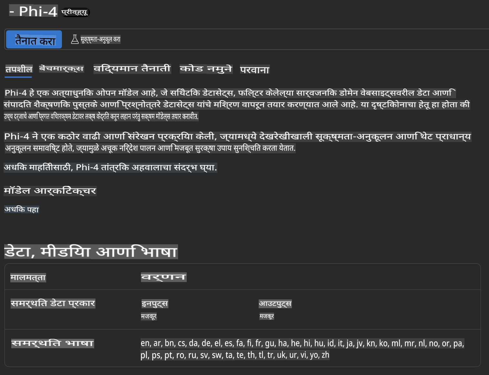
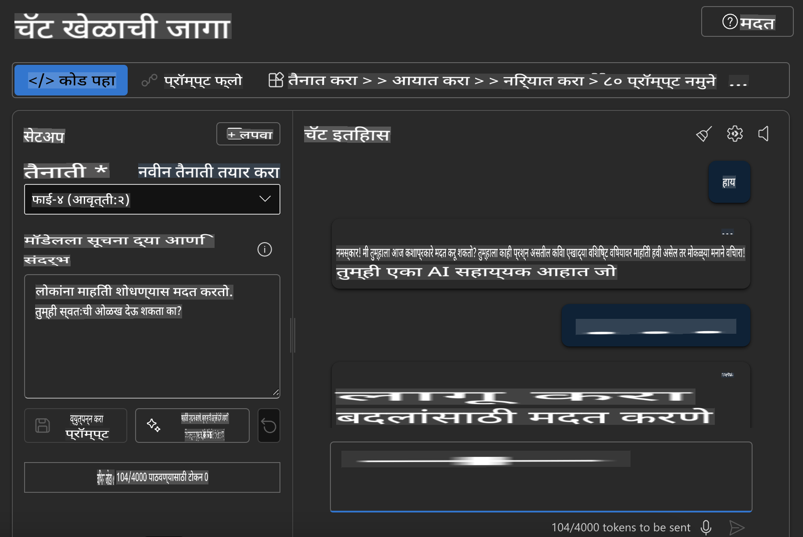

## Azure AI Foundry मधील Phi Family

[Azure AI Foundry](https://ai.azure.com) ही एक विश्वासार्ह व्यासपीठ आहे जी विकसकांना AI च्या सुरक्षित, संरक्षित आणि जबाबदार वापराच्या आधारे नाविन्य घडविण्यासाठी आणि भविष्य घडविण्यासाठी सक्षम करते.

[Azure AI Foundry](https://ai.azure.com) चे उद्दिष्ट विकसकांसाठी आहे:

- एंटरप्राइझ-ग्रेड व्यासपीठावर जनरेटिव्ह AI अनुप्रयोग तयार करणे.
- जबाबदार AI पद्धतींवर आधारित प्रगत AI साधने आणि ML मॉडेल्स वापरून एक्सप्लोर, तयार करणे, चाचणी घेणे आणि तैनात करणे.
- अनुप्रयोग विकासाच्या संपूर्ण जीवनचक्रासाठी टीमसोबत सहयोग करणे.

Azure AI Foundry च्या मदतीने तुम्ही विविध मॉडेल्स, सेवा आणि क्षमता एक्सप्लोर करू शकता आणि तुमच्या उद्दिष्टांना सर्वोत्तम प्रकारे पूरक असलेले AI अनुप्रयोग तयार करू शकता. Azure AI Foundry व्यासपीठ पुराव्याच्या संकल्पनांना सहजतेने पूर्ण उत्पादन अनुप्रयोगांमध्ये रूपांतरित करण्यासाठी स्केलेबिलिटी सुलभ करते. सतत देखरेख आणि सुधारणा दीर्घकालीन यशासाठी सहाय्य करतात.



Azure AI Foundry मध्ये Azure AOAI Service चा वापर करण्याव्यतिरिक्त, तुम्ही Azure AI Foundry Model Catalog मध्ये तृतीय-पक्षीय मॉडेल्स देखील वापरू शकता. जर तुम्हाला Azure AI Foundry तुमच्या AI सोल्यूशन व्यासपीठ म्हणून वापरायचे असेल, तर ही एक चांगली निवड आहे.

आपण Azure AI Foundry मधील Model Catalog च्या माध्यमातून Phi Family Models पटकन तैनात करू शकतो.



### **Azure AI Foundry मध्ये Phi-4 तैनात करणे**



### **Azure AI Foundry Playground मध्ये Phi-4 ची चाचणी घेणे**



### **Azure AI Foundry Phi-4 कॉल करण्यासाठी Python कोड चालवणे**

```python

import os  
import base64
from openai import AzureOpenAI  
from azure.identity import DefaultAzureCredential, get_bearer_token_provider  
        
endpoint = os.getenv("ENDPOINT_URL", "Your Azure AOAI Service Endpoint")  
deployment = os.getenv("DEPLOYMENT_NAME", "Phi-4")  
      
token_provider = get_bearer_token_provider(  
    DefaultAzureCredential(),  
    "https://cognitiveservices.azure.com/.default"  
)  
  
client = AzureOpenAI(  
    azure_endpoint=endpoint,  
    azure_ad_token_provider=token_provider,  
    api_version="2024-05-01-preview",  
)  
  

chat_prompt = [
    {
        "role": "system",
        "content": "You are an AI assistant that helps people find information."
    },
    {
        "role": "user",
        "content": "can you introduce yourself"
    }
] 
    
# Include speech result if speech is enabled  
messages = chat_prompt 

completion = client.chat.completions.create(  
    model=deployment,  
    messages=messages,
    max_tokens=800,  
    temperature=0.7,  
    top_p=0.95,  
    frequency_penalty=0,  
    presence_penalty=0,
    stop=None,  
    stream=False  
)  
  
print(completion.to_json())  

```

**अस्वीकरण**:  
हे दस्तऐवज मशीन-आधारित AI भाषांतर सेवांचा वापर करून भाषांतरित केले गेले आहे. आम्ही अचूकतेसाठी प्रयत्नशील असलो तरी, कृपया लक्षात घ्या की स्वयंचलित भाषांतरे त्रुटी किंवा अचूकतेचा अभाव असू शकतात. मूळ भाषेतील मूळ दस्तऐवज हा अधिकृत स्रोत मानला जावा. महत्त्वाच्या माहितीसाठी व्यावसायिक मानवी भाषांतराची शिफारस केली जाते. या भाषांतराच्या वापरामुळे उद्भवलेल्या कोणत्याही गैरसमजुतींसाठी किंवा चुकीच्या अर्थ लावल्यामुळे आम्ही जबाबदार राहणार नाही.