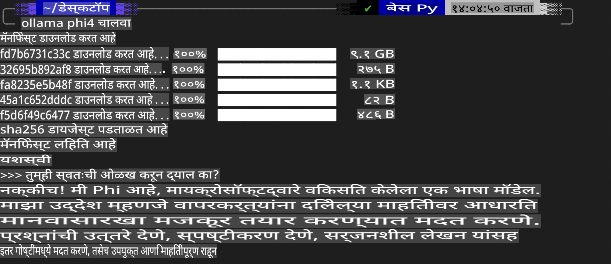
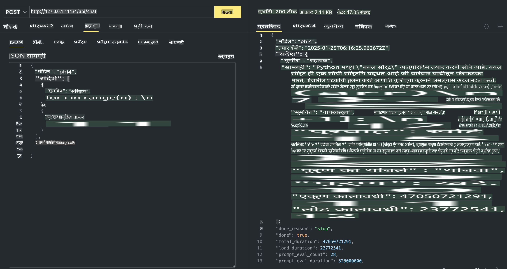

## Phi कुटुंब Ollama मध्ये

[Ollama](https://ollama.com) लोकांना सोप्या स्क्रिप्ट्सच्या माध्यमातून ओपन सोर्स LLM किंवा SLM थेट तैनात करण्याची परवानगी देते, तसेच स्थानिक Copilot अनुप्रयोग परिस्थितींना मदत करण्यासाठी API तयार करू शकते.

## **1. स्थापना**

Ollama Windows, macOS, आणि Linux वर चालविण्यासाठी समर्थन देते. तुम्ही या लिंकद्वारे Ollama स्थापित करू शकता ([https://ollama.com/download](https://ollama.com/download)). यशस्वीपणे स्थापना केल्यानंतर, तुम्ही थेट टर्मिनल विंडोमधून Phi-3 कॉल करण्यासाठी Ollama स्क्रिप्ट वापरू शकता. तुम्ही Ollama मधील [उपलब्ध लायब्ररी पाहू शकता](https://ollama.com/library). जर तुम्ही हे रिपॉझिटरी Codespace मध्ये उघडले, तर त्यामध्ये आधीच Ollama स्थापित केलेले असेल.

```bash

ollama run phi4

```

> [!NOTE]
> प्रथमच चालवताना मॉडेल डाउनलोड केले जाईल. अर्थात, तुम्ही थेट डाउनलोड केलेले Phi-4 मॉडेल देखील निर्दिष्ट करू शकता. आम्ही WSL च्या उदाहरणाद्वारे कमांड चालवतो. मॉडेल यशस्वीरित्या डाउनलोड झाल्यानंतर, तुम्ही थेट टर्मिनलवर संवाद साधू शकता.



## **2. Ollama मधून phi-4 API कॉल करा**

जर तुम्हाला Ollama द्वारे तयार केलेले Phi-4 API कॉल करायचे असेल, तर तुम्ही टर्मिनलमध्ये हा कमांड वापरून Ollama सर्व्हर सुरू करू शकता.

```bash

ollama serve

```

> [!NOTE]
> जर तुम्ही macOS किंवा Linux चालवत असाल, तर कृपया खालील त्रुटीचा सामना होऊ शकतो **"Error: listen tcp 127.0.0.1:11434: bind: address already in use"**. हा कमांड चालवताना तुम्हाला ही त्रुटी येऊ शकते. ही त्रुटी सहसा सर्व्हर आधीच चालू असल्याचे दर्शवते, त्यामुळे तुम्ही ती दुर्लक्ष करू शकता, किंवा Ollama थांबवून पुन्हा सुरू करू शकता:

**macOS**

```bash

brew services restart ollama

```

**Linux**

```bash

sudo systemctl stop ollama

```

Ollama दोन API ला समर्थन देते: generate आणि chat. तुम्ही 11434 पोर्टवर चालणाऱ्या स्थानिक सेवेला विनंत्या पाठवून, Ollama द्वारे प्रदान केलेल्या मॉडेल API तुमच्या गरजेनुसार कॉल करू शकता.

**Chat**

```bash

curl http://127.0.0.1:11434/api/chat -d '{
  "model": "phi3",
  "messages": [
    {
      "role": "system",
      "content": "Your are a python developer."
    },
    {
      "role": "user",
      "content": "Help me generate a bubble algorithm"
    }
  ],
  "stream": false
  
}'

This is the result in Postman



## Additional Resources

Check the list of available models in Ollama in [their library](https://ollama.com/library).

Pull your model from the Ollama server using this command

```bash
ollama pull phi4
```

Run the model using this command

```bash
ollama run phi4
```

***Note:*** Visit this link [https://github.com/ollama/ollama/blob/main/docs/api.md](https://github.com/ollama/ollama/blob/main/docs/api.md) to learn more

## Calling Ollama from Python

You can use `requests` or `urllib3` to make requests to the local server endpoints used above. However, a popular way to use Ollama in Python is via the [openai](https://pypi.org/project/openai/) SDK, since Ollama provides OpenAI-compatible server endpoints as well.

Here is an example for phi3-mini:

```python
import openai

client = openai.OpenAI(
    base_url="http://localhost:11434/v1",
    api_key="nokeyneeded",
)

response = client.chat.completions.create(
    model="phi4",
    temperature=0.7,
    n=1,
    messages=[
        {"role": "system", "content": "You are a helpful assistant."},
        {"role": "user", "content": "Write a haiku about a hungry cat"},
    ],
)

print("Response:")
print(response.choices[0].message.content)
```

## Calling Ollama from JavaScript 

```javascript
// Phi-4 वापरून फाईलचे सारांश करण्याचे उदाहरण
script({
    model: "ollama:phi4",
    title: "Summarize with Phi-4",
    system: ["system"],
})

// सारांशाचे उदाहरण
const file = def("FILE", env.files)
$`Summarize ${file} in a single paragraph.`
```

## Calling Ollama from C#

Create a new C# Console application and add the following NuGet package:

```bash
dotnet add package Microsoft.SemanticKernel --version 1.34.0
```

Then replace this code in the `Program.cs` file

```csharp
using Microsoft.SemanticKernel;
using Microsoft.SemanticKernel.ChatCompletion;

// स्थानिक Ollama सर्व्हर एंडपॉइंट वापरून chat completion सेवा जोडा
#pragma warning disable SKEXP0001, SKEXP0003, SKEXP0010, SKEXP0011, SKEXP0050, SKEXP0052
builder.AddOpenAIChatCompletion(
    modelId: "phi4",
    endpoint: new Uri("http://localhost:11434/"),
    apiKey: "non required");

// chat सेवेला सोप्या prompt द्वारे कॉल करा
string prompt = "Write a joke about kittens";
var response = await kernel.InvokePromptAsync(prompt);
Console.WriteLine(response.GetValue<string>());
```

Run the app with the command:

```bash
dotnet run
```

**अस्वीकृती**:  
हे दस्तऐवज मशीन-आधारित AI भाषांतर सेवांचा वापर करून अनुवादित केले गेले आहे. आम्ही अचूकतेसाठी प्रयत्नशील असलो तरी, कृपया लक्षात घ्या की स्वयंचलित भाषांतरांमध्ये त्रुटी किंवा अचूकतेचा अभाव असू शकतो. मूळ भाषेतील मूळ दस्तऐवज हा प्राधिकृत स्रोत मानला जावा. महत्त्वाच्या माहितीकरिता व्यावसायिक मानवी भाषांतराची शिफारस केली जाते. या भाषांतराचा वापर केल्यामुळे उद्भवणाऱ्या कोणत्याही गैरसमजुती किंवा चुकीच्या अर्थासाठी आम्ही जबाबदार राहणार नाही.