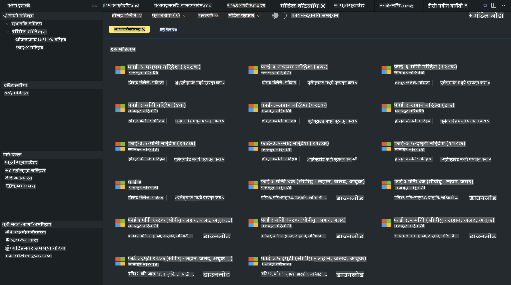
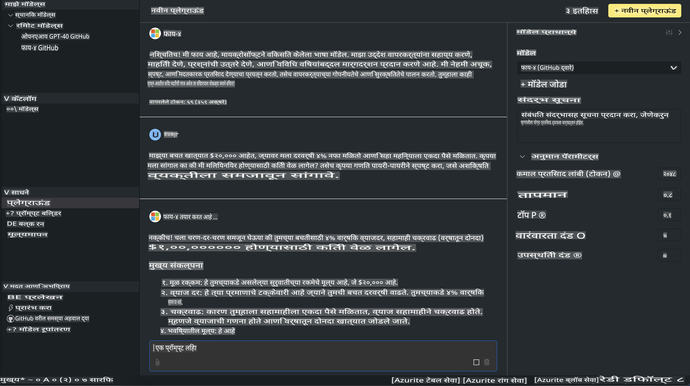

# AITK मधील Phi Family

[VS Code साठी AI Toolkit](https://marketplace.visualstudio.com/items?itemName=ms-windows-ai-studio.windows-ai-studio) हे जनरेटिव्ह AI अॅप डेव्हलपमेंट सोपे करते. यात Azure AI Foundry Catalog आणि Hugging Face सारख्या कॅटलॉगमधील अत्याधुनिक AI विकास साधने आणि मॉडेल्स एकत्र आणले जातात. यामुळे तुम्हाला GitHub Models आणि Azure AI Foundry Model Catalog द्वारे समर्थित AI मॉडेल्स ब्राउज करता येतील, त्यांना स्थानिक किंवा रिमोट डाऊनलोड करता येईल, फाइन-ट्यून, चाचणी आणि तुमच्या अॅप्लिकेशनमध्ये वापरता येईल.

AI Toolkit Preview स्थानिक स्तरावर चालते. स्थानिक इनफरन्स किंवा फाइन-ट्यूनिंगसाठी, निवडलेल्या मॉडेलवर अवलंबून, तुम्हाला NVIDIA CUDA GPU सारखा GPU लागेल. तुम्ही GitHub Models थेट AITK द्वारेही चालवू शकता.

## सुरुवात कशी करावी

[Windows Subsystem for Linux कसे इंस्टॉल करावे याबद्दल अधिक जाणून घ्या](https://learn.microsoft.com/windows/wsl/install?WT.mc_id=aiml-137032-kinfeylo)

आणि [डिफॉल्ट वितरण बदलणे](https://learn.microsoft.com/windows/wsl/install#change-the-default-linux-distribution-installed).

[AI Toolkit GitHub Repo](https://github.com/microsoft/vscode-ai-toolkit/)

- Windows, Linux, macOS

- Windows आणि Linux वर फाइन-ट्यूनिंगसाठी तुम्हाला Nvidia GPU आवश्यक आहे. याशिवाय, **Windows** ला Ubuntu 18.4 किंवा त्याहून अधिक असलेले Subsystem for Linux लागेल. [Windows Subsystem for Linux कसे इंस्टॉल करावे याबद्दल अधिक जाणून घ्या](https://learn.microsoft.com/windows/wsl/install) आणि [डिफॉल्ट वितरण बदलणे](https://learn.microsoft.com/windows/wsl/install#change-the-default-linux-distribution-installed).

### AI Toolkit इंस्टॉल करा

AI Toolkit हा [Visual Studio Code Extension](https://code.visualstudio.com/docs/setup/additional-components#_vs-code-extensions) म्हणून उपलब्ध आहे, त्यामुळे तुम्हाला आधी [VS Code](https://code.visualstudio.com/docs/setup/windows?WT.mc_id=aiml-137032-kinfeylo) इंस्टॉल करावा लागेल आणि नंतर [VS Marketplace](https://marketplace.visualstudio.com/items?itemName=ms-windows-ai-studio.windows-ai-studio) वरून AI Toolkit डाउनलोड करावा लागेल.  
[AI Toolkit Visual Studio Marketplace मध्ये उपलब्ध आहे](https://marketplace.visualstudio.com/items?itemName=ms-windows-ai-studio.windows-ai-studio) आणि इतर VS Code विस्तारांप्रमाणेच इंस्टॉल करता येतो.

जर तुम्हाला VS Code विस्तार इंस्टॉल करण्याची माहिती नसेल, तर पुढील स्टेप्स फॉलो करा:

### साइन इन करा

1. VS Code मधील Activity Bar मध्ये **Extensions** निवडा  
1. Extensions शोध पट्टीत "AI Toolkit" टाइप करा  
1. "AI Toolkit for Visual Studio Code" निवडा  
1. **Install** निवडा  

आता तुम्ही विस्तार वापरण्यास तयार आहात!

तुमच्याकडे GitHub मध्ये साइन इन करण्याची विनंती केली जाईल, कृपया "Allow" क्लिक करा. तुम्हाला GitHub साइन इन पेजवर पुनर्निर्देशित केले जाईल.

कृपया साइन इन करा आणि प्रक्रिया पूर्ण करा. यशस्वीरीत्या साइन इन झाल्यानंतर तुम्हाला VS Code वर पुनर्निर्देशित केले जाईल.

एकदा विस्तार इंस्टॉल झाल्यानंतर, तुम्हाला Activity Bar मध्ये AI Toolkit आयकॉन दिसेल.

आता उपलब्ध क्रिया एक्सप्लोर करूया!

### उपलब्ध क्रिया

AI Toolkit च्या प्राथमिक साइडबारमध्ये पुढील विभाग आहेत:

- **Models**
- **Resources**
- **Playground**  
- **Fine-tuning**
- **Evaluation**

Resources विभागात उपलब्ध आहेत. सुरुवात करण्यासाठी **Model Catalog** निवडा.

### कॅटलॉगमधून मॉडेल डाउनलोड करा

VS Code साइडबारमधून AI Toolkit लॉन्च केल्यावर, तुम्ही पुढील पर्याय निवडू शकता:



- **Model Catalog** मधून समर्थित मॉडेल शोधा आणि स्थानिकरित्या डाउनलोड करा  
- **Model Playground** मध्ये मॉडेल इनफरन्सची चाचणी करा  
- **Model Fine-tuning** मध्ये स्थानिक किंवा रिमोट फाइन-ट्यूनिंग करा  
- AI Toolkit साठी कमांड पॅलेटद्वारे क्लाउडवर फाइन-ट्यून केलेले मॉडेल तैनात करा  
- मॉडेल्सचे मूल्यांकन करा  

> [!NOTE]
>
> **GPU Vs CPU**
>
> तुम्हाला मॉडेल कार्ड्समध्ये मॉडेलचा आकार, प्लॅटफॉर्म आणि अॅक्सेलरेटर प्रकार (CPU, GPU) दिसेल. **Windows डिव्हाइसवर ज्यात किमान एक GPU आहे**, त्यावर ऑप्टिमाइझ केलेल्या कामगिरीसाठी फक्त Windows साठी लक्ष्य केलेली मॉडेल आवृत्त्या निवडा.
>
> हे सुनिश्चित करते की तुम्हाला DirectML अॅक्सेलरेटरसाठी ऑप्टिमाइझ केलेले मॉडेल मिळते.
>
> मॉडेलची नावे या स्वरूपात असतात:
>
> - `{model_name}-{accelerator}-{quantization}-{format}`.
>
> तुमच्या Windows डिव्हाइसवर GPU आहे की नाही हे तपासण्यासाठी, **Task Manager** उघडा आणि नंतर **Performance** टॅब निवडा. जर GPU(s) असतील, तर ती "GPU 0" किंवा "GPU 1" यासारख्या नावाखाली सूचीबद्ध असतील.

### Playground मध्ये मॉडेल चालवा

सर्व पॅरामीटर्स सेट केल्यानंतर, **Generate Project** क्लिक करा.

एकदा तुमचे मॉडेल डाउनलोड झाल्यावर, कॅटलॉगमधील मॉडेल कार्डवर **Load in Playground** निवडा:

- मॉडेल डाउनलोड सुरू करा  
- सर्व आवश्यक गोष्टी आणि अवलंबित्वे इंस्टॉल करा  
- VS Code workspace तयार करा  



### तुमच्या अॅप्लिकेशनमध्ये REST API वापरा

AI Toolkit सह एक स्थानिक REST API वेब सर्व्हर **पोर्ट 5272 वर** उपलब्ध आहे, जो [OpenAI chat completions format](https://platform.openai.com/docs/api-reference/chat/create) वापरतो.  

यामुळे तुम्ही क्लाउड AI मॉडेल सेवांवर अवलंबून न राहता तुमचे अॅप्लिकेशन स्थानिकरित्या चाचणी करू शकता. उदाहरणार्थ, पुढील JSON फाइल विनंतीच्या बॉडी कॉन्फिगर कशी करावी हे दाखवते:

```json
{
    "model": "Phi-4",
    "messages": [
        {
            "role": "user",
            "content": "what is the golden ratio?"
        }
    ],
    "temperature": 0.7,
    "top_p": 1,
    "top_k": 10,
    "max_tokens": 100,
    "stream": true
}
```

तुम्ही REST API [Postman](https://www.postman.com/) किंवा CURL (Client URL) युटिलिटी वापरून चाचणी करू शकता:

```bash
curl -vX POST http://127.0.0.1:5272/v1/chat/completions -H 'Content-Type: application/json' -d @body.json
```

### OpenAI क्लायंट लायब्ररी Python साठी वापरणे

```python
from openai import OpenAI

client = OpenAI(
    base_url="http://127.0.0.1:5272/v1/", 
    api_key="x" # required for the API but not used
)

chat_completion = client.chat.completions.create(
    messages=[
        {
            "role": "user",
            "content": "what is the golden ratio?",
        }
    ],
    model="Phi-4",
)

print(chat_completion.choices[0].message.content)
```

### Azure OpenAI क्लायंट लायब्ररी .NET साठी वापरणे

तुमच्या प्रोजेक्टमध्ये NuGet वापरून [Azure OpenAI क्लायंट लायब्ररी .NET साठी](https://www.nuget.org/packages/Azure.AI.OpenAI/) जोडा:

```bash
dotnet add {project_name} package Azure.AI.OpenAI --version 1.0.0-beta.17
```

तुमच्या प्रोजेक्टमध्ये **OverridePolicy.cs** नावाची C# फाइल जोडा आणि खालील कोड पेस्ट करा:

```csharp
// OverridePolicy.cs
using Azure.Core.Pipeline;
using Azure.Core;

internal partial class OverrideRequestUriPolicy(Uri overrideUri)
    : HttpPipelineSynchronousPolicy
{
    private readonly Uri _overrideUri = overrideUri;

    public override void OnSendingRequest(HttpMessage message)
    {
        message.Request.Uri.Reset(_overrideUri);
    }
}
```

त्यानंतर, तुमच्या **Program.cs** फाइलमध्ये खालील कोड पेस्ट करा:

```csharp
// Program.cs
using Azure.AI.OpenAI;

Uri localhostUri = new("http://localhost:5272/v1/chat/completions");

OpenAIClientOptions clientOptions = new();
clientOptions.AddPolicy(
    new OverrideRequestUriPolicy(localhostUri),
    Azure.Core.HttpPipelinePosition.BeforeTransport);
OpenAIClient client = new(openAIApiKey: "unused", clientOptions);

ChatCompletionsOptions options = new()
{
    DeploymentName = "Phi-4",
    Messages =
    {
        new ChatRequestSystemMessage("You are a helpful assistant. Be brief and succinct."),
        new ChatRequestUserMessage("What is the golden ratio?"),
    }
};

StreamingResponse<StreamingChatCompletionsUpdate> streamingChatResponse
    = await client.GetChatCompletionsStreamingAsync(options);

await foreach (StreamingChatCompletionsUpdate chatChunk in streamingChatResponse)
{
    Console.Write(chatChunk.ContentUpdate);
}
```

## AI Toolkit सह फाइन-ट्यूनिंग

- मॉडेल डिस्कव्हरी आणि Playground सह सुरुवात करा.  
- स्थानिक संगणन संसाधने वापरून मॉडेल फाइन-ट्यूनिंग आणि इनफरन्स.  
- Azure संसाधने वापरून रिमोट फाइन-ट्यूनिंग आणि इनफरन्स.  

[AI Toolkit सह फाइन-ट्यूनिंग](../../03.FineTuning/Finetuning_VSCodeaitoolkit.md)

## AI Toolkit Q&A Resources

सर्वसामान्य समस्या आणि उपायांसाठी कृपया आमच्या [Q&A पेज](https://github.com/microsoft/vscode-ai-toolkit/blob/main/archive/QA.md) ला भेट द्या.

**अस्वीकृती**:  
हा दस्तऐवज मशीन-आधारित AI अनुवाद सेवा वापरून अनुवादित करण्यात आला आहे. आम्ही अचूकतेसाठी प्रयत्नशील असलो तरी, कृपया लक्षात घ्या की स्वयंचलित अनुवादांमध्ये त्रुटी किंवा अचूकतेचा अभाव असू शकतो. मूळ भाषेतील मूळ दस्तऐवज हा प्राधिकृत स्रोत मानला जावा. महत्त्वाच्या माहितीकरिता, व्यावसायिक मानवी अनुवादाची शिफारस केली जाते. या अनुवादाच्या वापरामुळे उद्भवणाऱ्या कोणत्याही गैरसमजुती किंवा चुकीच्या अर्थासाठी आम्ही जबाबदार नाही.