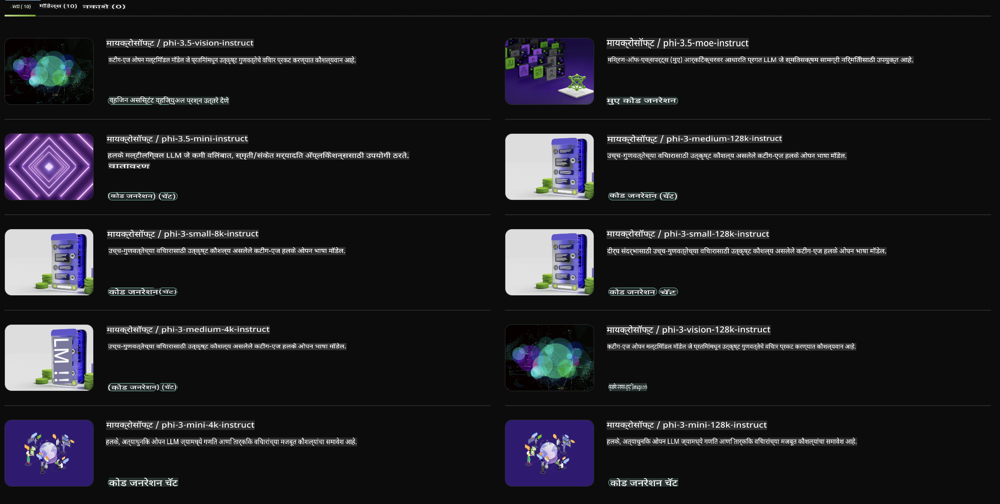

## NVIDIA NIM मधील Phi Family

NVIDIA NIM ही क्लाऊड, डेटा सेंटर आणि वर्कस्टेशनमध्ये जनरेटिव्ह AI मॉडेल्सच्या तैनातीला गती देण्यासाठी डिझाइन केलेल्या वापरण्यास सुलभ मायक्रोसर्व्हिसेसचा संच आहे. NIM मॉडेल कुटुंबानुसार आणि प्रति मॉडेल वर्गीकृत आहेत. उदाहरणार्थ, मोठ्या भाषिक मॉडेल्ससाठी (LLMs) NVIDIA NIM एंटरप्राइझ अॅप्लिकेशन्ससाठी अत्याधुनिक LLMs ची ताकद प्रदान करते, अप्रतिम नैसर्गिक भाषा प्रक्रिया आणि समज क्षमतांसह.

NIM आयटी आणि DevOps टीम्सना मोठ्या भाषिक मॉडेल्स (LLMs) त्यांच्या स्वतःच्या व्यवस्थापित वातावरणात होस्ट करण्यास सोपे करते, तर तरीही विकसकांना इंडस्ट्री स्टँडर्ड APIs प्रदान करते ज्यामुळे ते सामर्थ्यवान को-पायलट्स, चॅटबॉट्स आणि AI सहाय्यक तयार करू शकतात जे त्यांच्या व्यवसायाचे रूपांतर करू शकतात. NVIDIA च्या अत्याधुनिक GPU प्रवेग आणि स्केलेबल तैनातीचा लाभ घेत, NIM अतुलनीय कामगिरीसह अनुमानासाठी सर्वात वेगवान मार्ग प्रदान करते.

तुम्ही Phi Family Models च्या अनुमानासाठी NVIDIA NIM वापरू शकता.



### **नमुने - NVIDIA NIM मधील Phi-3-Vision**

कल्पना करा की तुमच्याकडे एक प्रतिमा आहे (`demo.png`) आणि तुम्हाला त्या प्रतिमेवर प्रक्रिया करणारा आणि त्याचा नवीन आवृत्ती जतन करणारा Python कोड तयार करायचा आहे (`phi-3-vision.jpg`).

वरील कोड हे कार्य स्वयंचलित करतो:

1. वातावरण आणि आवश्यक कॉन्फिगरेशन सेट करणे.
2. मॉडेलला आवश्यक Python कोड तयार करण्याचे निर्देश देणारा प्रॉम्प्ट तयार करणे.
3. प्रॉम्प्ट मॉडेलला पाठवून तयार केलेला कोड गोळा करणे.
4. तयार केलेला कोड काढणे आणि चालवणे.
5. मूळ आणि प्रक्रिया केलेल्या प्रतिमा दाखवणे.

ही पद्धत प्रतिमा प्रक्रिया कार्ये स्वयंचलित करण्यासाठी AI ची ताकद वापरते, ज्यामुळे तुमची उद्दिष्टे साध्य करणे सोपे आणि जलद होते.

[नमुना कोड सोल्युशन](../../../../../code/06.E2E/E2E_Nvidia_NIM_Phi3_Vision.ipynb)

चला संपूर्ण कोड पायरी पायरीने समजून घेऊया:

1. **आवश्यक पॅकेज स्थापित करा**:
    ```python
    !pip install langchain_nvidia_ai_endpoints -U
    ```
    हा आदेश `langchain_nvidia_ai_endpoints` पॅकेज स्थापित करतो, आणि याची खात्री करतो की ते नवीनतम आवृत्ती आहे.

2. **आवश्यक मॉड्यूल्स आयात करा**:
    ```python
    from langchain_nvidia_ai_endpoints import ChatNVIDIA
    import getpass
    import os
    import base64
    ```
    हे आयात NVIDIA AI endpoints शी संवाद साधण्यासाठी, पासवर्ड सुरक्षितपणे हाताळण्यासाठी, ऑपरेटिंग सिस्टमशी संवाद साधण्यासाठी, आणि base64 स्वरूपात डेटा एन्कोड/डिकोड करण्यासाठी आवश्यक मॉड्यूल्स आणतात.

3. **API Key सेट करा**:
    ```python
    if not os.getenv("NVIDIA_API_KEY"):
        os.environ["NVIDIA_API_KEY"] = getpass.getpass("Enter your NVIDIA API key: ")
    ```
    हा कोड `NVIDIA_API_KEY` पर्यावरणीय व्हेरिएबल सेट केले आहे का ते तपासतो. जर नसेल, तर ते वापरकर्त्याला सुरक्षितपणे API key प्रविष्ट करण्यास सांगतो.

4. **मॉडेल आणि प्रतिमेचा मार्ग परिभाषित करा**:
    ```python
    model = 'microsoft/phi-3-vision-128k-instruct'
    chat = ChatNVIDIA(model=model)
    img_path = './imgs/demo.png'
    ```
    हे वापरायचे मॉडेल सेट करते, दिलेल्या मॉडेलसह `ChatNVIDIA` चे उदाहरण तयार करते, आणि प्रतिमा फाईलचा मार्ग परिभाषित करते.

5. **टेक्स्ट प्रॉम्प्ट तयार करा**:
    ```python
    text = "Please create Python code for image, and use plt to save the new picture under imgs/ and name it phi-3-vision.jpg."
    ```
    हा कोड प्रतिमा प्रक्रिया करण्यासाठी Python कोड तयार करण्याचे निर्देश देणारा टेक्स्ट प्रॉम्प्ट परिभाषित करतो.

6. **प्रतिमा Base64 मध्ये एन्कोड करा**:
    ```python
    with open(img_path, "rb") as f:
        image_b64 = base64.b64encode(f.read()).decode()
    image = f''
    ```
    हा कोड प्रतिमा फाईल वाचतो, Base64 मध्ये एन्कोड करतो, आणि एन्कोड केलेल्या डेटासह HTML प्रतिमा टॅग तयार करतो.

7. **टेक्स्ट आणि प्रतिमेला प्रॉम्प्टमध्ये एकत्र करा**:
    ```python
    prompt = f"{text} {image}"
    ```
    हे टेक्स्ट प्रॉम्प्ट आणि HTML प्रतिमा टॅग एका सिंगल स्ट्रिंगमध्ये एकत्र करते.

8. **ChatNVIDIA वापरून कोड तयार करा**:
    ```python
    code = ""
    for chunk in chat.stream(prompt):
        print(chunk.content, end="")
        code += chunk.content
    ```
    हा कोड प्रॉम्प्ट `ChatNVIDIA` model and collects the generated code in chunks, printing and appending each chunk to the `code` स्ट्रिंगला पाठवतो.

9. **तयार केलेल्या सामग्रीमधून Python कोड काढा**:
    ```python
    begin = code.index('```python') + 9
    code = code[begin:]
    end = code.index('```')
    code = code[:end]
    ```
    हा कोड तयार केलेल्या सामग्रीमधून Markdown स्वरूप काढून खऱ्या Python कोडचे उत्खनन करतो.

10. **तयार केलेला कोड चालवा**:
    ```python
    import subprocess
    result = subprocess.run(["python", "-c", code], capture_output=True)
    ```
    हा कोड तयार केलेल्या Python कोडला सबप्रोसेस म्हणून चालवतो आणि त्याचे आउटपुट कॅप्चर करतो.

11. **प्रतिमा दाखवा**:
    ```python
    from IPython.display import Image, display
    display(Image(filename='./imgs/phi-3-vision.jpg'))
    display(Image(filename='./imgs/demo.png'))
    ```
    हे ओळी `IPython.display` मॉड्यूल वापरून प्रतिमा प्रदर्शित करतात.

**अस्वीकरण**:  
हा दस्तऐवज मशीन-आधारित एआय भाषांतर सेवा वापरून अनुवादित करण्यात आला आहे. आम्ही अचूकतेसाठी प्रयत्नशील असलो तरी, कृपया लक्षात घ्या की स्वयंचलित भाषांतरांमध्ये त्रुटी किंवा अचूकतेचा अभाव असू शकतो. मूळ भाषेतील मूळ दस्तऐवज हा अधिकृत स्रोत मानावा. महत्त्वाच्या माहितीसाठी, व्यावसायिक मानवी भाषांतराची शिफारस केली जाते. या भाषांतराचा वापर करून उद्भवलेल्या कोणत्याही गैरसमज किंवा चुकीच्या अर्थासाठी आम्ही जबाबदार नाही.