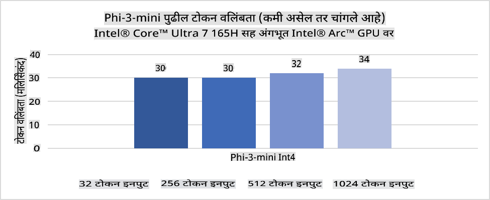
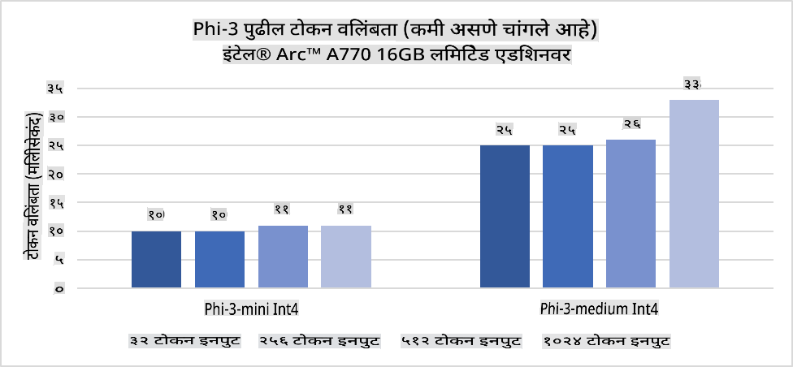
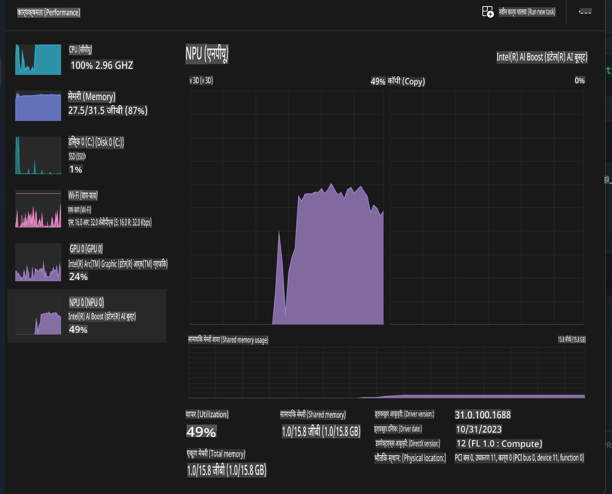
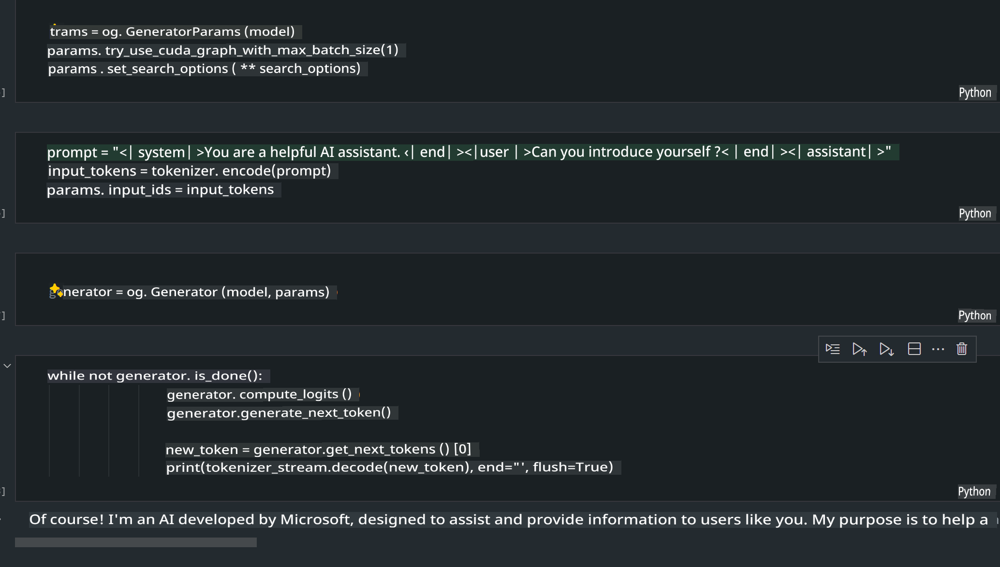
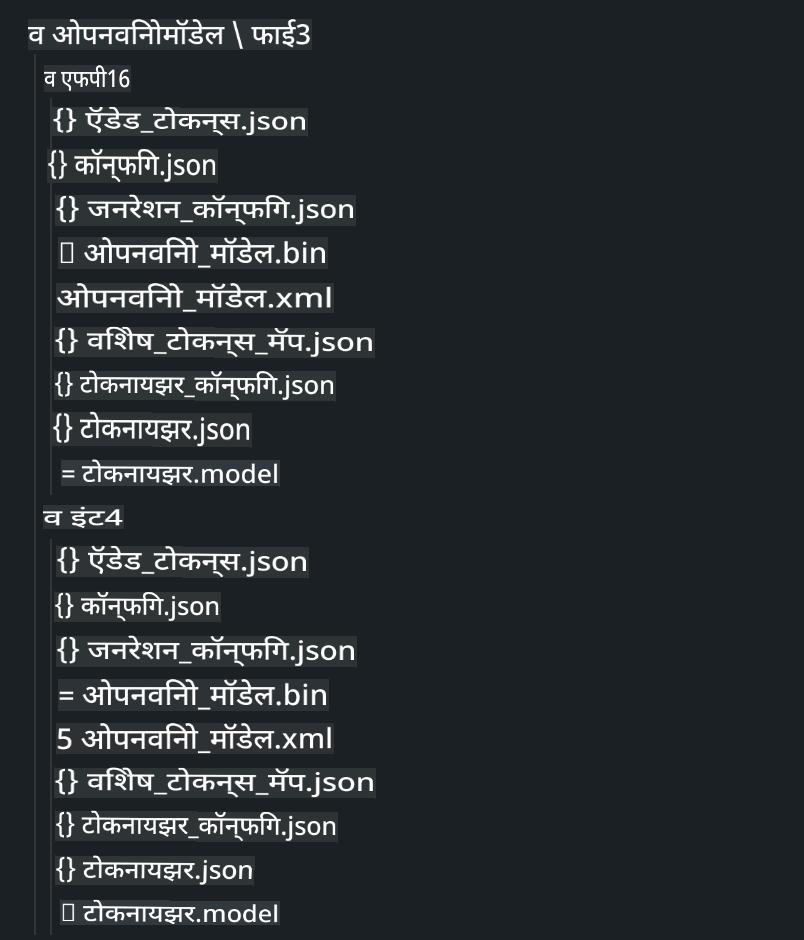
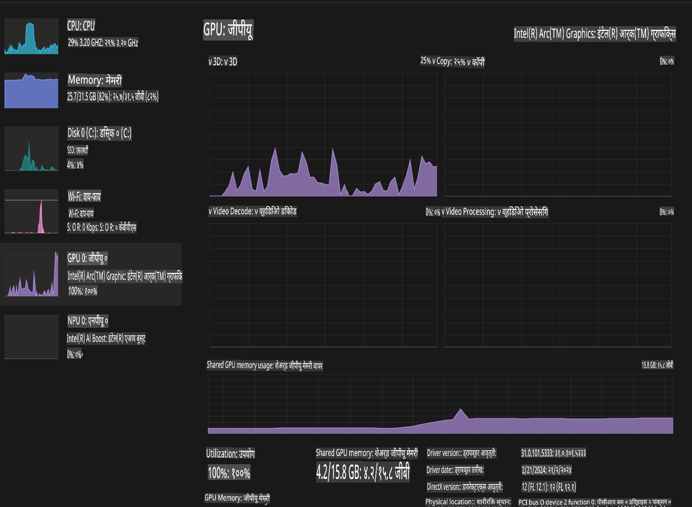

# **AI PC मध्ये Phi-3 चा उपयोग**

जनरेटिव्ह AI च्या प्रगतीसह आणि एज डिव्हाइस हार्डवेअर क्षमतांमध्ये सुधारणा झाल्यामुळे, आता अधिकाधिक जनरेटिव्ह AI मॉडेल्स वापरकर्त्यांच्या "तुमचं स्वतःचं डिव्हाइस आणा" (BYOD) डिव्हाइसवर समाकलित केली जाऊ शकतात. AI पीसी हे अशा मॉडेल्सपैकी एक आहेत. 2024 पासून, Intel, AMD, आणि Qualcomm यांनी पीसी उत्पादकांसोबत भागीदारी करून AI पीसी सादर केले आहेत, जे हार्डवेअर बदलांद्वारे स्थानिक जनरेटिव्ह AI मॉडेल्सची तैनाती सुलभ करतात. या चर्चेत, आपण Intel AI पीसीवर लक्ष केंद्रित करू आणि Intel AI पीसीवर Phi-3 कसे तैनात करायचे हे पाहू.

### NPU म्हणजे काय?

NPU (न्यूरल प्रोसेसिंग युनिट) ही एक समर्पित प्रोसेसर किंवा मोठ्या SoC वरील प्रोसेसिंग युनिट आहे, जी विशेषतः न्यूरल नेटवर्क ऑपरेशन्स आणि AI कार्ये गतीने पार पाडण्यासाठी डिझाइन केली आहे. सर्वसामान्य CPUs आणि GPUs च्या विपरीत, NPUs डेटा-चालित समांतर संगणनासाठी ऑप्टिमाइझ केलेले असतात, ज्यामुळे ते व्हिडिओ आणि प्रतिमांसारख्या मोठ्या मल्टीमीडिया डेटाचे आणि न्यूरल नेटवर्कसाठी डेटाचे कार्यक्षमतेने प्रक्रिया करण्यात अत्यंत कुशल असतात. ते AI संबंधित कार्यांसाठी विशेषतः उपयुक्त आहेत, जसे की भाषण ओळख, व्हिडिओ कॉलमध्ये पार्श्वभूमी अस्पष्ट करणे आणि ऑब्जेक्ट डिटेक्शनसारख्या फोटो किंवा व्हिडिओ एडिटिंग प्रक्रियांसाठी.

## NPU vs GPU

अनेक AI आणि मशीन लर्निंग वर्कलोड्स GPUs वर चालवले जात असले तरी, GPUs आणि NPUs यामध्ये महत्त्वाचा फरक आहे.  
GPUs त्यांच्या समांतर संगणन क्षमतांसाठी ओळखले जातात, परंतु सर्व GPUs ग्राफिक्स प्रक्रिया पलीकडे तितके कार्यक्षम नसतात. दुसरीकडे, NPUs न्यूरल नेटवर्क ऑपरेशन्समध्ये गुंतलेल्या जटिल गणनांसाठी खास डिझाइन केलेले असतात, ज्यामुळे ते AI कार्यांसाठी अत्यंत प्रभावी ठरतात.

सारांश, NPUs हे AI गणनांना गती देणारे गणिती तज्ज्ञ आहेत आणि AI PCs च्या उदयोन्मुख युगात ते महत्त्वाची भूमिका बजावतात!

***हे उदाहरण Intel च्या नवीनतम Intel Core Ultra Processor वर आधारित आहे.***

## **1. NPU वापरून Phi-3 मॉडेल चालवणे**

Intel® NPU डिव्हाइस हा एक AI इनफरन्स प्रवेगक आहे, जो Intel® Core™ Ultra CPU (पूर्वी मेटिओर लेक म्हणून ओळखला जाणारा) पासून Intel क्लायंट CPUs मध्ये समाकलित आहे. हे कृत्रिम न्यूरल नेटवर्क कार्ये ऊर्जा-कार्यक्षमतेने पार पाडण्यास सक्षम करते.





**Intel NPU प्रवेगक लायब्ररी**

Intel NPU Acceleration Library [https://github.com/intel/intel-npu-acceleration-library](https://github.com/intel/intel-npu-acceleration-library) ही एक Python लायब्ररी आहे जी Intel Neural Processing Unit (NPU) च्या शक्तीचा वापर करून तुमच्या ऍप्लिकेशन्सची कार्यक्षमता वाढवण्यासाठी डिझाइन केलेली आहे, ज्यामुळे सुसंगत हार्डवेअरवर उच्च-गती गणना होऊ शकते.

AI PC मध्ये Intel® Core™ Ultra प्रोसेसरने चालवलेल्या Phi-3-mini चे उदाहरण:


Python लायब्ररी pip च्या साहाय्याने इन्स्टॉल करा

```bash

   pip install intel-npu-acceleration-library

```

***Note*** प्रकल्प अद्याप विकासाधीन आहे, परंतु संदर्भ मॉडेल खूपच पूर्ण झाले आहे.

### **Intel NPU प्रवेगक लायब्ररीसह Phi-3 चालवणे**

Intel NPU प्रवेगक वापरून, ही लायब्ररी पारंपरिक एन्कोडिंग प्रक्रियेला प्रभावित करत नाही. तुम्हाला फक्त मूळ Phi-3 मॉडेलचे क्वांटायझेशन करण्यासाठी ही लायब्ररी वापरावी लागेल, जसे की FP16, INT8, INT4.

```python
from transformers import AutoTokenizer, pipeline,TextStreamer
from intel_npu_acceleration_library import NPUModelForCausalLM, int4
from intel_npu_acceleration_library.compiler import CompilerConfig
import warnings

model_id = "microsoft/Phi-3-mini-4k-instruct"

compiler_conf = CompilerConfig(dtype=int4)
model = NPUModelForCausalLM.from_pretrained(
    model_id, use_cache=True, config=compiler_conf, attn_implementation="sdpa"
).eval()

tokenizer = AutoTokenizer.from_pretrained(model_id)

text_streamer = TextStreamer(tokenizer, skip_prompt=True)
```

क्वांटायझेशन यशस्वी झाल्यानंतर, Phi-3 मॉडेल चालवण्यासाठी NPU ला कॉल करण्यासाठी अंमलबजावणी सुरू ठेवा.

```python
generation_args = {
   "max_new_tokens": 1024,
   "return_full_text": False,
   "temperature": 0.3,
   "do_sample": False,
   "streamer": text_streamer,
}

pipe = pipeline(
   "text-generation",
   model=model,
   tokenizer=tokenizer,
)

query = "<|system|>You are a helpful AI assistant.<|end|><|user|>Can you introduce yourself?<|end|><|assistant|>"

with warnings.catch_warnings():
    warnings.simplefilter("ignore")
    pipe(query, **generation_args)
```

कोड अंमलात आणताना, Task Manager च्या माध्यमातून NPU चा रनिंग स्टेटस पाहू शकतो.



***Samples*** : [AIPC_NPU_DEMO.ipynb](../../../../../code/03.Inference/AIPC/AIPC_NPU_DEMO.ipynb)

## **2. DirectML + ONNX Runtime वापरून Phi-3 मॉडेल चालवणे**

### **DirectML म्हणजे काय**

[DirectML](https://github.com/microsoft/DirectML) ही मशीन लर्निंगसाठी उच्च-कार्यक्षम, हार्डवेअर-प्रवेगित DirectX 12 लायब्ररी आहे. DirectML GPU प्रवेगकासह मशीन लर्निंग कार्ये सुलभ करते आणि AMD, Intel, NVIDIA, आणि Qualcomm यांसारख्या अनेक हार्डवेअरवर कार्य करते.

स्वतंत्रपणे वापरल्यास, DirectML API एक लो-लेव्हल DirectX 12 लायब्ररी आहे आणि ती उच्च-कार्यक्षमता, कमी विलंबता ऍप्लिकेशन्ससाठी योग्य आहे, जसे की फ्रेमवर्क्स, गेम्स, आणि रिअल-टाइम ऍप्लिकेशन्स. 

***Note*** : नवीनतम DirectML आधीच NPU ला सपोर्ट करते (https://devblogs.microsoft.com/directx/introducing-neural-processor-unit-npu-support-in-directml-developer-preview/)

### DirectML आणि CUDA यांची तुलना त्यांच्या क्षमतांनुसार:

**DirectML** ही Microsoft ने विकसित केलेली मशीन लर्निंग लायब्ररी आहे.  
- DX12 आधारित: DirectML DirectX 12 वर आधारित आहे, ज्यामुळे NVIDIA आणि AMD सह अनेक GPUs साठी समर्थन मिळते.  
- व्यापक समर्थन: DX12 चा फायदा घेतल्यामुळे, DirectML कोणत्याही DX12-सुसंगत GPU वर काम करू शकते.  
- प्रतिमा प्रक्रिया: DirectML न्यूरल नेटवर्क्स वापरून प्रतिमा आणि डेटा प्रक्रिया करते.  
- सुलभ सेटअप: DirectML सेट करणे सोपे आहे.  
- कार्यक्षमता: काही बाबतीत DirectML चांगली कामगिरी करते.  
- मर्यादा: मोठ्या फ्लोट16 बॅचसाठी काही वेळा धीमे असते.  

**CUDA** ही NVIDIA ची प्लॅटफॉर्म आहे जी त्यांच्या GPUs साठी विशिष्ट आहे.  
- NVIDIA-संबंधित: CUDA फक्त NVIDIA GPUs साठी डिझाइन केलेले आहे.  
- अत्यंत ऑप्टिमाइझ्ड: GPU प्रवेगक कार्यांसाठी उत्कृष्ट कामगिरी देते.  
- व्यापक वापर: TensorFlow, PyTorch सारख्या फ्रेमवर्कमध्ये CUDA चा सपोर्ट आहे.  
- मर्यादा: फक्त NVIDIA हार्डवेअरपुरते मर्यादित.  

### DirectML आणि CUDA यामधून निवड करणे

तुमच्या हार्डवेअरच्या उपलब्धतेनुसार आणि गरजेनुसार DirectML किंवा CUDA निवडता येईल.  

### **ONNX Runtime सह जनरेटिव्ह AI**

AI च्या युगात, AI मॉडेल्सची पोर्टेबिलिटी खूप महत्त्वाची आहे. ONNX Runtime वापरून प्रशिक्षित मॉडेल्स वेगवेगळ्या डिव्हाइसवर सहजपणे तैनात करता येतात. ONNX Runtime ने जनरेटिव्ह AI मॉडेल्ससाठी कोड ऑप्टिमायझेशन केले आहे (https://onnxruntime.ai/docs/genai/).

[Sample Code](https://github.com/Azure-Samples/Phi-3MiniSamples/tree/main/onnx)

***ONNX Runtime लायब्ररीसह जनरेटिव्ह AI कॉम्पाईल करा***

```bash

winget install --id=Kitware.CMake  -e

git clone https://github.com/microsoft/onnxruntime.git

cd .\onnxruntime\

./build.bat --build_shared_lib --skip_tests --parallel --use_dml --config Release

cd ../

git clone https://github.com/microsoft/onnxruntime-genai.git

cd .\onnxruntime-genai\

mkdir ort

cd ort

mkdir include

mkdir lib

copy ..\onnxruntime\include\onnxruntime\core\providers\dml\dml_provider_factory.h ort\include

copy ..\onnxruntime\include\onnxruntime\core\session\onnxruntime_c_api.h ort\include

copy ..\onnxruntime\build\Windows\Release\Release\*.dll ort\lib

copy ..\onnxruntime\build\Windows\Release\Release\onnxruntime.lib ort\lib

python build.py --use_dml


```

**लायब्ररी इन्स्टॉल करा**

```bash

pip install .\onnxruntime_genai_directml-0.3.0.dev0-cp310-cp310-win_amd64.whl

```

हा रनिंग परिणाम आहे:



***Samples*** : [AIPC_DirectML_DEMO.ipynb](../../../../../code/03.Inference/AIPC/AIPC_DirectML_DEMO.ipynb)

## **3. Intel OpenVino वापरून Phi-3 मॉडेल चालवणे**

### **OpenVINO म्हणजे काय**

[OpenVINO](https://github.com/openvinotoolkit/openvino) ही एक ओपन-सोर्स टूलकिट आहे, जी डीप लर्निंग मॉडेल्स ऑप्टिमाइज आणि तैनात करण्यासाठी आहे. OpenVINO CPU आणि GPU सह Phi-3 मॉडेल चालवण्यासाठी वापरले जाऊ शकते.

***Note***: सध्या, OpenVINO NPU ला सपोर्ट करत नाही.

### **OpenVINO लायब्ररी इन्स्टॉल करा**

```bash

 pip install git+https://github.com/huggingface/optimum-intel.git

 pip install git+https://github.com/openvinotoolkit/nncf.git

 pip install openvino-nightly

```

### **OpenVINO सह Phi-3 चालवणे**

NPU प्रमाणेच, OpenVINO क्वांटायझेशन मॉडेल्स चालवून जनरेटिव्ह AI मॉडेल्स पूर्ण करते. Phi-3 मॉडेलचे क्वांटायझेशन आधी करावे लागेल.

**INT4**

```bash

optimum-cli export openvino --model "microsoft/Phi-3-mini-4k-instruct" --task text-generation-with-past --weight-format int4 --group-size 128 --ratio 0.6  --sym  --trust-remote-code ./openvinomodel/phi3/int4

```

**FP16**

```bash

optimum-cli export openvino --model "microsoft/Phi-3-mini-4k-instruct" --task text-generation-with-past --weight-format fp16 --trust-remote-code ./openvinomodel/phi3/fp16

```

कन्व्हर्ट केलेले स्वरूप असे दिसते:



OVModelForCausalLM च्या माध्यमातून मॉडेल पथ (model_dir), संबंधित कॉन्फिगरेशन (ov_config = {"PERFORMANCE_HINT": "LATENCY", "NUM_STREAMS": "1", "CACHE_DIR": ""}), आणि हार्डवेअर-प्रवेगक उपकरणे (GPU.0) लोड करा.

```python

ov_model = OVModelForCausalLM.from_pretrained(
     model_dir,
     device='GPU.0',
     ov_config=ov_config,
     config=AutoConfig.from_pretrained(model_dir, trust_remote_code=True),
     trust_remote_code=True,
)

```

कोड अंमलात आणताना, Task Manager च्या माध्यमातून GPU चा रनिंग स्टेटस पाहू शकतो.



***Samples*** : [AIPC_OpenVino_Demo.ipynb](../../../../../code/03.Inference/AIPC/AIPC_OpenVino_Demo.ipynb)

### ***Note*** : वरील तीन पद्धतींना त्यांच्या स्वतःच्या फायद्यांचा लाभ आहे, परंतु AI PC इनफरन्ससाठी NPU प्रवेगक वापरण्याची शिफारस केली जाते.

**अस्वीकरण**:  
हे दस्तऐवज मशीन-आधारित AI भाषांतर सेवांचा वापर करून अनुवादित केले गेले आहे. आम्ही अचूकतेसाठी प्रयत्नशील असलो तरी, कृपया लक्षात घ्या की स्वयंचलित भाषांतरांमध्ये चुका किंवा अचूकतेचा अभाव असू शकतो. मूळ भाषेतील मूळ दस्तऐवज अधिकृत स्रोत मानावा. महत्त्वाच्या माहितीसाठी व्यावसायिक मानवी भाषांतराची शिफारस केली जाते. या भाषांतराच्या वापरामुळे उद्भवणाऱ्या कोणत्याही गैरसमज किंवा चुकीच्या अर्थासाठी आम्ही जबाबदार नाही.