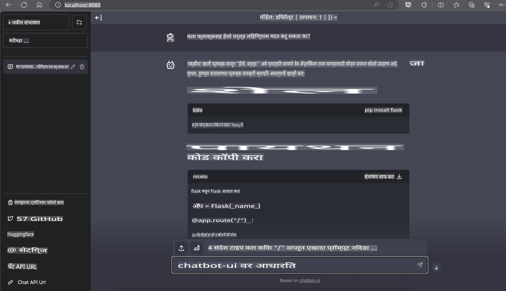

# **Nvidia Jetson वर Phi-3 चा वापर**

Nvidia Jetson ही Nvidia कडून उपलब्ध असलेल्या एम्बेडेड संगणकीय बोर्डांची मालिका आहे. Jetson TK1, TX1 आणि TX2 या मॉडेल्समध्ये Nvidia च्या Tegra प्रोसेसर (किंवा SoC) चा समावेश आहे, जो ARM आर्किटेक्चर सेंट्रल प्रोसेसिंग युनिट (CPU) एकत्रित करतो. Jetson हा कमी उर्जेवर चालणारा प्रणाली आहे आणि मशीन लर्निंग ऍप्लिकेशन्सला गती देण्यासाठी डिझाइन करण्यात आला आहे. Nvidia Jetson व्यावसायिक डेव्हलपरद्वारे विविध उद्योगांमध्ये प्रगत AI उत्पादने तयार करण्यासाठी वापरला जातो, तसेच विद्यार्थ्यांना आणि उत्साही लोकांना हाताळता येणाऱ्या AI शिकण्यासाठी आणि उत्कृष्ट प्रकल्प बनवण्यासाठीही उपयोगी आहे. SLM Jetson सारख्या एज डिव्हाइसेसवर तैनात केले जाते, ज्यामुळे औद्योगिक जनरेटिव्ह AI ऍप्लिकेशन परिदृश्यांची अधिक चांगली अंमलबजावणी शक्य होते.

## NVIDIA Jetson वर तैनाती:
स्वायत्त रोबोटिक्स आणि एम्बेडेड डिव्हाइसवर काम करणारे डेव्हलपर Phi-3 Mini चा उपयोग करू शकतात. Phi-3 चा लहान आकार एज डिप्लॉयमेंटसाठी आदर्श ठरतो. प्रशिक्षणादरम्यान पॅरामीटर्स काळजीपूर्वक ट्यून करण्यात आले आहेत, ज्यामुळे प्रतिसादामध्ये उच्च अचूकता मिळते.

### TensorRT-LLM ऑप्टिमायझेशन:
NVIDIA ची [TensorRT-LLM लायब्ररी](https://github.com/NVIDIA/TensorRT-LLM?WT.mc_id=aiml-138114-kinfeylo) मोठ्या भाषा मॉडेल्सच्या इन्फरन्सेसाठी ऑप्टिमायझेशन प्रदान करते. ही लायब्ररी Phi-3 Mini च्या लांब संदर्भ खिडकीला (context window) सपोर्ट करते, ज्यामुळे थ्रूपुट आणि लेटन्सी सुधारते. ऑप्टिमायझेशनमध्ये LongRoPE, FP8, आणि inflight batching यांसारख्या तंत्रांचा समावेश आहे.

### उपलब्धता आणि तैनाती:
डेव्हलपर [NVIDIA AI](https://www.nvidia.com/en-us/ai-data-science/generative-ai/) वर 128K संदर्भ खिडकीसह Phi-3 Mini शोधू शकतात. हे NVIDIA NIM म्हणून पॅकेज केलेले आहे, एक मायक्रोसर्व्हिस ज्याला मानक API सह कुठेही तैनात करता येते. याशिवाय, [GitHub वरील TensorRT-LLM इम्प्लिमेंटेशन्स](https://github.com/NVIDIA/TensorRT-LLM) उपलब्ध आहेत.

## **1. तयारी**

a. Jetson Orin NX / Jetson NX

b. JetPack 5.1.2+
   
c. Cuda 11.8
   
d. Python 3.8+

## **2. Jetson मध्ये Phi-3 चालवणे**

आपण [Ollama](https://ollama.com) किंवा [LlamaEdge](https://llamaedge.com) निवडू शकतो.

जर तुम्हाला gguf क्लाउड आणि एज डिव्हाइसवर एकाच वेळी वापरायचे असेल, तर LlamaEdge ला WasmEdge म्हणून समजू शकता (WasmEdge ही एक हलकी, उच्च-कार्यक्षमता, स्केलेबल WebAssembly रनटाइम आहे, जी क्लाउड नेटिव्ह, एज आणि विकेंद्रित ऍप्लिकेशन्ससाठी योग्य आहे. हे सर्व्हरलेस ऍप्लिकेशन्स, एम्बेडेड फंक्शन्स, मायक्रोसर्व्हिसेस, स्मार्ट कॉन्ट्रॅक्ट्स आणि IoT डिव्हाइसेससाठी सपोर्ट करते). तुम्ही gguf चे क्वांटिटेटिव्ह मॉडेल एज डिव्हाइस आणि क्लाउडवर LlamaEdge च्या माध्यमातून तैनात करू शकता.


खाली दिलेल्या पद्धतीने वापर करू शकता:

1. संबंधित लायब्ररी आणि फाइल्स इन्स्टॉल व डाउनलोड करा

```bash

curl -sSf https://raw.githubusercontent.com/WasmEdge/WasmEdge/master/utils/install.sh | bash -s -- --plugin wasi_nn-ggml

curl -LO https://github.com/LlamaEdge/LlamaEdge/releases/latest/download/llama-api-server.wasm

curl -LO https://github.com/LlamaEdge/chatbot-ui/releases/latest/download/chatbot-ui.tar.gz

tar xzf chatbot-ui.tar.gz

```

**टीप**: llama-api-server.wasm आणि chatbot-ui हे एकाच डायरेक्टरीमध्ये असणे आवश्यक आहे.

2. टर्मिनलमध्ये स्क्रिप्ट चालवा

```bash

wasmedge --dir .:. --nn-preload default:GGML:AUTO:{Your gguf path} llama-api-server.wasm -p phi-3-chat

```

हे आहे रनिंग रिझल्ट:



***नमुना कोड*** [Phi-3 Mini WASM नोटबुक नमुना](https://github.com/Azure-Samples/Phi-3MiniSamples/tree/main/wasm)

सारांश, Phi-3 Mini भाषा मॉडेलिंगमध्ये एक मोठी प्रगती दर्शवतो, ज्यामध्ये कार्यक्षमता, संदर्भ जागरूकता आणि NVIDIA च्या ऑप्टिमायझेशन कौशल्याचा समावेश आहे. तुम्ही रोबोट्स तयार करत असाल किंवा एज ऍप्लिकेशन्स, Phi-3 Mini हा एक शक्तिशाली साधन आहे ज्याचा विचार करायला हवा.

**अस्वीकरण**:  
हे दस्तऐवज मशीन-आधारित एआय अनुवाद सेवा वापरून अनुवादित केले गेले आहे. आम्ही अचूकतेसाठी प्रयत्नशील असलो तरी, कृपया लक्षात घ्या की स्वयंचलित अनुवादांमध्ये त्रुटी किंवा अचूकतेचा अभाव असू शकतो. मूळ भाषेतील मूळ दस्तऐवज अधिकृत स्रोत मानला जावा. महत्त्वाच्या माहितीसाठी व्यावसायिक मानवी अनुवादाची शिफारस केली जाते. या अनुवादाचा वापर केल्याने उद्भवणाऱ्या कोणत्याही गैरसमज किंवा चुकीच्या अर्थासाठी आम्ही जबाबदार राहणार नाही.