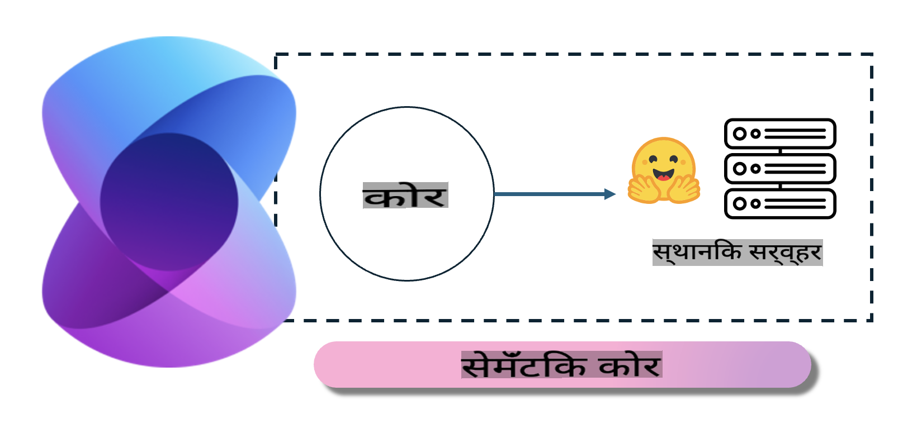
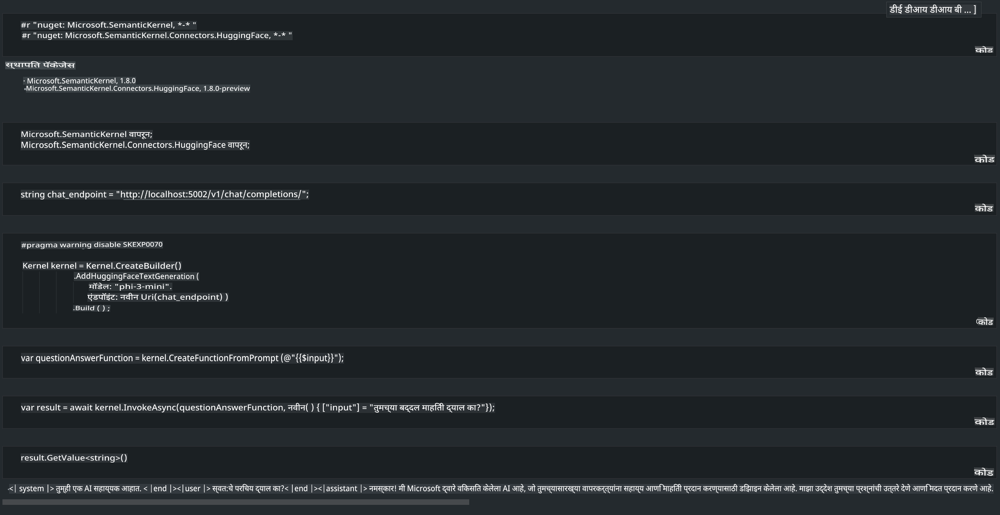

# **स्थानिक सर्व्हरवर Phi-3 चा वापर**

आपण Phi-3 स्थानिक सर्व्हरवर तैनात करू शकतो. वापरकर्ते [Ollama](https://ollama.com) किंवा [LM Studio](https://llamaedge.com) या उपायांचा वापर करू शकतात, किंवा स्वतःचा कोड लिहू शकतात. [Semantic Kernel](https://github.com/microsoft/semantic-kernel?WT.mc_id=aiml-138114-kinfeylo) किंवा [Langchain](https://www.langchain.com/) च्या मदतीने Phi-3 च्या स्थानिक सेवांशी जोडून CoPilot अॅप्लिकेशन्स तयार करता येतात.

## **Semantic Kernel चा वापर करून Phi-3-mini वापरणे**

CoPilot अॅप्लिकेशनमध्ये, आपण Semantic Kernel / LangChain च्या मदतीने अॅप्लिकेशन्स तयार करतो. हा प्रकारचा अॅप्लिकेशन फ्रेमवर्क सामान्यतः Azure OpenAI Service / OpenAI मॉडेल्ससाठी सुसंगत असतो आणि Hugging Face व स्थानिक मॉडेल्स यांसारख्या ओपन सोर्स मॉडेल्सना देखील समर्थन देतो. जर आपल्याला Semantic Kernel चा वापर करून Phi-3-mini पर्यंत पोहोचायचे असेल, तर काय करावे? .NET चा एक उदाहरण म्हणून, आपण Semantic Kernel मधील Hugging Face Connector सोबत याचा वापर करू शकतो. डीफॉल्टनुसार, तो Hugging Face वरील मॉडेल आयडीशी जुळतो (पहिल्यांदा वापरताना, मॉडेल Hugging Face वरून डाउनलोड होईल, ज्याला जास्त वेळ लागू शकतो). तुम्ही स्वतः तयार केलेल्या स्थानिक सेवेशी देखील कनेक्ट करू शकता. या दोघांच्या तुलनेत, आम्ही स्थानिक सेवा वापरण्याचा सल्ला देतो कारण यामुळे स्वायत्ततेचा अधिक उच्च स्तर मिळतो, विशेषतः एंटरप्राइझ अॅप्लिकेशन्समध्ये.

वरील चित्रामध्ये दाखवल्याप्रमाणे, Semantic Kernel च्या मदतीने स्थानिक सेवांशी जोडून Phi-3-mini मॉडेल सर्व्हर सहजपणे कनेक्ट करता येतो. खाली चालवलेले परिणाम दाखवले आहेत.

***नमुना कोड*** https://github.com/kinfey/Phi3MiniSamples/tree/main/semantickernel

**अस्वीकृती**:  
हे दस्तऐवज मशीन-आधारित एआय भाषांतर सेवांचा वापर करून अनुवादित केले गेले आहे. आम्ही अचूकतेसाठी प्रयत्नशील असलो तरी, कृपया लक्षात घ्या की स्वयंचलित भाषांतरांमध्ये चुका किंवा अचूकतेचा अभाव असू शकतो. मूळ भाषेतील मूळ दस्तऐवज हा अधिकृत स्रोत मानावा. महत्त्वाच्या माहितीसाठी व्यावसायिक मानवी भाषांतराची शिफारस केली जाते. या भाषांतराचा वापर करून निर्माण होणाऱ्या कोणत्याही गैरसमजुतींसाठी किंवा चुकीच्या अर्थासाठी आम्ही जबाबदार राहणार नाही.