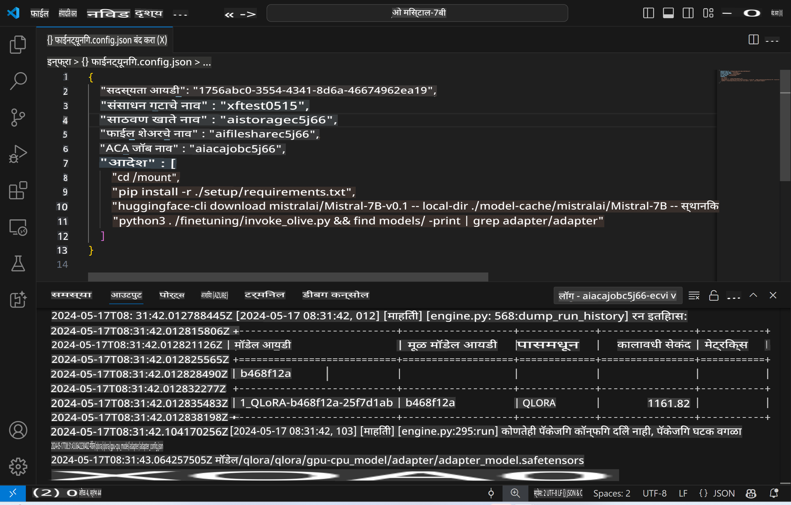
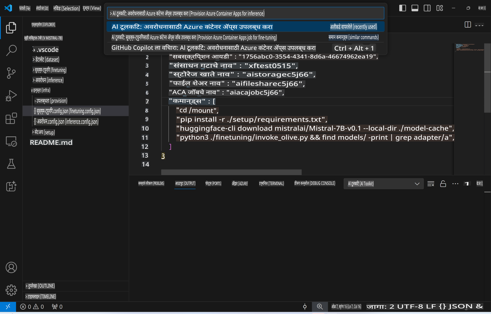
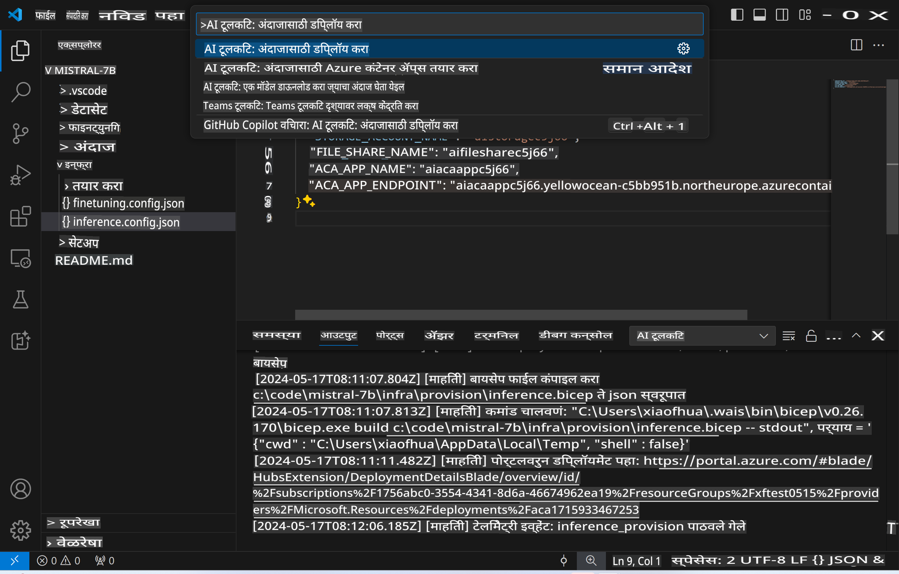
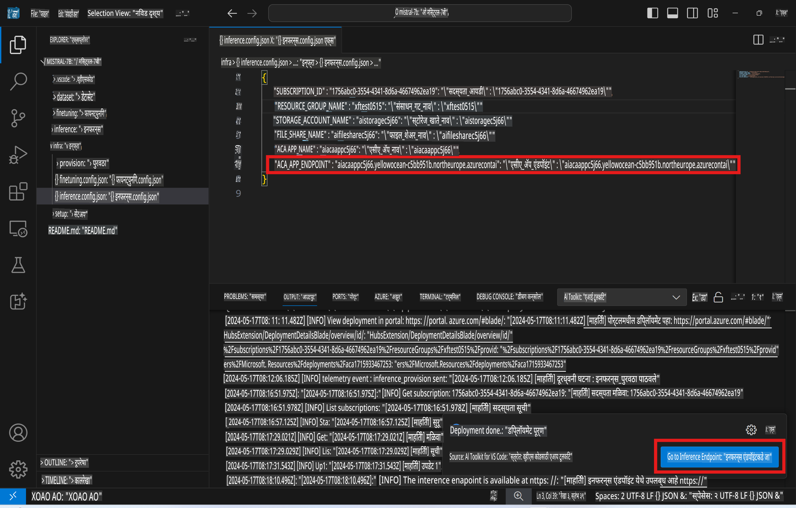

# फायन-ट्यून केलेल्या मॉडेलसह रिमोट इन्फरन्सिंग

रिमोट वातावरणात अॅडॅप्टर्स प्रशिक्षण पूर्ण झाल्यानंतर, मॉडेलशी संवाद साधण्यासाठी साध्या Gradio अॅप्लिकेशनचा वापर करा.



### Azure Resources तयार करा
रिमोट इन्फरन्ससाठी Azure Resources सेट अप करण्यासाठी कमांड पॅलेटमधून `AI Toolkit: Provision Azure Container Apps for inference` चालवा. या सेटअपदरम्यान, तुम्हाला तुमची Azure Subscription आणि resource group निवडण्यास सांगितले जाईल.  


डिफॉल्टनुसार, इन्फरन्ससाठी वापरलेली subscription आणि resource group फाइन-ट्यूनिंगसाठी वापरलेल्या subscription आणि resource groupशी जुळायला हवी. इन्फरन्ससाठी Azure Container App Environment वापरले जाईल आणि Azure Files मध्ये स्टोअर केलेले मॉडेल व मॉडेल अॅडॅप्टर वापरले जातील, जे फाइन-ट्यूनिंग स्टेप दरम्यान तयार झाले होते.

## AI Toolkit चा वापर 

### इन्फरन्ससाठी डिप्लॉयमेंट  
जर तुम्हाला इन्फरन्स कोड पुनरावलोकन करायचा असेल किंवा इन्फरन्स मॉडेल पुन्हा लोड करायचे असेल, तर कृपया `AI Toolkit: Deploy for inference` कमांड चालवा. यामुळे तुमचा ताजा कोड ACA सोबत सिंक्रोनाईझ होईल आणि रेप्लिका पुन्हा सुरू होईल.  



डिप्लॉयमेंट यशस्वीरित्या पूर्ण झाल्यानंतर, मॉडेल या एन्डपॉइंटद्वारे मूल्यांकनासाठी तयार आहे.

### इन्फरन्स API कसे वापरावे

VSCode सूचना पॅनेलमध्ये दर्शवलेल्या "*Go to Inference Endpoint*" बटणावर क्लिक करून तुम्ही इन्फरन्स API वर प्रवेश करू शकता. पर्यायी, वेब API एन्डपॉइंट `ACA_APP_ENDPOINT` मध्ये `./infra/inference.config.json` आणि आउटपुट पॅनेलमध्ये सापडू शकतो.



> **टीप:** इन्फरन्स एन्डपॉइंट पूर्ण कार्यान्वित होण्यासाठी काही मिनिटे लागू शकतात.

## टेम्प्लेटमध्ये समाविष्ट असलेले इन्फरन्स घटक
 
| फोल्डर | सामग्री |
| ------ |--------- |
| `infra` | रिमोट ऑपरेशन्ससाठी आवश्यक असलेल्या सर्व कॉन्फिगरेशन्स समाविष्ट आहेत. |
| `infra/provision/inference.parameters.json` | बाइसप टेम्प्लेट्ससाठीचे पॅरामीटर्स समाविष्ट आहेत, जे इन्फरन्ससाठी Azure Resources तयार करण्यासाठी वापरले जातात. |
| `infra/provision/inference.bicep` | इन्फरन्ससाठी Azure Resources तयार करण्यासाठीचे टेम्प्लेट्स समाविष्ट आहेत. |
| `infra/inference.config.json` | कॉन्फिगरेशन फाइल, जी `AI Toolkit: Provision Azure Container Apps for inference` कमांडद्वारे तयार केली जाते. ही फाइल इतर रिमोट कमांड पॅलेट्ससाठी इनपुट म्हणून वापरली जाते. |

### AI Toolkit वापरून Azure Resource Provision कॉन्फिगर करणे
[AI Toolkit](https://marketplace.visualstudio.com/items?itemName=ms-windows-ai-studio.windows-ai-studio) कॉन्फिगर करा.

इन्फरन्ससाठी Azure Container Apps तयार करा` command.

You can find configuration parameters in `./infra/provision/inference.parameters.json` file. Here are the details:
| Parameter | Description |
| --------- |------------ |
| `defaultCommands` | This is the commands to initiate a web API. |
| `maximumInstanceCount` | This parameter sets the maximum capacity of GPU instances. |
| `location` | This is the location where Azure resources are provisioned. The default value is the same as the chosen resource group's location. |
| `storageAccountName`, `fileShareName` `acaEnvironmentName`, `acaEnvironmentStorageName`, `acaAppName`,  `acaLogAnalyticsName` | These parameters are used to name the Azure resources for provision. By default, they will be same to the fine-tuning resource name. You can input a new, unused resource name to create your own custom-named resources, or you can input the name of an already existing Azure resource if you'd prefer to use that. For details, refer to the section [Using existing Azure Resources](../../../../../md/01.Introduction/03). |

### Using Existing Azure Resources

By default, the inference provision use the same Azure Container App Environment, Storage Account, Azure File Share, and Azure Log Analytics that were used for fine-tuning. A separate Azure Container App is created solely for the inference API. 

If you have customized the Azure resources during the fine-tuning step or want to use your own existing Azure resources for inference, specify their names in the `./infra/inference.parameters.json` फाइल. त्यानंतर, कमांड पॅलेटमधून `AI Toolkit: Provision Azure Container Apps for inference` कमांड चालवा. यामुळे कोणत्याही निर्दिष्ट रिसोर्सेसना अपडेट केले जाईल आणि गहाळ असलेल्या रिसोर्सेस तयार केले जातील.

उदाहरणार्थ, जर तुमच्याकडे आधीच एक Azure कंटेनर एन्व्हायर्नमेंट असेल, तर तुमची `./infra/finetuning.parameters.json` फाइल अशा प्रकारे दिसेल:

```json
{
    "$schema": "https://schema.management.azure.com/schemas/2019-04-01/deploymentParameters.json#",
    "contentVersion": "1.0.0.0",
    "parameters": {
      ...
      "acaEnvironmentName": {
        "value": "<your-aca-env-name>"
      },
      "acaEnvironmentStorageName": {
        "value": null
      },
      ...
    }
  }
```

### मॅन्युअल प्रोव्हिजन  
जर तुम्हाला Azure Resources मॅन्युअली कॉन्फिगर करायचे असतील, तर `./infra/provision` folders. If you have already set up and configured all the Azure resources without using the AI Toolkit command palette, you can simply enter the resource names in the `inference.config.json` फाइलमध्ये दिलेल्या बाइसप फाइल्स वापरा.

उदाहरणार्थ:

```json
{
  "SUBSCRIPTION_ID": "<your-subscription-id>",
  "RESOURCE_GROUP_NAME": "<your-resource-group-name>",
  "STORAGE_ACCOUNT_NAME": "<your-storage-account-name>",
  "FILE_SHARE_NAME": "<your-file-share-name>",
  "ACA_APP_NAME": "<your-aca-name>",
  "ACA_APP_ENDPOINT": "<your-aca-endpoint>"
}
```

**अस्वीकृती**:  
हा दस्तऐवज मशीन-आधारित AI अनुवाद सेवांचा वापर करून अनुवादित करण्यात आला आहे. आम्ही अचूकतेसाठी प्रयत्नशील असलो तरी, कृपया लक्षात घ्या की स्वयंचलित अनुवादांमध्ये त्रुटी किंवा अचूकतेचा अभाव असू शकतो. मूळ भाषेतील मूळ दस्तऐवज हा अधिकृत स्रोत मानला जावा. महत्त्वाच्या माहितीसाठी, व्यावसायिक मानवी अनुवादाची शिफारस केली जाते. या अनुवादाच्या वापरामुळे उद्भवणाऱ्या कोणत्याही गैरसमज किंवा चुकीच्या अर्थासाठी आम्ही जबाबदार राहणार नाही.