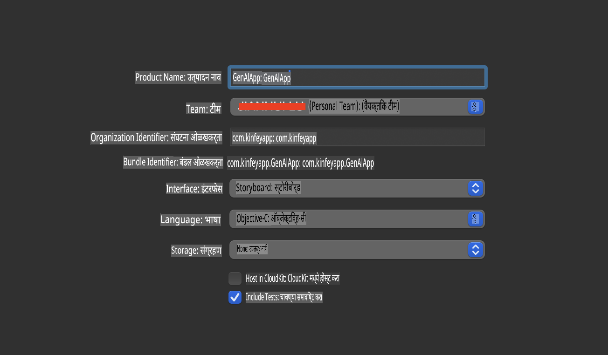
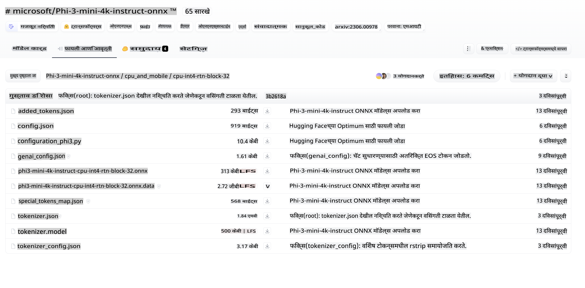
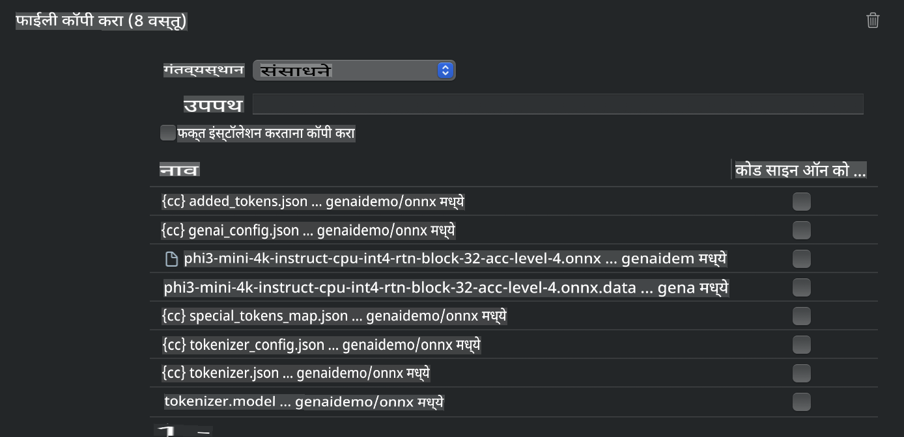
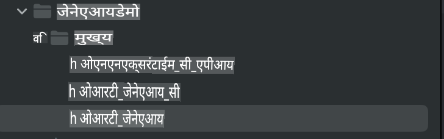
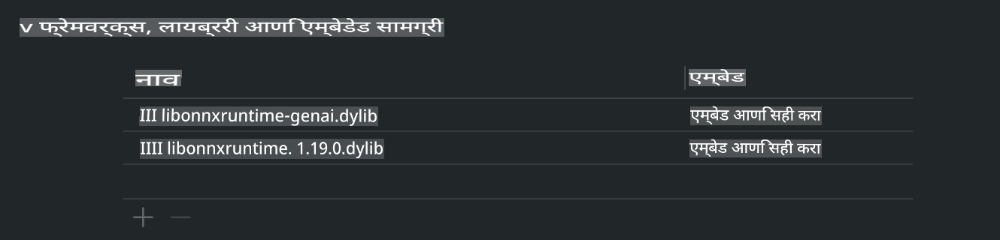
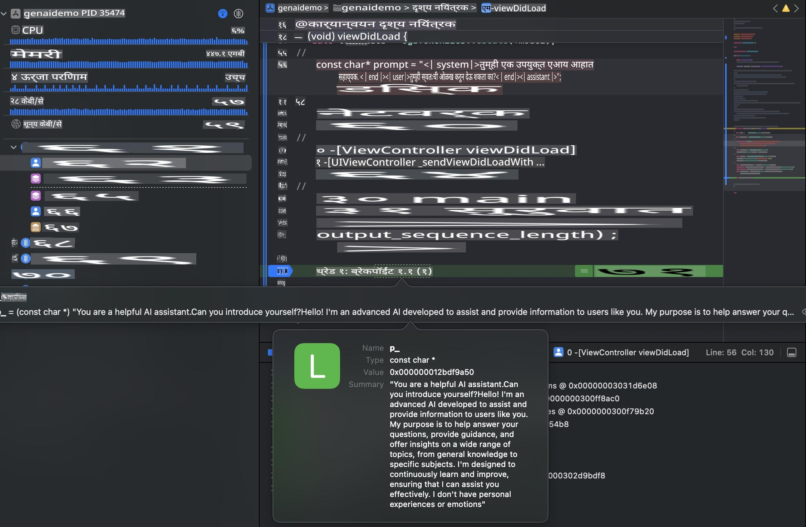

# **iOS मध्ये Phi-3 चा उपयोग**

Phi-3-mini ही Microsoft कडून विकसित केलेली नवीन मॉडेल्सची मालिका आहे, जी Large Language Models (LLMs) च्या edge devices आणि IoT डिव्हाइसेसवर डिप्लॉयमेंटसाठी सक्षम आहे. Phi-3-mini iOS, Android आणि Edge Device डिप्लॉयमेंटसाठी उपलब्ध आहे, ज्यामुळे BYOD वातावरणात जनरेटिव्ह AI चा उपयोग करता येतो. खालील उदाहरण iOS वर Phi-3-mini कसे डिप्लॉय करावे हे दाखवते.

## **1. तयारी**

- **a.** macOS 14+
- **b.** Xcode 15+
- **c.** iOS SDK 17.x (iPhone 14 A16 किंवा त्यापेक्षा जास्त)
- **d.** Python 3.10+ इन्स्टॉल करा (Conda वापरण्याची शिफारस केली जाते)
- **e.** Python लायब्ररी इन्स्टॉल करा: `python-flatbuffers`
- **f.** CMake इन्स्टॉल करा

### Semantic Kernel आणि Inference

Semantic Kernel हे एक अ‍ॅप्लिकेशन फ्रेमवर्क आहे, ज्याद्वारे Azure OpenAI Service, OpenAI मॉडेल्स, आणि स्थानिक मॉडेल्ससाठी सुसंगत अ‍ॅप्लिकेशन्स तयार करता येतात. Semantic Kernel च्या मदतीने स्थानिक Phi-3-mini मॉडेल सर्व्हरसोबत सहजपणे एकत्रिकरण करता येते.

### Quantized Models चा Ollama किंवा LlamaEdge च्या मदतीने उपयोग

अनेक वापरकर्ते मॉडेल्स स्थानिक पातळीवर चालवण्यासाठी Quantized Models वापरणे पसंत करतात. [Ollama](https://ollama.com) आणि [LlamaEdge](https://llamaedge.com) वापरकर्त्यांना विविध Quantized Models वापरण्याची परवानगी देतात:

#### **Ollama**

तुम्ही `ollama run phi3` थेट चालवू शकता किंवा ऑफलाइन कॉन्फिगर करू शकता. तुमच्या `gguf` फाईलसाठी एक Modelfile तयार करा. Phi-3-mini च्या Quantized Model चालवण्यासाठी नमुना कोड:

```gguf
FROM {Add your gguf file path}
TEMPLATE \"\"\"<|user|> .Prompt<|end|> <|assistant|>\"\"\"
PARAMETER stop <|end|>
PARAMETER num_ctx 4096
```

#### **LlamaEdge**

जर तुम्हाला `gguf` एकाच वेळी क्लाउड आणि Edge डिव्हाइसवर वापरायचे असेल, तर LlamaEdge एक उत्तम पर्याय आहे.

## **2. iOS साठी ONNX Runtime चे संकलन**

```bash

git clone https://github.com/microsoft/onnxruntime.git

cd onnxruntime

./build.sh --build_shared_lib --ios --skip_tests --parallel --build_dir ./build_ios --ios --apple_sysroot iphoneos --osx_arch arm64 --apple_deploy_target 17.5 --cmake_generator Xcode --config Release

cd ../

```

### **सूचना**

- **a.** संकलन करण्यापूर्वी, Xcode योग्य प्रकारे कॉन्फिगर केले आहे याची खात्री करा आणि टर्मिनलमध्ये ते Active Developer Directory म्हणून सेट करा:

    ```bash
    sudo xcode-select -switch /Applications/Xcode.app/Contents/Developer
    ```

- **b.** ONNX Runtime वेगवेगळ्या प्लॅटफॉर्मसाठी संकलित करणे आवश्यक आहे. iOS साठी, तुम्ही `arm64` or `x86_64` साठी संकलन करू शकता.

- **c.** संकलनासाठी नवीनतम iOS SDK वापरण्याची शिफारस केली जाते. मात्र, जर मागील SDK सह सुसंगतता आवश्यक असेल तर तुम्ही जुना SDK देखील वापरू शकता.

## **3. iOS साठी ONNX Runtime सह Generative AI चे संकलन**

> **टीप:** ONNX Runtime सह Generative AI सध्या प्रीव्ह्यूमध्ये आहे, त्यामुळे संभाव्य बदल लक्षात घ्या.

```bash

git clone https://github.com/microsoft/onnxruntime-genai
 
cd onnxruntime-genai
 
mkdir ort
 
cd ort
 
mkdir include
 
mkdir lib
 
cd ../
 
cp ../onnxruntime/include/onnxruntime/core/session/onnxruntime_c_api.h ort/include
 
cp ../onnxruntime/build_ios/Release/Release-iphoneos/libonnxruntime*.dylib* ort/lib
 
export OPENCV_SKIP_XCODEBUILD_FORCE_TRYCOMPILE_DEBUG=1
 
python3 build.py --parallel --build_dir ./build_ios --ios --ios_sysroot iphoneos --ios_arch arm64 --ios_deployment_target 17.5 --cmake_generator Xcode --cmake_extra_defines CMAKE_XCODE_ATTRIBUTE_CODE_SIGNING_ALLOWED=NO

```

## **4. Xcode मध्ये अ‍ॅप अ‍ॅप्लिकेशन तयार करा**

मी Objective-C अ‍ॅप विकास पद्धत निवडली, कारण ONNX Runtime C++ API सह Generative AI वापरण्यासाठी Objective-C अधिक सुसंगत आहे. अर्थात, तुम्ही Swift bridging च्या मदतीने संबंधित कॉल्स देखील पूर्ण करू शकता.



## **5. ONNX Quantized INT4 मॉडेल अ‍ॅप अ‍ॅप्लिकेशन प्रकल्पात कॉपी करा**

आपल्याला ONNX फॉरमॅटमधील INT4 Quantization मॉडेल आयात करावे लागेल, जे आधी डाउनलोड करणे आवश्यक आहे.



डाउनलोड केल्यानंतर, ते Xcode मधील Resources डिरेक्टरीमध्ये जोडणे आवश्यक आहे.



## **6. ViewControllers मध्ये C++ API जोडा**

> **सूचना:**

- **a.** प्रकल्पात संबंधित C++ हेडर फाईल्स जोडा.

  

- **b.** `onnxruntime-genai` dynamic library in Xcode.

  

- **c.** Use the C Samples code for testing. You can also add additional features like ChatUI for more functionality.

- **d.** Since you need to use C++ in your project, rename `ViewController.m` to `ViewController.mm` समाविष्ट करा, जेणेकरून Objective-C++ सपोर्ट सक्षम होईल.

```objc

    NSString *llmPath = [[NSBundle mainBundle] resourcePath];
    char const *modelPath = llmPath.cString;

    auto model =  OgaModel::Create(modelPath);

    auto tokenizer = OgaTokenizer::Create(*model);

    const char* prompt = "<|system|>You are a helpful AI assistant.<|end|><|user|>Can you introduce yourself?<|end|><|assistant|>";

    auto sequences = OgaSequences::Create();
    tokenizer->Encode(prompt, *sequences);

    auto params = OgaGeneratorParams::Create(*model);
    params->SetSearchOption("max_length", 100);
    params->SetInputSequences(*sequences);

    auto output_sequences = model->Generate(*params);
    const auto output_sequence_length = output_sequences->SequenceCount(0);
    const auto* output_sequence_data = output_sequences->SequenceData(0);
    auto out_string = tokenizer->Decode(output_sequence_data, output_sequence_length);
    
    auto tmp = out_string;

```

## **7. अ‍ॅप्लिकेशन चालवा**

सेटअप पूर्ण झाल्यानंतर, Phi-3-mini मॉडेलच्या inference चे परिणाम पाहण्यासाठी अ‍ॅप्लिकेशन चालवा.



अधिक नमुना कोड आणि तपशीलवार सूचना मिळवण्यासाठी [Phi-3 Mini Samples repository](https://github.com/Azure-Samples/Phi-3MiniSamples/tree/main/ios) ला भेट द्या.

**अस्वीकरण**:  
हा दस्तऐवज मशीन-आधारित AI अनुवाद सेवांचा वापर करून अनुवादित करण्यात आला आहे. आम्ही अचूकतेसाठी प्रयत्नशील असलो तरी कृपया लक्षात घ्या की स्वयंचलित अनुवादांमध्ये त्रुटी किंवा अचूकतेचा अभाव असू शकतो. मूळ भाषेतील मूळ दस्तऐवज हा अधिकृत स्रोत मानावा. महत्त्वाच्या माहितीकरिता व्यावसायिक मानव अनुवादाचा सल्ला घेणे शिफारसीय आहे. या अनुवादाच्या वापरामुळे उद्भवणाऱ्या कोणत्याही गैरसमजुती किंवा चुकीच्या अर्थ लावण्यास आम्ही जबाबदार राहणार नाही.