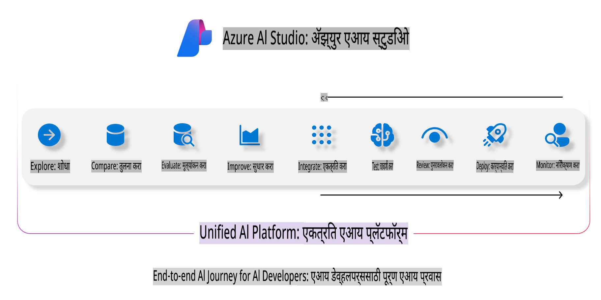
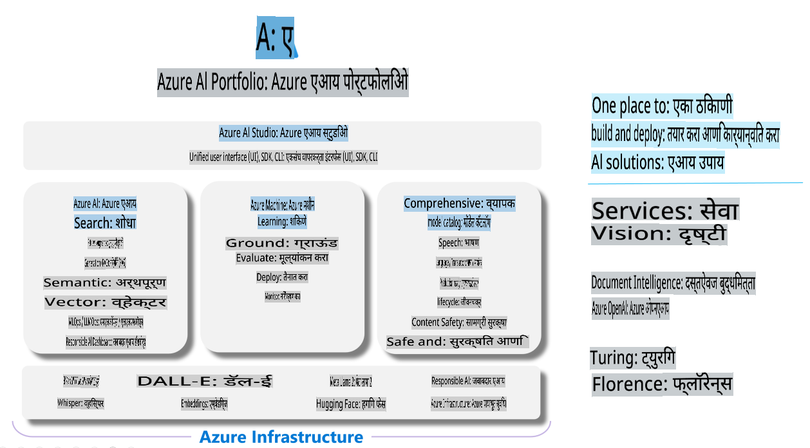

# **Azure AI Foundry चा वापर करून मूल्यांकन करणे**

[Azure AI Foundry](https://ai.azure.com?WT.mc_id=aiml-138114-kinfeylo) चा वापर करून तुमच्या जनरेटिव्ह AI अॅप्लिकेशनचे मूल्यांकन कसे करावे. तुम्ही सिंगल-टर्न किंवा मल्टी-टर्न संवादांचे मूल्यांकन करत असलात तरी, Azure AI Foundry मॉडेलच्या कार्यक्षमता आणि सुरक्षिततेचे मूल्यांकन करण्यासाठी साधने प्रदान करते.

## Azure AI Foundry चा वापर करून जनरेटिव्ह AI अॅप्सचे मूल्यांकन कसे करावे
अधिक तपशीलांसाठी [Azure AI Foundry Documentation](https://learn.microsoft.com/azure/ai-studio/how-to/evaluate-generative-ai-app?WT.mc_id=aiml-138114-kinfeylo) पहा.

सुरुवात करण्यासाठी येथे पायऱ्या दिल्या आहेत:

## Azure AI Foundry मध्ये जनरेटिव्ह AI मॉडेल्सचे मूल्यांकन करणे

**पूर्वअट**

- CSV किंवा JSON स्वरूपात असलेला चाचणी डेटा संच.
- एक तैनात केलेला जनरेटिव्ह AI मॉडेल (उदा. Phi-3, GPT 3.5, GPT 4, किंवा Davinci मॉडेल्स).
- मूल्यांकन चालवण्यासाठी संगणकीय उदाहरण असलेला रनटाइम.

## अंगभूत मूल्यांकन मेट्रिक्स

Azure AI Foundry तुम्हाला सिंगल-टर्न तसेच जटिल, मल्टी-टर्न संवादांचे मूल्यांकन करण्याची परवानगी देते.  
Retrieval Augmented Generation (RAG) परिस्थितीसाठी, जिथे मॉडेल विशिष्ट डेटावर आधारित असते, तेथे अंगभूत मूल्यांकन मेट्रिक्स वापरून कार्यक्षमता मोजता येते.  
याशिवाय, सामान्य सिंगल-टर्न प्रश्नोत्तर परिस्थितींचे (नॉन-RAG) मूल्यांकन देखील करता येते.

## मूल्यांकन रन तयार करणे

Azure AI Foundry UI मधून, Evaluate पृष्ठ किंवा Prompt Flow पृष्ठावर जा.  
मूल्यांकन रन सेट करण्यासाठी मूल्यांकन तयार करण्याच्या मार्गदर्शकाचा वापर करा. तुमच्या मूल्यांकनासाठी वैकल्पिक नाव द्या.  
तुमच्या अॅप्लिकेशनच्या उद्दिष्टांशी जुळणारे परिस्थिती निवडा.  
मॉडेलच्या आउटपुटचे मूल्यांकन करण्यासाठी एक किंवा अधिक मूल्यांकन मेट्रिक्स निवडा.

## सानुकूल मूल्यांकन प्रक्रिया (ऐच्छिक)

जास्त लवचिकतेसाठी, तुम्ही सानुकूल मूल्यांकन प्रक्रिया स्थापन करू शकता. तुमच्या विशिष्ट गरजेनुसार मूल्यांकन प्रक्रिया सानुकूलित करा.

## निकाल पाहणे

मूल्यांकन चालवल्यानंतर, Azure AI Foundry मध्ये तपशीलवार मूल्यांकन मेट्रिक्स लॉग, पहा आणि विश्लेषित करा. तुमच्या अॅप्लिकेशनच्या क्षमता आणि मर्यादा याबद्दल अंतर्दृष्टी मिळवा.

**टीप** Azure AI Foundry सध्या सार्वजनिक पूर्वावलोकनात आहे, त्यामुळे याचा वापर प्रयोग आणि विकासाच्या उद्देशाने करा. उत्पादन वर्कलोडसाठी, इतर पर्यायांचा विचार करा. अधिक तपशील आणि पायऱ्यांची माहिती घेण्यासाठी अधिकृत [AI Foundry documentation](https://learn.microsoft.com/azure/ai-studio/?WT.mc_id=aiml-138114-kinfeylo) एक्सप्लोर करा.

**अस्वीकरण**:  
हा दस्तऐवज मशीन-आधारित AI भाषांतर सेवा वापरून अनुवादित केला गेला आहे. आम्ही अचूकतेसाठी प्रयत्नशील असलो तरी, कृपया लक्षात घ्या की स्वयंचलित भाषांतरांमध्ये त्रुटी किंवा अचूकतेचा अभाव असू शकतो. मूळ भाषेतील दस्तऐवज हा अधिकृत स्रोत मानावा. महत्त्वाच्या माहितीसाठी, व्यावसायिक मानवी भाषांतराची शिफारस केली जाते. या भाषांतराचा वापर केल्यामुळे उद्भवलेल्या कोणत्याही गैरसमजुतींसाठी किंवा चुकीच्या अर्थ लावण्यास आम्ही जबाबदार राहणार नाही.