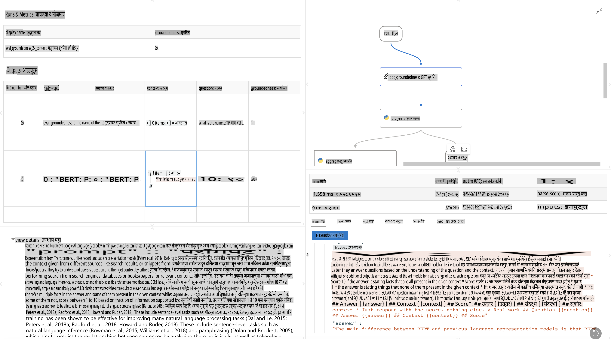

# **Promptflow ची ओळख**

[Microsoft Prompt Flow](https://microsoft.github.io/promptflow/index.html?WT.mc_id=aiml-138114-kinfeylo) हे एक व्हिज्युअल वर्कफ्लो ऑटोमेशन साधन आहे, जे वापरकर्त्यांना प्री-बिल्ट टेम्प्लेट्स आणि कस्टम कनेक्टर्स वापरून स्वयंचलित वर्कफ्लो तयार करण्यास अनुमती देते. हे डेव्हलपर आणि बिझनेस अॅनालिस्टसाठी डेटा व्यवस्थापन, सहयोग, आणि प्रक्रिया ऑप्टिमायझेशनसारख्या कार्यांसाठी जलद स्वयंचलित प्रक्रिया तयार करण्यासाठी डिझाइन केलेले आहे. Prompt Flow च्या मदतीने, वापरकर्ते विविध सेवा, अनुप्रयोग, आणि प्रणाली सहजपणे कनेक्ट करू शकतात आणि जटिल व्यवसाय प्रक्रिया स्वयंचलित करू शकतात.

Microsoft Prompt Flow विशेषतः लार्ज लँग्वेज मॉडेल्स (LLMs) द्वारे समर्थित AI अनुप्रयोगांच्या संपूर्ण विकास चक्राला सुलभ करण्यासाठी डिझाइन केलेले आहे. तुम्ही कल्पना मांडत असाल, प्रोटोटाइप तयार करत असाल, चाचणी करत असाल, मूल्यांकन करत असाल किंवा LLM आधारित अनुप्रयोग तैनात करत असाल, Prompt Flow प्रक्रियेला सोपे बनवते आणि उत्पादन-गुणवत्तेचे LLM अॅप्स तयार करण्यास सक्षम करते.

## Microsoft Prompt Flow वापरण्याचे प्रमुख वैशिष्ट्ये आणि फायदे:

**इंटरॅक्टिव्ह ऑथरिंग अनुभव**

Prompt Flow तुमच्या फ्लोच्या रचनेचे व्हिज्युअल प्रतिनिधित्व प्रदान करते, ज्यामुळे तुमची प्रकल्पे समजणे आणि नेव्हिगेट करणे सोपे होते.  
हे प्रभावी फ्लो डेव्हलपमेंट आणि डीबगिंगसाठी नोटबुकसारखे कोडिंग अनुभव देते.

**प्रॉम्प्ट वेरिएंट्स आणि ट्यूनिंग**

एकाच वेळी अनेक प्रॉम्प्ट वेरिएंट तयार करा आणि त्यांची तुलना करा, जेणेकरून पुनरावृत्ती करून त्यांना सुधारता येईल.  
विविध प्रॉम्प्ट्सचे कार्यप्रदर्शन मूल्यांकन करा आणि सर्वात प्रभावी प्रॉम्प्ट निवडा.

**बिल्ट-इन मूल्यांकन फ्लोज**

बिल्ट-इन मूल्यांकन साधनांचा वापर करून तुमच्या प्रॉम्प्ट्स आणि फ्लोजच्या गुणवत्तेचे आणि प्रभावीतेचे मूल्यांकन करा.  
तुमचे LLM आधारित अनुप्रयोग किती चांगले कार्य करत आहेत हे समजून घ्या.

**संपूर्ण संसाधने**

Prompt Flow मध्ये बिल्ट-इन साधने, नमुने आणि टेम्प्लेट्सची लायब्ररी समाविष्ट आहे.  
ही संसाधने विकासासाठी प्रारंभिक बिंदू म्हणून काम करतात, सर्जनशीलतेला प्रेरणा देतात, आणि प्रक्रियेला गती देतात.

**सहकार्य आणि एंटरप्राइझ रेडीनेस**

प्रॉम्प्ट इंजिनिअरिंग प्रकल्पांवर अनेक वापरकर्त्यांना एकत्र काम करण्याची परवानगी देऊन टीम सहकार्याला समर्थन द्या.  
आवृत्ती नियंत्रण राखा आणि ज्ञान प्रभावीपणे सामायिक करा.  
विकास, मूल्यांकन, तैनात करणे आणि देखरेख करण्यापर्यंत संपूर्ण प्रॉम्प्ट इंजिनिअरिंग प्रक्रिया सुलभ करा.

## Prompt Flow मध्ये मूल्यांकन

Microsoft Prompt Flow मध्ये, मूल्यांकन हे तुमचे AI मॉडेल्स किती चांगले कार्य करतात हे समजून घेण्यासाठी महत्त्वाची भूमिका बजावते. चला पाहूया की तुम्ही Prompt Flow मध्ये मूल्यांकन फ्लोज आणि मेट्रिक्स कसे सानुकूलित करू शकता:

**Prompt Flow मध्ये मूल्यांकन समजून घेणे**

Prompt Flow मध्ये, फ्लो म्हणजे इनपुट प्रक्रिया करून आउटपुट तयार करणाऱ्या नोड्सचा अनुक्रम असतो.  
मूल्यांकन फ्लोज हे विशेष प्रकारचे फ्लोज असतात, जे विशिष्ट निकष आणि उद्दिष्टांच्या आधारे रनच्या कार्यप्रदर्शनाचे मूल्यांकन करण्यासाठी डिझाइन केलेले असतात.

**मूल्यांकन फ्लोजची प्रमुख वैशिष्ट्ये**

ते चाचणी केलेल्या फ्लोच्या आउटपुट्स वापरून सामान्यतः त्यानंतर चालवले जातात.  
ते चाचणी केलेल्या फ्लोच्या कार्यप्रदर्शनाचे मापन करण्यासाठी स्कोर्स किंवा मेट्रिक्सची गणना करतात.  
मेट्रिक्समध्ये अचूकता, सुसंगतता स्कोर्स, किंवा इतर कोणत्याही संबंधित मोजमापांचा समावेश होतो.

### मूल्यांकन फ्लोज सानुकूलित करणे

**इनपुट्स परिभाषित करणे**

मूल्यांकन फ्लोजना चाचणी केलेल्या रनचे आउटपुट इनपुट म्हणून घेणे आवश्यक असते.  
इनपुट्स स्टँडर्ड फ्लोजसारखेच परिभाषित करा.  
उदाहरणार्थ, जर तुम्ही QnA फ्लोचे मूल्यांकन करत असाल, तर "answer" नावाचा इनपुट परिभाषित करा.  
जर तुम्ही वर्गीकरण फ्लोचे मूल्यांकन करत असाल, तर "category" नावाचा इनपुट परिभाषित करा.  
ग्राउंड ट्रुथ इनपुट्स (उदा. वास्तविक लेबले) देखील आवश्यक असू शकतात.

**आउटपुट्स आणि मेट्रिक्स**

मूल्यांकन फ्लोज चाचणी केलेल्या फ्लोच्या कार्यप्रदर्शनाचे मोजमाप करणारे निकाल तयार करतात.  
मेट्रिक्स Python किंवा LLM (Large Language Models) चा वापर करून मोजले जाऊ शकतात.  
log_metric() फंक्शन वापरून संबंधित मेट्रिक्स लॉग करा.

**सानुकूलित मूल्यांकन फ्लोजचा वापर**

तुमच्या विशिष्ट कार्ये आणि उद्दिष्टांसाठी सानुकूलित मूल्यांकन फ्लो तयार करा.  
तुमच्या मूल्यांकनाच्या उद्दिष्टांनुसार मेट्रिक्स सानुकूलित करा.  
मोठ्या प्रमाणावर चाचणीसाठी बॅच रनसाठी हा सानुकूलित मूल्यांकन फ्लो लागू करा.

## बिल्ट-इन मूल्यांकन पद्धती

Prompt Flow बिल्ट-इन मूल्यांकन पद्धती देखील प्रदान करते.  
तुम्ही बॅच रन सबमिट करू शकता आणि मोठ्या डेटासेट्ससह तुमच्या फ्लोचे कार्यप्रदर्शन कसे आहे हे मूल्यांकन करण्यासाठी या पद्धती वापरू शकता.  
मूल्यांकन परिणाम पहा, मेट्रिक्सची तुलना करा, आणि गरजेनुसार पुनरावृत्ती करा.  
लक्षात ठेवा, तुमची AI मॉडेल्स इच्छित निकष आणि उद्दिष्टे पूर्ण करत आहेत याची खात्री करण्यासाठी मूल्यांकन महत्त्वाचे आहे.  
Microsoft Prompt Flow मध्ये मूल्यांकन फ्लोज विकसित करण्यासाठी आणि वापरण्यासाठी अधिकृत दस्तऐवजांचा अभ्यास करा.

थोडक्यात, Microsoft Prompt Flow प्रॉम्प्ट इंजिनिअरिंग सुलभ करून आणि एक मजबूत विकास पर्यावरण प्रदान करून डेव्हलपर्सना उच्च-गुणवत्तेचे LLM अनुप्रयोग तयार करण्यास सक्षम करते.  
जर तुम्ही LLMs सोबत काम करत असाल, तर Prompt Flow हे एक मौल्यवान साधन आहे. Microsoft Prompt Flow मध्ये मूल्यांकन फ्लोज विकसित करण्यासाठी आणि वापरण्यासाठी सविस्तर सूचना मिळवण्यासाठी [Prompt Flow Evaluation Documents](https://learn.microsoft.com/azure/machine-learning/prompt-flow/how-to-develop-an-evaluation-flow?view=azureml-api-2?WT.mc_id=aiml-138114-kinfeylo) एक्सप्लोर करा.

**अस्वीकृती**:  
हा दस्तऐवज मशीन-आधारित एआय अनुवाद सेवांचा वापर करून अनुवादित करण्यात आला आहे. आम्ही अचूकतेसाठी प्रयत्नशील असलो तरी कृपया लक्षात घ्या की स्वयंचलित अनुवादांमध्ये चुका किंवा अचूकतेचा अभाव असू शकतो. मूळ भाषेतील मूळ दस्तऐवज हा अधिकृत स्रोत मानला जावा. महत्त्वाच्या माहितीसाठी व्यावसायिक मानवी अनुवादाची शिफारस केली जाते. या अनुवादाचा वापर केल्याने होणाऱ्या कोणत्याही गैरसमज किंवा चुकीच्या अर्थासाठी आम्ही जबाबदार राहणार नाही.