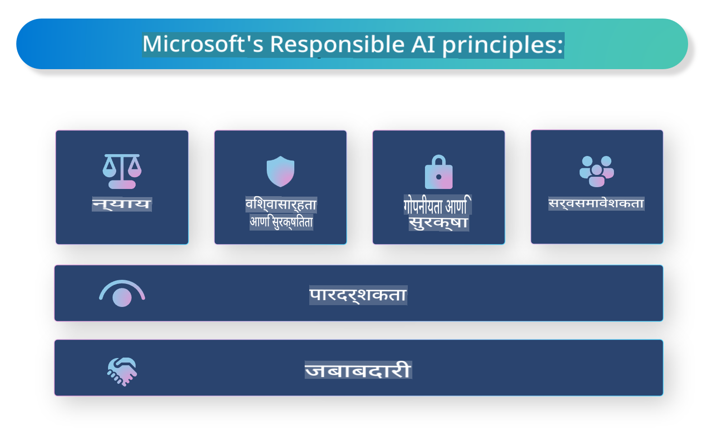

# **जबाबदार AI ची ओळख करून द्या**

[Microsoft Responsible AI](https://www.microsoft.com/ai/responsible-ai?WT.mc_id=aiml-138114-kinfeylo) ही एक उपक्रम आहे जी विकसक आणि संस्थांना पारदर्शक, विश्वासार्ह आणि जबाबदार AI प्रणाली तयार करण्यात मदत करण्याचे उद्दिष्ट ठेवते. या उपक्रमाद्वारे नैतिक तत्त्वांशी सुसंगत जबाबदार AI उपाय विकसित करण्यासाठी मार्गदर्शन आणि संसाधने उपलब्ध करून दिली जातात, जसे की गोपनीयता, न्याय आणि पारदर्शकता. तसेच, जबाबदार AI प्रणाली तयार करण्याशी संबंधित काही आव्हाने आणि सर्वोत्तम पद्धतींचा अभ्यास करू.

## Microsoft Responsible AI चे विहंगावलोकन

**नैतिक तत्त्वे**

Microsoft Responsible AI गोपनीयता, न्याय, पारदर्शकता, जबाबदारी आणि सुरक्षितता यासारख्या नैतिक तत्त्वांवर आधारित आहे. या तत्त्वांचा उद्देश AI प्रणाली नैतिक आणि जबाबदार पद्धतीने विकसित करण्याचा आहे.

**पारदर्शक AI**

Microsoft Responsible AI मध्ये AI प्रणालींमध्ये पारदर्शकतेचे महत्त्व अधोरेखित केले जाते. यामध्ये AI मॉडेल्स कसे कार्य करतात याचे स्पष्ट स्पष्टीकरण देणे आणि डेटा स्रोत व अल्गोरिदम सार्वजनिकपणे उपलब्ध करणे याचा समावेश होतो.

**जवाबदार AI**

[Microsoft Responsible AI](https://www.microsoft.com/ai/responsible-ai?WT.mc_id=aiml-138114-kinfeylo) जबाबदार AI प्रणालींच्या विकासाला प्रोत्साहन देते, ज्या AI मॉडेल्स निर्णय कसे घेतात याबद्दल अंतर्दृष्टी प्रदान करू शकतात. यामुळे वापरकर्त्यांना AI प्रणालींच्या परिणामांवर विश्वास ठेवणे सोपे होते.

**समावेशकता**

AI प्रणाली सर्वांसाठी फायदेशीर असाव्यात. Microsoft विविध दृष्टिकोनांचा विचार करणारी आणि पक्षपातीपणा किंवा भेदभाव टाळणारी समावेशक AI तयार करण्याचे उद्दिष्ट ठेवते.

**विश्वसनीयता आणि सुरक्षितता**

AI प्रणाली विश्वासार्ह आणि सुरक्षित ठेवणे अत्यंत महत्त्वाचे आहे. Microsoft सुसंगतपणे कार्य करणारी आणि हानिकारक परिणाम टाळणारी मजबूत मॉडेल्स तयार करण्यावर लक्ष केंद्रित करते.

**AI मधील न्याय**

Microsoft Responsible AI मान्य करते की पक्षपाती डेटावर किंवा अल्गोरिदमवर प्रशिक्षण दिल्यास AI प्रणाली पक्षपातीपणा कायम ठेवू शकतात. उपक्रम असा AI विकसित करण्यासाठी मार्गदर्शन प्रदान करतो जो वंश, लिंग किंवा वय यासारख्या घटकांवर आधारित भेदभाव करत नाही.

**गोपनीयता आणि सुरक्षा**

Microsoft Responsible AI वापरकर्त्यांची गोपनीयता आणि डेटा सुरक्षा संरक्षित करण्याच्या महत्त्वावर भर देते. यामध्ये मजबूत डेटा एन्क्रिप्शन आणि प्रवेश नियंत्रण अंमलात आणणे, तसेच AI प्रणालींमध्ये असुरक्षिततेसाठी नियमितपणे ऑडिट करणे याचा समावेश होतो.

**जबाबदारी आणि उत्तरदायित्व**

Microsoft Responsible AI AI विकास आणि अंमलबजावणीत जबाबदारी आणि उत्तरदायित्वाला प्रोत्साहन देते. यामध्ये विकसक आणि संस्थांना AI प्रणालींशी संबंधित संभाव्य जोखमींची जाणीव करून देणे आणि त्या जोखमी कमी करण्यासाठी उपाययोजना करणे याचा समावेश आहे.

## जबाबदार AI प्रणाली तयार करण्यासाठी सर्वोत्तम पद्धती

**विविध डेटासेट्सचा वापर करून AI मॉडेल्स विकसित करा**

AI प्रणालींमध्ये पक्षपातीपणा टाळण्यासाठी विविध दृष्टिकोन आणि अनुभवांचे प्रतिनिधित्व करणाऱ्या डेटासेट्सचा वापर करणे महत्त्वाचे आहे.

**स्पष्टीकरणक्षम AI तंत्रांचा वापर करा**

स्पष्टीकरणक्षम AI तंत्र वापरकर्त्यांना AI मॉडेल्स निर्णय कसे घेतात हे समजून घेण्यास मदत करू शकतात, ज्यामुळे प्रणालीवरील विश्वास वाढतो.

**AI प्रणालींमध्ये असुरक्षिततेसाठी नियमित ऑडिट करा**

AI प्रणालींचे नियमित ऑडिट करणे संभाव्य जोखमी आणि असुरक्षितता ओळखण्यात मदत करू शकते ज्यावर लक्ष देणे आवश्यक आहे.

**मजबूत डेटा एन्क्रिप्शन आणि प्रवेश नियंत्रण लागू करा**

डेटा एन्क्रिप्शन आणि प्रवेश नियंत्रण AI प्रणालींमध्ये वापरकर्त्यांची गोपनीयता आणि सुरक्षितता संरक्षित करण्यात मदत करू शकतात.

**AI विकासात नैतिक तत्त्वांचे पालन करा**

न्याय, पारदर्शकता आणि जबाबदारी यासारख्या नैतिक तत्त्वांचे पालन केल्याने AI प्रणालींवर विश्वास निर्माण होतो आणि त्या जबाबदार पद्धतीने विकसित होतात याची खात्री होते.

## जबाबदार AI साठी AI Foundry चा वापर

[Azure AI Foundry](https://ai.azure.com?WT.mc_id=aiml-138114-kinfeylo) हे एक प्रभावी व्यासपीठ आहे जे विकसक आणि संस्थांना वेगाने बुद्धिमान, अत्याधुनिक, बाजारासाठी तयार आणि जबाबदार अनुप्रयोग तयार करण्यास अनुमती देते. Azure AI Foundry च्या काही प्रमुख वैशिष्ट्ये आणि क्षमता येथे आहेत:

**आउट-ऑफ-द-बॉक्स APIs आणि मॉडेल्स**

Azure AI Foundry प्री-बिल्ट आणि सानुकूलनयोग्य API आणि मॉडेल्स प्रदान करते. यात जनरेटिव्ह AI, संवादांसाठी नैसर्गिक भाषा प्रक्रिया, शोध, मॉनिटरिंग, भाषांतर, भाषण, व्हिजन, आणि निर्णय घेणे यासारख्या AI कार्यांचा समावेश होतो.

**प्रॉम्प्ट फ्लो**

Azure AI Foundry मधील प्रॉम्प्ट फ्लो तुम्हाला संवादात्मक AI अनुभव तयार करण्यास सक्षम करते. हे चॅटबॉट्स, व्हर्च्युअल सहाय्यक आणि इतर संवादात्मक अनुप्रयोग तयार करणे सोपे बनवते.

**रिट्रीव्हल ऑगमेंटेड जनरेशन (RAG)**

RAG ही एक तंत्र आहे जी पुनर्प्राप्ती-आधारित आणि जनरेटिव्ह-आधारित दृष्टिकोन एकत्रित करते. पूर्वीच्या ज्ञानाचा (पुनर्प्राप्ती) आणि सर्जनशील निर्मितीचा (जनरेशन) लाभ घेऊन उत्तरांच्या गुणवत्तेत सुधारणा करते.

**जनरेटिव्ह AI साठी मूल्यांकन आणि मॉनिटरिंग मेट्रिक्स**

Azure AI Foundry जनरेटिव्ह AI मॉडेल्सचे मूल्यांकन आणि मॉनिटरिंग करण्यासाठी साधने प्रदान करते. तुम्ही त्यांच्या कामगिरी, न्याय आणि इतर महत्त्वाच्या मेट्रिक्सचे मूल्यांकन करू शकता जे जबाबदार अंमलबजावणी सुनिश्चित करतात. याशिवाय, जर तुम्ही डॅशबोर्ड तयार केला असेल, तर तुम्ही Azure Machine Learning Studio मधील नो-कोड UI वापरून Responsible AI Dashboard आणि संबंधित स्कोअरकार्ड तयार करू शकता. [Responsible AI Toolbox](https://responsibleaitoolbox.ai/?WT.mc_id=aiml-138114-kinfeylo) Python Libraries च्या आधारे तयार केलेला हा स्कोअरकार्ड तांत्रिक आणि बिगर-तांत्रिक भागधारकांसोबत न्याय, वैशिष्ट्य महत्त्व आणि इतर जबाबदार अंमलबजावणीच्या बाबतीत महत्त्वाच्या अंतर्दृष्टी शेअर करण्यास मदत करतो.

जबाबदार AI सह AI Foundry वापरण्यासाठी तुम्ही या सर्वोत्तम पद्धतींचे अनुसरण करू शकता:

**तुमच्या AI प्रणालीचे उद्दिष्ट आणि समस्या स्पष्ट करा**

विकास प्रक्रिया सुरू करण्यापूर्वी, तुमची AI प्रणाली कोणती समस्या सोडवण्याचा किंवा कोणते उद्दिष्ट साध्य करण्याचा प्रयत्न करत आहे हे स्पष्टपणे परिभाषित करणे महत्त्वाचे आहे. यामुळे प्रभावी मॉडेल तयार करण्यासाठी आवश्यक डेटा, अल्गोरिदम आणि संसाधने ओळखण्यास मदत होईल.

**संबंधित डेटा गोळा करा आणि पूर्व-प्रक्रिया करा**

AI प्रणालीच्या कार्यक्षमतेवर प्रशिक्षणासाठी वापरल्या जाणाऱ्या डेटाच्या गुणवत्तेचा आणि प्रमाणाचा मोठा प्रभाव पडतो. म्हणून, संबंधित डेटा गोळा करणे, त्याची साफसफाई करणे, पूर्व-प्रक्रिया करणे, आणि तो ज्या लोकसंख्येचे किंवा समस्येचे प्रतिनिधित्व करतो त्यासाठी योग्य आहे याची खात्री करणे महत्त्वाचे आहे.

**योग्य मूल्यांकन निवडा**

विविध मूल्यांकन अल्गोरिदम उपलब्ध आहेत. तुमच्या डेटावर आणि समस्येवर आधारित सर्वात योग्य अल्गोरिदम निवडणे महत्त्वाचे आहे.

**मॉडेलचे मूल्यांकन आणि विश्लेषण करा**

AI मॉडेल तयार झाल्यावर, योग्य मेट्रिक्स वापरून त्याच्या कार्यक्षमतेचे मूल्यांकन करणे आणि निकाल पारदर्शक पद्धतीने विश्लेषित करणे महत्त्वाचे आहे. यामुळे मॉडेलमधील कोणतेही पक्षपातीपणा किंवा मर्यादा ओळखण्यास आणि आवश्यकतेनुसार सुधारणा करण्यास मदत होईल.

**पारदर्शकता आणि स्पष्टीकरण सुनिश्चित करा**

AI प्रणाली पारदर्शक आणि स्पष्टीकरणक्षम असाव्यात जेणेकरून वापरकर्त्यांना त्या कशा कार्य करतात आणि निर्णय कसे घेतले जातात हे समजू शकेल. हे विशेषतः आरोग्य सेवा, वित्त, आणि कायदेशीर प्रणालींसारख्या मानवी जीवनावर महत्त्वपूर्ण परिणाम करणाऱ्या अनुप्रयोगांसाठी महत्त्वाचे आहे.

**मॉडेलचे निरीक्षण आणि अद्यतनित करा**

AI प्रणाली सतत अचूक आणि प्रभावी राहण्यासाठी त्यांचे सतत निरीक्षण आणि अद्यतन करणे आवश्यक आहे. यासाठी मॉडेलचे सतत देखभाल, चाचणी आणि पुनःप्रशिक्षण आवश्यक आहे.

शेवटी, Microsoft Responsible AI हा एक उपक्रम आहे जो विकसक आणि संस्थांना पारदर्शक, विश्वासार्ह आणि जबाबदार AI प्रणाली तयार करण्यात मदत करण्याचे उद्दिष्ट ठेवतो. जबाबदार AI अंमलबजावणी खूप महत्त्वाची आहे, आणि Azure AI Foundry संस्थांसाठी हे व्यावहारिक बनवण्याचे उद्दिष्ट ठेवते. नैतिक तत्त्वे आणि सर्वोत्तम पद्धतींचे अनुसरण करून, आपण असे सुनिश्चित करू शकतो की AI प्रणाली जबाबदार पद्धतीने विकसित आणि अंमलात आणल्या जातात, ज्याचा समाजाला एकूण फायदा होतो.

**अस्वीकृती**:  
हे दस्तऐवज मशीन-आधारित AI भाषांतर सेवांचा वापर करून अनुवादित केले गेले आहे. आम्ही अचूकतेसाठी प्रयत्नशील असलो तरी, कृपया लक्षात घ्या की स्वयंचलित भाषांतरे त्रुटी किंवा अचूकतेचा अभाव असू शकतात. मूळ भाषेतील मूळ दस्तऐवज हा अधिकृत स्रोत मानला जावा. महत्त्वाच्या माहितीसाठी, व्यावसायिक मानवी भाषांतराची शिफारस केली जाते. या भाषांतराचा वापर केल्याने उद्भवलेल्या कोणत्याही गैरसमज किंवा चुकीच्या अर्थासाठी आम्ही जबाबदार राहणार नाही.