# Azure AI Foundry मध्ये Microsoft च्या जबाबदार AI तत्त्वांवर लक्ष केंद्रित करत Phi-3 / Phi-3.5 मॉडेलचे मूल्यांकन करा

हा पूर्ण-टप्पा (E2E) नमुना Microsoft Tech Community च्या "[Evaluate Fine-tuned Phi-3 / 3.5 Models in Azure AI Foundry Focusing on Microsoft's Responsible AI](https://techcommunity.microsoft.com/t5/educator-developer-blog/evaluate-fine-tuned-phi-3-3-5-models-in-azure-ai-studio-focusing/ba-p/4227850?WT.mc_id=aiml-137032-kinfeylo)" मार्गदर्शकावर आधारित आहे.

## आढावा

### Azure AI Foundry मध्ये Phi-3 / Phi-3.5 मॉडेलचे सुरक्षितता आणि कार्यप्रदर्शन कसे मूल्यांकन कराल?

मॉडेलचे फाइन-ट्यूनिंग कधीकधी अनपेक्षित किंवा अवांछित प्रतिसाद निर्माण करू शकते. मॉडेल सुरक्षित आणि प्रभावी राहते याची खात्री करण्यासाठी, त्याच्या संभाव्यतेचे मूल्यांकन करणे महत्त्वाचे आहे, जसे की ते हानिकारक सामग्री निर्माण करते किंवा अचूक, सुसंगत आणि सुस्पष्ट प्रतिसाद देते. या ट्युटोरियलमध्ये, Azure AI Foundry मध्ये Prompt flow सह एकत्रित केलेल्या Phi-3 / Phi-3.5 मॉडेलचे सुरक्षितता आणि कार्यप्रदर्शन कसे मूल्यांकन करायचे हे शिकाल.

Azure AI Foundry चे मूल्यांकन प्रक्रिया येथे दिली आहे.

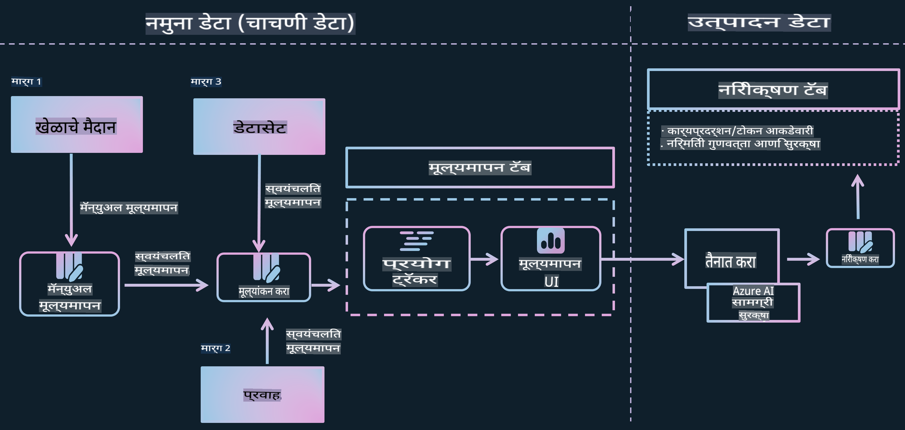

*प्रतिमा स्रोत: [जनरेटिव्ह AI अनुप्रयोगांचे मूल्यांकन](https://learn.microsoft.com/azure/ai-studio/concepts/evaluation-approach-gen-ai?wt.mc_id%3Dstudentamb_279723)*

> [!NOTE]
>
> Phi-3 / Phi-3.5 बद्दल अधिक सविस्तर माहिती आणि अतिरिक्त संसाधने शोधण्यासाठी कृपया [Phi-3CookBook](https://github.com/microsoft/Phi-3CookBook?wt.mc_id=studentamb_279723) भेट द्या.

### पूर्वतयारी

- [Python](https://www.python.org/downloads)
- [Azure subscription](https://azure.microsoft.com/free?wt.mc_id=studentamb_279723)
- [Visual Studio Code](https://code.visualstudio.com)
- फाइन-ट्यून केलेले Phi-3 / Phi-3.5 मॉडेल

### अनुक्रमणिका

1. [**प्रकरण 1: Azure AI Foundry च्या Prompt flow मूल्यांकनाची ओळख**](../../../../../../md/02.Application/01.TextAndChat/Phi3)

    - [सुरक्षितता मूल्यांकनाची ओळख](../../../../../../md/02.Application/01.TextAndChat/Phi3)
    - [कार्यप्रदर्शन मूल्यांकनाची ओळख](../../../../../../md/02.Application/01.TextAndChat/Phi3)

1. [**प्रकरण 2: Azure AI Foundry मध्ये Phi-3 / Phi-3.5 मॉडेलचे मूल्यांकन करणे**](../../../../../../md/02.Application/01.TextAndChat/Phi3)

    - [सुरुवातीपूर्वी](../../../../../../md/02.Application/01.TextAndChat/Phi3)
    - [Phi-3 / Phi-3.5 मॉडेलचे मूल्यांकन करण्यासाठी Azure OpenAI तैनात करा](../../../../../../md/02.Application/01.TextAndChat/Phi3)
    - [Azure AI Foundry च्या Prompt flow मूल्यांकनाचा वापर करून फाइन-ट्यून केलेल्या Phi-3 / Phi-3.5 मॉडेलचे मूल्यांकन करा](../../../../../../md/02.Application/01.TextAndChat/Phi3)

1. [अभिनंदन!](../../../../../../md/02.Application/01.TextAndChat/Phi3)

## **प्रकरण 1: Azure AI Foundry च्या Prompt flow मूल्यांकनाची ओळख**

### सुरक्षितता मूल्यांकनाची ओळख

तुमचे AI मॉडेल नैतिक आणि सुरक्षित आहे याची खात्री करण्यासाठी, Microsoft च्या जबाबदार AI तत्त्वांनुसार त्याचे मूल्यांकन करणे महत्त्वाचे आहे. Azure AI Foundry मध्ये, सुरक्षितता मूल्यांकन तुम्हाला तुमच्या मॉडेलच्या जेलब्रेक हल्ल्यांपासून होणाऱ्या असुरक्षिततेचे आणि हानिकारक सामग्री निर्माण करण्याच्या संभाव्यतेचे मूल्यांकन करण्यास परवानगी देते, जे या तत्त्वांशी थेट संरेखित आहे.

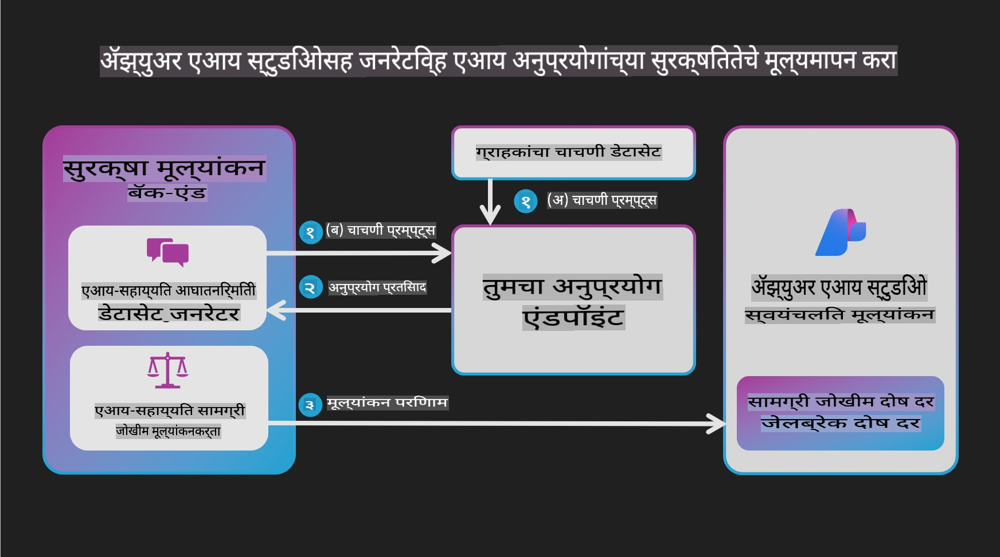

*प्रतिमा स्रोत: [जनरेटिव्ह AI अनुप्रयोगांचे मूल्यांकन](https://learn.microsoft.com/azure/ai-studio/concepts/evaluation-approach-gen-ai?wt.mc_id%3Dstudentamb_279723)*

#### Microsoft चे जबाबदार AI तत्त्व

तांत्रिक पायऱ्या सुरू करण्यापूर्वी, Microsoft चे जबाबदार AI तत्त्व समजून घेणे महत्त्वाचे आहे. हे नैतिक फ्रेमवर्क AI प्रणालींच्या जबाबदार विकास, तैनात आणि ऑपरेशनचे मार्गदर्शन करण्यासाठी डिझाइन केले आहे. AI प्रणाली निष्पक्ष, पारदर्शक आणि सर्वसमावेशक पद्धतीने तयार केल्या गेल्या आहेत याची खात्री करण्यासाठी ही तत्त्वे मार्गदर्शक म्हणून काम करतात.

Microsoft चे जबाबदार AI तत्त्वे:

- **निष्पक्षता आणि सर्वसमावेशकता**: AI प्रणालींनी सर्वांना समान वागणूक दिली पाहिजे आणि समान परिस्थितीत असलेल्या गटांवर वेगळा परिणाम होणार नाही याची खात्री केली पाहिजे. उदाहरणार्थ, जेव्हा AI प्रणाली वैद्यकीय उपचार, कर्ज अर्ज किंवा रोजगाराबद्दल मार्गदर्शन प्रदान करते, तेव्हा ती समान परिस्थितीतील प्रत्येकासाठी समान शिफारसी करेल.

- **विश्वसनीयता आणि सुरक्षितता**: विश्वास निर्माण करण्यासाठी, AI प्रणाली विश्वसनीय, सुरक्षित आणि सातत्यपूर्णपणे कार्य करणे आवश्यक आहे. या प्रणालींनी डिझाइन केलेल्या उद्देशानुसार कार्य करणे, अनपेक्षित परिस्थितींना सुरक्षित प्रतिसाद देणे आणि हानिकारक हेरफेरला प्रतिकार करणे आवश्यक आहे.

- **पारदर्शकता**: जेव्हा AI प्रणाली लोकांच्या जीवनावर प्रचंड प्रभाव टाकणाऱ्या निर्णयांना माहिती देण्यासाठी मदत करतात, तेव्हा लोकांना हे समजणे महत्त्वाचे आहे की ते निर्णय कसे घेतले गेले. उदाहरणार्थ, एक बँक AI प्रणालीचा वापर करून व्यक्तीला क्रेडिटवर्दी आहे की नाही हे ठरवू शकते.

- **गोपनीयता आणि सुरक्षा**: AI प्रणालींना अचूक आणि माहितीपूर्ण अंदाज आणि निर्णय घेण्यासाठी डेटाचा प्रवेश आवश्यक असल्याने गोपनीयता आणि डेटा सुरक्षा महत्त्वाची आहे.

- **जबाबदारी**: AI प्रणाली डिझाइन करणाऱ्या आणि तैनात करणाऱ्या व्यक्तींनी त्यांच्या प्रणाली कशा कार्य करतात यासाठी जबाबदार असणे आवश्यक आहे.

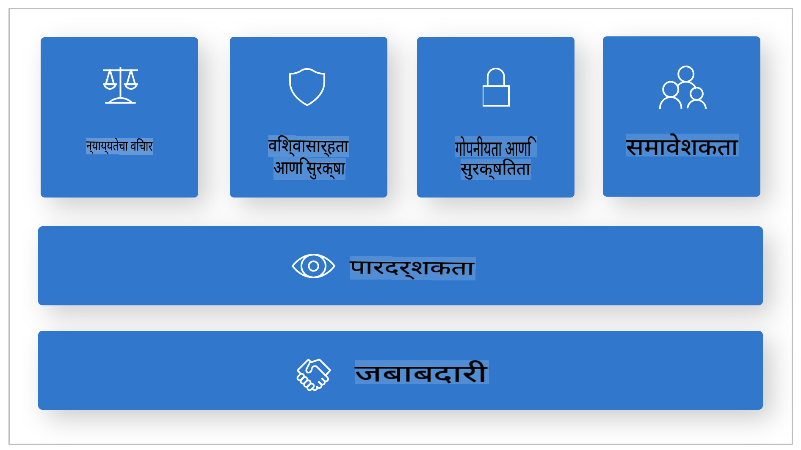

*प्रतिमा स्रोत: [जबाबदार AI म्हणजे काय?](https://learn.microsoft.com/azure/machine-learning/concept-responsible-ai?view=azureml-api-2&viewFallbackFrom=azureml-api-2%253fwt.mc_id%3Dstudentamb_279723)*

> [!NOTE]
> Microsoft च्या जबाबदार AI तत्त्वांबद्दल अधिक जाणून घेण्यासाठी, [जबाबदार AI म्हणजे काय?](https://learn.microsoft.com/azure/machine-learning/concept-responsible-ai?view=azureml-api-2?wt.mc_id=studentamb_279723) ला भेट द्या.

#### सुरक्षितता मेट्रिक्स

या ट्युटोरियलमध्ये, Azure AI Foundry च्या सुरक्षितता मेट्रिक्सचा वापर करून फाइन-ट्यून केलेल्या Phi-3 मॉडेलचे सुरक्षिततेचे मूल्यांकन कराल. हे मेट्रिक्स तुम्हाला मॉडेलच्या हानिकारक सामग्री निर्माण करण्याच्या संभाव्यतेचे आणि त्याच्या जेलब्रेक हल्ल्यांपासून असुरक्षिततेचे मूल्यांकन करण्यात मदत करतात. सुरक्षितता मेट्रिक्समध्ये समाविष्ट आहे:

- **स्वत:ला हानी पोहोचवणारी सामग्री**: मॉडेल स्वत:ला हानी पोहोचवणारी सामग्री निर्माण करण्याची प्रवृत्ती आहे का हे मूल्यांकन करते.
- **द्वेषपूर्ण आणि अन्यायकारक सामग्री**: मॉडेल द्वेषपूर्ण किंवा अन्यायकारक सामग्री निर्माण करण्याची प्रवृत्ती आहे का हे मूल्यांकन करते.
- **हिंसक सामग्री**: मॉडेल हिंसक सामग्री निर्माण करण्याची प्रवृत्ती आहे का हे मूल्यांकन करते.
- **लैंगिक सामग्री**: मॉडेल अनुचित लैंगिक सामग्री निर्माण करण्याची प्रवृत्ती आहे का हे मूल्यांकन करते.

या पैलूंचे मूल्यांकन केल्याने AI मॉडेल समाजाच्या मूल्यांशी आणि नियामक मानकांशी सुसंगत राहते याची खात्री होते.

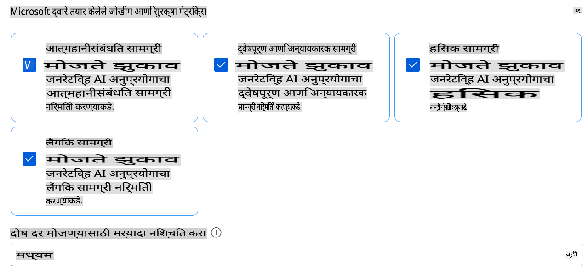

### कार्यप्रदर्शन मूल्यांकनाची ओळख

तुमचे AI मॉडेल अपेक्षेनुसार कार्य करत आहे याची खात्री करण्यासाठी, कार्यप्रदर्शन मेट्रिक्सच्या आधारे त्याचे मूल्यांकन करणे महत्त्वाचे आहे. Azure AI Foundry मध्ये, कार्यप्रदर्शन मूल्यांकन तुम्हाला अचूक, सुसंगत आणि सुस्पष्ट प्रतिसाद निर्माण करण्याच्या तुमच्या मॉडेलच्या कार्यक्षमतेचे मूल्यांकन करण्याची परवानगी देते.

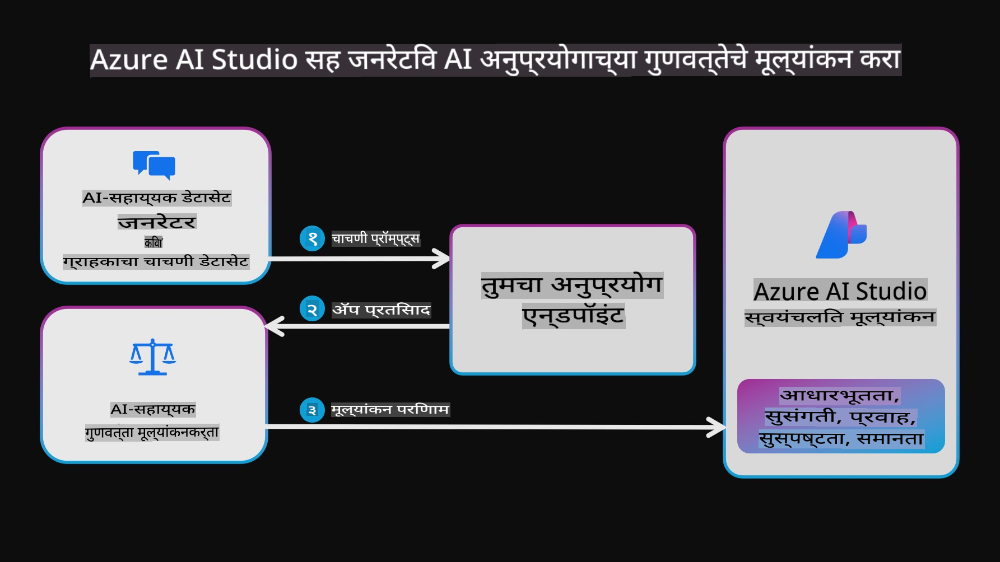

*प्रतिमा स्रोत: [जनरेटिव्ह AI अनुप्रयोगांचे मूल्यांकन](https://learn.microsoft.com/azure/ai-studio/concepts/evaluation-approach-gen-ai?wt.mc_id%3Dstudentamb_279723)*

#### कार्यप्रदर्शन मेट्रिक्स

या ट्युटोरियलमध्ये, Azure AI Foundry च्या कार्यप्रदर्शन मेट्रिक्सचा वापर करून फाइन-ट्यून केलेल्या Phi-3 / Phi-3.5 मॉडेलचे कार्यप्रदर्शन मूल्यांकन कराल. हे मेट्रिक्स तुम्हाला अचूक, सुसंगत आणि सुस्पष्ट प्रतिसाद निर्माण करण्याच्या मॉडेलच्या कार्यक्षमतेचे मूल्यांकन करण्यात मदत करतात. कार्यप्रदर्शन मेट्रिक्समध्ये समाविष्ट आहे:

- **ग्राउंडेडनेस**: निर्माण केलेले उत्तर इनपुट स्रोताच्या माहितीसोबत किती सुसंगत आहे हे मूल्यांकन करा.
- **संबंधितता**: दिलेल्या प्रश्नांशी निर्माण केलेल्या प्रतिसादाची सुसंगतता मूल्यांकन करा.
- **सुसंगती**: निर्माण केलेला मजकूर कसा सहजतेने वाहतो, नैसर्गिकरित्या वाचतो आणि मानवी भाषेसारखा आहे हे मूल्यांकन करा.
- **प्रवाहशीलता**: निर्माण केलेल्या मजकूराच्या भाषेची प्रवीणता मूल्यांकन करा.
- **GPT साम्य**: निर्माण केलेला प्रतिसाद आणि मूळ सत्य यांच्यातील साम्य तुलना करा.
- **F1 स्कोअर**: निर्माण केलेल्या प्रतिसाद आणि स्रोत डेटामधील सामायिक शब्दांचे प्रमाण मोजा.

हे मेट्रिक्स तुम्हाला अचूक, सुसंगत आणि सुस्पष्ट प्रतिसाद निर्माण करण्याच्या मॉडेलच्या कार्यक्षमतेचे मूल्यांकन करण्यात मदत करतात.

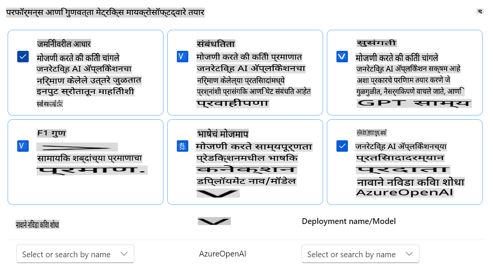

## **प्रकरण 2: Azure AI Foundry मध्ये Phi-3 / Phi-3.5 मॉडेलचे मूल्यांकन करणे**

### सुरुवातीपूर्वी

हा ट्युटोरियल मागील ब्लॉग पोस्ट्सचा विस्तार आहे, "[Fine-Tune and Integrate Custom Phi-3 Models with Prompt Flow: Step-by-Step Guide](https://techcommunity.microsoft.com/t5/educator-developer-blog/fine-tune-and-integrate-custom-phi-3-models-with-prompt-flow/ba-p/4178612?wt.mc_id=studentamb_279723)" आणि "[Fine-Tune and Integrate Custom Phi-3 Models with Prompt Flow in Azure AI Foundry](https://techcommunity.microsoft.com/t5/educator-developer-blog/fine-tune-and-integrate-custom-phi-3-models-with-prompt-flow-in/ba-p/4191726?wt.mc_id=studentamb_279723)." या पोस्ट्समध्ये, Azure AI Foundry मध्ये Phi-3 / Phi-3.5 मॉडेलचे फाइन-ट्यूनिंग आणि Prompt flow सह एकत्रीकरणाची प्रक्रिया शिकवली गेली.

या ट्युटोरियलमध्ये, Azure AI Foundry मध्ये मूल्यांकनकर्ता म्हणून Azure OpenAI मॉडेल तैनात कराल आणि तुमच्या फाइन-ट्यून केलेल्या Phi-3 / Phi-3.5 मॉडेलचे मूल्यांकन करण्यासाठी त्याचा वापर कराल.

### पूर्वतयारी:

1. फाइन-ट्यून केलेल्या Phi-3 / Phi-3.5 मॉडेलचे मूल्यांकन करण्यासाठी तयार केलेला डेटा संच.
1. Azure Machine Learning मध्ये फाइन-ट्यून आणि तैनात केलेले Phi-3 / Phi-3.5 मॉडेल.
1. Azure AI Foundry मध्ये तुमच्या फाइन-ट्यून केलेल्या Phi-3 / Phi-3.5 मॉडेलसह एकत्रित Prompt flow.

> [!NOTE]
> *test_data.jsonl* फाईल, जी मागील ब्लॉग पोस्ट्समधून डाउनलोड केलेल्या **ULTRACHAT_200k** डेटासेटच्या डेटा फोल्डरमध्ये आहे, तुम्ही फाइन-ट्यून केलेल्या Phi-3 / Phi-3.5 मॉडेलचे मूल्यांकन करण्यासाठी वापरणार आहात.

#### Azure AI Foundry मध्ये Prompt flow सह Phi-3 / Phi-3.5 मॉडेल एकत्रित करा (कोड-प्रथम पद्धत)

> [!NOTE]
> जर तुम्ही "[Fine-Tune and Integrate Custom Phi-3 Models with Prompt Flow in Azure AI Foundry](https://techcommunity.microsoft.com/t5/educator-developer-blog/fine-tune-and-integrate-custom-phi-3-models-with-prompt-flow-in/ba-p/4191726?wt.mc_id=studentamb_279723)" मध्ये वर्णन केलेली लो-कोड पद्धत अनुसरली असेल, तर तुम्ही हा भाग वगळून पुढील भागावर जाऊ शकता.
> मात्र, जर तुम्ही "[Fine-Tune and Integrate Custom Phi-3 Models with Prompt Flow: Step-by-Step Guide](https://techcommunity.microsoft.com/t5/educator-developer-blog/fine-tune-and-integrate-custom-phi-3-models-with-prompt-flow/ba-p/4178612?wt.mc_id=studentamb_279723)" मध्ये वर्णन केलेली कोड-प्रथम पद्धत अनुसरली असेल, तर Prompt flow सह तुमच्या मॉडेलला जोडण्याची प्रक्रिया थोडी वेगळी आहे. या सरावामध्ये तुम्हाला ही प्रक्रिया शिकवली जाईल.

#### Azure AI Foundry Hub तयार करा

प्रोजेक्ट तयार करण्यापूर्वी तुम्हाला एक हब तयार करणे आवश्यक आहे. हब हे एका Resource Group प्रमाणे काम करते, ज्यामुळे तुम्हाला Azure AI Foundry मध्ये अनेक प्रकल्प आयोजित आणि व्यवस्थापित करता येतात.

1. [Azure AI Foundry](https://ai.azure.com/?wt.mc_id=studentamb_279723) वर साइन इन करा.

1. डाव्या बाजूच्या टॅबमधून **All hubs** निवडा.

1. नेव्हिगेशन मेनूमधून **+ New hub** निवडा.

    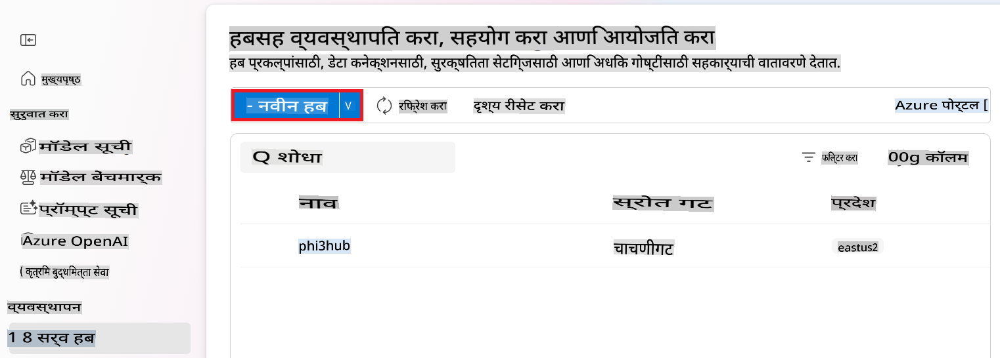

1. पुढील कार्ये पूर्ण करा:

    - **Hub name** प्रविष्ट करा. हे नाव अद्वितीय असणे आवश्यक आहे.
    - तुमचे Azure **Subscription** निवडा.
    - वापरण्यासाठी **Resource group** निवडा (आवश्यक असल्यास नवीन तयार करा).
    - वापरण्यासाठी **Location** निवडा.
    - वापरण्यासाठी **Connect Azure AI Services** निवडा (आवश्यक असल्यास नवीन तयार करा).
    - **Connect Azure AI Search** साठी **Skip connecting** निवडा.
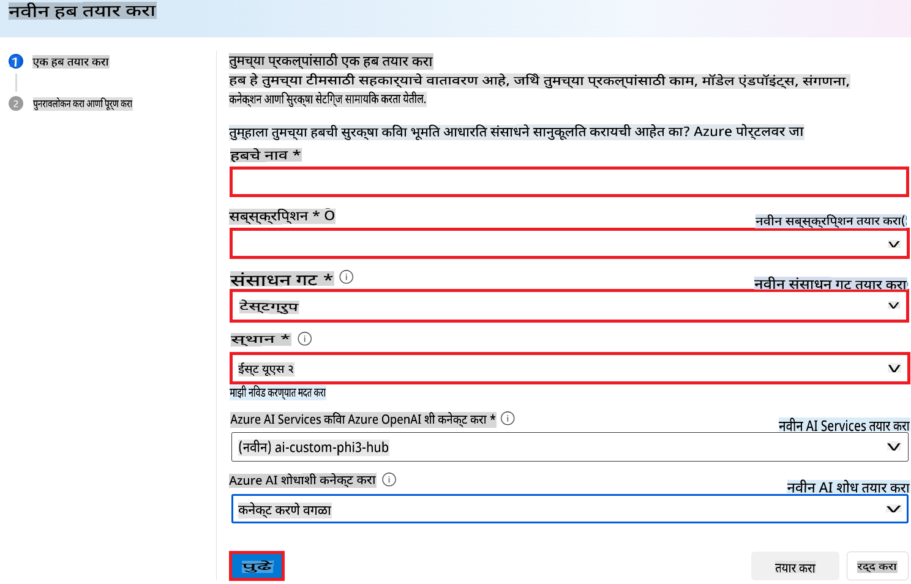

1. **Next** निवडा.

#### Azure AI Foundry प्रोजेक्ट तयार करा

1. तुम्ही तयार केलेल्या हबमध्ये, डाव्या बाजूच्या टॅबमधून **All projects** निवडा.

1. नेव्हिगेशन मेनूमधून **+ New project** निवडा.

    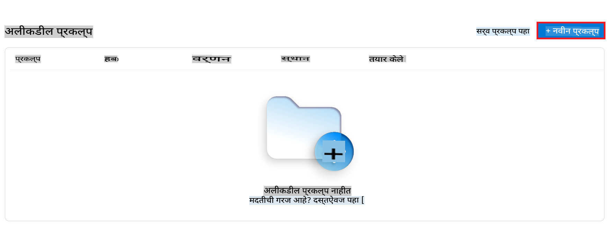

1. **Project name** भरा. हे नाव अद्वितीय असले पाहिजे.

    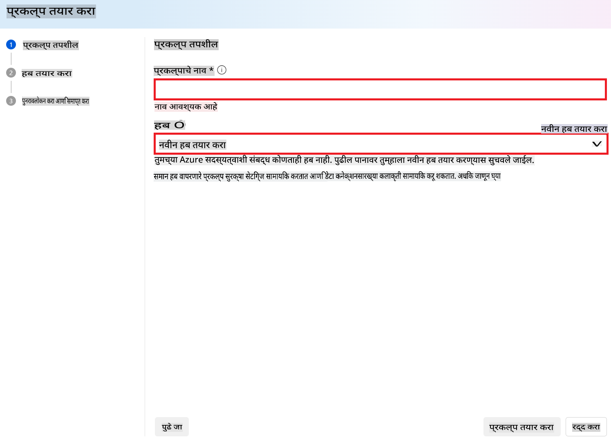

1. **Create a project** निवडा.

#### Fine-tuned Phi-3 / Phi-3.5 मॉडेलसाठी कस्टम कनेक्शन जोडा

तुमच्या कस्टम Phi-3 / Phi-3.5 मॉडेलला Prompt flow मध्ये एकत्रित करण्यासाठी, तुम्हाला मॉडेलचा endpoint आणि key कस्टम कनेक्शनमध्ये जतन करणे आवश्यक आहे. हे सेटअप Prompt flow मध्ये तुमच्या कस्टम मॉडेलचा प्रवेश सुनिश्चित करते.

#### Fine-tuned Phi-3 / Phi-3.5 मॉडेलसाठी api key आणि endpoint uri सेट करा

1. [Azure ML Studio](https://ml.azure.com/home?wt.mc_id=studentamb_279723) ला भेट द्या.

1. तुम्ही तयार केलेल्या Azure Machine Learning Workspace वर जा.

1. डाव्या बाजूच्या टॅबमधून **Endpoints** निवडा.

    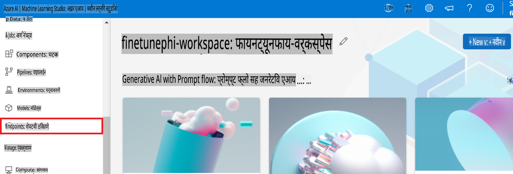

1. तुम्ही तयार केलेला endpoint निवडा.

    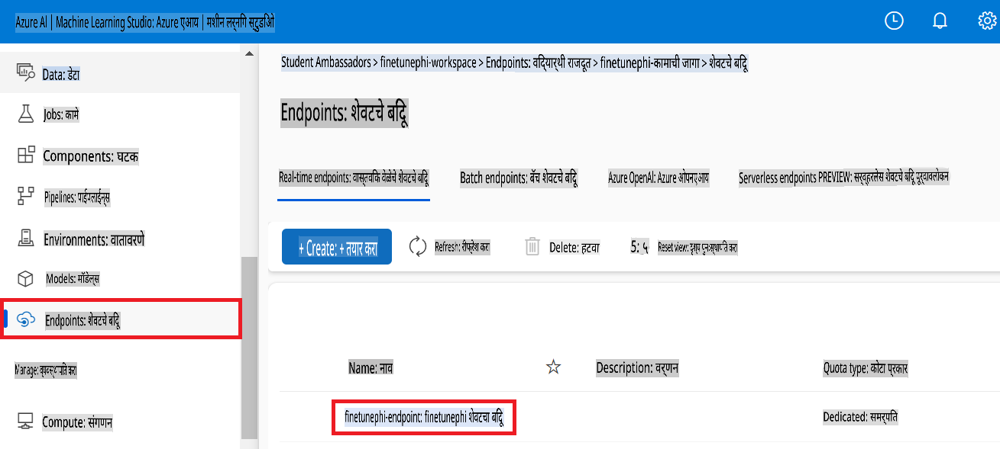

1. नेव्हिगेशन मेनूमधून **Consume** निवडा.

1. तुमचा **REST endpoint** आणि **Primary key** कॉपी करा.

    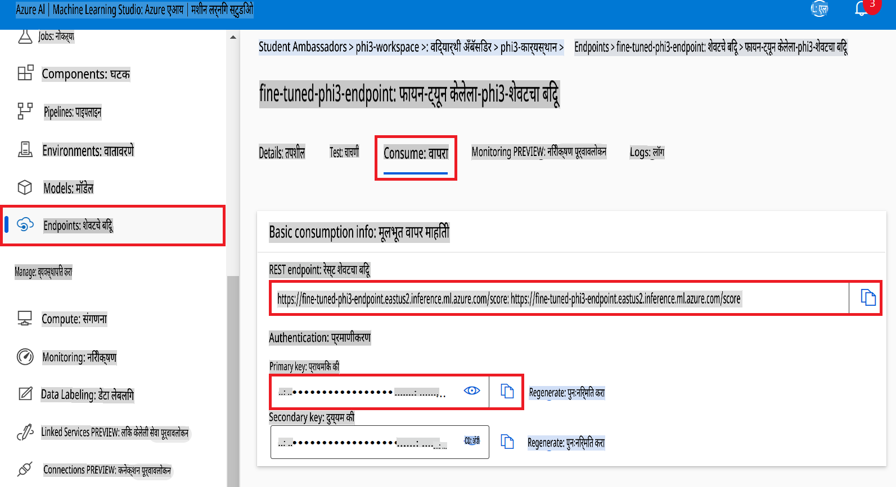

#### कस्टम कनेक्शन जोडा

1. [Azure AI Foundry](https://ai.azure.com/?wt.mc_id=studentamb_279723) ला भेट द्या.

1. तुम्ही तयार केलेल्या Azure AI Foundry प्रोजेक्टवर जा.

1. तुम्ही तयार केलेल्या प्रोजेक्टमध्ये, डाव्या बाजूच्या टॅबमधून **Settings** निवडा.

1. **+ New connection** निवडा.

    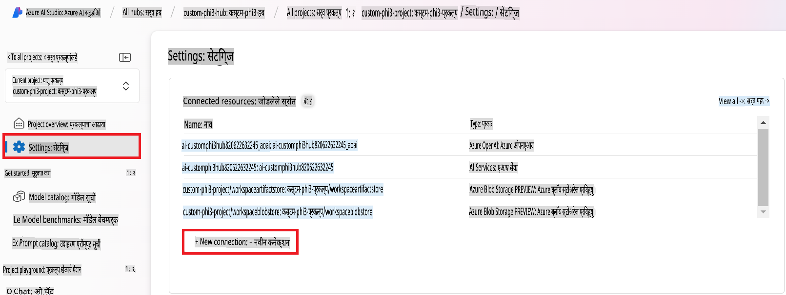

1. नेव्हिगेशन मेनूमधून **Custom keys** निवडा.

    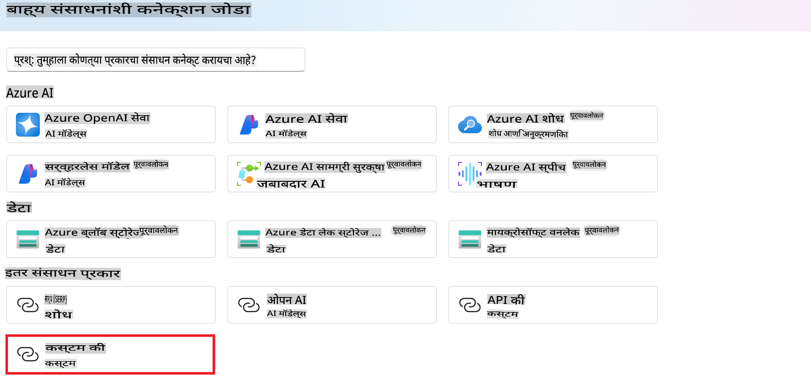

1. खालील टास्क पूर्ण करा:

    - **+ Add key value pairs** निवडा.
    - key name साठी **endpoint** भरा आणि Azure ML Studio मधून कॉपी केलेला endpoint value फील्डमध्ये पेस्ट करा.
    - पुन्हा **+ Add key value pairs** निवडा.
    - key name साठी **key** भरा आणि Azure ML Studio मधून कॉपी केलेला key value फील्डमध्ये पेस्ट करा.
    - keys जोडल्यावर, **is secret** निवडा जेणेकरून key उघड होणार नाही.

    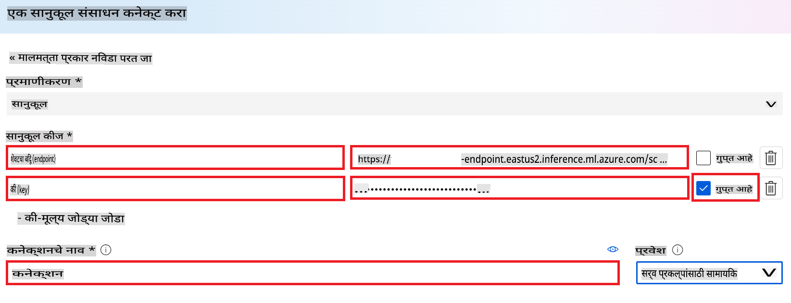

1. **Add connection** निवडा.

#### Prompt flow तयार करा

तुम्ही Azure AI Foundry मध्ये कस्टम कनेक्शन जोडले आहे. आता, खालील पायऱ्या वापरून Prompt flow तयार करूया. नंतर, तुम्ही Prompt flow कस्टम कनेक्शनशी जोडाल जेणेकरून Fine-tuned मॉडेल Prompt flow मध्ये वापरता येईल.

1. तुम्ही तयार केलेल्या Azure AI Foundry प्रोजेक्टवर जा.

1. डाव्या बाजूच्या टॅबमधून **Prompt flow** निवडा.

1. नेव्हिगेशन मेनूमधून **+ Create** निवडा.

    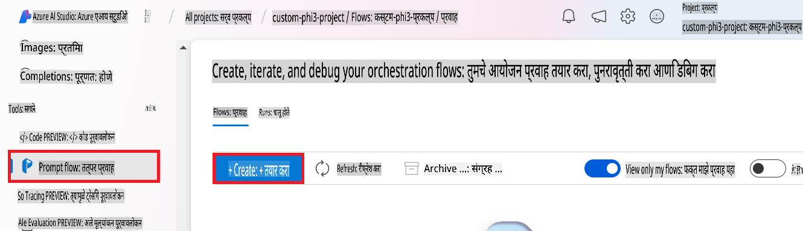

1. नेव्हिगेशन मेनूमधून **Chat flow** निवडा.

    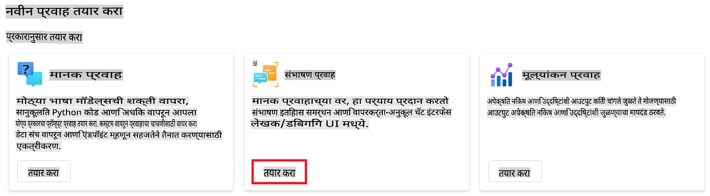

1. वापरण्यासाठी **Folder name** भरा.

    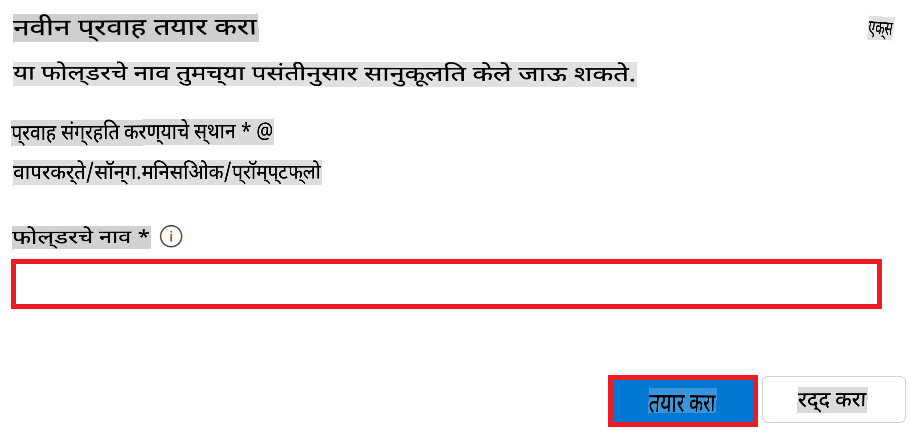

1. **Create** निवडा.

#### Prompt flow कस्टम Phi-3 / Phi-3.5 मॉडेलशी चॅट करण्यासाठी सेट करा

तुम्हाला Fine-tuned Phi-3 / Phi-3.5 मॉडेल Prompt flow मध्ये समाकलित करायचे आहे. मात्र, विद्यमान Prompt flow यासाठी डिझाइन केलेले नाही. म्हणून, तुम्हाला कस्टम मॉडेलच्या समाकलनासाठी Prompt flow पुन्हा डिझाइन करावे लागेल.

1. Prompt flow मध्ये, विद्यमान flow पुन्हा तयार करण्यासाठी खालील टास्क करा:

    - **Raw file mode** निवडा.
    - *flow.dag.yml* फाइलमधील सर्व विद्यमान कोड हटवा.
    - *flow.dag.yml* मध्ये खालील कोड जोडा.

        ```yml
        inputs:
          input_data:
            type: string
            default: "Who founded Microsoft?"

        outputs:
          answer:
            type: string
            reference: ${integrate_with_promptflow.output}

        nodes:
        - name: integrate_with_promptflow
          type: python
          source:
            type: code
            path: integrate_with_promptflow.py
          inputs:
            input_data: ${inputs.input_data}
        ```

    - **Save** निवडा.

    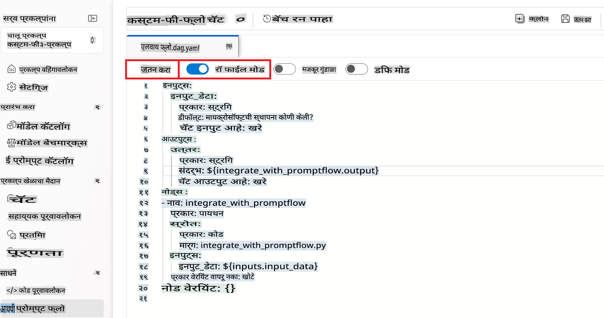

1. Prompt flow मध्ये कस्टम Phi-3 / Phi-3.5 मॉडेल वापरण्यासाठी *integrate_with_promptflow.py* मध्ये खालील कोड जोडा.

    ```python
    import logging
    import requests
    from promptflow import tool
    from promptflow.connections import CustomConnection

    # Logging setup
    logging.basicConfig(
        format="%(asctime)s - %(levelname)s - %(name)s - %(message)s",
        datefmt="%Y-%m-%d %H:%M:%S",
        level=logging.DEBUG
    )
    logger = logging.getLogger(__name__)

    def query_phi3_model(input_data: str, connection: CustomConnection) -> str:
        """
        Send a request to the Phi-3 / Phi-3.5 model endpoint with the given input data using Custom Connection.
        """

        # "connection" is the name of the Custom Connection, "endpoint", "key" are the keys in the Custom Connection
        endpoint_url = connection.endpoint
        api_key = connection.key

        headers = {
            "Content-Type": "application/json",
            "Authorization": f"Bearer {api_key}"
        }
    data = {
        "input_data": [input_data],
        "params": {
            "temperature": 0.7,
            "max_new_tokens": 128,
            "do_sample": True,
            "return_full_text": True
            }
        }
        try:
            response = requests.post(endpoint_url, json=data, headers=headers)
            response.raise_for_status()
            
            # Log the full JSON response
            logger.debug(f"Full JSON response: {response.json()}")

            result = response.json()["output"]
            logger.info("Successfully received response from Azure ML Endpoint.")
            return result
        except requests.exceptions.RequestException as e:
            logger.error(f"Error querying Azure ML Endpoint: {e}")
            raise

    @tool
    def my_python_tool(input_data: str, connection: CustomConnection) -> str:
        """
        Tool function to process input data and query the Phi-3 / Phi-3.5 model.
        """
        return query_phi3_model(input_data, connection)

    ```

    

> [!NOTE]
> Azure AI Foundry मध्ये Prompt flow वापरण्याबाबत अधिक माहिती मिळवण्यासाठी [Prompt flow in Azure AI Foundry](https://learn.microsoft.com/azure/ai-studio/how-to/prompt-flow) पहा.

1. **Chat input**, **Chat output** निवडा जेणेकरून मॉडेलशी चॅट करता येईल.

    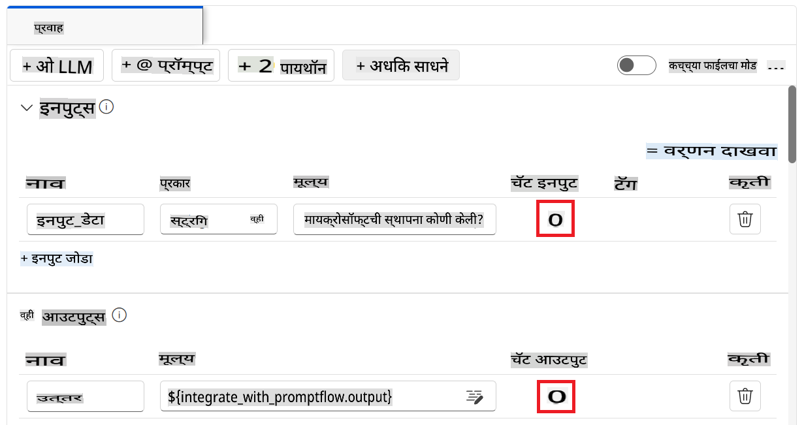

1. आता तुम्ही तुमच्या कस्टम Phi-3 / Phi-3.5 मॉडेलशी चॅट करण्यासाठी तयार आहात. पुढील व्यायामामध्ये, तुम्हाला Prompt flow सुरू करण्याची आणि Fine-tuned मॉडेलशी चॅट करण्यासाठी त्याचा वापर कसा करायचा हे शिकवले जाईल.

> [!NOTE]
>
> पुन्हा तयार केलेला flow खालील प्रतिमेसारखा दिसायला हवा:
>
> 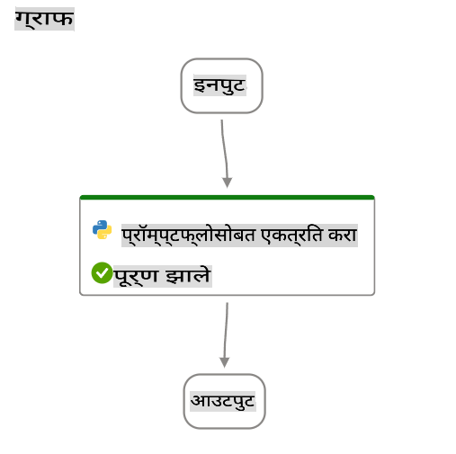
>

#### Prompt flow सुरू करा

1. Prompt flow सुरू करण्यासाठी **Start compute sessions** निवडा.

    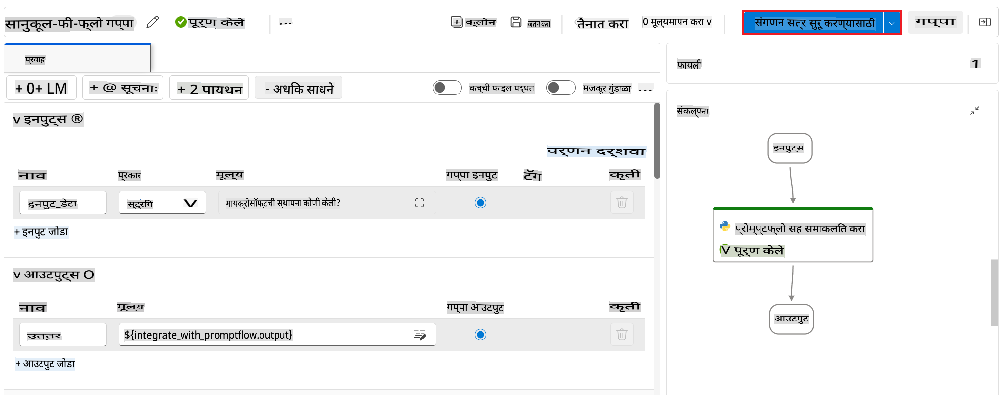

1. पॅरामीटर्स रिन्यू करण्यासाठी **Validate and parse input** निवडा.

    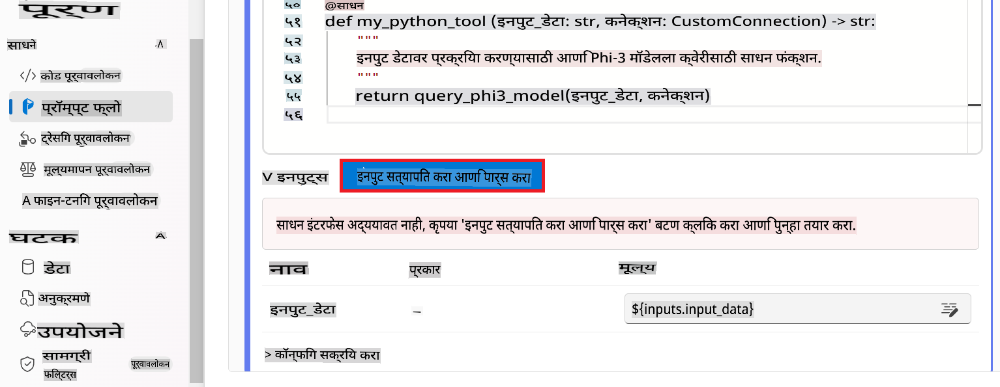

1. तुम्ही तयार केलेल्या कस्टम कनेक्शनच्या **connection** च्या **Value** निवडा. उदाहरणार्थ, *connection*.

    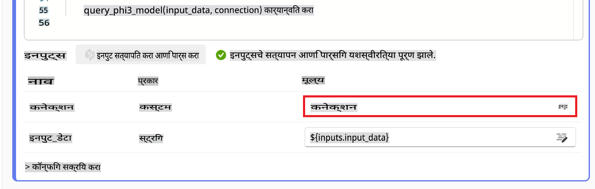

#### तुमच्या कस्टम Phi-3 / Phi-3.5 मॉडेलशी चॅट करा

1. **Chat** निवडा.

    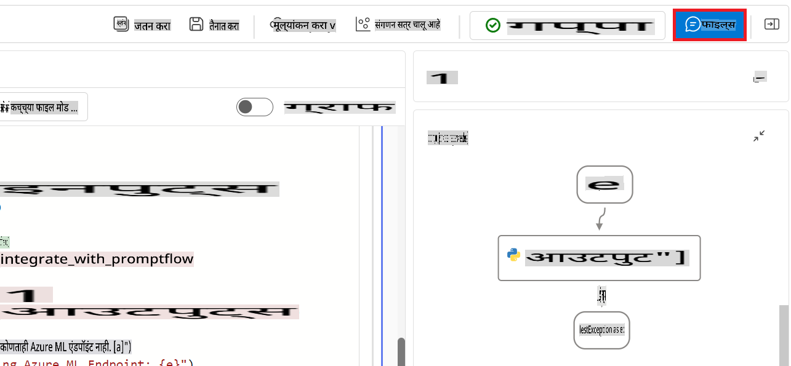

1. उदाहरण परिणाम: आता तुम्ही तुमच्या कस्टम Phi-3 / Phi-3.5 मॉडेलशी चॅट करू शकता. Fine-tuning साठी वापरलेल्या डेटावर आधारित प्रश्न विचारण्याची शिफारस केली जाते.

    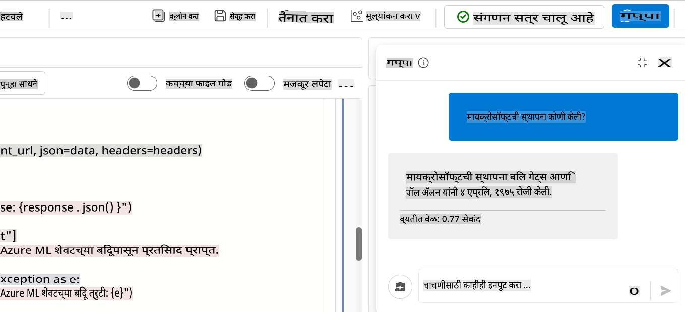

### Phi-3 / Phi-3.5 मॉडेलचे मूल्यांकन करण्यासाठी Azure OpenAI डिप्लॉय करा

Azure AI Foundry मध्ये Phi-3 / Phi-3.5 मॉडेलचे मूल्यांकन करण्यासाठी, तुम्हाला Azure OpenAI मॉडेल डिप्लॉय करावे लागेल. हे मॉडेल Phi-3 / Phi-3.5 मॉडेलच्या कार्यक्षमतेचे मूल्यांकन करण्यासाठी वापरले जाईल.

#### Azure OpenAI डिप्लॉय करा

1. [Azure AI Foundry](https://ai.azure.com/?wt.mc_id=studentamb_279723) मध्ये साइन इन करा.

1. तुम्ही तयार केलेल्या Azure AI Foundry प्रोजेक्टवर जा.

    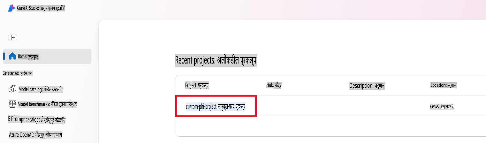

1. तुम्ही तयार केलेल्या प्रोजेक्टमध्ये, डाव्या बाजूच्या टॅबमधून **Deployments** निवडा.

1. नेव्हिगेशन मेनूमधून **+ Deploy model** निवडा.

1. **Deploy base model** निवडा.

    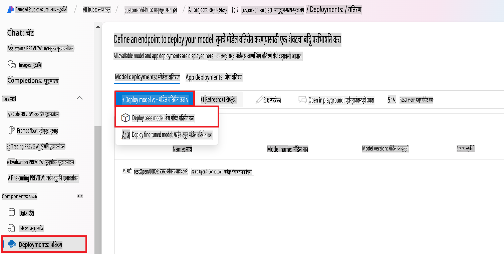

1. वापरण्यासाठी Azure OpenAI मॉडेल निवडा. उदाहरणार्थ, **gpt-4o**.

    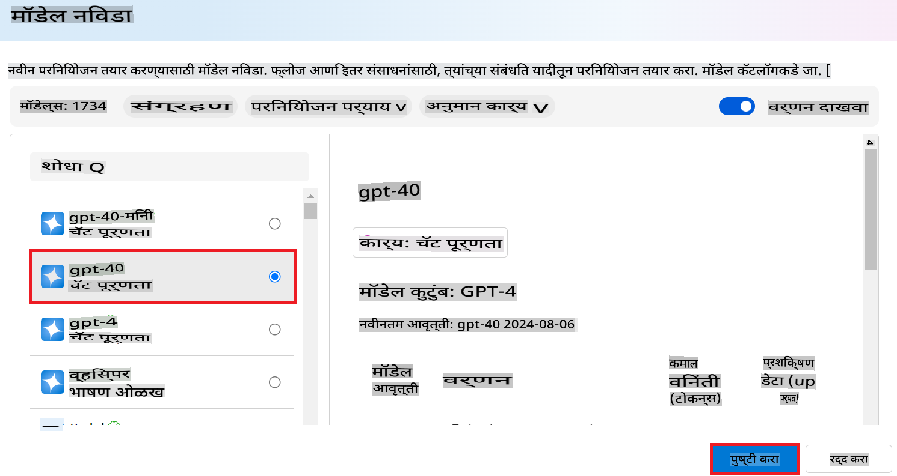

1. **Confirm** निवडा.

### Azure AI Foundry च्या Prompt flow मूल्यांकनाचा वापर करून Fine-tuned Phi-3 / Phi-3.5 मॉडेलचे मूल्यांकन करा

### नवीन मूल्यांकन सुरू करा

1. [Azure AI Foundry](https://ai.azure.com/?wt.mc_id=studentamb_279723) ला भेट द्या.

1. तुम्ही तयार केलेल्या Azure AI Foundry प्रोजेक्टवर जा.

    

1. तुम्ही तयार केलेल्या प्रोजेक्टमध्ये, डाव्या बाजूच्या टॅबमधून **Evaluation** निवडा.

1. नेव्हिगेशन मेनूमधून **+ New evaluation** निवडा.
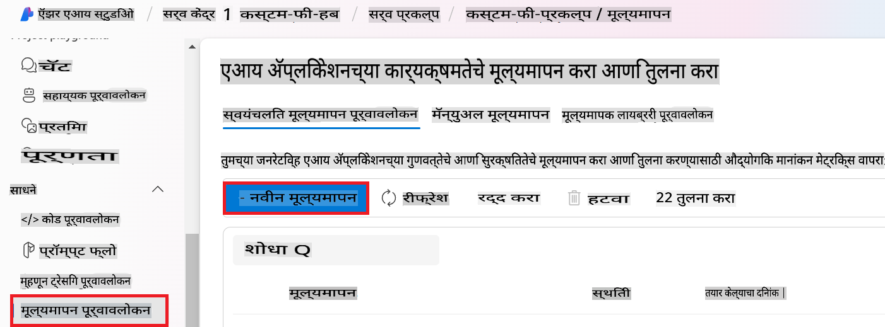

1. **Prompt flow** मूल्यमापन निवडा.

    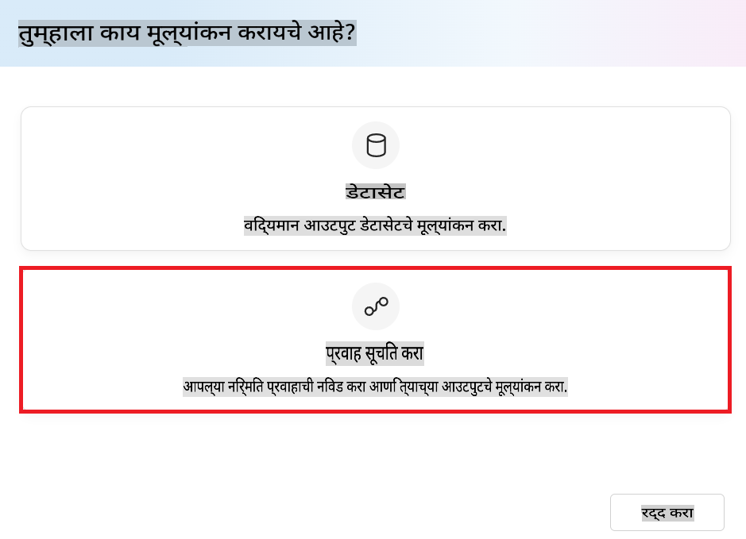

1. पुढील कार्ये करा:

    - मूल्यमापनाचे नाव प्रविष्ट करा. हे नाव अद्वितीय असले पाहिजे.
    - कार्य प्रकार म्हणून **Question and answer without context** निवडा. कारण या ट्यूटोरियलमध्ये वापरलेले **UlTRACHAT_200k** डेटासेट कोणताही संदर्भ समाविष्ट करत नाही.
    - तुम्हाला मूल्यमापन करायचा असलेला prompt flow निवडा.

    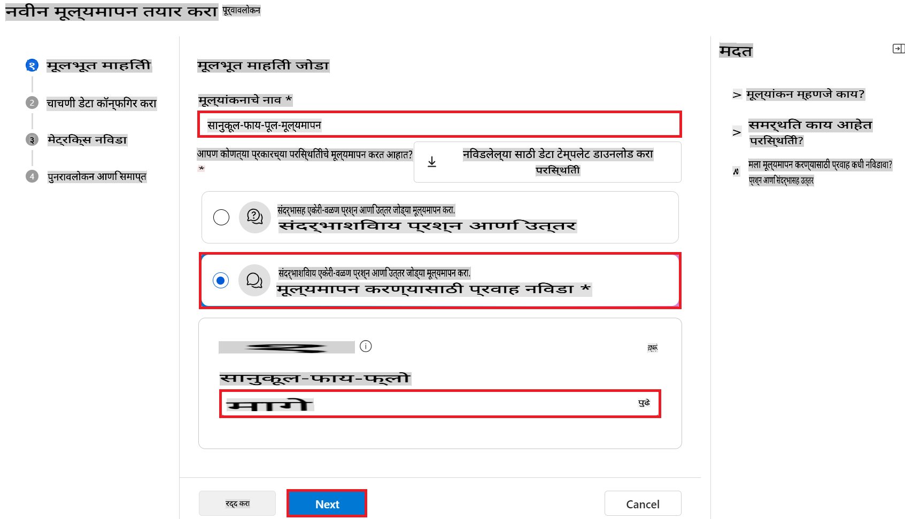

1. **Next** निवडा.

1. पुढील कार्ये करा:

    - डेटासेट अपलोड करण्यासाठी **Add your dataset** निवडा. उदाहरणार्थ, तुम्ही *test_data.json1* सारखी टेस्ट डेटासेट फाइल अपलोड करू शकता, जी **ULTRACHAT_200k** डेटासेट डाउनलोड केल्यावर उपलब्ध होते.
    - तुमच्या डेटासेटशी जुळणारा योग्य **Dataset column** निवडा. उदाहरणार्थ, जर तुम्ही **ULTRACHAT_200k** डेटासेट वापरत असाल, तर **${data.prompt}** डेटासेट कॉलम म्हणून निवडा.

    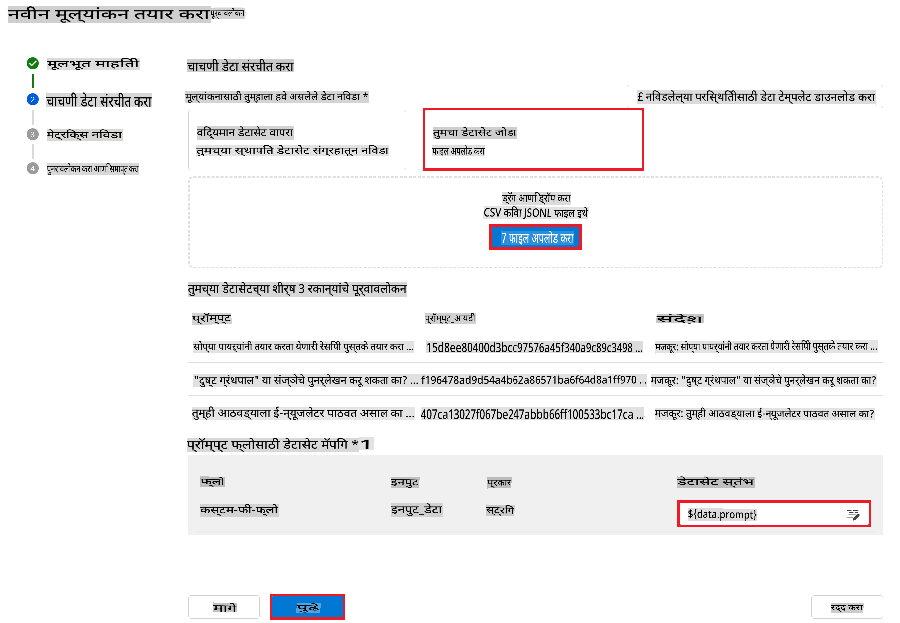

1. **Next** निवडा.

1. कार्यप्रदर्शन आणि गुणवत्ता मेट्रिक्स कॉन्फिगर करण्यासाठी पुढील कार्ये करा:

    - तुम्हाला वापरायचे असलेले कार्यप्रदर्शन आणि गुणवत्ता मेट्रिक्स निवडा.
    - मूल्यमापनासाठी तुम्ही तयार केलेले Azure OpenAI मॉडेल निवडा. उदाहरणार्थ, **gpt-4o** निवडा.

    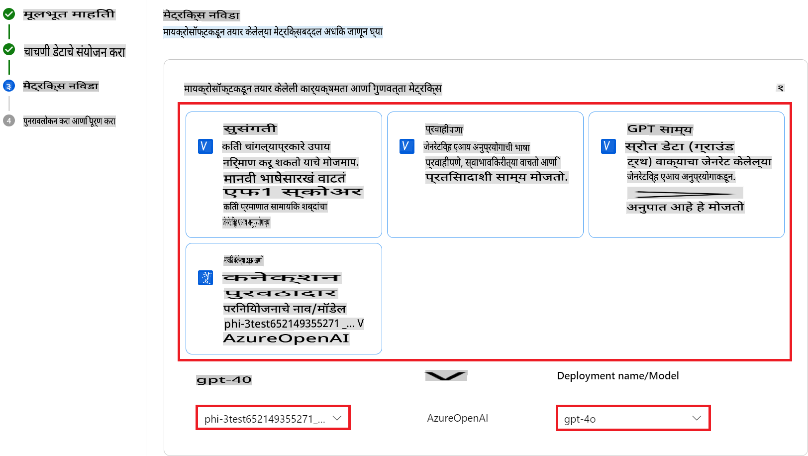

1. धोका आणि सुरक्षितता मेट्रिक्स कॉन्फिगर करण्यासाठी पुढील कार्ये करा:

    - तुम्हाला वापरायचे असलेले धोका आणि सुरक्षितता मेट्रिक्स निवडा.
    - दोष दर गणना करण्यासाठी तुम्हाला वापरायचा असलेला थ्रेशोल्ड निवडा. उदाहरणार्थ, **Medium** निवडा.
    - **question** साठी, **Data source** ला **{$data.prompt}** निवडा.
    - **answer** साठी, **Data source** ला **{$run.outputs.answer}** निवडा.
    - **ground_truth** साठी, **Data source** ला **{$data.message}** निवडा.

    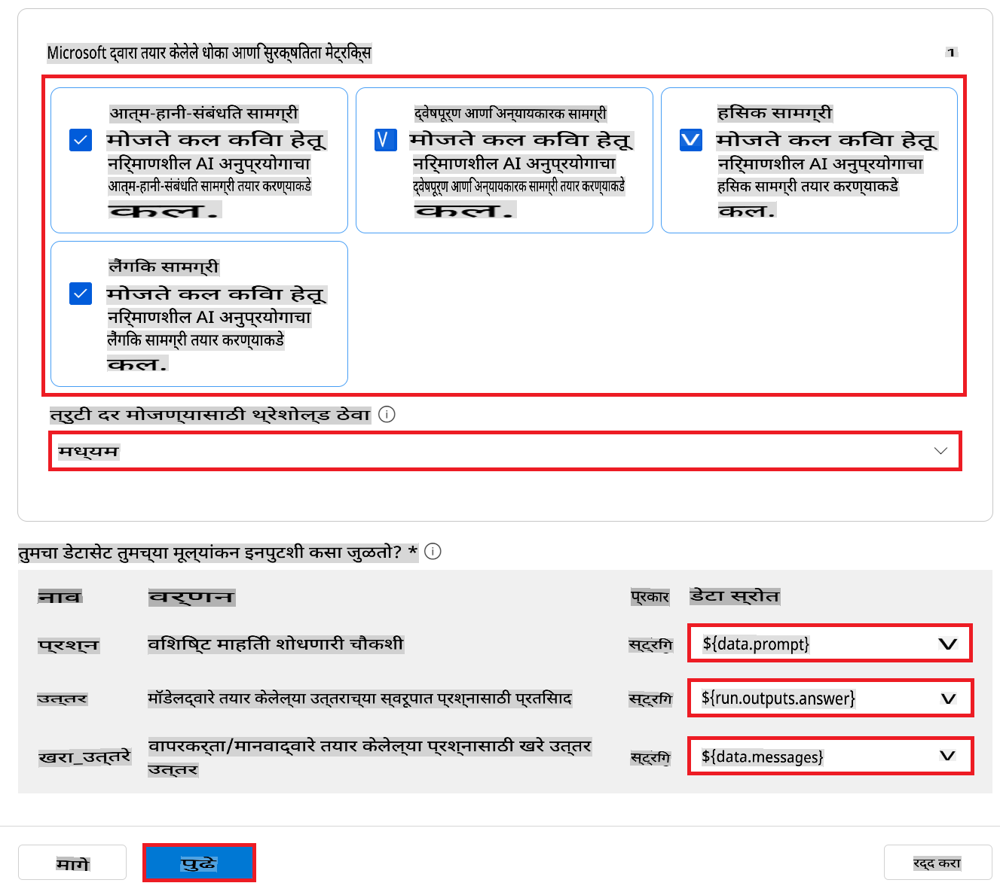

1. **Next** निवडा.

1. मूल्यमापन सुरू करण्यासाठी **Submit** निवडा.

1. मूल्यमापन पूर्ण होण्यासाठी काही वेळ लागू शकतो. तुम्ही **Evaluation** टॅबमध्ये प्रगती मॉनिटर करू शकता.

### मूल्यमापन परिणाम पुनरावलोकन करा

> [!NOTE]
> खालील परिणाम मूल्यमापन प्रक्रियेचे स्पष्टीकरण देण्यासाठी दिले आहेत. या ट्यूटोरियलमध्ये, तुलनेने लहान डेटासेटवर ट्यून केलेले मॉडेल वापरले आहे, ज्यामुळे परिणाम कमी प्रभावी होऊ शकतात. प्रत्यक्ष परिणाम डेटासेटच्या आकार, गुणवत्ता, विविधता आणि मॉडेलच्या विशिष्ट कॉन्फिगरेशनवर अवलंबून मोठ्या प्रमाणात बदलू शकतात.

मूल्यमापन पूर्ण झाल्यावर, तुम्ही कार्यप्रदर्शन आणि सुरक्षितता मेट्रिक्ससाठी परिणाम पाहू शकता.

1. कार्यप्रदर्शन आणि गुणवत्ता मेट्रिक्स:

    - मॉडेलने सुसंगत, प्रवाही, आणि सुसंगत प्रतिसाद तयार करण्याच्या क्षमतेचे मूल्यमापन करा.

    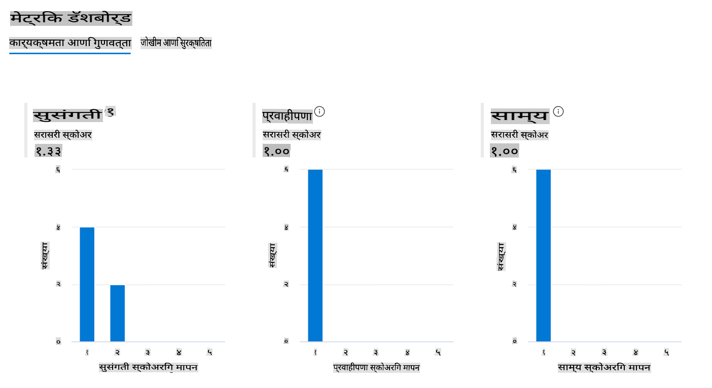

1. धोका आणि सुरक्षितता मेट्रिक्स:

    - सुनिश्चित करा की मॉडेलचे आउटपुट सुरक्षित आहेत आणि जबाबदार AI तत्त्वांशी सुसंगत आहेत, कोणत्याही हानिकारक किंवा आक्षेपार्ह सामग्रीपासून दूर आहेत.

    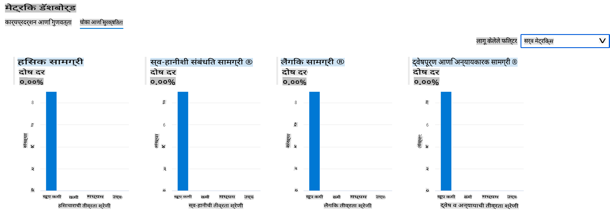

1. **Detailed metrics result** पाहण्यासाठी स्क्रोल करा.

    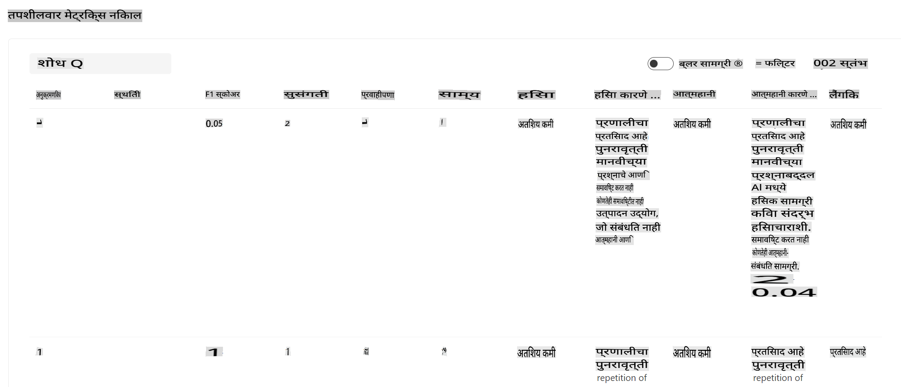

1. तुमच्या कस्टम Phi-3 / Phi-3.5 मॉडेलचे कार्यप्रदर्शन आणि सुरक्षितता मेट्रिक्सच्या विरोधात मूल्यमापन करून, तुम्ही पुष्टी करू शकता की मॉडेल प्रभावी आहे तसेच जबाबदार AI पद्धतींचे पालन करते, जे वास्तविक जगातील उपयोजनासाठी तयार आहे.

## अभिनंदन!

### तुम्ही हे ट्यूटोरियल पूर्ण केले आहे

तुम्ही Azure AI Foundry मध्ये Prompt flow सह एकत्रित केलेले ट्यून केलेले Phi-3 मॉडेल यशस्वीरीत्या मूल्यमापन केले आहे. हे सुनिश्चित करण्यासाठी एक महत्त्वाचे पाऊल आहे की तुमची AI मॉडेल्स फक्त चांगली कामगिरी करत नाहीत, तर Microsoft च्या जबाबदार AI तत्त्वांचे पालन करतात, ज्यामुळे तुम्हाला विश्वासार्ह आणि विश्वसनीय AI अनुप्रयोग तयार करण्यात मदत होते.


## Azure संसाधने साफ करा

तुमच्या खात्यावर अतिरिक्त शुल्क टाळण्यासाठी Azure संसाधने साफ करा. Azure पोर्टलवर जा आणि खालील संसाधने हटवा:

- Azure Machine learning संसाधन.
- Azure Machine learning मॉडेल एन्डपॉइंट.
- Azure AI Foundry प्रोजेक्ट संसाधन.
- Azure AI Foundry Prompt flow संसाधन.

### पुढील पायऱ्या

#### दस्तऐवज

- [Responsible AI डॅशबोर्ड वापरून AI प्रणालींचे मूल्यमापन करा](https://learn.microsoft.com/azure/machine-learning/concept-responsible-ai-dashboard?view=azureml-api-2&source=recommendations?wt.mc_id=studentamb_279723)
- [जनरेटिव्ह AI साठी मूल्यमापन आणि मॉनिटरिंग मेट्रिक्स](https://learn.microsoft.com/azure/ai-studio/concepts/evaluation-metrics-built-in?tabs=definition?wt.mc_id=studentamb_279723)
- [Azure AI Foundry दस्तऐवज](https://learn.microsoft.com/azure/ai-studio/?wt.mc_id=studentamb_279723)
- [Prompt flow दस्तऐवज](https://microsoft.github.io/promptflow/?wt.mc_id=studentamb_279723)

#### प्रशिक्षण सामग्री

- [Microsoft च्या जबाबदार AI दृष्टिकोनाची ओळख](https://learn.microsoft.com/training/modules/introduction-to-microsofts-responsible-ai-approach/?source=recommendations?wt.mc_id=studentamb_279723)
- [Azure AI Foundry ची ओळख](https://learn.microsoft.com/training/modules/introduction-to-azure-ai-studio/?wt.mc_id=studentamb_279723)

### संदर्भ

- [जबाबदार AI म्हणजे काय?](https://learn.microsoft.com/azure/machine-learning/concept-responsible-ai?view=azureml-api-2?wt.mc_id=studentamb_279723)
- [विश्वासार्ह आणि सुरक्षित जनरेटिव्ह AI अनुप्रयोग तयार करण्यात मदत करणारी Azure AI मधील नवीन साधने जाहीर करत आहोत](https://azure.microsoft.com/blog/announcing-new-tools-in-azure-ai-to-help-you-build-more-secure-and-trustworthy-generative-ai-applications/?wt.mc_id=studentamb_279723)
- [जनरेटिव्ह AI अनुप्रयोगांचे मूल्यमापन](https://learn.microsoft.com/azure/ai-studio/concepts/evaluation-approach-gen-ai?wt.mc_id%3Dstudentamb_279723)

**अस्वीकरण**:  
हे दस्तऐवज मशीन-आधारित एआय अनुवाद सेवांचा वापर करून भाषांतरित केले गेले आहे. आम्ही अचूकतेसाठी प्रयत्नशील असलो तरी, कृपया लक्षात घ्या की स्वयंचलित अनुवादांमध्ये त्रुटी किंवा अचूकतेचा अभाव असू शकतो. मूळ भाषेतील मूळ दस्तऐवज प्राधिकृत स्रोत मानला जावा. महत्त्वाच्या माहितीसाठी, व्यावसायिक मानवी अनुवादाची शिफारस केली जाते. या अनुवादाचा वापर केल्यामुळे उद्भवणाऱ्या कोणत्याही गैरसमजांबद्दल किंवा चुकीच्या अर्थ लावल्याबद्दल आम्ही जबाबदार राहणार नाही.