# कस्टम Phi-3 मॉडेल्सना फाइन-ट्यून करा आणि Prompt Flow सह समाकलित करा

ही एंड-टू-एंड (E2E) उदाहरण Microsoft Tech Community मधील "[Fine-Tune and Integrate Custom Phi-3 Models with Prompt Flow: Step-by-Step Guide](https://techcommunity.microsoft.com/t5/educator-developer-blog/fine-tune-and-integrate-custom-phi-3-models-with-prompt-flow/ba-p/4178612?WT.mc_id=aiml-137032-kinfeylo)" या मार्गदर्शिकेवर आधारित आहे. यात कस्टम Phi-3 मॉडेल्सना फाइन-ट्यून करणे, डिप्लॉय करणे आणि Prompt Flow सह समाकलित करण्याच्या प्रक्रियेचा परिचय दिला आहे.

## आढावा

या E2E उदाहरणात, तुम्ही Phi-3 मॉडेल फाइन-ट्यून करणे आणि Prompt Flow सह समाकलित करणे शिकाल. Azure Machine Learning आणि Prompt Flow चा वापर करून, तुम्ही कस्टम AI मॉडेल्स डिप्लॉय आणि वापरण्यासाठी वर्कफ्लो तयार कराल. हे उदाहरण तीन टप्प्यांमध्ये विभागले आहे:

**परिस्थिती 1: Azure संसाधने सेट करा आणि फाइन-ट्यूनिंगसाठी तयारी करा**

**परिस्थिती 2: Phi-3 मॉडेल फाइन-ट्यून करा आणि Azure Machine Learning Studio मध्ये डिप्लॉय करा**

**परिस्थिती 3: Prompt Flow सह समाकलित करा आणि तुमच्या कस्टम मॉडेलशी संवाद साधा**

खाली या E2E उदाहरणाचा आढावा दिला आहे.

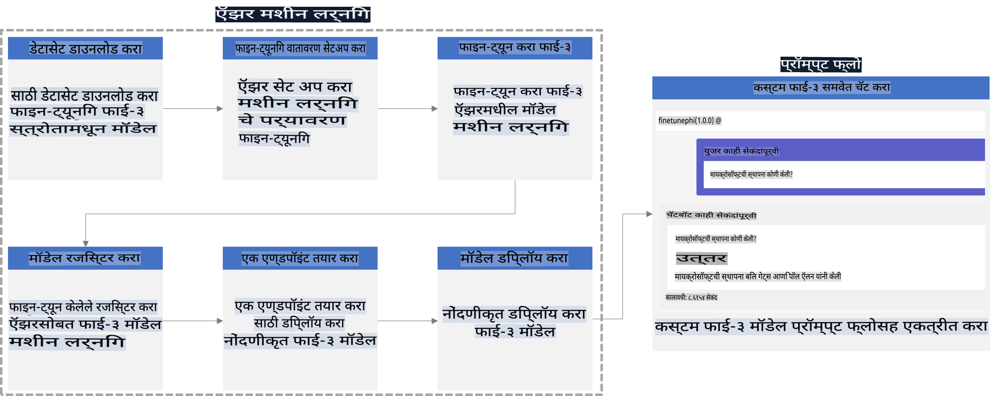

### विषय सूची

1. **[परिस्थिती 1: Azure संसाधने सेट करा आणि फाइन-ट्यूनिंगसाठी तयारी करा](../../../../../../md/02.Application/01.TextAndChat/Phi3)**
    - [Azure Machine Learning Workspace तयार करा](../../../../../../md/02.Application/01.TextAndChat/Phi3)
    - [Azure Subscription मध्ये GPU कोटा मागणी करा](../../../../../../md/02.Application/01.TextAndChat/Phi3)
    - [भूमिका नियुक्ती जोडा](../../../../../../md/02.Application/01.TextAndChat/Phi3)
    - [प्रकल्प सेट करा](../../../../../../md/02.Application/01.TextAndChat/Phi3)
    - [फाइन-ट्यूनिंगसाठी डेटासेट तयार करा](../../../../../../md/02.Application/01.TextAndChat/Phi3)

1. **[परिस्थिती 2: Phi-3 मॉडेल फाइन-ट्यून करा आणि Azure Machine Learning Studio मध्ये डिप्लॉय करा](../../../../../../md/02.Application/01.TextAndChat/Phi3)**
    - [Azure CLI सेट करा](../../../../../../md/02.Application/01.TextAndChat/Phi3)
    - [Phi-3 मॉडेल फाइन-ट्यून करा](../../../../../../md/02.Application/01.TextAndChat/Phi3)
    - [फाइन-ट्यून केलेले मॉडेल डिप्लॉय करा](../../../../../../md/02.Application/01.TextAndChat/Phi3)

1. **[परिस्थिती 3: Prompt Flow सह समाकलित करा आणि तुमच्या कस्टम मॉडेलशी संवाद साधा](../../../../../../md/02.Application/01.TextAndChat/Phi3)**
    - [कस्टम Phi-3 मॉडेल Prompt Flow सह समाकलित करा](../../../../../../md/02.Application/01.TextAndChat/Phi3)
    - [तुमच्या कस्टम मॉडेलशी संवाद साधा](../../../../../../md/02.Application/01.TextAndChat/Phi3)

## परिस्थिती 1: Azure संसाधने सेट करा आणि फाइन-ट्यूनिंगसाठी तयारी करा

### Azure Machine Learning Workspace तयार करा

1. पोर्टल पृष्ठाच्या शीर्षस्थानी **शोध पट्टीत** *azure machine learning* टाइप करा आणि दिसणाऱ्या पर्यायांमधून **Azure Machine Learning** निवडा.

    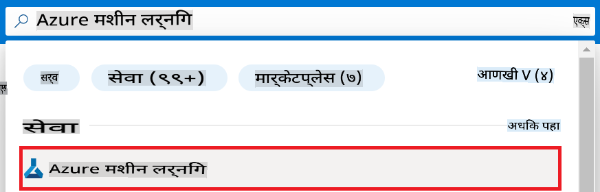

1. नेव्हिगेशन मेनूमधून **+ Create** निवडा.

1. नेव्हिगेशन मेनूमधून **New workspace** निवडा.

    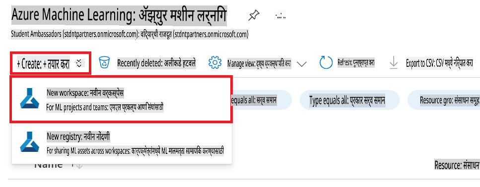

1. खालील गोष्टी करा:

    - तुमचे Azure **Subscription** निवडा.
    - वापरण्यासाठी **Resource group** निवडा (गरज असल्यास नवीन तयार करा).
    - **Workspace Name** प्रविष्ट करा. हे अद्वितीय असले पाहिजे.
    - तुमच्या इच्छेनुसार **Region** निवडा.
    - वापरण्यासाठी **Storage account** निवडा (गरज असल्यास नवीन तयार करा).
    - वापरण्यासाठी **Key vault** निवडा (गरज असल्यास नवीन तयार करा).
    - वापरण्यासाठी **Application insights** निवडा (गरज असल्यास नवीन तयार करा).
    - वापरण्यासाठी **Container registry** निवडा (गरज असल्यास नवीन तयार करा).

    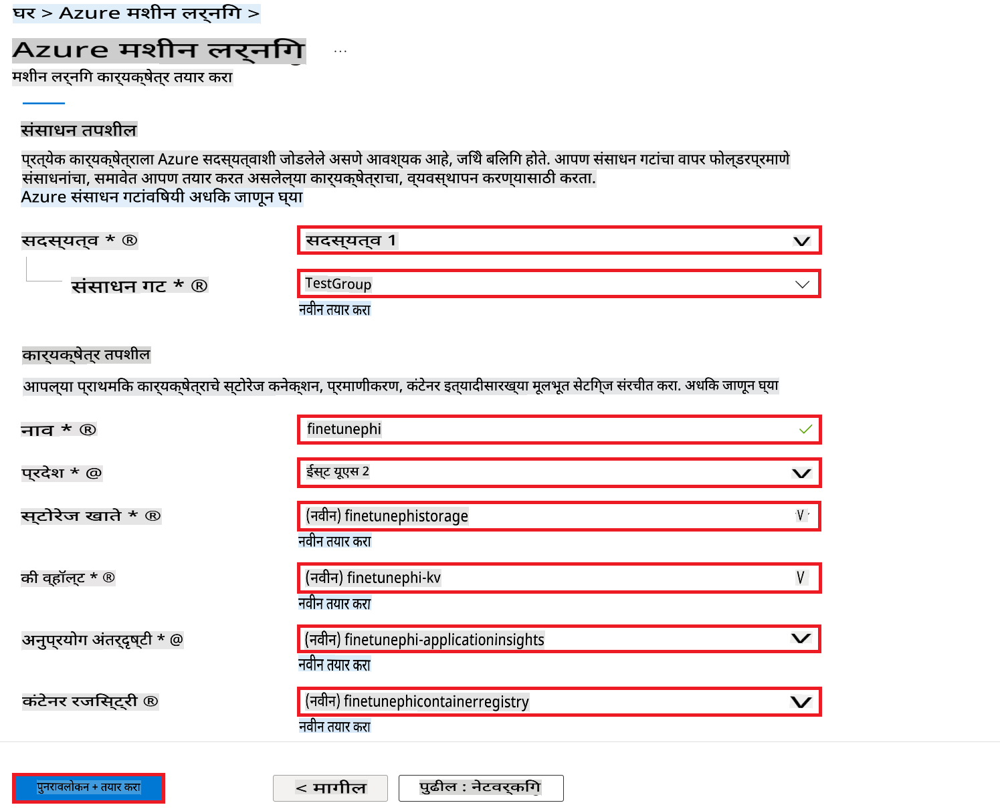

1. **Review + Create** निवडा.

1. **Create** निवडा.

### Azure Subscription मध्ये GPU कोटा मागणी करा

या E2E उदाहरणात, फाइन-ट्यूनिंगसाठी *Standard_NC24ads_A100_v4 GPU* वापरण्यात येईल, ज्यासाठी कोटा मागणी आवश्यक आहे, तर *Standard_E4s_v3* CPU डिप्लॉयमेंटसाठी वापरण्यात येईल, ज्यासाठी कोटा मागणी आवश्यक नाही.

> [!NOTE]
>
> फक्त Pay-As-You-Go सबस्क्रिप्शन GPU साठी पात्र आहेत; इतर प्रकारच्या सबस्क्रिप्शनला सध्या समर्थन नाही.
>
> ज्या वापरकर्त्यांकडे GPU नसलेल्या सबस्क्रिप्शन आहेत, त्यांच्यासाठी CPU वापरून लहान डेटासेटवर प्रक्रिया कशी करावी यासाठीही मार्गदर्शन दिले आहे. मात्र, GPU वापरून मोठ्या डेटासेटवर प्रक्रिया केल्यास अधिक चांगले निकाल मिळतात.

1. [Azure ML Studio](https://ml.azure.com/home?wt.mc_id=studentamb_279723) ला भेट द्या.

1. *Standard NCADSA100v4 Family* कोटा मागणीसाठी खालील चरण करा:

    - डाव्या बाजूच्या टॅबमधून **Quota** निवडा.
    - वापरण्यासाठी **Virtual machine family** निवडा. उदाहरणार्थ, **Standard NCADSA100v4 Family Cluster Dedicated vCPUs** निवडा, ज्यात *Standard_NC24ads_A100_v4* GPU समाविष्ट आहे.
    - नेव्हिगेशन मेनूमधून **Request quota** निवडा.

        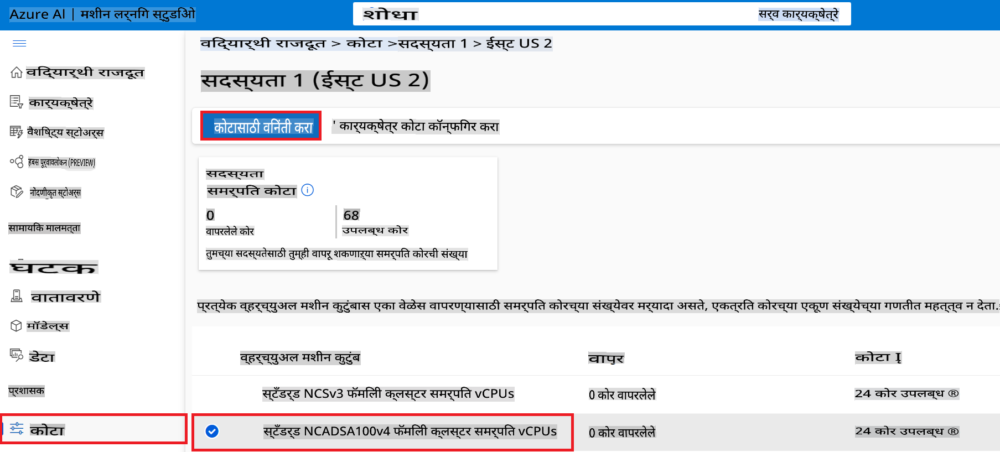

    - Request quota पृष्ठात, वापरण्यासाठी **New cores limit** प्रविष्ट करा. उदाहरणार्थ, 24.
    - GPU कोटा मागणीसाठी **Submit** निवडा.

> [!NOTE]
> तुमच्या गरजेनुसार योग्य GPU किंवा CPU निवडण्यासाठी [Sizes for Virtual Machines in Azure](https://learn.microsoft.com/azure/virtual-machines/sizes/overview?tabs=breakdownseries%2Cgeneralsizelist%2Ccomputesizelist%2Cmemorysizelist%2Cstoragesizelist%2Cgpusizelist%2Cfpgasizelist%2Chpcsizelist) दस्तऐवजाचा संदर्भ घ्या.

### भूमिका नियुक्ती जोडा

तुमचे मॉडेल्स फाइन-ट्यून आणि डिप्लॉय करण्यासाठी, तुम्हाला प्रथम एक User Assigned Managed Identity (UAI) तयार करावी लागेल आणि त्याला योग्य परवानग्या द्याव्या लागतील. डिप्लॉयमेंट दरम्यान प्रमाणीकरणासाठी ही UAI वापरली जाईल.

#### User Assigned Managed Identity (UAI) तयार करा

1. पोर्टल पृष्ठाच्या शीर्षस्थानी **शोध पट्टीत** *managed identities* टाइप करा आणि दिसणाऱ्या पर्यायांमधून **Managed Identities** निवडा.

    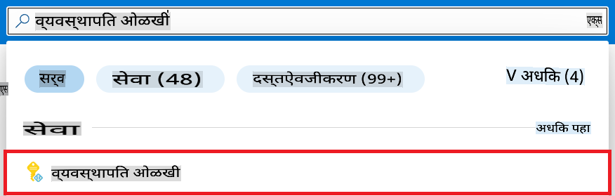

1. **+ Create** निवडा.

    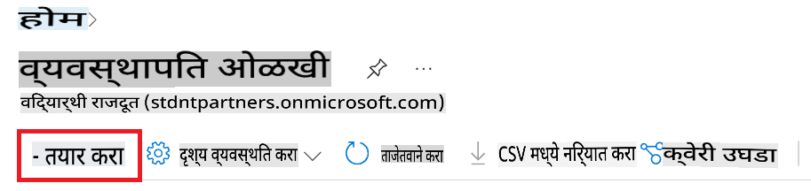

1. खालील गोष्टी करा:

    - तुमचे Azure **Subscription** निवडा.
    - वापरण्यासाठी **Resource group** निवडा (गरज असल्यास नवीन तयार करा).
    - तुमच्या इच्छेनुसार **Region** निवडा.
    - **Name** प्रविष्ट करा. हे अद्वितीय असले पाहिजे.

1. **Review + create** निवडा.

1. **+ Create** निवडा.

#### Managed Identity साठी Contributor भूमिका जोडा

1. तयार केलेल्या Managed Identity संसाधनाकडे जा.

1. डाव्या बाजूच्या टॅबमधून **Azure role assignments** निवडा.

1. नेव्हिगेशन मेनूमधून **+Add role assignment** निवडा.

1. Add role assignment पृष्ठावर, खालील गोष्टी करा:
    - **Scope** **Resource group** निवडा.
    - तुमचे Azure **Subscription** निवडा.
    - वापरण्यासाठी **Resource group** निवडा.
    - **Role** **Contributor** निवडा.

    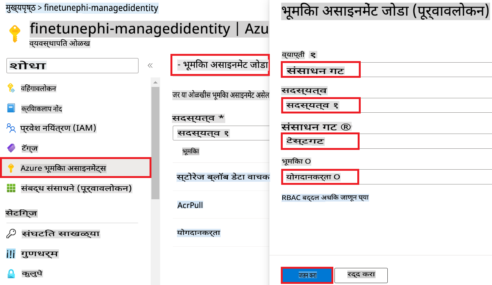

1. **Save** निवडा. 

#### Storage Blob Data Reader भूमिका जोडा

1. पोर्टल पृष्ठाच्या शीर्षस्थानी **शोध पट्टीत** *storage accounts* टाइप करा आणि दिसणाऱ्या पर्यायांमधून **Storage accounts** निवडा.

    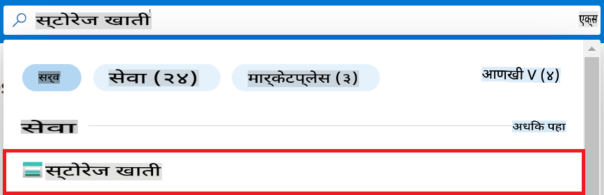

1. Azure Machine Learning workspace शी संबंधित स्टोरेज खाते निवडा. उदाहरणार्थ, *finetunephistorage*.

1. भूमिका नियुक्ती पृष्ठावर जाण्यासाठी खालील चरण करा:

    - तयार केलेल्या Azure Storage खात्याकडे जा.
    - डाव्या बाजूच्या टॅबमधून **Access Control (IAM)** निवडा.
    - नेव्हिगेशन मेनूमधून **+ Add** निवडा.
    - नेव्हिगेशन मेनूमधून **Add role assignment** निवडा.

    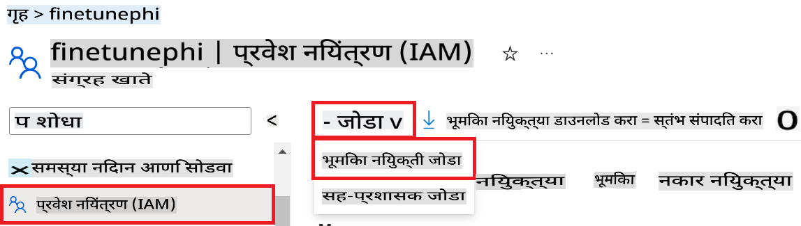

1. Add role assignment पृष्ठावर, खालील गोष्टी करा:

    - Role पृष्ठात, **Storage Blob Data Reader** टाइप करा आणि दिसणाऱ्या पर्यायांमधून **Storage Blob Data Reader** निवडा.
    - Role पृष्ठात, **Next** निवडा.
    - Members पृष्ठात, **Assign access to** **Managed identity** निवडा.
    - Members पृष्ठात, **+ Select members** निवडा.
    - Select managed identities पृष्ठात, तुमचे Azure **Subscription** निवडा.
    - Select managed identities पृष्ठात, **Managed identity** निवडा.
    - Select managed identities पृष्ठात, तुम्ही तयार केलेले Manage Identity निवडा. उदाहरणार्थ, *finetunephi-managedidentity*.
    - Select managed identities पृष्ठात, **Select** निवडा.

    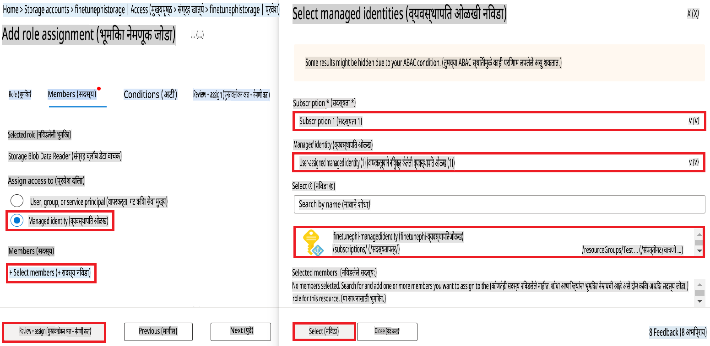

1. **Review + assign** निवडा.

#### AcrPull भूमिका जोडा

1. पोर्टल पृष्ठाच्या शीर्षस्थानी **शोध पट्टीत** *container registries* टाइप करा आणि दिसणाऱ्या पर्यायांमधून **Container registries** निवडा.

    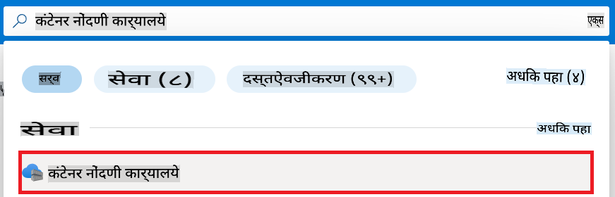

1. Azure Machine Learning workspace शी संबंधित कंटेनर रजिस्ट्री निवडा. उदाहरणार्थ, *finetunephicontainerregistries*.

1. भूमिका नियुक्ती पृष्ठावर जाण्यासाठी खालील चरण करा:

    - डाव्या बाजूच्या टॅबमधून **Access Control (IAM)** निवडा.
    - नेव्हिगेशन मेनूमधून **+ Add** निवडा.
    - नेव्हिगेशन मेनूमधून **Add role assignment** निवडा.

1. Add role assignment पृष्ठावर, खालील गोष्टी करा:

    - Role पृष्ठात, **AcrPull** टाइप करा आणि दिसणाऱ्या पर्यायांमधून **AcrPull** निवडा.
    - Role पृष्ठात, **Next** निवडा.
    - Members पृष्ठात, **Assign access to** **Managed identity** निवडा.
    - Members पृष्ठात, **+ Select members** निवडा.
    - Select managed identities पृष्ठात, तुमचे Azure **Subscription** निवडा.
    - Select managed identities पृष्ठात, **Managed identity** निवडा.
    - Select managed identities पृष्ठात, तुम्ही तयार केलेले Manage Identity निवडा. उदाहरणार्थ, *finetunephi-managedidentity*.
    - Select managed identities पृष्ठात, **Select** निवडा.
    - **Review + assign** निवडा.

### प्रकल्प सेट करा

आता, तुम्ही काम करण्यासाठी फोल्डर तयार कराल आणि Azure Cosmos DB मधील स्टोअर केलेल्या चॅट इतिहासाचा वापर करून वापरकर्त्यांशी संवाद साधण्यासाठी प्रोग्राम तयार करण्यासाठी वर्चुअल वातावरण सेट कराल.

#### काम करण्यासाठी फोल्डर तयार करा

1. टर्मिनल विंडो उघडा आणि *finetune-phi* नावाचे फोल्डर तयार करण्यासाठी खालील कमांड टाइप करा.

    ```console
    mkdir finetune-phi
    ```

1. तयार केलेल्या *finetune-phi* फोल्डरमध्ये जाण्यासाठी खालील कमांड टाइप करा.

    ```console
    cd finetune-phi
    ```

#### वर्चुअल वातावरण तयार करा

1. *.venv* नावाचे वर्चुअल वातावरण तयार करण्यासाठी खालील कमांड टाइप करा.

    ```console
    python -m venv .venv
    ```

1. वर्चुअल वातावरण सक्रिय करण्यासाठी खालील कमांड टाइप करा.

    ```console
    .venv\Scripts\activate.bat
    ```

> [!NOTE]
>
> जर ते यशस्वी झाले, तर तुम्ही कमांड प्रॉम्प्टच्या आधी *(.venv)* पाहू शकता.

#### आवश्यक पॅकेजेस इन्स्टॉल करा

1. आवश्यक पॅकेजेस इन्स्टॉल करण्यासाठी खालील कमांड्स टाइप करा.

    ```console
    pip install datasets==2.19.1
    pip install transformers==4.41.1
    pip install azure-ai-ml==1.16.0
    pip install torch==2.3.1
    pip install trl==0.9.4
    pip install promptflow==1.12.0
    ```

#### प्रकल्प फायली तयार करा

या सरावात, तुम्ही प्रकल्पासाठी आवश्यक फायली तयार कराल. यामध्ये डेटासेट डाउनलोड करण्यासाठी, Azure Machine Learning वातावरण सेट करण्यासाठी, Phi-3 मॉडेल फाइन-ट्यून करण्यासाठी आणि डिप्लॉय करण्यासाठी स्क्रिप्ट्स समाविष्ट असतील. तुम्ही *conda.yml* फाइल तयार कराल ज्यामुळे फाइन-ट्यूनिंगचे वातावरण सेट करता येईल.

या सरावात, तुम्ही:

- *download_dataset.py* फाइल तयार करा.
- *setup_ml.py* फाइल तयार करा.
- *finetuning_dir* फोल्डरमध्ये *fine_tune.py* फाइल तयार करा.
- *conda.yml* फाइल तयार करा.
- *deploy_model.py* फाइल तयार करा.
- *integrate_with_promptflow.py* फाइल तयार करा.
- *flow.dag.yml* फाइल तयार करा.
- Azure माहिती प्रविष्ट करण्यासाठी *config.py* फाइल तयार करा.

> [!NOTE]
>
> पूर्ण फोल्डर संरचना:
>
> ```text
> └── YourUserName
> .    └── finetune-phi
> .        ├── finetuning_dir
> .        │      └── fine_tune.py
> .        ├── conda.yml
> .        ├── config.py
> .        ├── deploy_model.py
> .        ├── download_dataset.py
> .        ├── flow.dag.yml
> .        ├── integrate_with_promptflow.py
> .        └── setup_ml.py
> ```

1. **Visual Studio Code** उघडा.

1. मेनू बारमधून **File** निवडा.

1. **Open Folder** निवडा.

1. *finetune-phi* फोल्डर निवडा, जो *C:\Users\yourUserName\finetune-phi* येथे आहे.

    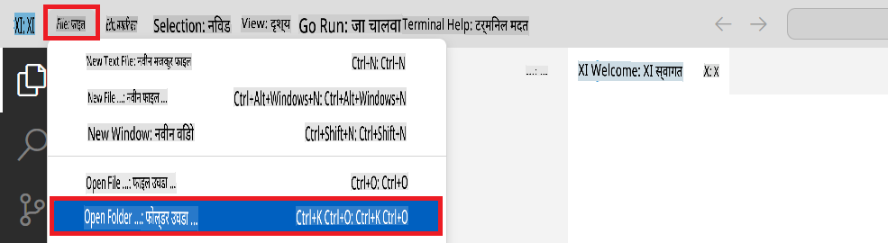

1. Visual Studio Code च्या डाव्या बाजूला, उजवे-क्लिक करा आणि **New File** निवडून *download_dataset.py* नावाची फाइल तयार करा.

1. डाव्या बाजूला, **New File** निवडून *setup_ml.py* नावाची फाइल तयार करा.

1. डाव्या बाजूला, **New File** निवडून *deploy_model.py* नावाची फाइल तयार करा.

    

1. डाव्या बाजूला, **New Folder** निवडून *finetuning_dir* नावाचा फोल्डर तयार करा.

1. *finetuning_dir* फोल्डरमध्ये *fine_tune.py* नावाची फाइल तयार करा.

#### *conda.yml* फाइल तयार आणि कॉन्फिगर करा

1. डाव्या बाजूला, **New File** निवडून *conda.yml* नावाची फाइल तयार करा.

1. Phi-3 मॉडेलसाठी फाइन-ट्यूनिंगचे वातावरण सेट करण्यासाठी खालील कोड *conda.yml* फाइलमध्ये जोडा.

    ```yml
    name: phi-3-training-env
    channels:
      - defaults
      - conda-forge
    dependencies:
      - python=3.10
      - pip
      - numpy<2.0
      - pip:
          - torch==2.4.0
          - torchvision==0.19.0
          - trl==0.8.6
          - transformers==4.41
          - datasets==2.21.0
          - azureml-core==1.57.0
          - azure-storage-blob==12.19.0
          - azure-ai-ml==1.16
          - azure-identity==1.17.1
          - accelerate==0.33.0
          - mlflow==2.15.1
          - azureml-mlflow==1.57.0
    ```

#### *config.py* फाइल तयार आणि कॉन्फिगर करा

1. डाव्या बाजूला, **New File** निवडून *config.py* नावाची फाइल तयार करा.

1. Azure माहिती समाविष्ट करण्यासाठी खालील कोड *config.py* फाइलमध्ये जोडा.

    ```python
    # Azure settings
    AZURE_SUBSCRIPTION_ID = "your_subscription_id"
    AZURE_RESOURCE_GROUP_NAME = "your_resource_group_name" # "TestGroup"

    # Azure Machine Learning settings
    AZURE_ML_WORKSPACE_NAME = "your_workspace_name" # "finetunephi-workspace"

    # Azure Managed Identity settings
    AZURE_MANAGED_IDENTITY_CLIENT_ID = "your_azure_managed_identity_client_id"
    AZURE_MANAGED_IDENTITY_NAME = "your_azure_managed_identity_name" # "finetunephi-mangedidentity"
    AZURE_MANAGED_IDENTITY_RESOURCE_ID = f"/subscriptions/{AZURE_SUBSCRIPTION_ID}/resourceGroups/{AZURE_RESOURCE_GROUP_NAME}/providers/Microsoft.ManagedIdentity/userAssignedIdentities/{AZURE_MANAGED_IDENTITY_NAME}"

    # Dataset file paths
    TRAIN_DATA_PATH = "data/train_data.jsonl"
    TEST_DATA_PATH = "data/test_data.jsonl"

    # Fine-tuned model settings
    AZURE_MODEL_NAME = "your_fine_tuned_model_name" # "finetune-phi-model"
    AZURE_ENDPOINT_NAME = "your_fine_tuned_model_endpoint_name" # "finetune-phi-endpoint"
    AZURE_DEPLOYMENT_NAME = "your_fine_tuned_model_deployment_name" # "finetune-phi-deployment"

    AZURE_ML_API_KEY = "your_fine_tuned_model_api_key"
    AZURE_ML_ENDPOINT = "your_fine_tuned_model_endpoint_uri" # "https://{your-endpoint-name}.{your-region}.inference.ml.azure.com/score"
    ```

#### Azure पर्यावरणीय चल जोडा

1. Azure Subscription ID जोडण्यासाठी खालील चरण करा:

    - पोर्टल पृष्ठाच्या शीर्षस्थानी **शोध पट्टीत** *subscriptions* टाइप करा आणि **Subscriptions** निवडा.
    - सध्या वापरत असलेले Azure Subscription निवडा.
    - तुमचा Subscription ID कॉपी करा आणि *config.py* फाइलमध्ये पेस्ट करा.
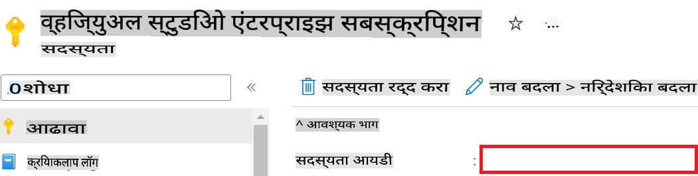

1. Azure Workspace Name जोडण्यासाठी खालील टास्क पूर्ण करा:

    - तुम्ही तयार केलेल्या Azure Machine Learning रिसोर्सवर जा.
    - तुमचे अकाउंट नाव कॉपी करा आणि *config.py* फाइलमध्ये पेस्ट करा.

    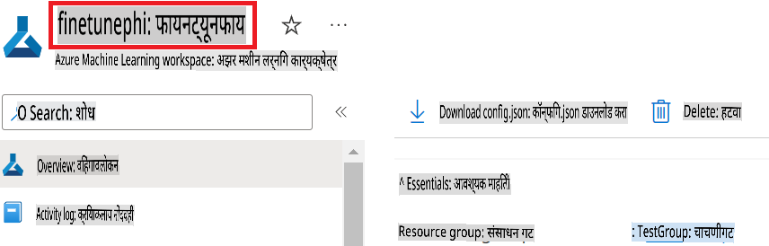

1. Azure Resource Group Name जोडण्यासाठी खालील टास्क पूर्ण करा:

    - तुम्ही तयार केलेल्या Azure Machine Learning रिसोर्सवर जा.
    - तुमचे Azure Resource Group Name कॉपी करा आणि *config.py* फाइलमध्ये पेस्ट करा.

    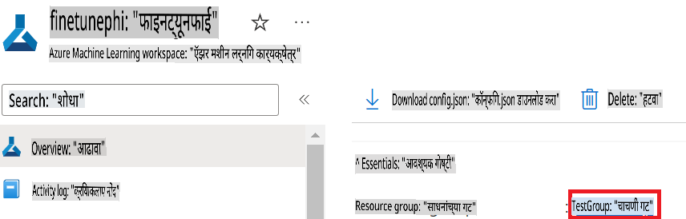

2. Azure Managed Identity नाव जोडण्यासाठी खालील टास्क पूर्ण करा:

    - तुम्ही तयार केलेल्या Managed Identities रिसोर्सवर जा.
    - तुमचे Azure Managed Identity नाव कॉपी करा आणि *config.py* फाइलमध्ये पेस्ट करा.

    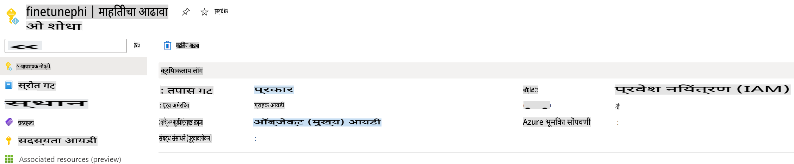

### फाइन-ट्यूनिंगसाठी डेटासेट तयार करा

या एक्सरसाइजमध्ये, तुम्ही *download_dataset.py* फाइल चालवून *ULTRACHAT_200k* डेटासेट्स तुमच्या स्थानिक वातावरणात डाउनलोड कराल. त्यानंतर तुम्ही हे डेटासेट्स वापरून Azure Machine Learning मध्ये Phi-3 मॉडेल फाइन-ट्यून कराल.

#### *download_dataset.py* वापरून तुमचे डेटासेट डाउनलोड करा

1. Visual Studio Code मध्ये *download_dataset.py* फाइल उघडा.

1. खालील कोड *download_dataset.py* मध्ये जोडा.

    ```python
    import json
    import os
    from datasets import load_dataset
    from config import (
        TRAIN_DATA_PATH,
        TEST_DATA_PATH)

    def load_and_split_dataset(dataset_name, config_name, split_ratio):
        """
        Load and split a dataset.
        """
        # Load the dataset with the specified name, configuration, and split ratio
        dataset = load_dataset(dataset_name, config_name, split=split_ratio)
        print(f"Original dataset size: {len(dataset)}")
        
        # Split the dataset into train and test sets (80% train, 20% test)
        split_dataset = dataset.train_test_split(test_size=0.2)
        print(f"Train dataset size: {len(split_dataset['train'])}")
        print(f"Test dataset size: {len(split_dataset['test'])}")
        
        return split_dataset

    def save_dataset_to_jsonl(dataset, filepath):
        """
        Save a dataset to a JSONL file.
        """
        # Create the directory if it does not exist
        os.makedirs(os.path.dirname(filepath), exist_ok=True)
        
        # Open the file in write mode
        with open(filepath, 'w', encoding='utf-8') as f:
            # Iterate over each record in the dataset
            for record in dataset:
                # Dump the record as a JSON object and write it to the file
                json.dump(record, f)
                # Write a newline character to separate records
                f.write('\n')
        
        print(f"Dataset saved to {filepath}")

    def main():
        """
        Main function to load, split, and save the dataset.
        """
        # Load and split the ULTRACHAT_200k dataset with a specific configuration and split ratio
        dataset = load_and_split_dataset("HuggingFaceH4/ultrachat_200k", 'default', 'train_sft[:1%]')
        
        # Extract the train and test datasets from the split
        train_dataset = dataset['train']
        test_dataset = dataset['test']

        # Save the train dataset to a JSONL file
        save_dataset_to_jsonl(train_dataset, TRAIN_DATA_PATH)
        
        # Save the test dataset to a separate JSONL file
        save_dataset_to_jsonl(test_dataset, TEST_DATA_PATH)

    if __name__ == "__main__":
        main()

    ```

> [!TIP]
>
> **सीपीयू वापरून मिनिमल डेटासेटसह फाइन-ट्यूनिंगसाठी मार्गदर्शन**
>
> जर तुम्हाला फाइन-ट्यूनिंगसाठी सीपीयू वापरायचा असेल, तर ही पद्धत Visual Studio Enterprise Subscription सारख्या सबस्क्रिप्शनसाठी किंवा फाइन-ट्यूनिंग आणि डिप्लॉयमेंट प्रक्रिया लवकर तपासण्यासाठी आदर्श आहे.
>
> `dataset = load_and_split_dataset("HuggingFaceH4/ultrachat_200k", 'default', 'train_sft[:1%]')` with `dataset = load_and_split_dataset("HuggingFaceH4/ultrachat_200k", 'default', 'train_sft[:10]')` बदल करा.
>

1. खालील कमांड तुमच्या टर्मिनलमध्ये टाइप करा आणि स्क्रिप्ट चालवून डेटासेट तुमच्या स्थानिक वातावरणात डाउनलोड करा.

    ```console
    python download_data.py
    ```

1. डेटासेट्स यशस्वीरित्या तुमच्या स्थानिक *finetune-phi/data* डिरेक्टरीमध्ये सेव्ह झाले आहेत का ते तपासा.

> [!NOTE]
>
> **डेटासेटचा आकार आणि फाइन-ट्यूनिंगचा वेळ**
>
> या E2E सॅम्पलमध्ये, तुम्ही केवळ 1% डेटासेट (`train_sft[:1%]`) वापरत आहात. यामुळे डेटा लक्षणीयरीत्या कमी होतो, अपलोड आणि फाइन-ट्यूनिंग प्रक्रिया जलद होते. तुम्ही ट्रेनिंग वेळ आणि मॉडेल परफॉर्मन्स यामध्ये योग्य संतुलन साधण्यासाठी टक्केवारी समायोजित करू शकता. डेटासेटचा छोटा भाग वापरल्याने फाइन-ट्यूनिंगसाठी लागणारा वेळ कमी होतो, ज्यामुळे प्रक्रिया अधिक व्यवस्थापनीय बनते.

## परिस्थिती 2: Phi-3 मॉडेल फाइन-ट्यून करा आणि Azure Machine Learning Studio मध्ये डिप्लॉय करा

### Azure CLI सेट अप करा

तुमच्या वातावरणाचे प्रमाणीकरण करण्यासाठी Azure CLI सेट अप करणे आवश्यक आहे. Azure CLI तुम्हाला कमांड लाइनवरून थेट Azure रिसोर्सेस व्यवस्थापित करण्याची परवानगी देते आणि Azure Machine Learning ला या रिसोर्सेसमध्ये प्रवेश करण्यासाठी आवश्यक असलेले क्रेडेन्शियल्स प्रदान करते. सुरुवात करण्यासाठी [Azure CLI](https://learn.microsoft.com/cli/azure/install-azure-cli) इंस्टॉल करा.

1. टर्मिनल विंडो उघडा आणि तुमच्या Azure खात्यात लॉग इन करण्यासाठी खालील कमांड टाइप करा.

    ```console
    az login
    ```

1. वापरण्यासाठी तुमचे Azure खाते निवडा.

1. वापरण्यासाठी तुमची Azure सबस्क्रिप्शन निवडा.

    

> [!TIP]
>
> Azure मध्ये साइन इन करण्यात अडचण येत असल्यास, डिव्हाइस कोड वापरून प्रयत्न करा. टर्मिनल विंडो उघडा आणि तुमच्या Azure खात्यात साइन इन करण्यासाठी खालील कमांड टाइप करा:
>
> ```console
> az login --use-device-code
> ```
>

### Phi-3 मॉडेल फाइन-ट्यून करा

या एक्सरसाइजमध्ये, तुम्ही दिलेल्या डेटासेट वापरून Phi-3 मॉडेल फाइन-ट्यून कराल. सर्वप्रथम, तुम्ही *fine_tune.py* फाइलमध्ये फाइन-ट्यूनिंग प्रक्रिया परिभाषित कराल. त्यानंतर, Azure Machine Learning वातावरण कॉन्फिगर करून *setup_ml.py* फाइल चालवून फाइन-ट्यूनिंग प्रक्रिया सुरू कराल. ही स्क्रिप्ट Azure Machine Learning वातावरणात फाइन-ट्यूनिंग सुनिश्चित करते.

#### *fine_tune.py* फाइलमध्ये कोड जोडा

1. *finetuning_dir* फोल्डरमध्ये जा आणि Visual Studio Code मध्ये *fine_tune.py* फाइल उघडा.

1. खालील कोड *fine_tune.py* मध्ये जोडा.

    ```python
    import argparse
    import sys
    import logging
    import os
    from datasets import load_dataset
    import torch
    import mlflow
    from transformers import AutoModelForCausalLM, AutoTokenizer, TrainingArguments
    from trl import SFTTrainer

    # To avoid the INVALID_PARAMETER_VALUE error in MLflow, disable MLflow integration
    os.environ["DISABLE_MLFLOW_INTEGRATION"] = "True"

    # Logging setup
    logging.basicConfig(
        format="%(asctime)s - %(levelname)s - %(name)s - %(message)s",
        datefmt="%Y-%m-%d %H:%M:%S",
        handlers=[logging.StreamHandler(sys.stdout)],
        level=logging.WARNING
    )
    logger = logging.getLogger(__name__)

    def initialize_model_and_tokenizer(model_name, model_kwargs):
        """
        Initialize the model and tokenizer with the given pretrained model name and arguments.
        """
        model = AutoModelForCausalLM.from_pretrained(model_name, **model_kwargs)
        tokenizer = AutoTokenizer.from_pretrained(model_name)
        tokenizer.model_max_length = 2048
        tokenizer.pad_token = tokenizer.unk_token
        tokenizer.pad_token_id = tokenizer.convert_tokens_to_ids(tokenizer.pad_token)
        tokenizer.padding_side = 'right'
        return model, tokenizer

    def apply_chat_template(example, tokenizer):
        """
        Apply a chat template to tokenize messages in the example.
        """
        messages = example["messages"]
        if messages[0]["role"] != "system":
            messages.insert(0, {"role": "system", "content": ""})
        example["text"] = tokenizer.apply_chat_template(
            messages, tokenize=False, add_generation_prompt=False
        )
        return example

    def load_and_preprocess_data(train_filepath, test_filepath, tokenizer):
        """
        Load and preprocess the dataset.
        """
        train_dataset = load_dataset('json', data_files=train_filepath, split='train')
        test_dataset = load_dataset('json', data_files=test_filepath, split='train')
        column_names = list(train_dataset.features)

        train_dataset = train_dataset.map(
            apply_chat_template,
            fn_kwargs={"tokenizer": tokenizer},
            num_proc=10,
            remove_columns=column_names,
            desc="Applying chat template to train dataset",
        )

        test_dataset = test_dataset.map(
            apply_chat_template,
            fn_kwargs={"tokenizer": tokenizer},
            num_proc=10,
            remove_columns=column_names,
            desc="Applying chat template to test dataset",
        )

        return train_dataset, test_dataset

    def train_and_evaluate_model(train_dataset, test_dataset, model, tokenizer, output_dir):
        """
        Train and evaluate the model.
        """
        training_args = TrainingArguments(
            bf16=True,
            do_eval=True,
            output_dir=output_dir,
            eval_strategy="epoch",
            learning_rate=5.0e-06,
            logging_steps=20,
            lr_scheduler_type="cosine",
            num_train_epochs=3,
            overwrite_output_dir=True,
            per_device_eval_batch_size=4,
            per_device_train_batch_size=4,
            remove_unused_columns=True,
            save_steps=500,
            seed=0,
            gradient_checkpointing=True,
            gradient_accumulation_steps=1,
            warmup_ratio=0.2,
        )

        trainer = SFTTrainer(
            model=model,
            args=training_args,
            train_dataset=train_dataset,
            eval_dataset=test_dataset,
            max_seq_length=2048,
            dataset_text_field="text",
            tokenizer=tokenizer,
            packing=True
        )

        train_result = trainer.train()
        trainer.log_metrics("train", train_result.metrics)

        mlflow.transformers.log_model(
            transformers_model={"model": trainer.model, "tokenizer": tokenizer},
            artifact_path=output_dir,
        )

        tokenizer.padding_side = 'left'
        eval_metrics = trainer.evaluate()
        eval_metrics["eval_samples"] = len(test_dataset)
        trainer.log_metrics("eval", eval_metrics)

    def main(train_file, eval_file, model_output_dir):
        """
        Main function to fine-tune the model.
        """
        model_kwargs = {
            "use_cache": False,
            "trust_remote_code": True,
            "torch_dtype": torch.bfloat16,
            "device_map": None,
            "attn_implementation": "eager"
        }

        # pretrained_model_name = "microsoft/Phi-3-mini-4k-instruct"
        pretrained_model_name = "microsoft/Phi-3.5-mini-instruct"

        with mlflow.start_run():
            model, tokenizer = initialize_model_and_tokenizer(pretrained_model_name, model_kwargs)
            train_dataset, test_dataset = load_and_preprocess_data(train_file, eval_file, tokenizer)
            train_and_evaluate_model(train_dataset, test_dataset, model, tokenizer, model_output_dir)

    if __name__ == "__main__":
        parser = argparse.ArgumentParser()
        parser.add_argument("--train-file", type=str, required=True, help="Path to the training data")
        parser.add_argument("--eval-file", type=str, required=True, help="Path to the evaluation data")
        parser.add_argument("--model_output_dir", type=str, required=True, help="Directory to save the fine-tuned model")
        args = parser.parse_args()
        main(args.train_file, args.eval_file, args.model_output_dir)

    ```

1. *fine_tune.py* फाइल सेव्ह करा आणि बंद करा.

> [!TIP]
> **Phi-3.5 मॉडेल फाइन-ट्यून करू शकता**
>
> *fine_tune.py* फाइलमध्ये, `pretrained_model_name` from `"microsoft/Phi-3-mini-4k-instruct"` to any model you want to fine-tune. For example, if you change it to `"microsoft/Phi-3.5-mini-instruct"`, you'll be using the Phi-3.5-mini-instruct model for fine-tuning. To find and use the model name you prefer, visit [Hugging Face](https://huggingface.co/), search for the model you're interested in, and then copy and paste its name into the `pretrained_model_name` फील्ड बदलू शकता.
>
> :::image type="content" source="../../imgs/03/FineTuning-PromptFlow/finetunephi3.5.png" alt-text="Phi-3.5 फाइन-ट्यून करा.":::
>

#### *setup_ml.py* फाइलमध्ये कोड जोडा

1. Visual Studio Code मध्ये *setup_ml.py* फाइल उघडा.

1. खालील कोड *setup_ml.py* मध्ये जोडा.

    ```python
    import logging
    from azure.ai.ml import MLClient, command, Input
    from azure.ai.ml.entities import Environment, AmlCompute
    from azure.identity import AzureCliCredential
    from config import (
        AZURE_SUBSCRIPTION_ID,
        AZURE_RESOURCE_GROUP_NAME,
        AZURE_ML_WORKSPACE_NAME,
        TRAIN_DATA_PATH,
        TEST_DATA_PATH
    )

    # Constants

    # Uncomment the following lines to use a CPU instance for training
    # COMPUTE_INSTANCE_TYPE = "Standard_E16s_v3" # cpu
    # COMPUTE_NAME = "cpu-e16s-v3"
    # DOCKER_IMAGE_NAME = "mcr.microsoft.com/azureml/openmpi4.1.0-ubuntu20.04:latest"

    # Uncomment the following lines to use a GPU instance for training
    COMPUTE_INSTANCE_TYPE = "Standard_NC24ads_A100_v4"
    COMPUTE_NAME = "gpu-nc24s-a100-v4"
    DOCKER_IMAGE_NAME = "mcr.microsoft.com/azureml/curated/acft-hf-nlp-gpu:59"

    CONDA_FILE = "conda.yml"
    LOCATION = "eastus2" # Replace with the location of your compute cluster
    FINETUNING_DIR = "./finetuning_dir" # Path to the fine-tuning script
    TRAINING_ENV_NAME = "phi-3-training-environment" # Name of the training environment
    MODEL_OUTPUT_DIR = "./model_output" # Path to the model output directory in azure ml

    # Logging setup to track the process
    logger = logging.getLogger(__name__)
    logging.basicConfig(
        format="%(asctime)s - %(levelname)s - %(name)s - %(message)s",
        datefmt="%Y-%m-%d %H:%M:%S",
        level=logging.WARNING
    )

    def get_ml_client():
        """
        Initialize the ML Client using Azure CLI credentials.
        """
        credential = AzureCliCredential()
        return MLClient(credential, AZURE_SUBSCRIPTION_ID, AZURE_RESOURCE_GROUP_NAME, AZURE_ML_WORKSPACE_NAME)

    def create_or_get_environment(ml_client):
        """
        Create or update the training environment in Azure ML.
        """
        env = Environment(
            image=DOCKER_IMAGE_NAME,  # Docker image for the environment
            conda_file=CONDA_FILE,  # Conda environment file
            name=TRAINING_ENV_NAME,  # Name of the environment
        )
        return ml_client.environments.create_or_update(env)

    def create_or_get_compute_cluster(ml_client, compute_name, COMPUTE_INSTANCE_TYPE, location):
        """
        Create or update the compute cluster in Azure ML.
        """
        try:
            compute_cluster = ml_client.compute.get(compute_name)
            logger.info(f"Compute cluster '{compute_name}' already exists. Reusing it for the current run.")
        except Exception:
            logger.info(f"Compute cluster '{compute_name}' does not exist. Creating a new one with size {COMPUTE_INSTANCE_TYPE}.")
            compute_cluster = AmlCompute(
                name=compute_name,
                size=COMPUTE_INSTANCE_TYPE,
                location=location,
                tier="Dedicated",  # Tier of the compute cluster
                min_instances=0,  # Minimum number of instances
                max_instances=1  # Maximum number of instances
            )
            ml_client.compute.begin_create_or_update(compute_cluster).wait()  # Wait for the cluster to be created
        return compute_cluster

    def create_fine_tuning_job(env, compute_name):
        """
        Set up the fine-tuning job in Azure ML.
        """
        return command(
            code=FINETUNING_DIR,  # Path to fine_tune.py
            command=(
                "python fine_tune.py "
                "--train-file ${{inputs.train_file}} "
                "--eval-file ${{inputs.eval_file}} "
                "--model_output_dir ${{inputs.model_output}}"
            ),
            environment=env,  # Training environment
            compute=compute_name,  # Compute cluster to use
            inputs={
                "train_file": Input(type="uri_file", path=TRAIN_DATA_PATH),  # Path to the training data file
                "eval_file": Input(type="uri_file", path=TEST_DATA_PATH),  # Path to the evaluation data file
                "model_output": MODEL_OUTPUT_DIR
            }
        )

    def main():
        """
        Main function to set up and run the fine-tuning job in Azure ML.
        """
        # Initialize ML Client
        ml_client = get_ml_client()

        # Create Environment
        env = create_or_get_environment(ml_client)
        
        # Create or get existing compute cluster
        create_or_get_compute_cluster(ml_client, COMPUTE_NAME, COMPUTE_INSTANCE_TYPE, LOCATION)

        # Create and Submit Fine-Tuning Job
        job = create_fine_tuning_job(env, COMPUTE_NAME)
        returned_job = ml_client.jobs.create_or_update(job)  # Submit the job
        ml_client.jobs.stream(returned_job.name)  # Stream the job logs
        
        # Capture the job name
        job_name = returned_job.name
        print(f"Job name: {job_name}")

    if __name__ == "__main__":
        main()

    ```

1. `COMPUTE_INSTANCE_TYPE`, `COMPUTE_NAME`, and `LOCATION` तुमच्या तपशीलांसह बदला.

    ```python
   # Uncomment the following lines to use a GPU instance for training
    COMPUTE_INSTANCE_TYPE = "Standard_NC24ads_A100_v4"
    COMPUTE_NAME = "gpu-nc24s-a100-v4"
    ...
    LOCATION = "eastus2" # Replace with the location of your compute cluster
    ```

> [!TIP]
>
> **सीपीयू वापरून मिनिमल डेटासेटसह फाइन-ट्यूनिंगसाठी मार्गदर्शन**
>
> जर तुम्हाला फाइन-ट्यूनिंगसाठी सीपीयू वापरायचा असेल, तर ही पद्धत Visual Studio Enterprise Subscription सारख्या सबस्क्रिप्शनसाठी किंवा फाइन-ट्यूनिंग आणि डिप्लॉयमेंट प्रक्रिया लवकर तपासण्यासाठी आदर्श आहे.
>
> 1. *setup_ml* फाइल उघडा.
> 1. `COMPUTE_INSTANCE_TYPE`, `COMPUTE_NAME`, and `DOCKER_IMAGE_NAME` with the following. If you do not have access to *Standard_E16s_v3*, you can use an equivalent CPU instance or request a new quota.
> 1. Replace `LOCATION` तुमच्या तपशीलांसह बदला.
>
>    ```python
>    # Uncomment the following lines to use a CPU instance for training
>    COMPUTE_INSTANCE_TYPE = "Standard_E16s_v3" # cpu
>    COMPUTE_NAME = "cpu-e16s-v3"
>    DOCKER_IMAGE_NAME = "mcr.microsoft.com/azureml/openmpi4.1.0-ubuntu20.04:latest"
>    LOCATION = "eastus2" # Replace with the location of your compute cluster
>    ```
>

1. *setup_ml.py* स्क्रिप्ट चालवण्यासाठी खालील कमांड टाइप करा आणि Azure Machine Learning मध्ये फाइन-ट्यूनिंग प्रक्रिया सुरू करा.

    ```python
    python setup_ml.py
    ```

1. या एक्सरसाइजमध्ये, तुम्ही Azure Machine Learning वापरून Phi-3 मॉडेल यशस्वीरित्या फाइन-ट्यून केले. *setup_ml.py* स्क्रिप्ट चालवून, तुम्ही Azure Machine Learning वातावरण सेट अप केले आणि *fine_tune.py* फाइलमध्ये परिभाषित फाइन-ट्यूनिंग प्रक्रिया सुरू केली. कृपया लक्षात घ्या की फाइन-ट्यूनिंग प्रक्रिया पूर्ण होण्यासाठी बराच वेळ लागू शकतो. `python setup_ml.py` command, you need to wait for the process to complete. You can monitor the status of the fine-tuning job by following the link provided in the terminal to the Azure Machine Learning portal.

    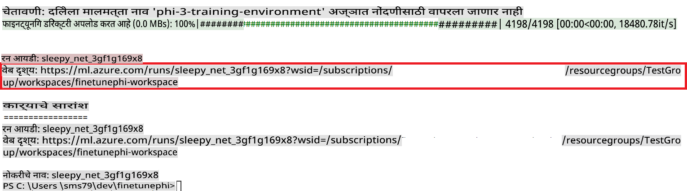

### Deploy the fine-tuned model

To integrate the fine-tuned Phi-3 model with Prompt Flow, you need to deploy the model to make it accessible for real-time inference. This process involves registering the model, creating an online endpoint, and deploying the model.

#### Set the model name, endpoint name, and deployment name for deployment

1. Open *config.py* file.

1. Replace `AZURE_MODEL_NAME = "your_fine_tuned_model_name"` with the desired name for your model.

1. Replace `AZURE_ENDPOINT_NAME = "your_fine_tuned_model_endpoint_name"` with the desired name for your endpoint.

1. Replace `AZURE_DEPLOYMENT_NAME = "your_fine_tuned_model_deployment_name"` चालवून तुमच्या डिप्लॉयमेंटसाठी इच्छित नाव वापरा.

#### *deploy_model.py* फाइलमध्ये कोड जोडा

*deploy_model.py* फाइल चालवणे संपूर्ण डिप्लॉयमेंट प्रक्रिया स्वयंचलित करते. हे मॉडेल रजिस्टर करते, एक एंडपॉइंट तयार करते आणि *config.py* फाइलमध्ये निर्दिष्ट केलेल्या सेटिंग्जच्या आधारावर डिप्लॉयमेंट प्रक्रिया चालवते, ज्यामध्ये मॉडेल नाव, एंडपॉइंट नाव, आणि डिप्लॉयमेंट नाव समाविष्ट आहे.

1. Visual Studio Code मध्ये *deploy_model.py* फाइल उघडा.

1. खालील कोड *deploy_model.py* मध्ये जोडा.

    ```python
    import logging
    from azure.identity import AzureCliCredential
    from azure.ai.ml import MLClient
    from azure.ai.ml.entities import Model, ProbeSettings, ManagedOnlineEndpoint, ManagedOnlineDeployment, IdentityConfiguration, ManagedIdentityConfiguration, OnlineRequestSettings
    from azure.ai.ml.constants import AssetTypes

    # Configuration imports
    from config import (
        AZURE_SUBSCRIPTION_ID,
        AZURE_RESOURCE_GROUP_NAME,
        AZURE_ML_WORKSPACE_NAME,
        AZURE_MANAGED_IDENTITY_RESOURCE_ID,
        AZURE_MANAGED_IDENTITY_CLIENT_ID,
        AZURE_MODEL_NAME,
        AZURE_ENDPOINT_NAME,
        AZURE_DEPLOYMENT_NAME
    )

    # Constants
    JOB_NAME = "your-job-name"
    COMPUTE_INSTANCE_TYPE = "Standard_E4s_v3"

    deployment_env_vars = {
        "SUBSCRIPTION_ID": AZURE_SUBSCRIPTION_ID,
        "RESOURCE_GROUP_NAME": AZURE_RESOURCE_GROUP_NAME,
        "UAI_CLIENT_ID": AZURE_MANAGED_IDENTITY_CLIENT_ID,
    }

    # Logging setup
    logging.basicConfig(
        format="%(asctime)s - %(levelname)s - %(name)s - %(message)s",
        datefmt="%Y-%m-%d %H:%M:%S",
        level=logging.DEBUG
    )
    logger = logging.getLogger(__name__)

    def get_ml_client():
        """Initialize and return the ML Client."""
        credential = AzureCliCredential()
        return MLClient(credential, AZURE_SUBSCRIPTION_ID, AZURE_RESOURCE_GROUP_NAME, AZURE_ML_WORKSPACE_NAME)

    def register_model(ml_client, model_name, job_name):
        """Register a new model."""
        model_path = f"azureml://jobs/{job_name}/outputs/artifacts/paths/model_output"
        logger.info(f"Registering model {model_name} from job {job_name} at path {model_path}.")
        run_model = Model(
            path=model_path,
            name=model_name,
            description="Model created from run.",
            type=AssetTypes.MLFLOW_MODEL,
        )
        model = ml_client.models.create_or_update(run_model)
        logger.info(f"Registered model ID: {model.id}")
        return model

    def delete_existing_endpoint(ml_client, endpoint_name):
        """Delete existing endpoint if it exists."""
        try:
            endpoint_result = ml_client.online_endpoints.get(name=endpoint_name)
            logger.info(f"Deleting existing endpoint {endpoint_name}.")
            ml_client.online_endpoints.begin_delete(name=endpoint_name).result()
            logger.info(f"Deleted existing endpoint {endpoint_name}.")
        except Exception as e:
            logger.info(f"No existing endpoint {endpoint_name} found to delete: {e}")

    def create_or_update_endpoint(ml_client, endpoint_name, description=""):
        """Create or update an endpoint."""
        delete_existing_endpoint(ml_client, endpoint_name)
        logger.info(f"Creating new endpoint {endpoint_name}.")
        endpoint = ManagedOnlineEndpoint(
            name=endpoint_name,
            description=description,
            identity=IdentityConfiguration(
                type="user_assigned",
                user_assigned_identities=[ManagedIdentityConfiguration(resource_id=AZURE_MANAGED_IDENTITY_RESOURCE_ID)]
            )
        )
        endpoint_result = ml_client.online_endpoints.begin_create_or_update(endpoint).result()
        logger.info(f"Created new endpoint {endpoint_name}.")
        return endpoint_result

    def create_or_update_deployment(ml_client, endpoint_name, deployment_name, model):
        """Create or update a deployment."""

        logger.info(f"Creating deployment {deployment_name} for endpoint {endpoint_name}.")
        deployment = ManagedOnlineDeployment(
            name=deployment_name,
            endpoint_name=endpoint_name,
            model=model.id,
            instance_type=COMPUTE_INSTANCE_TYPE,
            instance_count=1,
            environment_variables=deployment_env_vars,
            request_settings=OnlineRequestSettings(
                max_concurrent_requests_per_instance=3,
                request_timeout_ms=180000,
                max_queue_wait_ms=120000
            ),
            liveness_probe=ProbeSettings(
                failure_threshold=30,
                success_threshold=1,
                period=100,
                initial_delay=500,
            ),
            readiness_probe=ProbeSettings(
                failure_threshold=30,
                success_threshold=1,
                period=100,
                initial_delay=500,
            ),
        )
        deployment_result = ml_client.online_deployments.begin_create_or_update(deployment).result()
        logger.info(f"Created deployment {deployment.name} for endpoint {endpoint_name}.")
        return deployment_result

    def set_traffic_to_deployment(ml_client, endpoint_name, deployment_name):
        """Set traffic to the specified deployment."""
        try:
            # Fetch the current endpoint details
            endpoint = ml_client.online_endpoints.get(name=endpoint_name)
            
            # Log the current traffic allocation for debugging
            logger.info(f"Current traffic allocation: {endpoint.traffic}")
            
            # Set the traffic allocation for the deployment
            endpoint.traffic = {deployment_name: 100}
            
            # Update the endpoint with the new traffic allocation
            endpoint_poller = ml_client.online_endpoints.begin_create_or_update(endpoint)
            updated_endpoint = endpoint_poller.result()
            
            # Log the updated traffic allocation for debugging
            logger.info(f"Updated traffic allocation: {updated_endpoint.traffic}")
            logger.info(f"Set traffic to deployment {deployment_name} at endpoint {endpoint_name}.")
            return updated_endpoint
        except Exception as e:
            # Log any errors that occur during the process
            logger.error(f"Failed to set traffic to deployment: {e}")
            raise


    def main():
        ml_client = get_ml_client()

        registered_model = register_model(ml_client, AZURE_MODEL_NAME, JOB_NAME)
        logger.info(f"Registered model ID: {registered_model.id}")

        endpoint = create_or_update_endpoint(ml_client, AZURE_ENDPOINT_NAME, "Endpoint for finetuned Phi-3 model")
        logger.info(f"Endpoint {AZURE_ENDPOINT_NAME} is ready.")

        try:
            deployment = create_or_update_deployment(ml_client, AZURE_ENDPOINT_NAME, AZURE_DEPLOYMENT_NAME, registered_model)
            logger.info(f"Deployment {AZURE_DEPLOYMENT_NAME} is created for endpoint {AZURE_ENDPOINT_NAME}.")

            set_traffic_to_deployment(ml_client, AZURE_ENDPOINT_NAME, AZURE_DEPLOYMENT_NAME)
            logger.info(f"Traffic is set to deployment {AZURE_DEPLOYMENT_NAME} at endpoint {AZURE_ENDPOINT_NAME}.")
        except Exception as e:
            logger.error(f"Failed to create or update deployment: {e}")

    if __name__ == "__main__":
        main()

    ```

1. `JOB_NAME`:

    - Navigate to Azure Machine Learning resource that you created.
    - Select **Studio web URL** to open the Azure Machine Learning workspace.
    - Select **Jobs** from the left side tab.
    - Select the experiment for fine-tuning. For example, *finetunephi*.
    - Select the job that you created.
    - Copy and paste your job Name into the `JOB_NAME = "your-job-name"` in *deploy_model.py* file.

1. Replace `COMPUTE_INSTANCE_TYPE` तुमच्या तपशीलांसह बदला.

1. *deploy_model.py* स्क्रिप्ट चालवण्यासाठी खालील कमांड टाइप करा आणि Azure Machine Learning मध्ये डिप्लॉयमेंट प्रक्रिया सुरू करा.

    ```python
    python deploy_model.py
    ```

> [!WARNING]
> तुमच्या खात्यावर अतिरिक्त शुल्क येऊ नये यासाठी, Azure Machine Learning वर्कस्पेसमध्ये तयार केलेला एंडपॉइंट हटवणे सुनिश्चित करा.
>

#### Azure Machine Learning वर्कस्पेसमध्ये डिप्लॉयमेंट स्थिती तपासा

1. [Azure ML Studio](https://ml.azure.com/home?wt.mc_id=studentamb_279723) ला भेट द्या.

1. तुम्ही तयार केलेल्या Azure Machine Learning वर्कस्पेसवर जा.

1. **Studio web URL** निवडा आणि Azure Machine Learning वर्कस्पेस उघडा.

1. डाव्या बाजूच्या टॅबमधून **Endpoints** निवडा.

    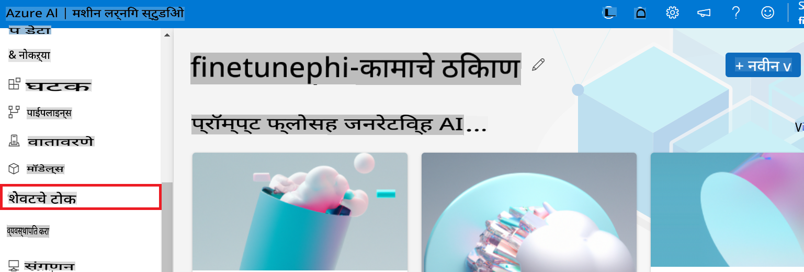

2. तुम्ही तयार केलेला एंडपॉइंट निवडा.

    

3. या पृष्ठावर, डिप्लॉयमेंट प्रक्रियेदरम्यान तयार केलेले एंडपॉइंट्स व्यवस्थापित करू शकता.

## परिस्थिती 3: Prompt flow सह एकत्रित करा आणि तुमच्या कस्टम मॉडेलसह संवाद साधा

### कस्टम Phi-3 मॉडेल Prompt flow सह एकत्रित करा

तुमचे फाइन-ट्यून केलेले मॉडेल यशस्वीरित्या डिप्लॉय केल्यानंतर, तुम्ही आता ते Prompt flow सह एकत्रित करू शकता. यामुळे तुमचे मॉडेल रिअल-टाइम ऍप्लिकेशन्समध्ये वापरण्यासाठी उपलब्ध होईल, जे कस्टम Phi-3 मॉडेलसह विविध इंटरॅक्टिव्ह टास्क सक्षम करेल.

#### फाइन-ट्यून केलेल्या Phi-3 मॉडेलचे API की आणि एंडपॉइंट URI सेट करा

1. तुम्ही तयार केलेल्या Azure Machine Learning वर्कस्पेसवर जा.
1. डाव्या बाजूच्या टॅबमधून **Endpoints** निवडा.
1. तुम्ही तयार केलेला एंडपॉइंट निवडा.
1. नेव्हिगेशन मेनूमधून **Consume** निवडा.
1. तुमचा **REST endpoint** कॉपी करा आणि *config.py* फाइलमध्ये पेस्ट करा, `AZURE_ML_ENDPOINT = "your_fine_tuned_model_endpoint_uri"` with your **REST endpoint**.
1. Copy and paste your **Primary key** into the *config.py* file, replacing `AZURE_ML_API_KEY = "your_fine_tuned_model_api_key"` बदलून तुमच्या **Primary key** सह.

    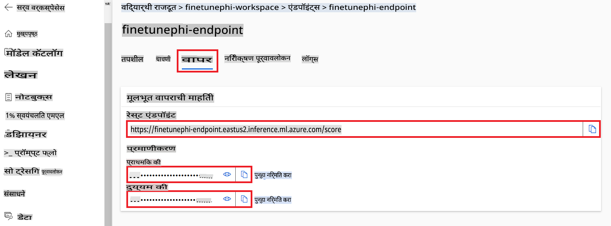

#### *flow.dag.yml* फाइलमध्ये कोड जोडा

1. Visual Studio Code मध्ये *flow.dag.yml* फाइल उघडा.

1. खालील कोड *flow.dag.yml* मध्ये जोडा.

    ```yml
    inputs:
      input_data:
        type: string
        default: "Who founded Microsoft?"

    outputs:
      answer:
        type: string
        reference: ${integrate_with_promptflow.output}

    nodes:
    - name: integrate_with_promptflow
      type: python
      source:
        type: code
        path: integrate_with_promptflow.py
      inputs:
        input_data: ${inputs.input_data}
    ```

#### *integrate_with_promptflow.py* फाइलमध्ये कोड जोडा

1. Visual Studio Code मध्ये *integrate_with_promptflow.py* फाइल उघडा.

1. खालील कोड *integrate_with_promptflow.py* मध्ये जोडा.

    ```python
    import logging
    import requests
    from promptflow.core import tool
    import asyncio
    import platform
    from config import (
        AZURE_ML_ENDPOINT,
        AZURE_ML_API_KEY
    )

    # Logging setup
    logging.basicConfig(
        format="%(asctime)s - %(levelname)s - %(name)s - %(message)s",
        datefmt="%Y-%m-%d %H:%M:%S",
        level=logging.DEBUG
    )
    logger = logging.getLogger(__name__)

    def query_azml_endpoint(input_data: list, endpoint_url: str, api_key: str) -> str:
        """
        Send a request to the Azure ML endpoint with the given input data.
        """
        headers = {
            "Content-Type": "application/json",
            "Authorization": f"Bearer {api_key}"
        }
        data = {
            "input_data": [input_data],
            "params": {
                "temperature": 0.7,
                "max_new_tokens": 128,
                "do_sample": True,
                "return_full_text": True
            }
        }
        try:
            response = requests.post(endpoint_url, json=data, headers=headers)
            response.raise_for_status()
            result = response.json()[0]
            logger.info("Successfully received response from Azure ML Endpoint.")
            return result
        except requests.exceptions.RequestException as e:
            logger.error(f"Error querying Azure ML Endpoint: {e}")
            raise

    def setup_asyncio_policy():
        """
        Setup asyncio event loop policy for Windows.
        """
        if platform.system() == 'Windows':
            asyncio.set_event_loop_policy(asyncio.WindowsSelectorEventLoopPolicy())
            logger.info("Set Windows asyncio event loop policy.")

    @tool
    def my_python_tool(input_data: str) -> str:
        """
        Tool function to process input data and query the Azure ML endpoint.
        """
        setup_asyncio_policy()
        return query_azml_endpoint(input_data, AZURE_ML_ENDPOINT, AZURE_ML_API_KEY)

    ```

### तुमच्या कस्टम मॉडेलसह संवाद साधा

1. *deploy_model.py* स्क्रिप्ट चालवण्यासाठी खालील कमांड टाइप करा आणि Azure Machine Learning मध्ये डिप्लॉयमेंट प्रक्रिया सुरू करा.

    ```python
    pf flow serve --source ./ --port 8080 --host localhost
    ```

1. खालीलप्रमाणे परिणाम मिळतील: आता तुम्ही तुमच्या कस्टम Phi-3 मॉडेलसह संवाद साधू शकता. फाइन-ट्यूनिंगसाठी वापरलेल्या डेटावर आधारित प्रश्न विचारण्याची शिफारस केली जाते.

    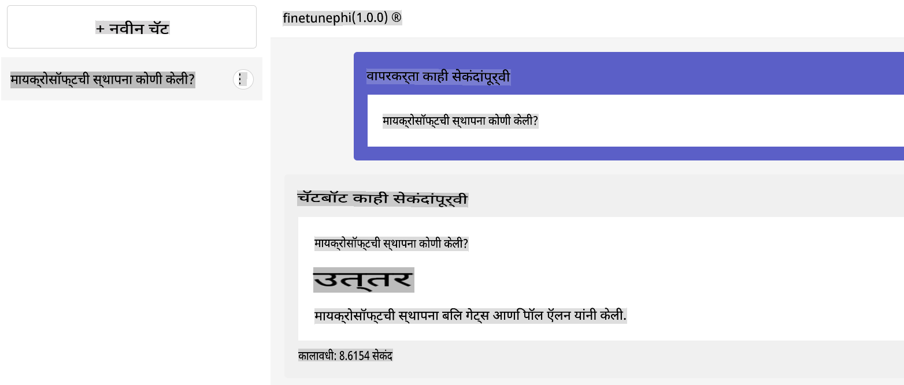

**अस्वीकरण**:  
हा दस्तऐवज मशीन-आधारित AI भाषांतर सेवांचा वापर करून अनुवादित करण्यात आला आहे. आम्ही अचूकतेसाठी प्रयत्नशील असलो तरी, कृपया लक्षात घ्या की स्वयंचलित भाषांतरांमध्ये चुका किंवा अचूकतेचा अभाव असू शकतो. मूळ भाषेतील मूळ दस्तऐवज हा प्रामाणिक स्रोत मानला जावा. महत्त्वाच्या माहितीकरिता व्यावसायिक मानवी भाषांतराची शिफारस केली जाते. या भाषांतराचा वापर करून उद्भवलेल्या कोणत्याही गैरसमजुती किंवा चुकीच्या अर्थाबद्दल आम्ही जबाबदार राहणार नाही.