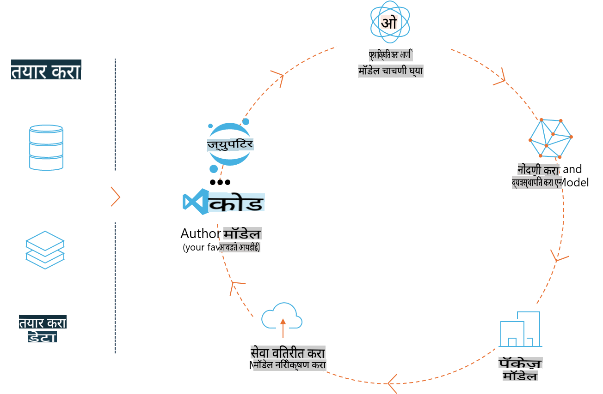
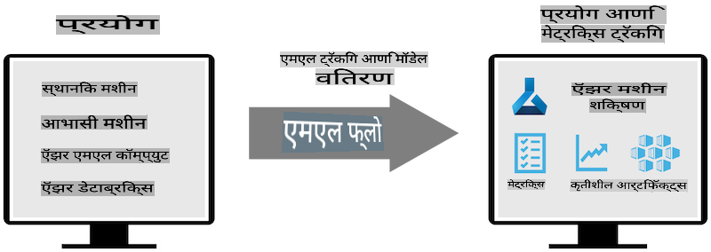
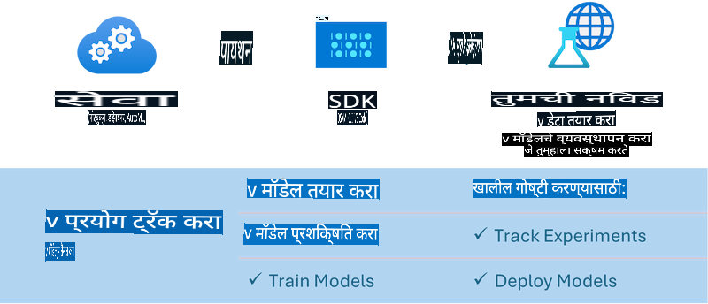

# एमएलफ्लो

[MLflow](https://mlflow.org/) ही एक ओपन-सोर्स प्लॅटफॉर्म आहे जी मशीन लर्निंगच्या संपूर्ण जीवनचक्राचे व्यवस्थापन करण्यासाठी डिझाइन केली गेली आहे.



एमएलफ्लोचा उपयोग एमएल जीवनचक्राचे व्यवस्थापन करण्यासाठी केला जातो, ज्यामध्ये प्रयोग, पुनरुत्पादनक्षमता, डिप्लॉयमेंट आणि एक केंद्रीय मॉडेल रजिस्ट्री यांचा समावेश आहे. सध्या MLFlow चार घटक प्रदान करते:

- **MLflow Tracking:** प्रयोग, कोड, डेटा कॉन्फिग आणि निकाल नोंदवा आणि क्वेरी करा.  
- **MLflow Projects:** डेटा सायन्स कोडला एका स्वरूपात पॅकेज करा जे कोणत्याही प्लॅटफॉर्मवर चालवता येईल.  
- **Mlflow Models:** मशीन लर्निंग मॉडेल्स विविध सर्व्हिंग वातावरणांमध्ये डिप्लॉय करा.  
- **Model Registry:** मॉडेल्स एका केंद्रीय रेपॉझिटरीमध्ये संग्रहित करा, त्यांना नोट्स जोडा आणि व्यवस्थापित करा.  

यामध्ये प्रयोग ट्रॅकिंग, कोडला पुनरुत्पादनक्षम रनमध्ये पॅकेजिंग करणे, आणि मॉडेल्स शेअर व डिप्लॉय करणे यासाठी सुविधा समाविष्ट आहेत. एमएलफ्लो Databricks मध्ये समाकलित आहे आणि विविध एमएल लायब्ररींना समर्थन देते, ज्यामुळे ते लायब्ररी-निरपेक्ष बनते. हे कोणत्याही मशीन लर्निंग लायब्ररीसह आणि कोणत्याही प्रोग्रामिंग भाषेत वापरले जाऊ शकते, कारण हे सोयीसाठी REST API आणि CLI प्रदान करते.



MLFlow ची मुख्य वैशिष्ट्ये:

- **Experiment Tracking:** पॅरामीटर्स आणि निकालांची नोंद व तुलना करा.  
- **Model Management:** मॉडेल्स विविध सर्व्हिंग आणि इनफरन्स प्लॅटफॉर्मवर डिप्लॉय करा.  
- **Model Registry:** MLFlow मॉडेल्सच्या जीवनचक्राचे सहकार्याने व्यवस्थापन करा, ज्यामध्ये आवृत्ती नियंत्रण आणि नोट्स समाविष्ट आहेत.  
- **Projects:** एमएल कोड शेअर करण्यासाठी किंवा प्रॉडक्शनमध्ये वापरण्यासाठी पॅकेज करा.  

एमएलफ्लो MLOps लूपलाही समर्थन देते, ज्यामध्ये डेटा तयार करणे, मॉडेल्स नोंदणी व व्यवस्थापन, मॉडेल्स पॅकेज करणे, सेवा डिप्लॉय करणे आणि मॉडेल्सचे निरीक्षण करणे यांचा समावेश आहे. हे प्रोटोटाइपपासून प्रॉडक्शन वर्कफ्लोपर्यंत जाण्याची प्रक्रिया सुलभ करण्याचे उद्दिष्ट ठेवते, विशेषतः क्लाउड आणि एज वातावरणांमध्ये.

## एंड-टू-एंड उदाहरण - Phi-3 साठी रॅपर तयार करणे आणि त्याचा एमएलफ्लो मॉडेल म्हणून वापर करणे

या एंड-टू-एंड नमुन्यात आम्ही Phi-3 स्मॉल लँग्वेज मॉडेल (SLM) साठी रॅपर तयार करण्यासाठी दोन वेगवेगळ्या दृष्टिकोनांचे प्रदर्शन करू आणि नंतर ते स्थानिक किंवा क्लाउडमध्ये, उदा. Azure Machine Learning workspace मध्ये, एमएलफ्लो मॉडेल म्हणून चालवू.



| प्रकल्प | वर्णन | स्थान |
| ------------ | ----------- | -------- |
| Transformer Pipeline | जर तुम्हाला HuggingFace मॉडेल MLFlow च्या experimental transformers flavour सह वापरायचे असेल तर Transformer Pipeline हा रॅपर तयार करण्याचा सर्वात सोपा पर्याय आहे. | [**TransformerPipeline.ipynb**](../../../../../../code/06.E2E/E2E_Phi-3-MLflow_TransformerPipeline.ipynb) |
| Custom Python Wrapper | लेखनाच्या वेळी, transformer pipeline ने HuggingFace मॉडेल्ससाठी ONNX स्वरूपात MLFlow wrapper निर्माण करण्याचे समर्थन केले नाही, अगदी experimental optimum Python पॅकेजसहही. अशा परिस्थितीत, तुम्ही MLFlow साठी कस्टम Python wrapper तयार करू शकता. | [**CustomPythonWrapper.ipynb**](../../../../../../code/06.E2E/E2E_Phi-3-MLflow_CustomPythonWrapper.ipynb) |

## प्रकल्प: Transformer Pipeline

1. तुम्हाला MLFlow आणि HuggingFace चे संबंधित Python पॅकेजेस आवश्यक असतील:

    ``` Python
    import mlflow
    import transformers
    ```

2. त्यानंतर, तुम्ही HuggingFace रजिस्ट्रीतील लक्ष्य Phi-3 मॉडेलचा संदर्भ घेऊन transformer pipeline सुरू करू शकता. _Phi-3-mini-4k-instruct_ च्या मॉडेल कार्डवरून दिसते की, त्याचे कार्य "Text Generation" प्रकाराचे आहे:

    ``` Python
    pipeline = transformers.pipeline(
        task = "text-generation",
        model = "microsoft/Phi-3-mini-4k-instruct"
    )
    ```

3. आता तुम्ही तुमच्या Phi-3 मॉडेलच्या transformer pipeline ला MLFlow स्वरूपात जतन करू शकता आणि अतिरिक्त तपशील प्रदान करू शकता जसे की लक्ष्य artifacts path, विशिष्ट मॉडेल कॉन्फिगरेशन सेटिंग्ज आणि inference API प्रकार:

    ``` Python
    model_info = mlflow.transformers.log_model(
        transformers_model = pipeline,
        artifact_path = "phi3-mlflow-model",
        model_config = model_config,
        task = "llm/v1/chat"
    )
    ```

## प्रकल्प: Custom Python Wrapper

1. येथे आपण Microsoft च्या [ONNX Runtime generate() API](https://github.com/microsoft/onnxruntime-genai) चा उपयोग ONNX मॉडेलच्या इनफरन्ससाठी आणि टोकन्स एन्कोडिंग/डिकोडिंगसाठी करू शकतो. खालील उदाहरण CPU लक्ष्यित करत असल्याने तुम्हाला _onnxruntime_genai_ पॅकेज निवडावे लागेल:

    ``` Python
    import mlflow
    from mlflow.models import infer_signature
    import onnxruntime_genai as og
    ```

1. आमचा कस्टम क्लास दोन पद्धतींना अंमलात आणतो: _load_context()_ ज्यामध्ये Phi-3 Mini 4K Instruct चा **ONNX मॉडेल**, **generator parameters** आणि **tokenizer** सुरू केले जातात; आणि _predict()_ जे दिलेल्या prompt साठी output tokens तयार करते:

    ``` Python
    class Phi3Model(mlflow.pyfunc.PythonModel):
        def load_context(self, context):
            # Retrieving model from the artifacts
            model_path = context.artifacts["phi3-mini-onnx"]
            model_options = {
                 "max_length": 300,
                 "temperature": 0.2,         
            }
        
            # Defining the model
            self.phi3_model = og.Model(model_path)
            self.params = og.GeneratorParams(self.phi3_model)
            self.params.set_search_options(**model_options)
            
            # Defining the tokenizer
            self.tokenizer = og.Tokenizer(self.phi3_model)
    
        def predict(self, context, model_input):
            # Retrieving prompt from the input
            prompt = model_input["prompt"][0]
            self.params.input_ids = self.tokenizer.encode(prompt)
    
            # Generating the model's response
            response = self.phi3_model.generate(self.params)
    
            return self.tokenizer.decode(response[0][len(self.params.input_ids):])
    ```

1. आता तुम्ही _mlflow.pyfunc.log_model()_ फंक्शन वापरून Phi-3 मॉडेलसाठी कस्टम Python wrapper (pickle स्वरूपात) तयार करू शकता, मूळ ONNX मॉडेल आणि आवश्यक dependencies सह:

    ``` Python
    model_info = mlflow.pyfunc.log_model(
        artifact_path = artifact_path,
        python_model = Phi3Model(),
        artifacts = {
            "phi3-mini-onnx": "cpu_and_mobile/cpu-int4-rtn-block-32-acc-level-4",
        },
        input_example = input_example,
        signature = infer_signature(input_example, ["Run"]),
        extra_pip_requirements = ["torch", "onnxruntime_genai", "numpy"],
    )
    ```

## तयार झालेल्या एमएलफ्लो मॉडेल्सच्या सिग्नेचर

1. वरील Transformer Pipeline प्रकल्पातील तिसऱ्या चरणात, आम्ही MLFlow मॉडेलचे कार्य "_llm/v1/chat_" असे सेट केले. अशा प्रकारच्या सूचनेमुळे मॉडेलचा API wrapper तयार होतो, जो OpenAI च्या Chat API शी सुसंगत असतो, जसे की खाली दर्शविले आहे:

    ``` Python
    {inputs: 
      ['messages': Array({content: string (required), name: string (optional), role: string (required)}) (required), 'temperature': double (optional), 'max_tokens': long (optional), 'stop': Array(string) (optional), 'n': long (optional), 'stream': boolean (optional)],
    outputs: 
      ['id': string (required), 'object': string (required), 'created': long (required), 'model': string (required), 'choices': Array({finish_reason: string (required), index: long (required), message: {content: string (required), name: string (optional), role: string (required)} (required)}) (required), 'usage': {completion_tokens: long (required), prompt_tokens: long (required), total_tokens: long (required)} (required)],
    params: 
      None}
    ```

1. परिणामी, तुम्ही तुमचा prompt खालील स्वरूपात सबमिट करू शकता:

    ``` Python
    messages = [{"role": "user", "content": "What is the capital of Spain?"}]
    ```

1. नंतर, OpenAI API-सुसंगत post-processing वापरा, उदा., _response[0][‘choices’][0][‘message’][‘content’]_, तुमचे आउटपुट अधिक आकर्षक करण्यासाठी, जसे की:

    ``` JSON
    Question: What is the capital of Spain?
    
    Answer: The capital of Spain is Madrid. It is the largest city in Spain and serves as the political, economic, and cultural center of the country. Madrid is located in the center of the Iberian Peninsula and is known for its rich history, art, and architecture, including the Royal Palace, the Prado Museum, and the Plaza Mayor.
    
    Usage: {'prompt_tokens': 11, 'completion_tokens': 73, 'total_tokens': 84}
    ```

1. वरील Custom Python Wrapper प्रकल्पातील तिसऱ्या चरणात, आम्ही MLFlow पॅकेजला दिलेल्या इनपुट उदाहरणावरून मॉडेलची सिग्नेचर तयार करू दिली. आमच्या MLFlow wrapper ची सिग्नेचर अशा प्रकारे दिसेल:

    ``` Python
    {inputs: 
      ['prompt': string (required)],
    outputs: 
      [string (required)],
    params: 
      None}
    ```

1. त्यामुळे, आमच्या prompt मध्ये "prompt" dictionary key समाविष्ट असणे आवश्यक आहे, उदा.:

    ``` Python
    {"prompt": "<|system|>You are a stand-up comedian.<|end|><|user|>Tell me a joke about atom<|end|><|assistant|>",}
    ```

1. मॉडेलचे आउटपुट नंतर string स्वरूपात प्रदान केले जाईल:

    ``` JSON
    Alright, here's a little atom-related joke for you!
    
    Why don't electrons ever play hide and seek with protons?
    
    Because good luck finding them when they're always "sharing" their electrons!
    
    Remember, this is all in good fun, and we're just having a little atomic-level humor!
    ```

**अस्वीकृती**:  
हा दस्तऐवज मशीन-आधारित एआय अनुवाद सेवा वापरून अनुवादित केला आहे. आम्ही अचूकतेसाठी प्रयत्नशील असलो तरी, कृपया लक्षात घ्या की स्वयंचलित अनुवादांमध्ये चुका किंवा अचूकतेचा अभाव असू शकतो. मूळ भाषेतील मूळ दस्तऐवज प्राधिकृत स्रोत मानला जावा. महत्त्वाच्या माहितीकरिता व्यावसायिक मानवी अनुवादाची शिफारस केली जाते. या अनुवादाचा वापर करून उद्भवलेल्या कोणत्याही गैरसमज किंवा चुकीच्या अर्थासाठी आम्ही जबाबदार नाही.