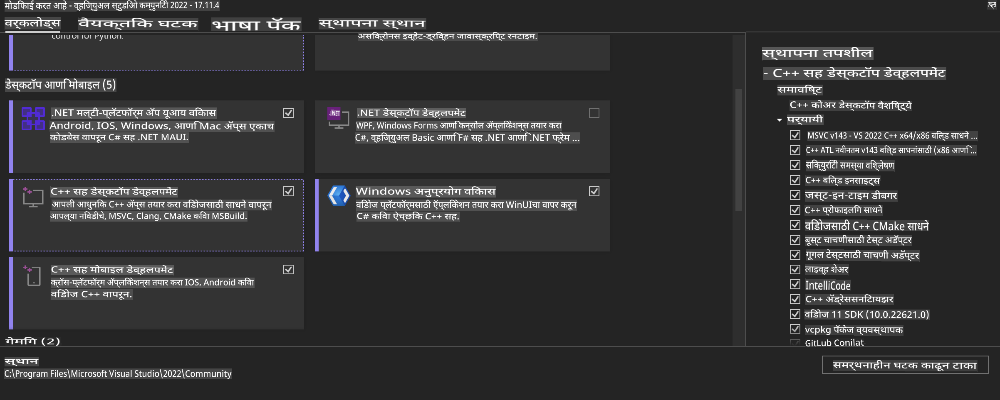
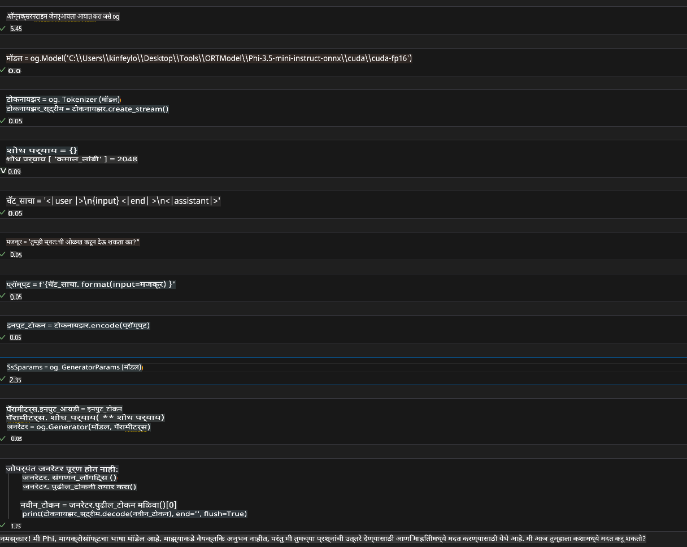
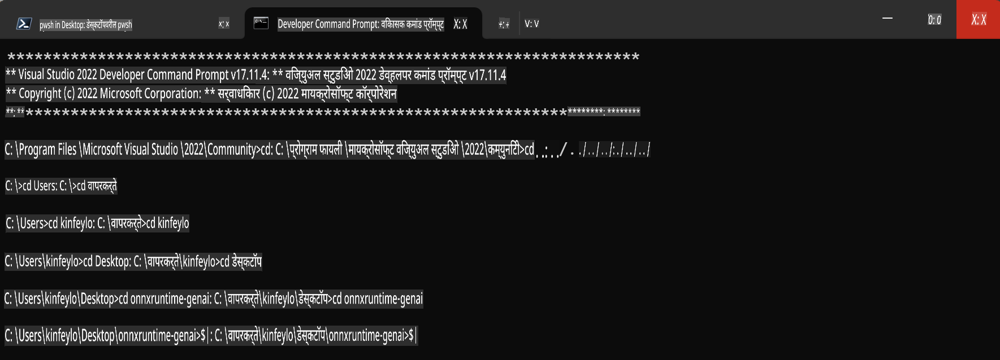

# **OnnxRuntime GenAI Windows GPU साठी मार्गदर्शक**

हा मार्गदर्शक Windows वर GPUs सह ONNX Runtime (ORT) सेटअप आणि वापरण्यासाठी पायऱ्या प्रदान करतो. हा GPU प्रवेगाचा उपयोग करून तुमच्या मॉडेल्सच्या कार्यक्षमतेत सुधारणा करण्यासाठी डिझाइन केला आहे.

या दस्तऐवजात खालील मार्गदर्शन समाविष्ट आहे:

- पर्यावरण सेटअप: CUDA, cuDNN आणि ONNX Runtime सारख्या आवश्यक अवलंबनांच्या स्थापनेच्या सूचना.
- कॉन्फिगरेशन: GPU संसाधनांचा प्रभावीपणे उपयोग करण्यासाठी पर्यावरण आणि ONNX Runtime कसे कॉन्फिगर करावे.
- ऑप्टिमायझेशन टिप्स: सर्वोत्तम कार्यक्षमतेसाठी तुमच्या GPU सेटिंग्ज कशा ट्यून कराव्यात याबद्दल सल्ला.

### **1. Python 3.10.x /3.11.8**

   ***टीप*** [miniforge](https://github.com/conda-forge/miniforge/releases/latest/download/Miniforge3-Windows-x86_64.exe) वापरण्याची शिफारस करा तुमच्या Python पर्यावरणासाठी

   ```bash

   conda create -n pydev python==3.11.8

   conda activate pydev

   ```

   ***स्मरणपत्र*** जर तुम्ही Python ONNX लायब्ररीशी संबंधित काहीही स्थापित केले असेल, तर कृपया ते अनइंस्टॉल करा.

### **2. winget सह CMake स्थापित करा**

   ```bash

   winget install -e --id Kitware.CMake

   ```

### **3. Visual Studio 2022 - Desktop Development with C++ स्थापित करा**

   ***टीप*** जर तुम्हाला संकलन करायचे नसेल तर तुम्ही हा टप्पा वगळू शकता.



### **4. NVIDIA ड्रायव्हर स्थापित करा**

1. **NVIDIA GPU Driver**  [https://www.nvidia.com/en-us/drivers/](https://www.nvidia.com/en-us/drivers/)

2. **NVIDIA CUDA 12.4** [https://developer.nvidia.com/cuda-12-4-0-download-archive](https://developer.nvidia.com/cuda-12-4-0-download-archive)

3. **NVIDIA CUDNN 9.4**  [https://developer.nvidia.com/cudnn-downloads](https://developer.nvidia.com/cudnn-downloads)

***स्मरणपत्र*** कृपया स्थापनेच्या प्रक्रियेत डिफॉल्ट सेटिंग्ज वापरा.

### **5. NVIDIA पर्यावरण सेट करा**

NVIDIA CUDNN 9.4 चे lib, bin, include फोल्डर NVIDIA CUDA 12.4 च्या lib, bin, include फोल्डरमध्ये कॉपी करा.

- *'C:\Program Files\NVIDIA\CUDNN\v9.4\bin\12.6'* मधील फाइल्स *'C:\Program Files\NVIDIA GPU Computing Toolkit\CUDA\v12.4\bin'* मध्ये कॉपी करा.

- *'C:\Program Files\NVIDIA\CUDNN\v9.4\include\12.6'* मधील फाइल्स *'C:\Program Files\NVIDIA GPU Computing Toolkit\CUDA\v12.4\include'* मध्ये कॉपी करा.

- *'C:\Program Files\NVIDIA\CUDNN\v9.4\lib\12.6'* मधील फाइल्स *'C:\Program Files\NVIDIA GPU Computing Toolkit\CUDA\v12.4\lib\x64'* मध्ये कॉपी करा.

### **6. Phi-3.5-mini-instruct-onnx डाउनलोड करा**

   ```bash

   winget install -e --id Git.Git

   winget install -e --id GitHub.GitLFS

   git lfs install

   git clone https://huggingface.co/microsoft/Phi-3.5-mini-instruct-onnx

   ```

### **7. InferencePhi35Instruct.ipynb चालवा**

   [Notebook](../../../../../../code/09.UpdateSamples/Aug/ortgpu-phi35-instruct.ipynb) उघडा आणि चालवा.



### **8. ORT GenAI GPU संकलित करा**

   ***टीप*** 
   
   1. कृपया सुरुवातीला onnx, onnxruntime आणि onnxruntime-genai संबंधित सर्व काही अनइंस्टॉल करा.

   ```bash

   pip list 
   
   ```

   नंतर सर्व onnxruntime लायब्ररी अनइंस्टॉल करा, उदा.:

   ```bash

   pip uninstall onnxruntime

   pip uninstall onnxruntime-genai

   pip uninstall onnxruntume-genai-cuda
   
   ```

   2. Visual Studio Extension सपोर्ट तपासा.

   C:\Program Files\NVIDIA GPU Computing Toolkit\CUDA\v12.4\extras येथे C:\Program Files\NVIDIA GPU Computing Toolkit\CUDA\v12.4\extras\visual_studio_integration आहे का ते तपासा. 

   जर सापडले नाही तर इतर CUDA टूलकिट ड्रायव्हर फोल्डर तपासा आणि visual_studio_integration फोल्डर आणि त्यातील सामग्री कॉपी करून C:\Program Files\NVIDIA GPU Computing Toolkit\CUDA\v12.4\extras\visual_studio_integration मध्ये ठेवा.

   - जर तुम्हाला संकलन करायचे नसेल तर तुम्ही हा टप्पा वगळू शकता.

   ```bash

   git clone https://github.com/microsoft/onnxruntime-genai

   ```

   - [https://github.com/microsoft/onnxruntime/releases/download/v1.19.2/onnxruntime-win-x64-gpu-1.19.2.zip](https://github.com/microsoft/onnxruntime/releases/download/v1.19.2/onnxruntime-win-x64-gpu-1.19.2.zip) डाउनलोड करा.

   - onnxruntime-win-x64-gpu-1.19.2.zip अनझिप करा, आणि त्याचे नाव **ort** असे ठेवा, आणि ort फोल्डर onnxruntime-genai मध्ये कॉपी करा.

   - Windows Terminal वापरून, Developer Command Prompt for VS 2022 उघडा आणि onnxruntime-genai फोल्डरमध्ये जा.



   - तुमच्या Python पर्यावरणासह संकलित करा.

   ```bash

   cd onnxruntime-genai

   python build.py --use_cuda  --cuda_home "C:\Program Files\NVIDIA GPU Computing Toolkit\CUDA\v12.4" --config Release
 

   cd build/Windows/Release/Wheel

   pip install .whl

   ```

**अस्वीकरण**:  
हे दस्तऐवज मशीन-आधारित एआय अनुवाद सेवांचा वापर करून अनुवादित केले गेले आहे. आम्ही अचूकतेसाठी प्रयत्नशील असलो तरी कृपया लक्षात घ्या की स्वयंचलित अनुवादांमध्ये त्रुटी किंवा अचूकतेचा अभाव असू शकतो. मूळ भाषेतील मूळ दस्तऐवज हा अधिकृत स्रोत मानावा. महत्त्वाच्या माहितीसाठी, व्यावसायिक मानवी अनुवादाची शिफारस केली जाते. या अनुवादाच्या वापरामुळे उद्भवणाऱ्या कोणत्याही गैरसमज किंवा चुकीच्या अर्थासाठी आम्ही जबाबदार राहणार नाही.