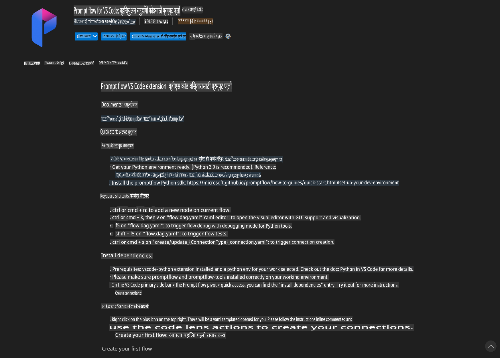
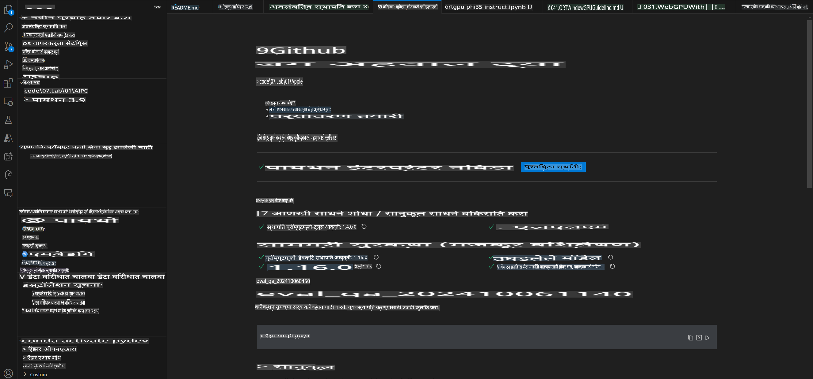
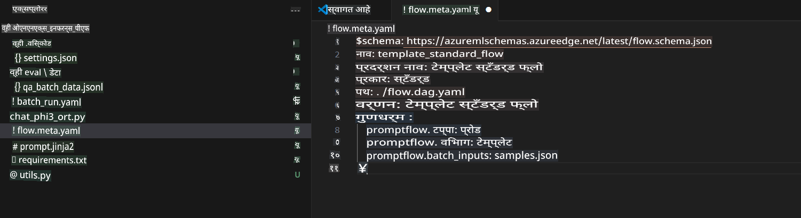
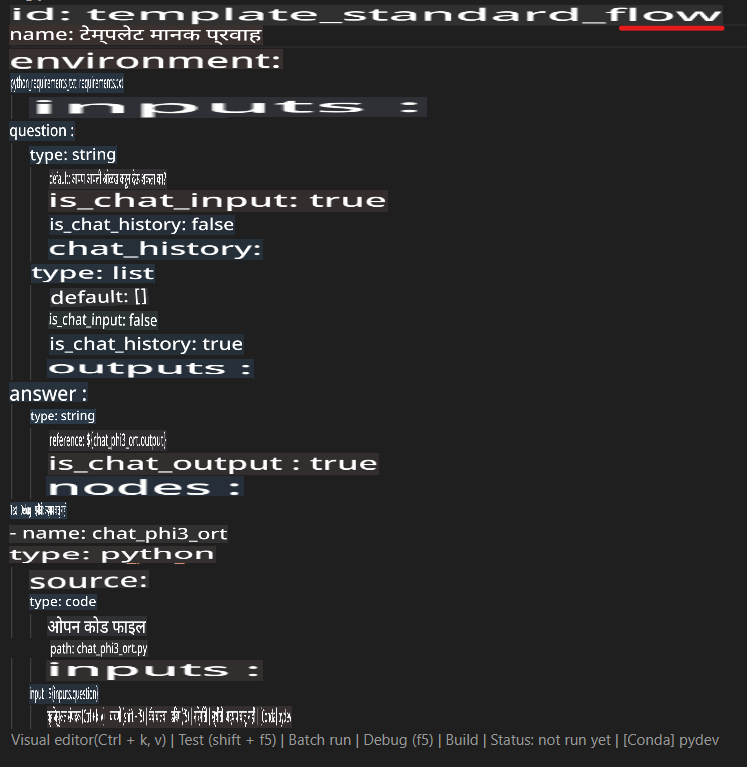
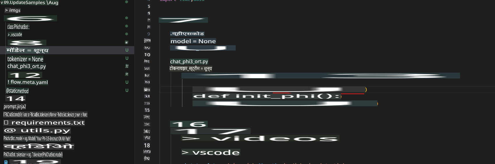
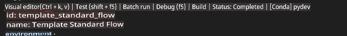
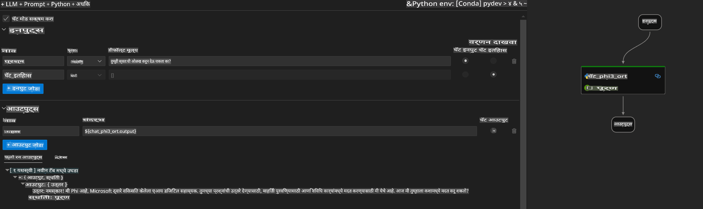
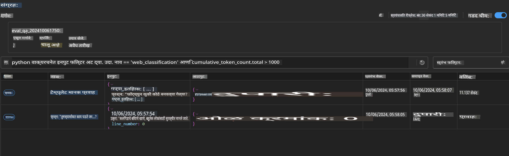

# Phi-3.5-Instruct ONNX वापरून Windows GPU वर Prompt Flow सोल्यूशन तयार करणे

खालील दस्तऐवज Phi-3 मॉडेल्सवर आधारित AI अनुप्रयोग विकसित करण्यासाठी ONNX (Open Neural Network Exchange) सह PromptFlow कसे वापरायचे याचे उदाहरण आहे.

PromptFlow ही LLM-आधारित (Large Language Model) AI अनुप्रयोगांच्या एंड-टू-एंड विकास प्रक्रियेला सुलभ करण्यासाठी डिझाइन केलेली विकास साधनांची मालिका आहे. यात कल्पना तयार करणे, प्रोटोटायपिंग, चाचणी आणि मूल्यमापन यांचा समावेश होतो.

PromptFlow ला ONNX सह एकत्रित करून, विकसक खालील गोष्टी करू शकतात:

- **मॉडेल कार्यप्रदर्शन ऑप्टिमाइझ करा**: ONNX चा वापर करून कार्यक्षम मॉडेल अंदाज आणि उपयोजन करा.  
- **विकास सुलभ करा**: Workflow व्यवस्थापित करण्यासाठी आणि पुनरावृत्ती होणाऱ्या कामांना स्वयंचलित करण्यासाठी PromptFlow वापरा.  
- **सहकार्य सुधारा**: एकत्रित विकास वातावरण प्रदान करून टीम सदस्यांमधील चांगले सहकार्य सुलभ करा.  

**Prompt flow** ही विकास साधनांची मालिका आहे जी LLM-आधारित AI अनुप्रयोगांच्या विकास प्रक्रियेला सुलभ करते. यात कल्पना मांडणे, प्रोटोटाइप तयार करणे, चाचणी करणे, मूल्यमापन करणे, उत्पादनात तैनात करणे आणि मॉनिटरिंग यांचा समावेश आहे. हे प्रॉम्प्ट इंजिनिअरिंग खूप सोपे करते आणि तुम्हाला उत्पादन-गुणवत्तेचे LLM अॅप्स तयार करण्यास सक्षम करते.

Prompt flow OpenAI, Azure OpenAI Service, आणि सानुकूल मॉडेल्स (Huggingface, स्थानिक LLM/SLM) शी कनेक्ट होऊ शकते. आम्ही Phi-3.5 चे क्वांटाइझ्ड ONNX मॉडेल स्थानिक अनुप्रयोगांमध्ये तैनात करण्याची आशा करतो. Prompt flow आम्हाला आमचा व्यवसाय चांगल्या प्रकारे नियोजित करण्यात आणि Phi-3.5 आधारित स्थानिक सोल्यूशन पूर्ण करण्यात मदत करू शकतो. या उदाहरणात, आम्ही Windows GPU वर आधारित Prompt flow सोल्यूशन पूर्ण करण्यासाठी ONNX Runtime GenAI Library एकत्रित करू.

## **स्थापना**

### **Windows GPU साठी ONNX Runtime GenAI**

Windows GPU साठी ONNX Runtime GenAI सेट करण्यासाठी हे मार्गदर्शन वाचा [इथे क्लिक करा](./ORTWindowGPUGuideline.md)

### **VSCode मध्ये Prompt flow सेट करणे**

1. Prompt flow VS Code Extension इंस्टॉल करा



2. Prompt flow VS Code Extension इंस्टॉल केल्यानंतर, एक्स्टेंशनवर क्लिक करा आणि **Installation dependencies** निवडा. या मार्गदर्शिकेचे अनुसरण करून तुमच्या वातावरणात Prompt flow SDK इंस्टॉल करा.



3. [उदाहरण कोड डाउनलोड करा](../../../../../../code/09.UpdateSamples/Aug/pf/onnx_inference_pf) आणि VS Code वापरून हा नमुना उघडा.



4. **flow.dag.yaml** उघडा आणि तुमचे Python वातावरण निवडा.



   **chat_phi3_ort.py** उघडा आणि तुमच्या Phi-3.5-instruct ONNX मॉडेलचे स्थान बदला.



5. तुमचा Prompt flow चाचणीसाठी चालवा.

**flow.dag.yaml** उघडा आणि Visual Editor वर क्लिक करा.



क्लिक केल्यानंतर, चाचणीसाठी चालवा.



1. टर्मिनलमध्ये बॅच चालवून अधिक निकाल तपासा.

```bash

pf run create --file batch_run.yaml --stream --name 'Your eval qa name'    

```

तुमच्या डिफॉल्ट ब्राउझरमध्ये निकाल तपासू शकता.



**अस्वीकरण**:  
हा दस्तऐवज मशीन-आधारित एआय अनुवाद सेवांचा वापर करून अनुवादित करण्यात आला आहे. आम्ही अचूकतेसाठी प्रयत्नशील असलो तरी कृपया लक्षात घ्या की स्वयंचलित अनुवादांमध्ये त्रुटी किंवा अचूकतेचा अभाव असू शकतो. मूळ भाषेतील मूळ दस्तऐवज हा अधिकृत स्रोत मानला जावा. महत्वाच्या माहितीसाठी व्यावसायिक मानवी अनुवादाची शिफारस केली जाते. या अनुवादाच्या वापरामुळे उद्भवलेल्या कोणत्याही गैरसमजुतींसाठी किंवा चुकीच्या अर्थ लावल्याबद्दल आम्ही जबाबदार राहणार नाही.