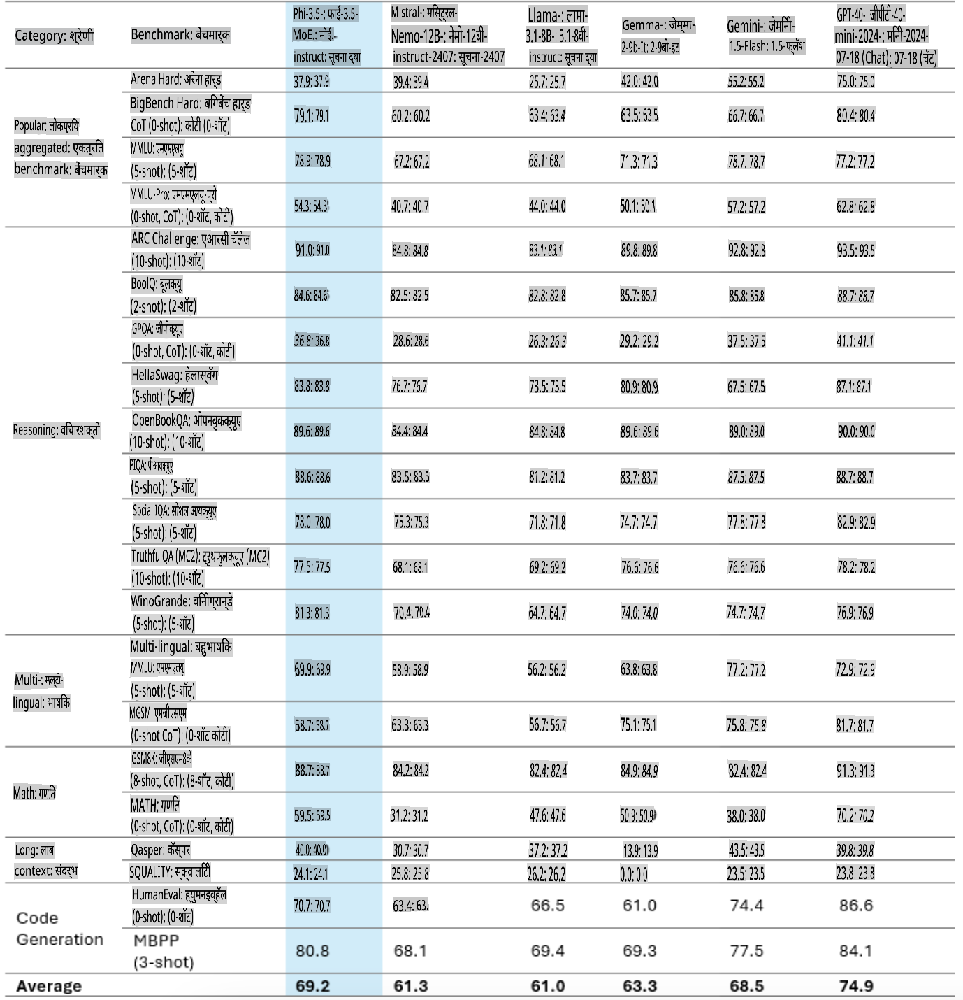
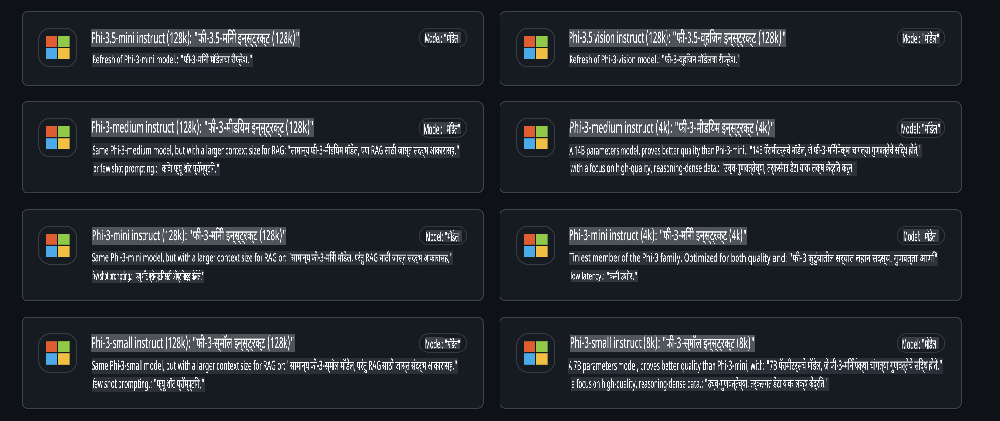
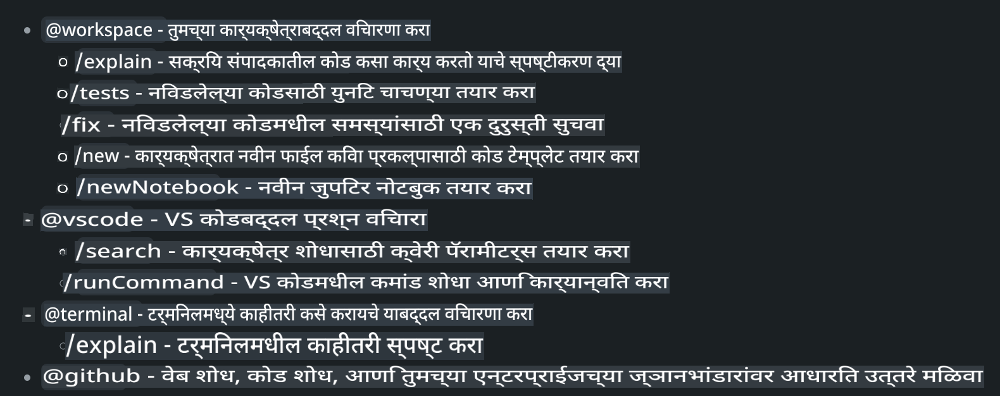
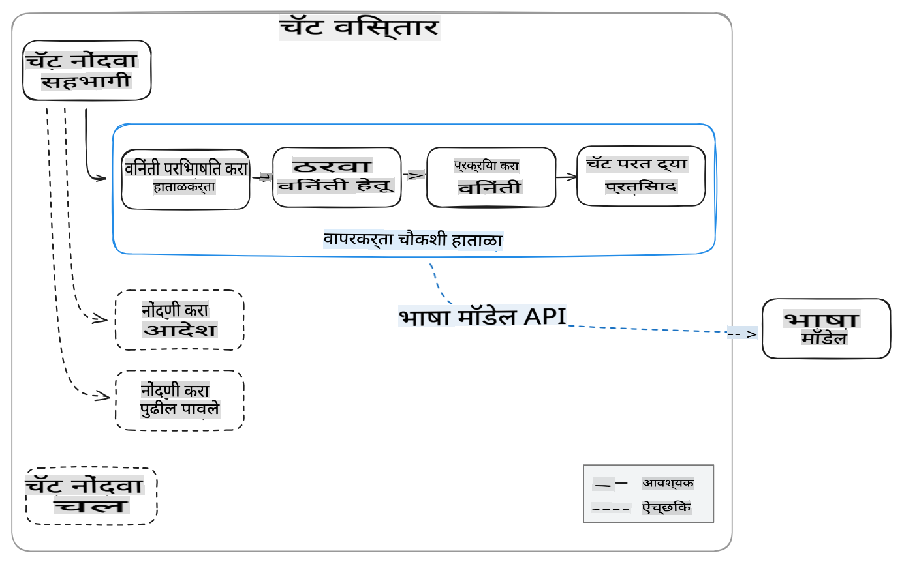
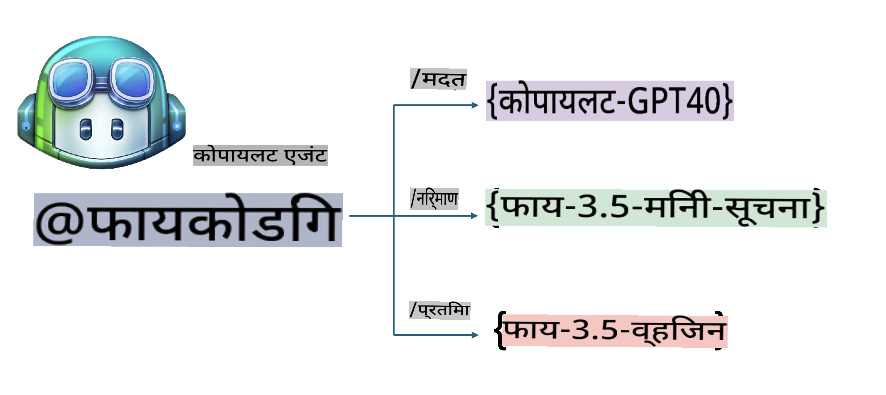
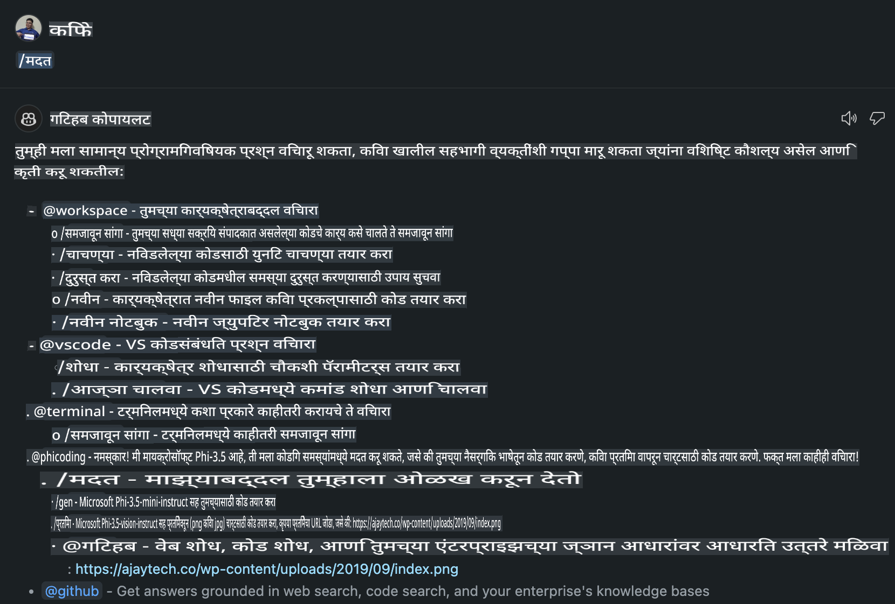
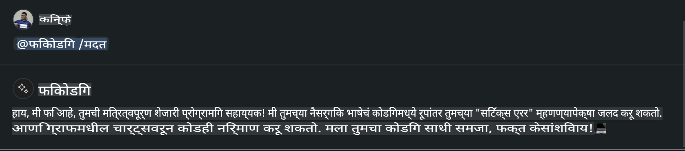
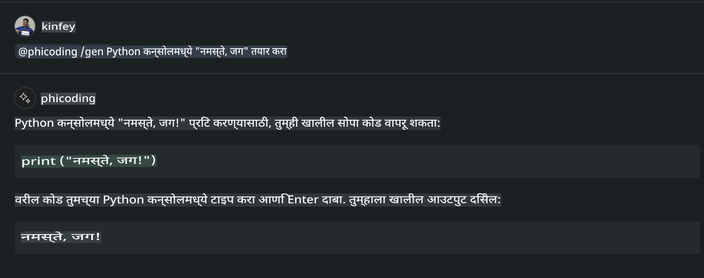
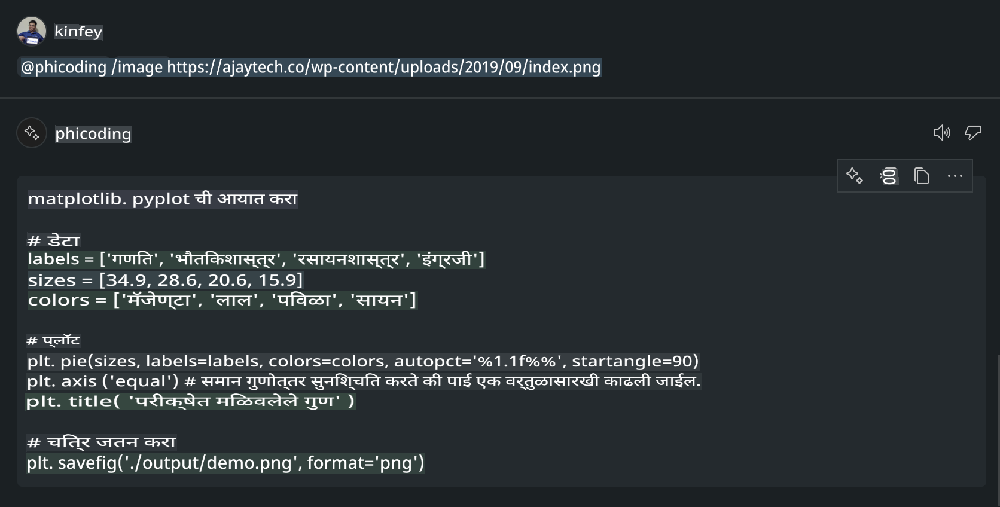

# **Phi-3.5 आणि GitHub Models च्या मदतीने Visual Studio Code Chat Copilot Agent तयार करा**

तुम्ही Visual Studio Code Copilot वापरत आहात का? विशेषतः Chat मध्ये, तुम्ही वेगवेगळ्या एजंट्सचा वापर करून Visual Studio Code मध्ये प्रकल्प तयार करणे, लिहिणे आणि देखभाल करण्याची क्षमता सुधारू शकता. Visual Studio Code एक API प्रदान करते ज्याद्वारे कंपन्या आणि व्यक्ती त्यांच्या व्यवसायाच्या गरजेनुसार वेगवेगळे एजंट तयार करू शकतात आणि विविध क्षेत्रांमध्ये त्यांची क्षमता वाढवू शकतात. या लेखात, आपण GitHub Models च्या **Phi-3.5-mini-instruct (128k)** आणि **Phi-3.5-vision-instruct (128k)** यांचा वापर करून आपला स्वतःचा Visual Studio Code Agent कसा तयार करायचा यावर लक्ष केंद्रित करू.

## **GitHub Models वरील Phi-3.5 बद्दल**

Phi-3/3.5 कुटुंबातील Phi-3/3.5-mini-instruct मध्ये उत्कृष्ट कोड समजण्याची आणि तयार करण्याची क्षमता आहे, तसेच त्याला Gemma-2-9b आणि Mistral-Nemo-12B-instruct-2407 च्या तुलनेत अधिक फायदे आहेत.



GitHub Models मध्ये आता **Phi-3.5-mini-instruct (128k)** आणि **Phi-3.5-vision-instruct (128k)** या मॉडेल्ससाठी प्रवेश उपलब्ध आहे. विकसक OpenAI SDK, Azure AI Inference SDK, आणि REST API च्या माध्यमातून त्यांचा वापर करू शकतात.



***टीप:*** उत्पादनाच्या वातावरणात Azure Model Catalog सह चांगले स्विच करण्यासाठी येथे Azure AI Inference SDK वापरण्याची शिफारस केली जाते.

GitHub Models शी जोडल्यानंतर कोड जनरेशन परिदृश्यामध्ये **Phi-3.5-mini-instruct (128k)** आणि **Phi-3.5-vision-instruct (128k)** चे परिणाम खालीलप्रमाणे आहेत, तसेच पुढील उदाहरणांसाठीही तयारी आहे.

**डेमो: GitHub Models Phi-3.5-mini-instruct (128k) प्रॉम्प्टवरून कोड तयार करतो** ([या लिंकवर क्लिक करा](../../../../../../code/09.UpdateSamples/Aug/ghmodel_phi35_instruct_demo.ipynb))

**डेमो: GitHub Models Phi-3.5-vision-instruct (128k) प्रतिमेवरून कोड तयार करतो** ([या लिंकवर क्लिक करा](../../../../../../code/09.UpdateSamples/Aug/ghmodel_phi35_vision_demo.ipynb))

## **GitHub Copilot Chat Agent बद्दल**

GitHub Copilot Chat Agent वेगवेगळ्या प्रकल्पांच्या परिदृश्यांमध्ये कोडच्या आधारे विविध कामे पूर्ण करू शकतो. या प्रणालीमध्ये चार एजंट्स आहेत: workspace, github, terminal, vscode.



एजंटचे नाव '@' सह जोडून, तुम्ही संबंधित काम पटकन पूर्ण करू शकता. जर एखाद्या कंपनीने आपल्या व्यवसायाशी संबंधित सामग्री जसे की आवश्यकता, कोडिंग, चाचणी वैशिष्ट्ये आणि प्रकाशन यांचा समावेश केला, तर GitHub Copilot च्या आधारावर अधिक शक्तिशाली खासगी फंक्शन्स मिळवता येतात.

Visual Studio Code Chat Agent ने आता अधिकृतपणे आपले API जारी केले आहे, ज्यामुळे कंपन्या किंवा एंटरप्राइझ विकसक वेगवेगळ्या सॉफ्टवेअर व्यवसाय परिसंस्थांवर आधारित एजंट्स तयार करू शकतात. Visual Studio Code Extension Development च्या विकास पद्धतीवर आधारित, तुम्ही Visual Studio Code Chat Agent API च्या इंटरफेसमध्ये सहज प्रवेश करू शकता. आम्ही या प्रक्रियेवर आधारित विकास करू शकतो.



विकास परिदृश्य तृतीय-पक्ष मॉडेल API (उदा. GitHub Models, Azure Model Catalog, आणि ओपन सोर्स मॉडेल्सवर आधारित स्वतःची सेवा) च्या प्रवेशाला समर्थन देते, तसेच GitHub Copilot द्वारे प्रदान केलेले gpt-35-turbo, gpt-4, आणि gpt-4o मॉडेल्स वापरू शकतो.

## **Phi-3.5 च्या आधारे @phicoding एजंट जोडा**

Phi-3.5 च्या प्रोग्रामिंग क्षमतांचा समावेश करून कोड लिहिणे, प्रतिमा निर्मिती कोड आणि इतर कार्ये पूर्ण करण्याचा प्रयत्न करू. Phi-3.5 भोवती तयार केलेला @PHI एजंट तयार करा. खाली काही कार्ये दिली आहेत:

1. **@phicoding /help** कमांडद्वारे GitHub Copilot द्वारे प्रदान केलेल्या GPT-4o च्या मदतीने स्वतःची ओळख तयार करा.

2. **@phicoding /gen** कमांडद्वारे **Phi-3.5-mini-instruct (128k)** च्या आधारे वेगवेगळ्या प्रोग्रामिंग भाषांसाठी कोड तयार करा.

3. **@phicoding /image** कमांडद्वारे **Phi-3.5-vision-instruct (128k)** च्या आधारे कोड तयार करा आणि प्रतिमेची पूर्तता करा.



## **संबंधित पायऱ्या**

1. npm चा वापर करून Visual Studio Code Extension विकासासाठी समर्थन स्थापित करा.

```bash

npm install --global yo generator-code 

```
2. Visual Studio Code Extension प्लगइन तयार करा (Typescript विकास मोड वापरून, नाव phiext).

```bash

yo code 

```

3. तयार केलेला प्रकल्प उघडा आणि package.json मध्ये बदल करा. येथे संबंधित निर्देश आणि कॉन्फिगरेशन, तसेच GitHub Models चे कॉन्फिगरेशन दिले आहे. लक्षात ठेवा, तुम्हाला येथे तुमचा GitHub Models टोकन जोडावा लागेल.

```json

{
  "name": "phiext",
  "displayName": "phiext",
  "description": "",
  "version": "0.0.1",
  "engines": {
    "vscode": "^1.93.0"
  },
  "categories": [
    "AI",
    "Chat"
  ],
  "activationEvents": [],
  "enabledApiProposals": [
      "chatVariableResolver"
  ],
  "main": "./dist/extension.js",
  "contributes": {
    "chatParticipants": [
        {
            "id": "chat.phicoding",
            "name": "phicoding",
            "description": "Hey! I am Microsoft Phi-3.5, She can help me with coding problems, such as generation code with your natural language, or even generation code about chart from images. Just ask me anything!",
            "isSticky": true,
            "commands": [
                {
                    "name": "help",
                    "description": "Introduce myself to you"
                },
                {
                    "name": "gen",
                    "description": "Generate code for you with Microsoft Phi-3.5-mini-instruct"
                },
                {
                    "name": "image",
                    "description": "Generate code for chart from image(png or jpg) with Microsoft Phi-3.5-vision-instruct, please add image url like this : https://ajaytech.co/wp-content/uploads/2019/09/index.png"
                }
            ]
        }
    ],
    "commands": [
        {
            "command": "phicoding.namesInEditor",
            "title": "Use Microsoft Phi 3.5 in Editor"
        }
    ],
    "configuration": {
      "type": "object",
      "title": "githubmodels",
      "properties": {
        "githubmodels.endpoint": {
          "type": "string",
          "default": "https://models.inference.ai.azure.com",
          "description": "Your GitHub Models Endpoint",
          "order": 0
        },
        "githubmodels.api_key": {
          "type": "string",
          "default": "Your GitHub Models Token",
          "description": "Your GitHub Models Token",
          "order": 1
        },
        "githubmodels.phi35instruct": {
          "type": "string",
          "default": "Phi-3.5-mini-instruct",
          "description": "Your Phi-35-Instruct Model",
          "order": 2
        },
        "githubmodels.phi35vision": {
          "type": "string",
          "default": "Phi-3.5-vision-instruct",
          "description": "Your Phi-35-Vision Model",
          "order": 3
        }
      }
    }
  },
  "scripts": {
    "vscode:prepublish": "npm run package",
    "compile": "webpack",
    "watch": "webpack --watch",
    "package": "webpack --mode production --devtool hidden-source-map",
    "compile-tests": "tsc -p . --outDir out",
    "watch-tests": "tsc -p . -w --outDir out",
    "pretest": "npm run compile-tests && npm run compile && npm run lint",
    "lint": "eslint src",
    "test": "vscode-test"
  },
  "devDependencies": {
    "@types/vscode": "^1.93.0",
    "@types/mocha": "^10.0.7",
    "@types/node": "20.x",
    "@typescript-eslint/eslint-plugin": "^8.3.0",
    "@typescript-eslint/parser": "^8.3.0",
    "eslint": "^9.9.1",
    "typescript": "^5.5.4",
    "ts-loader": "^9.5.1",
    "webpack": "^5.94.0",
    "webpack-cli": "^5.1.4",
    "@vscode/test-cli": "^0.0.10",
    "@vscode/test-electron": "^2.4.1"
  },
  "dependencies": {
    "@types/node-fetch": "^2.6.11",
    "node-fetch": "^3.3.2",
    "@azure-rest/ai-inference": "latest",
    "@azure/core-auth": "latest",
    "@azure/core-sse": "latest"
  }
}


```

4. src/extension.ts मध्ये बदल करा.

```typescript

// The module 'vscode' contains the VS Code extensibility API
// Import the module and reference it with the alias vscode in your code below
import * as vscode from 'vscode';
import ModelClient from "@azure-rest/ai-inference";
import { AzureKeyCredential } from "@azure/core-auth";


interface IPhiChatResult extends vscode.ChatResult {
    metadata: {
        command: string;
    };
}


const MODEL_SELECTOR: vscode.LanguageModelChatSelector = { vendor: 'copilot', family: 'gpt-4o' };

function isValidImageUrl(url: string): boolean {
    const regex = /^(https?:\/\/.*\.(?:png|jpg))$/i;
    return regex.test(url);
}
  

// This method is called when your extension is activated
// Your extension is activated the very first time the command is executed
export function activate(context: vscode.ExtensionContext) {

    const codinghandler: vscode.ChatRequestHandler = async (request: vscode.ChatRequest, context: vscode.ChatContext, stream: vscode.ChatResponseStream, token: vscode.CancellationToken): Promise<IPhiChatResult> => {


        const config : any = vscode.workspace.getConfiguration('githubmodels');
        const endPoint: string = config.get('endpoint');
        const apiKey: string = config.get('api_key');
        const phi35instruct: string = config.get('phi35instruct');
        const phi35vision: string = config.get('phi35vision');
        
        if (request.command === 'help') {

            const content = "Welcome to Coding assistant with Microsoft Phi-3.5"; 
            stream.progress(content);


            try {
                const [model] = await vscode.lm.selectChatModels(MODEL_SELECTOR);
                if (model) {
                    const messages = [
                        vscode.LanguageModelChatMessage.User("Please help me express this content in a humorous way: I am a programming assistant who can help you convert natural language into code and generate code based on the charts in the images. output format like this : Hey I am Phi ......")
                    ];
                    const chatResponse = await model.sendRequest(messages, {}, token);
                    for await (const fragment of chatResponse.text) {
                        stream.markdown(fragment);
                    }
                }
            } catch(err) {
                console.log(err);
            }


            return { metadata: { command: 'help' } };

        }

        
        if (request.command === 'gen') {

            const content = "Welcome to use phi-3.5 to generate code";

            stream.progress(content);

            const client = new ModelClient(endPoint, new AzureKeyCredential(apiKey));

            const response = await client.path("/chat/completions").post({
              body: {
                messages: [
                  { role:"system", content: "You are a coding assistant.Help answer all code generation questions." },
                  { role:"user", content: request.prompt }
                ],
                model: phi35instruct,
                temperature: 0.4,
                max_tokens: 1000,
                top_p: 1.
              }
            });

            stream.markdown(response.body.choices[0].message.content);

            return { metadata: { command: 'gen' } };

        }


        
        if (request.command === 'image') {


            const content = "Welcome to use phi-3.5 to generate code from image(png or jpg),image url like this:https://ajaytech.co/wp-content/uploads/2019/09/index.png";

            stream.progress(content);

            if (!isValidImageUrl(request.prompt)) {
                stream.markdown('Please provide a valid image URL');
                return { metadata: { command: 'image' } };
            }
            else
            {

                const client = new ModelClient(endPoint, new AzureKeyCredential(apiKey));
    
                const response = await client.path("/chat/completions").post({
                    body: {
                      messages: [
                        { role: "system", content: "You are a helpful assistant that describes images in details." },
                        { role: "user", content: [
                            { type: "text", text: "Please generate code according to the chart in the picture according to the following requirements\n1. Keep all information in the chart, including data and text\n2. Do not generate additional information that is not included in the chart\n3. Please extract data from the picture, do not generate it from csv\n4. Please save the regenerated chart as a chart and save it to ./output/demo.png"},
                            { type: "image_url", image_url: {url: request.prompt}
                            }
                          ]
                        }
                      ],
                      model: phi35vision,
                      temperature: 0.4,
                      max_tokens: 2048,
                      top_p: 1.
                    }
                  });
    
                
                stream.markdown(response.body.choices[0].message.content);
    
                return { metadata: { command: 'image' } };
            }


        }


        return { metadata: { command: '' } };
    };


    const phi_ext = vscode.chat.createChatParticipant("chat.phicoding", codinghandler);

    phi_ext.iconPath = new vscode.ThemeIcon('sparkle');


    phi_ext.followupProvider = {
        provideFollowups(result: IPhiChatResult, context: vscode.ChatContext, token: vscode.CancellationToken) {
            return [{
                prompt: 'Let us coding with Phi-3.5 😋😋😋😋',
                label: vscode.l10n.t('Enjoy coding with Phi-3.5'),
                command: 'help'
            } satisfies vscode.ChatFollowup];
        }
    };

    context.subscriptions.push(phi_ext);
}

// This method is called when your extension is deactivated
export function deactivate() {}


```

6. रन करा.

***/help***



***@phicoding /help***



***@phicoding /gen***



***@phicoding /image***



तुम्ही नमुना कोड डाउनलोड करू शकता: [क्लिक करा](../../../../../../code/09.UpdateSamples/Aug/vscode)

## **स्रोत**

1. GitHub Models साठी साइन अप करा [https://gh.io/models](https://gh.io/models)

2. Visual Studio Code Extension Development बद्दल जाणून घ्या [https://code.visualstudio.com/api/get-started/your-first-extension](https://code.visualstudio.com/api/get-started/your-first-extension)

3. Visual Studio Code Copilot Chat API बद्दल जाणून घ्या [https://code.visualstudio.com/api/extension-guides/chat](https://code.visualstudio.com/api/extension-guides/chat)

**अस्वीकरण**:  
हे दस्तऐवज मशीन-आधारित एआय अनुवाद सेवांचा वापर करून अनुवादित केले गेले आहे. आम्ही अचूकतेसाठी प्रयत्नशील असलो तरी, कृपया लक्षात घ्या की स्वयंचलित अनुवादांमध्ये त्रुटी किंवा अचूकतेचा अभाव असू शकतो. मूळ भाषेतील मूळ दस्तऐवज हा प्राधिकृत स्रोत मानला जावा. महत्त्वाच्या माहितीकरिता व्यावसायिक मानवी अनुवादाची शिफारस केली जाते. या अनुवादाच्या वापरामुळे उद्भवणाऱ्या कोणत्याही गैरसमजुती किंवा चुकीच्या अर्थाबद्दल आम्ही जबाबदार राहणार नाही.