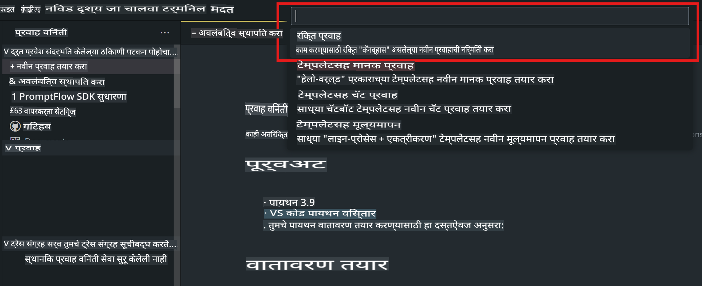
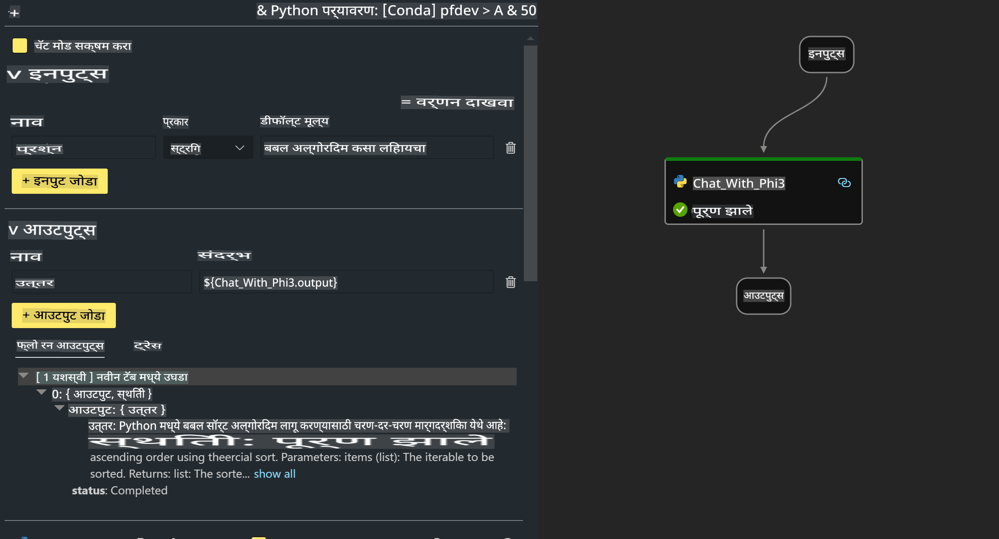

# **लॅब 2 - AIPC मध्ये Phi-3-mini सह Prompt flow चालवा**

## **Prompt flow म्हणजे काय**

Prompt flow हा विकास साधनांचा एक संच आहे, जो LLM-आधारित AI अनुप्रयोगांच्या संपूर्ण विकास प्रक्रियेतील प्रत्येक टप्पा सुलभ करतो. यात कल्पनाशक्ती, प्रोटोटायपिंग, चाचणी, मूल्यमापन, उत्पादनात अंमलबजावणी आणि निरीक्षण यांचा समावेश आहे. यामुळे प्रॉम्प्ट इंजिनिअरिंग अधिक सोपे होते आणि तुम्हाला उत्पादन दर्जाचे LLM अॅप्स तयार करता येतात.

Prompt flow च्या मदतीने तुम्ही हे करू शकता:

- LLMs, प्रॉम्प्ट्स, Python कोड आणि इतर साधने एकत्र जोडून कार्यक्षम वर्कफ्लो तयार करा.

- तुमचे फ्लो डीबग करा आणि विशेषतः LLMs सह संवाद सुलभतेने पुनरावलोकन करा.

- तुमच्या फ्लोचे मूल्यमापन करा आणि मोठ्या डेटासेटसह गुणवत्ता व कार्यक्षमता मेट्रिक्स मोजा.

- चाचणी व मूल्यमापन तुमच्या CI/CD प्रणालीमध्ये समाकलित करा, जेणेकरून तुमच्या फ्लोची गुणवत्ता सुनिश्चित करता येईल.

- तुमचे फ्लो निवडलेल्या सर्व्हिंग प्लॅटफॉर्मवर तैनात करा किंवा तुमच्या अॅपच्या कोड बेसमध्ये सहज समाकलित करा.

- (पर्यायी पण अत्यंत शिफारस केलेले) Azure AI वरील Prompt flow च्या क्लाउड आवृत्तीचा उपयोग करून तुमच्या टीमसोबत सहकार्य करा.

## **AIPC म्हणजे काय**

AI PC मध्ये CPU, GPU आणि NPU असतो, ज्यात प्रत्येकाकडे विशिष्ट AI प्रवेग क्षमता असते. NPU, म्हणजेच Neural Processing Unit, हा एक विशेष प्रवेगक आहे, जो कृत्रिम बुद्धिमत्ता (AI) आणि मशीन लर्निंग (ML) कार्ये तुमच्या PC वरच हाताळतो, डेटा क्लाउडवर प्रक्रिया करण्यासाठी पाठविण्याऐवजी. GPU आणि CPU देखील या कार्यभारावर प्रक्रिया करू शकतात, पण NPU विशेषतः कमी उर्जेच्या AI गणनांमध्ये उत्कृष्ट आहे. AI PC हा आपल्या संगणकांच्या कार्यपद्धतीत एक मूलभूत बदल दर्शवतो. हा पूर्वी अस्तित्वात नसलेल्या समस्येचे समाधान नाही, तर तो दररोजच्या PC वापरासाठी एक मोठे सुधारणा वचन देतो.

तर हे कसे कार्य करते? जनरेटिव्ह AI आणि प्रचंड मोठ्या भाषा मॉडेल्स (LLMs) जे सार्वजनिक डेटावर प्रशिक्षण घेतात, त्याच्या तुलनेत तुमच्या PC वर होणारा AI जवळजवळ प्रत्येक स्तरावर अधिक सुलभ आहे. ही संकल्पना समजायला सोपी आहे आणि कारण ती तुमच्या डेटावर प्रशिक्षित आहे, क्लाउडमध्ये प्रवेश करण्याची गरज नाही, त्यामुळे फायदे अधिक वैयक्तिक, खासगी आणि सुरक्षित आहेत.

निकट भविष्यात, AI PC जगामध्ये वैयक्तिक सहाय्यक आणि लहान AI मॉडेल्स थेट तुमच्या PC वर चालतील, तुमच्या डेटा वापरून तुमच्या रोजच्या कार्यांसाठी अधिक वैयक्तिकृत व सुरक्षित AI सुधारणा देतील – जसे की मीटिंग नोट्स घेणे, फँटसी फुटबॉल लीग आयोजित करणे, फोटो आणि व्हिडिओ संपादनासाठी स्वयंचलित सुधारणा करणे, किंवा कुटुंबियांच्या आगमन व प्रस्थान वेळांवर आधारित परिपूर्ण कार्यक्रम आखणे.

## **AIPC वर जनरेशन कोड फ्लो तयार करणे**

***Note*** ：जर तुम्ही पर्यावरणाची स्थापना पूर्ण केली नसेल, तर कृपया [लॅब 0 -इंस्टॉलेशन्स](./01.Installations.md) ला भेट द्या.

1. Visual Studio Code मध्ये Prompt flow Extension उघडा आणि एक रिक्त फ्लो प्रकल्प तयार करा.



2. Input आणि Output पॅरामिटर्स जोडा आणि नवीन फ्लो म्हणून Python कोड जोडा.



तुमच्या फ्लोचे बांधकाम करण्यासाठी तुम्ही या रचनेचा संदर्भ घेऊ शकता (flow.dag.yaml):

```yaml

inputs:
  question:
    type: string
    default: how to write Bubble Algorithm
outputs:
  answer:
    type: string
    reference: ${Chat_With_Phi3.output}
nodes:
- name: Chat_With_Phi3
  type: python
  source:
    type: code
    path: Chat_With_Phi3.py
  inputs:
    question: ${inputs.question}


```

3. ***Chat_With_Phi3.py*** मध्ये कोड जोडा:

```python


from promptflow.core import tool

# import torch
from transformers import AutoTokenizer, pipeline,TextStreamer
import intel_npu_acceleration_library as npu_lib

import warnings

import asyncio
import platform

class Phi3CodeAgent:
    
    model = None
    tokenizer = None
    text_streamer = None
    
    model_id = "microsoft/Phi-3-mini-4k-instruct"

    @staticmethod
    def init_phi3():
        
        if Phi3CodeAgent.model is None or Phi3CodeAgent.tokenizer is None or Phi3CodeAgent.text_streamer is None:
            Phi3CodeAgent.model = npu_lib.NPUModelForCausalLM.from_pretrained(
                                    Phi3CodeAgent.model_id,
                                    torch_dtype="auto",
                                    dtype=npu_lib.int4,
                                    trust_remote_code=True
                                )
            Phi3CodeAgent.tokenizer = AutoTokenizer.from_pretrained(Phi3CodeAgent.model_id)
            Phi3CodeAgent.text_streamer = TextStreamer(Phi3CodeAgent.tokenizer, skip_prompt=True)

    

    @staticmethod
    def chat_with_phi3(prompt):
        
        Phi3CodeAgent.init_phi3()

        messages = "<|system|>You are a AI Python coding assistant. Please help me to generate code in Python.The answer only genertated Python code, but any comments and instructions do not need to be generated<|end|><|user|>" + prompt +"<|end|><|assistant|>"


        generation_args = {
            "max_new_tokens": 1024,
            "return_full_text": False,
            "temperature": 0.3,
            "do_sample": False,
            "streamer": Phi3CodeAgent.text_streamer,
        }

        pipe = pipeline(
            "text-generation",
            model=Phi3CodeAgent.model,
            tokenizer=Phi3CodeAgent.tokenizer,
            # **generation_args
        )

        result = ''

        with warnings.catch_warnings():
            warnings.simplefilter("ignore")
            response = pipe(messages, **generation_args)
            result =response[0]['generated_text']
            return result


@tool
def my_python_tool(question: str) -> str:
    if platform.system() == 'Windows':
        asyncio.set_event_loop_policy(asyncio.WindowsSelectorEventLoopPolicy())
    return Phi3CodeAgent.chat_with_phi3(question)


```

4. फ्लोची चाचणी Debug किंवा Run मधून करा आणि जनरेशन कोड योग्य आहे का ते तपासा.


5. टर्मिनलमध्ये फ्लोला Development API म्हणून चालवा.

```

pf flow serve --source ./ --port 8080 --host localhost   

```

तुम्ही Postman / Thunder Client मध्ये याची चाचणी करू शकता.

### **टीप**

1. पहिला रन खूप वेळ घेतो. Hugging face CLI वरून phi-3 मॉडेल डाउनलोड करण्याची शिफारस केली जाते.

2. Intel NPU च्या मर्यादित संगणकीय क्षमतेचा विचार करता, Phi-3-mini-4k-instruct वापरण्याची शिफारस केली जाते.

3. आम्ही Intel NPU प्रवेगाचा वापर करून INT4 रूपांतरण क्वांटाईज करतो, परंतु जर तुम्ही सेवा पुन्हा चालवली, तर कॅशे आणि nc_workshop फोल्डर्स हटवावे लागतील.

## **स्रोत**

1. Promptflow शिकण्यासाठी [https://microsoft.github.io/promptflow/](https://microsoft.github.io/promptflow/)

2. Intel NPU Acceleration शिकण्यासाठी [https://github.com/intel/intel-npu-acceleration-library](https://github.com/intel/intel-npu-acceleration-library)

3. नमुना कोड डाउनलोड करा [Local NPU Agent Sample Code](../../../../../../../../../code/07.Lab/01/AIPC)

**अस्वीकरण**:  
हा दस्तऐवज मशीन-आधारित एआय भाषांतर सेवांचा वापर करून अनुवादित केला आहे. आम्ही अचूकतेसाठी प्रयत्नशील असलो तरी, कृपयाआहे कि स्वयंचलित भाषांतरांमध्ये चुका किंवा अचूकतेचा अभाव असू शकतो. मूळ भाषेतील मूळ दस्तऐवज प्रामाणिक स्रोत मानला जावा. महत्त्वाच्या माहितीकरिता, व्यावसायिक मानवी भाषांतराची शिफारस केली जाते. या भाषांतराचा वापर केल्यामुळे उद्भवलेल्या कोणत्याही गैरसमज किंवा चुकीच्या अर्थासाठी आम्ही जबाबदार राहणार नाही.