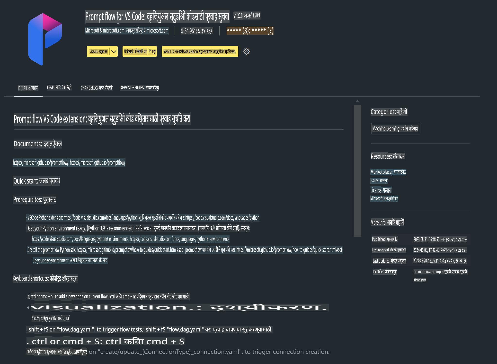

# **लॅब 0 - स्थापना**

लॅबमध्ये प्रवेश करताना संबंधित वातावरण कॉन्फिगर करणे आवश्यक आहे :


### **1. Python 3.11+**

तुमचे Python वातावरण कॉन्फिगर करण्यासाठी miniforge वापरण्याची शिफारस केली जाते.

miniforge कॉन्फिगर करण्यासाठी, कृपया [https://github.com/conda-forge/miniforge](https://github.com/conda-forge/miniforge) येथे जा.

miniforge कॉन्फिगर केल्यानंतर, Power Shell मध्ये खालील कमांड चालवा

```bash

conda create -n pyenv python==3.11.8 -y

conda activate pyenv

```


### **2. Prompt flow SDK स्थापित करा**

लॅब 1 मध्ये, आपण Prompt flow वापरतो, त्यामुळे तुम्हाला Prompt flow SDK कॉन्फिगर करणे आवश्यक आहे.

```bash

pip install promptflow --upgrade

```

तुम्ही या कमांडने promptflow sdk तपासू शकता


```bash

pf --version

```

### **3. Visual Studio Code Prompt flow विस्तार स्थापित करा**



### **4. Apple's MLX फ्रेमवर्क**

MLX हे Apple silicon वर मशीन लर्निंग संशोधनासाठी एक अॅरे फ्रेमवर्क आहे, जे Apple मशीन लर्निंग संशोधनाने आणले आहे. तुम्ही **Apple MLX फ्रेमवर्क** वापरून Apple Silicon सह LLM / SLM वेगाने चालवू शकता. अधिक जाणून घेण्यासाठी, तुम्ही [https://github.com/microsoft/PhiCookBook/blob/main/md/01.Introduction/03/MLX_Inference.md](https://github.com/microsoft/PhiCookBook/blob/main/md/01.Introduction/03/MLX_Inference.md) वाचू शकता.

MLX फ्रेमवर्क लायब्ररी bash मध्ये स्थापित करा


```bash

pip install mlx-lm

```


### **5. इतर Python लायब्ररी**


requirements.txt तयार करा आणि खालील सामग्री जोडा

```txt

notebook
numpy 
scipy 
scikit-learn 
matplotlib 
pandas 
pillow 
graphviz

```


### **6. NVM स्थापित करा**

Powershell मध्ये nvm स्थापित करा 


```bash

brew install nvm

```

nodejs 18.20 स्थापित करा


```bash

nvm install 18.20.0

nvm use 18.20.0

```

### **7. Visual Studio Code विकास समर्थन स्थापित करा**


```bash

npm install --global yo generator-code

```

अभिनंदन! तुम्ही SDK यशस्वीरित्या कॉन्फिगर केले आहे. पुढे, प्रत्यक्ष हाताळणीच्या टप्प्यांकडे जा.

**अस्वीकरण**:  
हा दस्तऐवज मशीन-आधारित एआय भाषांतर सेवांचा वापर करून भाषांतरित केला गेला आहे. आम्ही अचूकतेसाठी प्रयत्नशील असलो तरी, कृपया लक्षात घ्या की स्वयंचलित भाषांतरांमध्ये त्रुटी किंवा अचूकतेचा अभाव असू शकतो. मूळ भाषेतील दस्तऐवज हा प्रामाणिक स्रोत मानला जावा. महत्त्वाच्या माहितीसाठी, व्यावसायिक मानवी भाषांतराची शिफारस केली जाते. या भाषांतराच्या वापरामुळे होणाऱ्या कोणत्याही गैरसमजुतींसाठी किंवा चुकीच्या अर्थ लावण्यास आम्ही जबाबदार राहणार नाही.