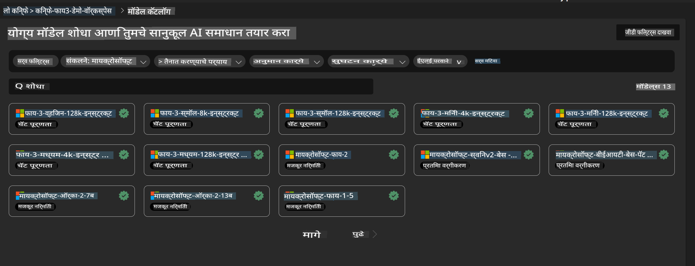
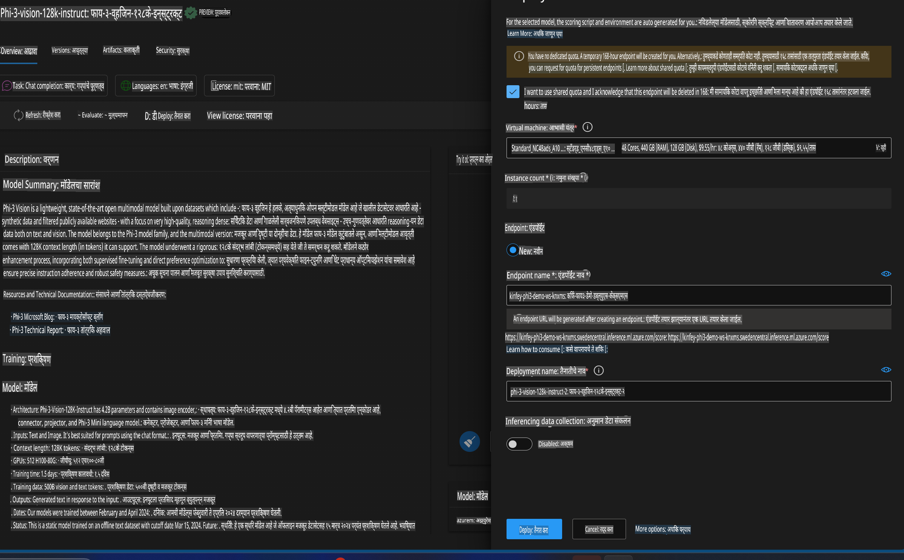

# **लॅब 3 - Azure Machine Learning Service वर Phi-3-Vision तैनात करा**

स्थानिक कोडचे उत्पादन तैनाती पूर्ण करण्यासाठी आपण NPU चा वापर करतो आणि नंतर PHI-3-VISION च्या क्षमतेचा परिचय करून त्याद्वारे चित्रांमधून कोड निर्माण करण्याचा उद्देश आहे.

या परिचयाद्वारे, आपण Azure Machine Learning Service मध्ये लवकरच Model As Service म्हणून Phi-3 Vision सेवा तयार करू शकतो.

***टीप***: Phi-3 Vision ला जलद गतीने सामग्री निर्माण करण्यासाठी संगणकीय शक्तीची आवश्यकता असते. हे साध्य करण्यासाठी आपल्याला क्लाऊड संगणकीय शक्तीची मदत घ्यावी लागेल.

### **1. Azure Machine Learning Service तयार करा**

आपल्याला Azure Portal मध्ये Azure Machine Learning Service तयार करावी लागेल. कसे करायचे हे शिकायचे असल्यास, कृपया हा दुवा पहा [https://learn.microsoft.com/azure/machine-learning/quickstart-create-resources?view=azureml-api-2](https://learn.microsoft.com/azure/machine-learning/quickstart-create-resources?view=azureml-api-2)

### **2. Azure Machine Learning Service मध्ये Phi-3 Vision निवडा**



### **3. Azure मध्ये Phi-3-Vision तैनात करा**



### **4. Postman मध्ये Endpoint तपासा**


***टीप***

1. पाठवायचे असलेले parameters मध्ये Authorization, azureml-model-deployment, आणि Content-Type समाविष्ट असणे आवश्यक आहे. तैनातीची माहिती तपासून ती मिळवा.

2. parameters पाठवण्यासाठी, Phi-3-Vision ला image link पाठवावी लागेल. कृपया GPT-4-Vision पद्धतीचा संदर्भ घ्या, जसे की

```json

{
  "input_data":{
    "input_string":[
      {
        "role":"user",
        "content":[ 
          {
            "type": "text",
            "text": "You are a Python coding assistant.Please create Python code for image "
          },
          {
              "type": "image_url",
              "image_url": {
                "url": "https://ajaytech.co/wp-content/uploads/2019/09/index.png"
              }
          }
        ]
      }
    ],
    "parameters":{
          "temperature": 0.6,
          "top_p": 0.9,
          "do_sample": false,
          "max_new_tokens": 2048
    }
  }
}

```

3. **/score** ला Post पद्धतीने कॉल करा.

**अभिनंदन**！आपण जलद PHI-3-VISION तैनात करण्याचे कार्य पूर्ण केले आहे आणि चित्रांमधून कोड तयार करण्यासाठी कसे वापरायचे हे शिकले आहे. पुढे, आपण NPU आणि क्लाऊड यांचा एकत्रितपणे वापर करून अॅप्लिकेशन्स तयार करू शकतो.

**अस्वीकरण**:  
हा दस्तऐवज मशीन-आधारित एआय भाषांतर सेवांचा वापर करून अनुवादित केला आहे. आम्ही अचूकतेसाठी प्रयत्नशील असलो तरी, कृपया लक्षात घ्या की स्वयंचलित अनुवादांमध्ये त्रुटी किंवा अचूकतेचा अभाव असू शकतो. मूळ भाषेतील मूळ दस्तऐवज हा अधिकृत स्रोत मानला जावा. महत्वाच्या माहितीसाठी, व्यावसायिक मानवी भाषांतराची शिफारस केली जाते. या अनुवादाचा वापर केल्यामुळे उद्भवलेल्या कोणत्याही गैरसमजुती किंवा चुकीच्या अर्थासाठी आम्ही जबाबदार राहणार नाही.