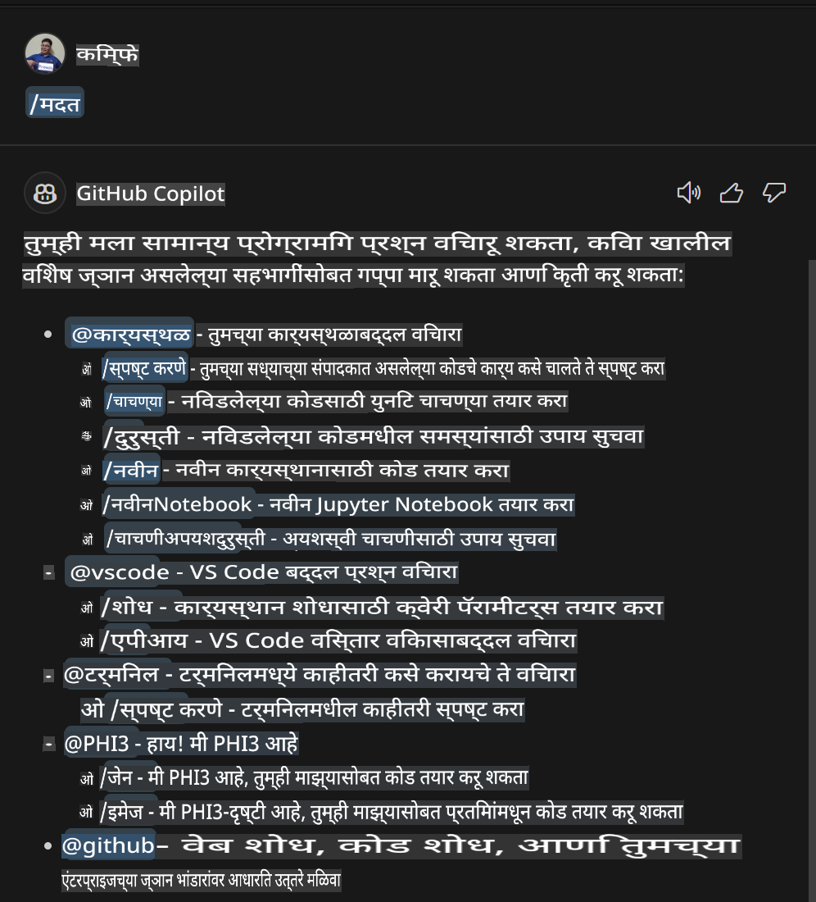
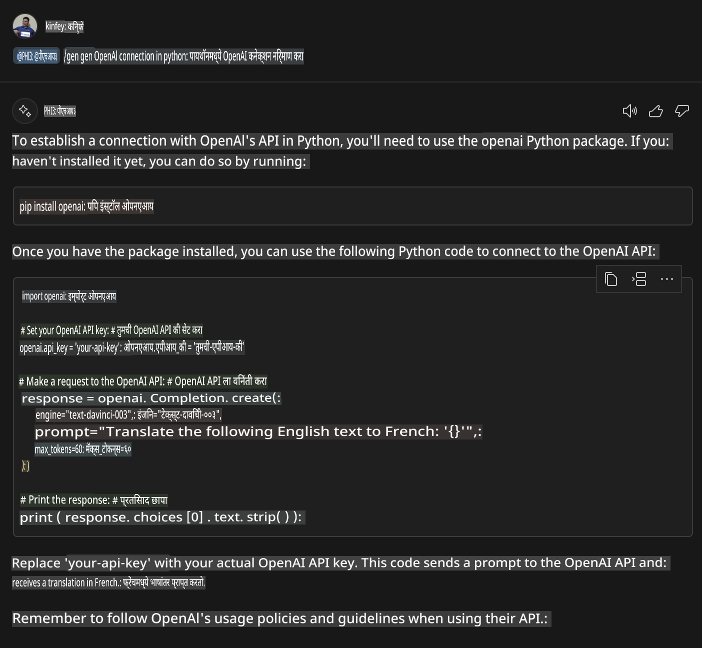

# **लॅब 3 - GitHub Copilot Chat मध्ये @PHI3 एजंट तयार करा**

Visual Studio Code Copilot Chat मध्ये, तुम्ही @workspace च्या माध्यमातून संपूर्ण प्रकल्प व्यवस्थापित करू शकता. एंटरप्राइझ परिदृश्यांसाठी, आपण Copilot Chat चा Agent अधिक लवचिकतेने सानुकूलित करू शकतो.

गेल्या लॅबमध्ये, आपण MX फ्रेमवर्क आणि क्लाउड एकत्रित करून Phi3 Agent साठी Visual Studio Code Extension पूर्ण केले.



### **1. VSCode डेव्हलपमेंट एक्सटेंशन तयार करा**

कृपया या लिंकला भेट द्या [https://code.visualstudio.com/api/get-started/your-first-extension](https://code.visualstudio.com/api/get-started/your-first-extension) एक्सटेंशन प्रकल्प तयार करण्यासाठी.

***टीप:*** कृपया या प्रकल्पासाठी Typescript, WebPack हे तांत्रिक समाधान वापरा.

### **2. vscode.d.ts जोडा**

Visual Studio Code Chat API अद्याप कोड API मध्ये समाविष्ट केलेले नाही, परंतु आता ते एक्सटेंशन्सद्वारे जोडले जाते.

vscode.d.ts डाउनलोड करा [https://github.com/microsoft/vscode/blob/main/src/vscode-dts/vscode.d.ts](https://github.com/microsoft/vscode/blob/main/src/vscode-dts/vscode.d.ts)

***टीप:*** कृपया हे Visual Studio Code Insiders 1.90+ मध्ये चालवा.

### **3. package.json अद्यतनित करा**

```json

{
  "name": "phi3ext",
  "displayName": "phi3ext",
  "description": "",
  "version": "0.0.1",
  "engines": {
    "vscode": "^1.90.0"
  },
  "categories": [
      "AI",
      "Chat"
  ],
  "activationEvents": [],
  "enabledApiProposals": [
      "chatVariableResolver"
  ],
  "main": "./dist/extension.js",
  "contributes": {
      "chatParticipants": [
          {
              "id": "chat.PHI3",
              "name": "PHI3",
              "description": "Hey! I am PHI3",
              "isSticky": true,
              "commands": [
                  {
                      "name": "gen",
                      "description": "I am PHI3, you can gen code with me"
                  },
                  {
                      "name": "img",
                      "description": "I am PHI3-vision, you can gen code from img with me"
                  }
              ]
          }
      ],
      "commands": [
          {
              "command": "PHI3.namesInEditor",
              "title": "Use PHI3 in Editor"
          }
      ]
  },  
  "scripts": {
    "vscode:prepublish": "npm run package",
    "compile": "webpack",
    "watch": "webpack --watch",
    "package": "webpack --mode production --devtool hidden-source-map",
    "compile-tests": "tsc -p . --outDir out",
    "watch-tests": "tsc -p . -w --outDir out",
    "pretest": "npm run compile-tests && npm run compile && npm run lint",
    "lint": "eslint src --ext ts",
    "test": "vscode-test"
  },
  "devDependencies": {
    "@types/vscode": "^1.90.0",
    "@types/mocha": "^10.0.6",
    "@types/node": "18.x",
    "@typescript-eslint/eslint-plugin": "^7.11.0",
    "@typescript-eslint/parser": "^7.11.0",
    "eslint": "^8.57.0",
    "typescript": "^5.4.5",
    "ts-loader": "^9.5.1",
    "webpack": "^5.91.0",
    "webpack-cli": "^5.1.4",
    "@vscode/test-cli": "^0.0.9",
    "@vscode/test-electron": "^2.4.0"
  },
  "dependencies": {
    "@types/node-fetch": "^2.6.11",
    "node-fetch": "^3.3.2"
  }
}

```

तुम्ही टर्मिनलमध्ये **npm install** चालवू शकता आणि तुमचे एक्सटेंशन डिबग करून चाचणी करू शकता.

***नमुन्य कोड डाउनलोड करा*** [इथे क्लिक करा](../../../../../../../../../code/07.Lab/01/Apple)

### **4. src/extension.ts बदला**

```ts

// The module 'vscode' contains the VS Code extensibility API
// Import the module and reference it with the alias vscode in your code below
import * as vscode from 'vscode';


interface IPHI3ChatResult extends vscode.ChatResult {
    metadata: {
        command: string;
    }
}


// This method is called when your extension is activated
// Your extension is activated the very first time the command is executed
export function activate(extcontext: vscode.ExtensionContext) {


	// Define a SHEIN chat handler. 
	const phi3handler: vscode.ChatRequestHandler = async (request: vscode.ChatRequest, context: vscode.ChatContext, stream: vscode.ChatResponseStream, token: vscode.CancellationToken): Promise<IPHI3ChatResult> => {

		if (request.command == 'gen') {

			const content = "Welcome to Phi-3 to gen code";

			const result = await gen(request.prompt);

			const code = result;
			
			
			stream.markdown(code)


            return { metadata: { command: 'gen' } };

		}
		if (request.command == 'img') {

			const content = "Welcome to Phi-3 vision to gen code in image";

			const prompt = request.prompt;

			if(prompt.indexOf("(IMG_URL:")>-1){

				const img_url = prompt.split("(IMG_URL:")[1].split(")")[0];
				const question = prompt.split("(IMG_URL:")[0];
				const tmp = question;

				const result = await genImage(question,img_url);
	
				const code = result;
				
				
				stream.markdown(code)
	
	
				return { metadata: { command: 'img' } };
			}
			else
			{
				var result = "Please ask question like this Your question (IMG_URL:https://example.com/image.jpg)";
				stream.markdown(result);
			}


            return { metadata: { command: 'img' } };

		}


		return { metadata: { command: '' } };

	}


	const phi3 = vscode.chat.createChatParticipant("chat.PHI3", phi3handler);

	phi3.iconPath = new vscode.ThemeIcon('sparkle');


    phi3.followupProvider = {
        provideFollowups(result: IPHI3ChatResult, context: vscode.ChatContext, token: vscode.CancellationToken) {
            return [{
                prompt: 'let us code with Phi-3 Family',
                label: vscode.l10n.t('Dev with Phi-3 Family'),
                command: 'help'
            } satisfies vscode.ChatFollowup];
        }
    };

	extcontext.subscriptions.push(phi3);
}


interface GenCode {
	prompt: string;
}

interface ImgGenCodeResponse {
	output: string;
}


interface GenCodeResponse {
	result: string;
}

async function gen(prompt: string) {

	const postData: GenCode = {
		prompt: prompt
	};
	const response = await fetch('http://localhost:8080/score', {
		method: 'POST',
		body: JSON.stringify(postData),
		headers: { 'Content-Type': 'application/json' }
	});
	const post = await response.json();
	const resultResponse = post as GenCodeResponse;
	return resultResponse.result;
}

async function genImage(prompt: string, img_url: string) {

	// const postData: GenCode = {
	// 	question: prompt
	// };
	const response = await fetch('Your Phi-3 Endpoint', {
		method: 'POST',
		body: JSON.stringify({
			"input_data":{
			  "input_string":[
				{
				  "role":"user",
				  "content":[ 
					{
					  "type": "text",
					  "text": prompt
					},
					{
						"type": "image_url",
						"image_url": {
						  "url": img_url
						}
					}
				  ]
				}
			  ],
			  "parameters":{
					"temperature": 0.6,
					"top_p": 0.9,
					"do_sample": false,
					"max_new_tokens": 2048
			  }
			}
		}),
		headers: { 'Content-Type': 'application/json', 'Authorization' : 'Bearer Your Phi-3-Vision Endpoint Key', 'azureml-model-deployment': 'Your Phi-3-Vision Deployment Name' }
	});
	const post = await response.json();
	const resultResponse = post as ImgGenCodeResponse;
	return resultResponse.output;
}

// This method is called when your extension is deactivated
export function deactivate() {}


```

अभिनंदन! तुम्ही सर्व लॅब्स पूर्ण केल्या आहेत. आशा आहे की यामुळे तुम्हाला Phi-3 कुटुंब समजून घेण्यास आणि GitHub Copilot Chat कसे वापरायचे हे शिकण्यास मदत झाली.

तुम्ही ***@PHI3 /gen*** वापरून पाहू शकता.



तुम्ही ***@PHI3 /img*** वापरून पाहू शकता.


**अस्वीकरण**:  
हे दस्तऐवज मशीन-आधारित एआय भाषांतर सेवा वापरून अनुवादित केले गेले आहे. आम्ही अचूकतेसाठी प्रयत्नशील असलो तरी, कृपया लक्षात घ्या की स्वयंचलित भाषांतरांमध्ये त्रुटी किंवा अचूकतेचा अभाव असू शकतो. मूळ भाषेतील मूळ दस्तऐवज हा प्राधिकृत स्रोत मानला जावा. महत्त्वाच्या माहितीसाठी व्यावसायिक मानव भाषांतराची शिफारस केली जाते. या भाषांतराच्या वापरामुळे होणाऱ्या कोणत्याही गैरसमजुतींसाठी किंवा चुकीच्या अर्थ लावण्यासाठी आम्ही जबाबदार राहणार नाही.