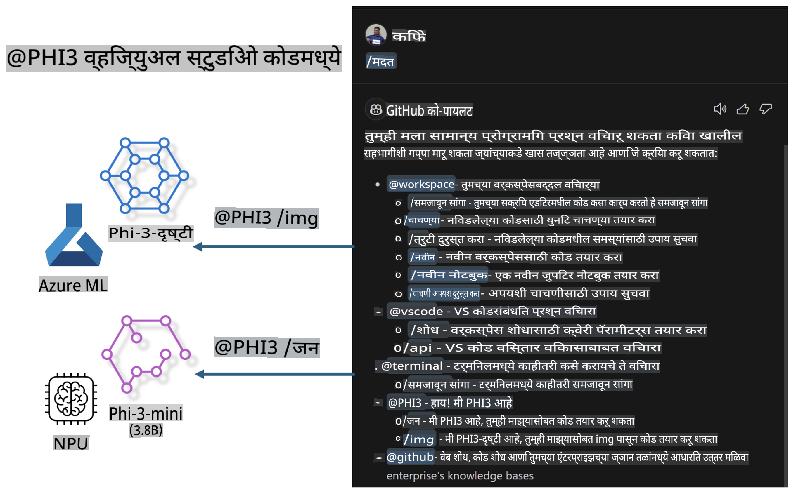

# **तुमच्या स्वतःच्या Visual Studio Code GitHub Copilot Chat चा Microsoft Phi-3 Family वापरून निर्माण करा**

तुम्ही GitHub Copilot Chat मधील workspace agent वापरला आहे का? तुम्हाला तुमच्या टीमसाठी स्वतःचा कोड एजंट तयार करायचा आहे का? या हँड्स-ऑन लॅबमध्ये ओपन सोर्स मॉडेलचा वापर करून एंटरप्राइझ-लेव्हल कोड बिझनेस एजंट तयार करण्याचा उद्देश आहे.

## **मूलभूत माहिती**

### **Microsoft Phi-3 का निवडावे**

Phi-3 ही एक फॅमिली सिरीज आहे, ज्यामध्ये phi-3-mini, phi-3-small, आणि phi-3-medium यांचा समावेश आहे, जे टेक्स्ट जनरेशन, डायलॉग कम्प्लीशन आणि कोड जनरेशनसाठी वेगवेगळ्या ट्रेनिंग पॅरामीटर्सवर आधारित आहेत. याशिवाय, Vision आधारित phi-3-vision देखील उपलब्ध आहे. हे एंटरप्राइझेस किंवा विविध टीम्ससाठी ऑफलाइन जनरेटिव्ह AI सोल्यूशन्स तयार करण्यासाठी उपयुक्त आहे.

हे लिंक वाचण्याची शिफारस केली जाते [https://github.com/microsoft/PhiCookBook/blob/main/md/01.Introduction/01/01.PhiFamily.md](https://github.com/microsoft/PhiCookBook/blob/main/md/01.Introduction/01/01.PhiFamily.md)

### **Microsoft GitHub Copilot Chat**

GitHub Copilot Chat एक्स्टेंशन तुम्हाला चॅट इंटरफेस देते, ज्यामुळे तुम्ही GitHub Copilot सोबत संवाद साधू शकता आणि VS Code मध्ये थेट कोडिंग-संबंधित प्रश्नांची उत्तरे मिळवू शकता, ज्यासाठी डॉक्युमेंटेशन किंवा ऑनलाइन फोरम शोधण्याची गरज नाही.

Copilot Chat सिंटॅक्स हायलाइटिंग, इंडेंटेशन आणि इतर फॉरमॅटिंग वैशिष्ट्यांचा वापर करून तयार प्रतिसाद अधिक स्पष्ट करते. युजरने विचारलेल्या प्रश्नानुसार, परिणामामध्ये Copilot ने वापरलेल्या संदर्भांशी संबंधित लिंक्स, जसे की सोर्स कोड फाइल्स किंवा डॉक्युमेंटेशन, किंवा VS Code फंक्शनॅलिटी ऍक्सेस करण्यासाठी बटणांचा समावेश असतो.

- Copilot Chat तुमच्या डेव्हलपर फ्लोमध्ये समाकलित होते आणि जिथे आवश्यक आहे तिथे मदत करते:

- एडिटर किंवा टर्मिनलमधून थेट इनलाइन चॅट संवाद सुरू करा जेव्हा तुम्ही कोडिंग करत असता

- साइडला AI सहाय्यक म्हणून Chat view वापरा, जो कधीही मदत करण्यासाठी उपलब्ध असेल

- क्विक चॅट सुरू करा, झटपट प्रश्न विचारण्यासाठी आणि तुमच्या कामात परत येण्यासाठी

तुम्ही GitHub Copilot Chat खालीलप्रमाणे विविध परिस्थितींमध्ये वापरू शकता:

- समस्येचे उत्तम निराकरण कसे करावे यावर कोडिंग प्रश्नांची उत्तरे देणे

- इतरांच्या कोडचे स्पष्टीकरण देणे आणि सुधारणा सुचवणे

- कोड फिक्सेस प्रस्तावित करणे

- युनिट टेस्ट केसेस जनरेट करणे

- कोड डॉक्युमेंटेशन तयार करणे

हे लिंक वाचण्याची शिफारस केली जाते [https://code.visualstudio.com/docs/copilot/copilot-chat](https://code.visualstudio.com/docs/copilot/copilot-chat?WT.mc_id=aiml-137032-kinfeylo)

### **Microsoft GitHub Copilot Chat @workspace**

Copilot Chat मध्ये **@workspace** संदर्भित केल्याने तुम्हाला संपूर्ण कोडबेसबद्दल प्रश्न विचारता येतात. प्रश्नाच्या आधारे, Copilot हुशारीने संबंधित फाइल्स आणि सिंबॉल्स शोधतो आणि नंतर उत्तरांमध्ये लिंक्स व कोड उदाहरणांसह संदर्भित करतो.

तुमच्या प्रश्नाचे उत्तर देण्यासाठी, **@workspace** VS Code मध्ये कोडबेस नेव्हिगेट करताना डेव्हलपर ज्या स्रोतांचा वापर करतो त्याच स्रोतांचा शोध घेतो:

- workspace मधील सर्व फाइल्स, .gitignore फाइलद्वारे दुर्लक्षित फाइल्स वगळता

- डायरेक्टरी स्ट्रक्चर, ज्यामध्ये नेस्टेड फोल्डर आणि फाइल नावे असतात

- GitHub चा कोड सर्च इंडेक्स, जर workspace GitHub रेपॉझिटरी असेल आणि कोड सर्चद्वारे इंडेक्स केलेले असेल

- workspace मधील सिंबॉल्स आणि डेफिनेशन्स

- सध्या निवडलेला टेक्स्ट किंवा अॅक्टिव्ह एडिटरमधील दृश्यमान टेक्स्ट

टीप: जर तुम्ही एखादी फाइल उघडली असेल किंवा दुर्लक्षित फाइलमधील टेक्स्ट निवडले असेल, तर .gitignore वगळले जाते.

हे लिंक वाचण्याची शिफारस केली जाते [https://code.visualstudio.com/docs/copilot/copilot-chat](https://code.visualstudio.com/docs/copilot/workspace-context?WT.mc_id=aiml-137032-kinfeylo)

## **या लॅबबद्दल अधिक जाणून घ्या**

GitHub Copilot ने एंटरप्राइझेसची प्रोग्रामिंग कार्यक्षमता मोठ्या प्रमाणावर सुधारली आहे, आणि प्रत्येक एंटरप्राइझ GitHub Copilot च्या संबंधित फंक्शन्स कस्टमाईज करण्याची अपेक्षा करते. अनेक एंटरप्राइझेसनी त्यांच्या स्वतःच्या बिझनेस परिस्थिती आणि ओपन सोर्स मॉडेल्सवर आधारित GitHub Copilot सारख्या एक्स्टेंशन्स कस्टमाईज केल्या आहेत. एंटरप्राइझेससाठी, कस्टमाईज्ड एक्स्टेंशन्स अधिक नियंत्रित करणे सोपे असते, परंतु यामुळे युजर अनुभवावर परिणाम होतो. शेवटी, GitHub Copilot सामान्य परिस्थिती आणि व्यावसायिकतेच्या बाबतीत अधिक शक्तिशाली आहे. जर अनुभव सातत्यपूर्ण ठेवता आला, तर एंटरप्राइझचे स्वतःचे एक्स्टेंशन कस्टमाईज करणे चांगले होईल. GitHub Copilot Chat चॅट अनुभवात विस्तार करण्यासाठी संबंधित API प्रदान करते. सातत्यपूर्ण अनुभव राखणे आणि कस्टमाईज्ड फंक्शन्स असणे हा एक चांगला युजर अनुभव आहे.

या लॅबमध्ये प्रामुख्याने Phi-3 मॉडेलचा वापर करून स्थानिक NPU आणि Azure हायब्रिड यांचा वापर करून GitHub Copilot Chat मध्ये कस्टम एजंट तयार केला जातो ***@PHI3*** जो एंटरप्राइझ डेव्हलपर्सना कोड जनरेशन ***(@PHI3 /gen)*** पूर्ण करण्यात आणि प्रतिमांवर आधारित कोड जनरेट करण्यात ***(@PHI3 /img)*** सहाय्य करतो.

### ***टीप:***

हा लॅब सध्या Intel CPU आणि Apple Silicon च्या AIPC मध्ये अंमलात आणला जात आहे. आम्ही Qualcomm च्या NPU चा व्हर्जन अपडेट करत राहू.

## **लॅब**

| नाव | वर्णन | AIPC | Apple |
| ------------ | ----------- | -------- |-------- |
| Lab0 - Installations(✅) | संबंधित वातावरण आणि इंस्टॉलेशन टूल्स कॉन्फिगर आणि इन्स्टॉल करा | [Go](./HOL/AIPC/01.Installations.md) |[Go](./HOL/Apple/01.Installations.md) |
| Lab1 - Run Prompt flow with Phi-3-mini (✅) | AIPC / Apple Silicon सोबत Phi-3-mini चा वापर करून स्थानिक NPU वर कोड जनरेशन तयार करा | [Go](./HOL/AIPC/02.PromptflowWithNPU.md) |  [Go](./HOL/Apple/02.PromptflowWithMLX.md) |
| Lab2 - Deploy Phi-3-vision on Azure Machine Learning Service(✅) | Azure Machine Learning Service च्या Model Catalog - Phi-3-vision प्रतिमा डिप्लॉय करून कोड जनरेट करा | [Go](./HOL/AIPC/03.DeployPhi3VisionOnAzure.md) |[Go](./HOL/Apple/03.DeployPhi3VisionOnAzure.md) |
| Lab3 - Create a @phi-3 agent in GitHub Copilot Chat(✅)  | GitHub Copilot Chat मध्ये कस्टम Phi-3 एजंट तयार करा, जो कोड जनरेशन, ग्राफ जनरेशन कोड, RAG, इत्यादी पूर्ण करतो | [Go](./HOL/AIPC/04.CreatePhi3AgentInVSCode.md) | [Go](./HOL/Apple/04.CreatePhi3AgentInVSCode.md) |
| Sample Code (✅)  | सॅम्पल कोड डाउनलोड करा | [Go](../../../../../../../code/07.Lab/01/AIPC) | [Go](../../../../../../../code/07.Lab/01/Apple) |

## **स्रोत**

1. Phi-3 Cookbook [https://github.com/microsoft/Phi-3CookBook](https://github.com/microsoft/Phi-3CookBook)

2. GitHub Copilot बद्दल अधिक जाणून घ्या [https://learn.microsoft.com/training/paths/copilot/](https://learn.microsoft.com/training/paths/copilot/?WT.mc_id=aiml-137032-kinfeylo)

3. GitHub Copilot Chat बद्दल अधिक जाणून घ्या [https://learn.microsoft.com/training/paths/accelerate-app-development-using-github-copilot/](https://learn.microsoft.com/training/paths/accelerate-app-development-using-github-copilot/?WT.mc_id=aiml-137032-kinfeylo)

4. GitHub Copilot Chat API बद्दल अधिक जाणून घ्या [https://code.visualstudio.com/api/extension-guides/chat](https://code.visualstudio.com/api/extension-guides/chat?WT.mc_id=aiml-137032-kinfeylo)

5. Azure AI Foundry बद्दल अधिक जाणून घ्या [https://learn.microsoft.com/training/paths/create-custom-copilots-ai-studio/](https://learn.microsoft.com/training/paths/create-custom-copilots-ai-studio/?WT.mc_id=aiml-137032-kinfeylo)

6. Azure AI Foundry च्या Model Catalog बद्दल अधिक जाणून घ्या [https://learn.microsoft.com/azure/ai-studio/how-to/model-catalog-overview](https://learn.microsoft.com/azure/ai-studio/how-to/model-catalog-overview)

**अस्वीकृती**:  
हे दस्तऐवज मशीन-आधारित एआय भाषांतर सेवा वापरून भाषांतरित केले गेले आहे. आम्ही अचूकतेसाठी प्रयत्नशील असलो तरी, कृपया लक्षात घ्या की स्वयंचलित भाषांतरांमध्ये त्रुटी किंवा अचूकतेचा अभाव असू शकतो. मूळ भाषेतील मूळ दस्तऐवज हा अधिकृत स्रोत मानला पाहिजे. महत्त्वाच्या माहितीसाठी व्यावसायिक मानव भाषांतराचा सल्ला घेणे शिफारसीय आहे. या भाषांतराच्या वापरामुळे होणाऱ्या कोणत्याही गैरसमज किंवा चुकीच्या अर्थ लावण्याबद्दल आम्ही जबाबदार राहणार नाही.