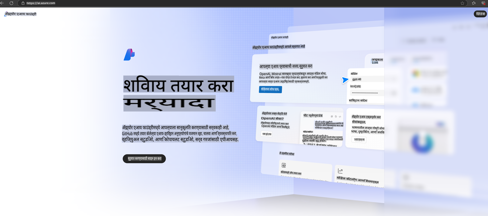

# **Azure AI Foundry मध्ये Phi-3 चा वापर**

जनरेटिव्ह AI च्या विकासासह, आम्हाला एक एकत्रित प्लॅटफॉर्म वापरण्याची आशा आहे जो वेगवेगळ्या LLM आणि SLM, एंटरप्राइझ डेटा इंटिग्रेशन, फाइन-ट्यूनिंग/RAG ऑपरेशन्स आणि LLM आणि SLM समाकलित केल्यानंतर विविध एंटरप्राइझ व्यवसायांचे मूल्यमापन व्यवस्थापित करू शकेल. यामुळे जनरेटिव्ह AI स्मार्ट अनुप्रयोग अधिक चांगल्या प्रकारे अंमलात आणता येतील. [Azure AI Foundry](https://ai.azure.com) हे एंटरप्राइझ-स्तरीय जनरेटिव्ह AI अनुप्रयोग प्लॅटफॉर्म आहे.

Azure AI Foundry च्या मदतीने, तुम्ही मोठ्या भाषा मॉडेल (LLM) च्या प्रतिसादांचे मूल्यमापन करू शकता आणि प्रॉम्प्ट फ्लोच्या सहाय्याने प्रॉम्प्ट अनुप्रयोग घटकांचे समन्वय करू शकता, ज्यामुळे कार्यक्षमता सुधारली जाते. हा प्लॅटफॉर्म प्रूफ ऑफ कॉन्सेप्ट्स सहजतेने पूर्ण उत्पादनात रूपांतरित करण्यासाठी स्केलेबिलिटी सुलभ करतो. सतत देखरेख आणि परिष्करण दीर्घकालीन यशासाठी समर्थन देते.

आम्ही सोप्या पायऱ्यांद्वारे Azure AI Foundry वर Phi-3 मॉडेल पटकन तैनात करू शकतो आणि त्यानंतर Azure AI Foundry वापरून Phi-3 संबंधित Playground/Chat, Fine-tuning, मूल्यांकन आणि इतर संबंधित कार्य पूर्ण करू शकतो.

## **1. तयारी**

जर तुमच्या संगणकावर आधीपासूनच [Azure Developer CLI](https://learn.microsoft.com/azure/developer/azure-developer-cli/overview?WT.mc_id=aiml-138114-kinfeylo) इन्स्टॉल केलेले असेल, तर या टेम्पलेटचा वापर नवीन डिरेक्टरीत फक्त हा आदेश चालवणे इतके सोपे आहे.

## मॅन्युअल निर्मिती

Microsoft Azure AI Foundry प्रकल्प आणि हब तयार करणे तुमचे AI काम आयोजित आणि व्यवस्थापित करण्याचा एक उत्तम मार्ग आहे. सुरुवात करण्यासाठी येथे स्टेप-बाय-स्टेप मार्गदर्शिका दिली आहे:

### Azure AI Foundry मध्ये प्रकल्प तयार करणे

1. **Azure AI Foundry वर जा**: Azure AI Foundry पोर्टलवर साइन इन करा.
2. **प्रकल्प तयार करा**:
   - जर तुम्ही एखाद्या प्रकल्पात असाल, तर होम पेजवर जाण्यासाठी पृष्ठाच्या वरील डाव्या कोपर्‍यात "Azure AI Foundry" निवडा.
   - "+ Create project" निवडा.
   - प्रकल्पासाठी नाव प्रविष्ट करा.
   - जर तुमच्याकडे हब असेल, तर तो डिफॉल्टने निवडला जाईल. जर तुम्हाला एकापेक्षा जास्त हबसाठी प्रवेश असेल, तर तुम्ही ड्रॉपडाऊनमधून वेगळा हब निवडू शकता. जर तुम्हाला नवीन हब तयार करायचा असेल, तर "Create new hub" निवडा आणि नाव द्या.
   - "Create" निवडा.

### Azure AI Foundry मध्ये हब तयार करणे

1. **Azure AI Foundry वर जा**: तुमच्या Azure खात्यासह साइन इन करा.
2. **हब तयार करा**:
   - डाव्या मेनूमधून व्यवस्थापन केंद्र निवडा.
   - "All resources" निवडा, त्यानंतर "+ New project" च्या खालील बाणावर क्लिक करा आणि "+ New hub" निवडा.
   - "Create a new hub" डायलॉगमध्ये, तुमच्या हबसाठी नाव प्रविष्ट करा (उदा., contoso-hub) आणि इतर फील्ड आवश्यकतेनुसार बदला.
   - "Next" निवडा, माहिती पुनरावलोकन करा आणि नंतर "Create" निवडा.

अधिक तपशीलवार सूचना मिळवण्यासाठी, तुम्ही अधिकृत [Microsoft दस्तऐवज](https://learn.microsoft.com/azure/ai-studio/how-to/create-projects) पाहू शकता.

यशस्वी निर्मितीनंतर, तुम्ही [ai.azure.com](https://ai.azure.com/) द्वारे तयार केलेल्या स्टुडिओमध्ये प्रवेश करू शकता.

एका AI Foundry वर एकापेक्षा जास्त प्रकल्प असू शकतात. AI Foundry मध्ये प्रकल्प तयार करून तयारी करा.

Azure AI Foundry [QuickStarts](https://learn.microsoft.com/azure/ai-studio/quickstarts/get-started-code) तयार करा.

## **2. Azure AI Foundry मध्ये Phi मॉडेल तैनात करा**

प्रकल्पाच्या Explore पर्यायावर क्लिक करा, Model Catalog मध्ये प्रवेश करा आणि Phi-3 निवडा.

Phi-3-mini-4k-instruct निवडा.

Phi-3-mini-4k-instruct मॉडेल तैनात करण्यासाठी 'Deploy' क्लिक करा.

> [!NOTE]
>
> तैनाती करताना तुम्ही संगणकीय शक्ती निवडू शकता.

## **3. Azure AI Foundry मध्ये Playground Chat Phi**

तैनाती पृष्ठावर जा, Playground निवडा आणि Azure AI Foundry च्या Phi-3 सोबत चॅट करा.

## **4. Azure AI Foundry मधून मॉडेल तैनात करणे**

Azure Model Catalog मधून मॉडेल तैनात करण्यासाठी, तुम्ही खालील चरणांचे अनुसरण करू शकता:

- Azure AI Foundry वर साइन इन करा.
- Azure AI Foundry च्या मॉडेल कॅटलॉगमधून तुम्हाला तैनात करायचे मॉडेल निवडा.
- मॉडेलच्या तपशील पृष्ठावर, Deploy निवडा आणि नंतर Serverless API with Azure AI Content Safety निवडा.
- तुमच्या मॉडेल्स तैनात करण्यासाठी प्रकल्प निवडा. Serverless API ऑफरिंग वापरण्यासाठी, तुमचे वर्कस्पेस East US 2 किंवा Sweden Central प्रदेशात असणे आवश्यक आहे. तुम्ही Deployment नाव सानुकूलित करू शकता.
- तैनाती विजार्डवर, किंमत आणि अटींविषयी जाणून घेण्यासाठी Pricing and terms निवडा.
- Deploy निवडा. तैनाती तयार होईपर्यंत थांबा आणि तुम्हाला Deployments पृष्ठावर पुनर्निर्देशित केले जाईल.
- मॉडेलशी संवाद साधण्यासाठी Open in playground निवडा.
- तुम्ही Deployments पृष्ठावर परत जाऊ शकता, तैनात केलेले मॉडेल निवडू शकता आणि तैनातीच्या Target URL आणि Secret Key लक्षात ठेवू शकता, ज्याचा वापर तुम्ही तैनाती कॉल करण्यासाठी आणि पूर्णता निर्माण करण्यासाठी करू शकता.
- तुम्ही Build टॅबवर नेव्हिगेट करून आणि Components विभागातून Deployments निवडून नेहमी Endpoint चा तपशील, URL आणि Access Keys शोधू शकता.

> [!NOTE]
> कृपया लक्षात घ्या की ही पावले करण्यासाठी तुमच्या खात्याकडे Resource Group वर Azure AI Developer भूमिका परवानग्या असणे आवश्यक आहे.

## **5. Azure AI Foundry मध्ये Phi API चा वापर**

Postman च्या GET च्या माध्यमातून https://{तुमच्या प्रकल्पाचे नाव}.region.inference.ml.azure.com/swagger.json येथे प्रवेश करू शकता आणि Key सह एकत्रित करून प्रदान केलेल्या इंटरफेसविषयी माहिती मिळवू शकता.

तुम्ही विनंतीचे पॅरामिटर्स तसेच प्रतिसादाचे पॅरामिटर्स सहजपणे मिळवू शकता.

**अस्वीकरण**:  
हा दस्तऐवज मशीन-आधारित एआय अनुवाद सेवांचा वापर करून अनुवादित करण्यात आला आहे. आम्ही अचूकतेसाठी प्रयत्नशील असलो तरी, कृपया लक्षात घ्या की स्वयंचलित अनुवादांमध्ये त्रुटी किंवा अचूकतेचा अभाव असू शकतो. मूळ भाषेतील मूळ दस्तऐवज हा अधिकृत स्रोत मानावा. महत्त्वाच्या माहितीसाठी व्यावसायिक मानवी अनुवादाची शिफारस केली जाते. या अनुवादाच्या वापरामुळे होणाऱ्या कोणत्याही गैरसमज किंवा चुकीच्या अर्थ लावण्यास आम्ही जबाबदार राहणार नाही.