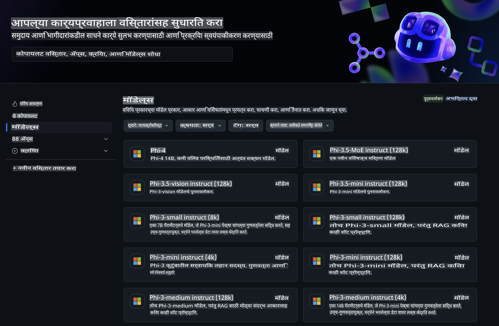
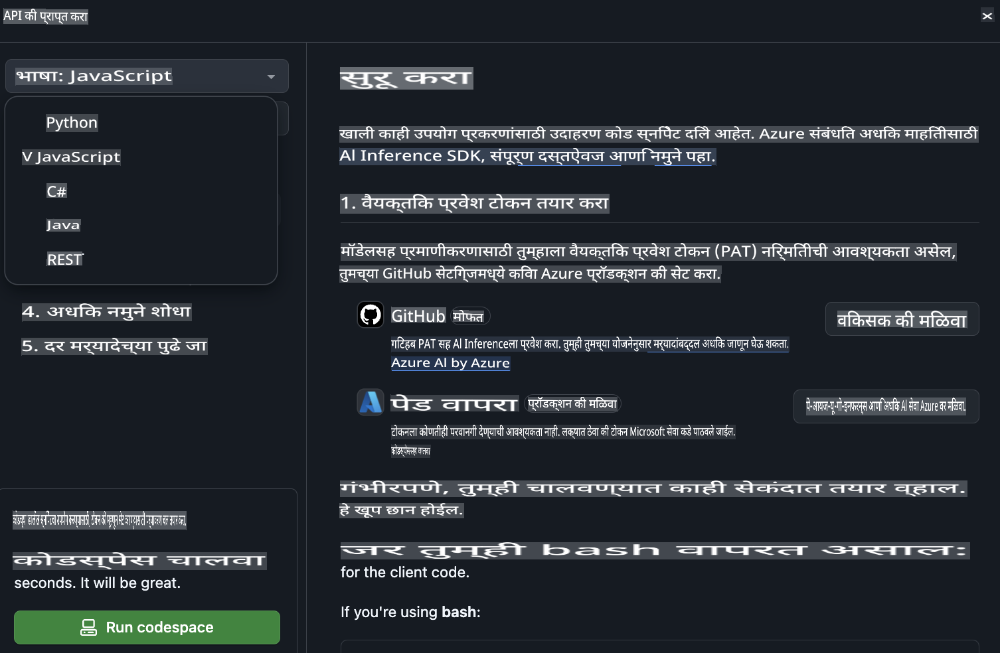
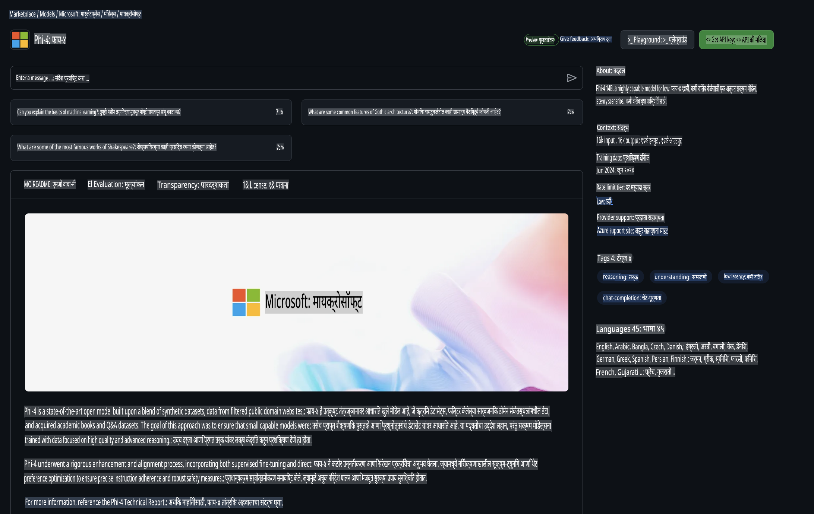

## GitHub मॉडेल्स - मर्यादित सार्वजनिक बीटा

[GitHub Models](https://github.com/marketplace/models) मध्ये आपले स्वागत आहे! Azure AI वर होस्ट केलेल्या AI मॉडेल्सचा शोध घेण्यासाठी आम्ही सर्व काही तयार ठेवले आहे.



GitHub Models वर उपलब्ध असलेल्या मॉडेल्सबद्दल अधिक माहितीसाठी, [GitHub Model Marketplace](https://github.com/marketplace/models) ला भेट द्या.

## उपलब्ध मॉडेल्स

प्रत्येक मॉडेलसाठी एक समर्पित प्लेग्राउंड आणि नमुना कोड उपलब्ध आहे.


### GitHub Model Catalog मधील Phi-3 मॉडेल्स

[Phi-3-Medium-128k-Instruct](https://github.com/marketplace/models/azureml/Phi-3-medium-128k-instruct)

[Phi-3-medium-4k-instruct](https://github.com/marketplace/models/azureml/Phi-3-medium-4k-instruct)

[Phi-3-mini-128k-instruct](https://github.com/marketplace/models/azureml/Phi-3-mini-128k-instruct)

[Phi-3-mini-4k-instruct](https://github.com/marketplace/models/azureml/Phi-3-mini-4k-instruct)

[Phi-3-small-128k-instruct](https://github.com/marketplace/models/azureml/Phi-3-small-128k-instruct)

[Phi-3-small-8k-instruct](https://github.com/marketplace/models/azureml/Phi-3-small-8k-instruct)

## सुरुवात कशी कराल

तुमच्यासाठी तयार असलेल्या काही मूलभूत उदाहरणे आहेत. तुम्ही ती नमुने निर्देशिकेमध्ये शोधू शकता. जर तुम्हाला थेट तुमच्या आवडत्या भाषेमध्ये सुरुवात करायची असेल, तर खालील भाषांमध्ये उदाहरणे उपलब्ध आहेत:

- Python  
- JavaScript  
- cURL  

नमुने आणि मॉडेल्स चालवण्यासाठी एक समर्पित Codespaces Environment देखील उपलब्ध आहे. 



## नमुना कोड

खाली काही वापर प्रकरणांसाठी कोडचे नमुने दिले आहेत. Azure AI Inference SDK बद्दल अधिक माहितीसाठी, संपूर्ण दस्तऐवज आणि नमुने पहा.

## सेटअप

1. वैयक्तिक प्रवेश टोकन तयार करा  
टोकनला कोणत्याही परवानग्या देण्याची गरज नाही. लक्षात ठेवा की टोकन Microsoft सेवेकडे पाठवले जाईल.

खालील कोडचे तुकडे वापरण्यासाठी, तुमच्या टोकनला क्लायंट कोडसाठी की म्हणून सेट करण्यासाठी एक वातावरणीय चल तयार करा.

जर तुम्ही bash वापरत असाल:
```
export GITHUB_TOKEN="<your-github-token-goes-here>"
```  
जर तुम्ही powershell वापरत असाल:

```
$Env:GITHUB_TOKEN="<your-github-token-goes-here>"
```  

जर तुम्ही Windows command prompt वापरत असाल:

```
set GITHUB_TOKEN=<your-github-token-goes-here>
```  

## Python नमुना

### अवलंबन स्थापित करा  
pip वापरून Azure AI Inference SDK स्थापित करा (आवश्यक: Python >=3.8):

```
pip install azure-ai-inference
```  

### एक मूलभूत कोड नमुना चालवा  

हा नमुना chat completion API साठी एक मूलभूत कॉल दर्शवतो. GitHub AI मॉडेल inference endpoint आणि तुमचे GitHub टोकन याचा उपयोग करत आहे. कॉल समकालीन आहे.

```
import os
from azure.ai.inference import ChatCompletionsClient
from azure.ai.inference.models import SystemMessage, UserMessage
from azure.core.credentials import AzureKeyCredential

endpoint = "https://models.inference.ai.azure.com"
# Replace Model_Name 
model_name = "Phi-3-small-8k-instruct"
token = os.environ["GITHUB_TOKEN"]

client = ChatCompletionsClient(
    endpoint=endpoint,
    credential=AzureKeyCredential(token),
)

response = client.complete(
    messages=[
        SystemMessage(content="You are a helpful assistant."),
        UserMessage(content="What is the capital of France?"),
    ],
    model=model_name,
    temperature=1.,
    max_tokens=1000,
    top_p=1.
)

print(response.choices[0].message.content)
```  

### मल्टी-टर्न संभाषण चालवा  

हा नमुना chat completion API सह मल्टी-टर्न संभाषण दर्शवतो. चॅट अॅप्लिकेशनसाठी मॉडेल वापरताना, तुम्हाला त्या संभाषणाचा इतिहास व्यवस्थापित करावा लागेल आणि नवीन संदेश मॉडेलकडे पाठवावे लागतील.

```
import os
from azure.ai.inference import ChatCompletionsClient
from azure.ai.inference.models import AssistantMessage, SystemMessage, UserMessage
from azure.core.credentials import AzureKeyCredential

token = os.environ["GITHUB_TOKEN"]
endpoint = "https://models.inference.ai.azure.com"
# Replace Model_Name
model_name = "Phi-3-small-8k-instruct"

client = ChatCompletionsClient(
    endpoint=endpoint,
    credential=AzureKeyCredential(token),
)

messages = [
    SystemMessage(content="You are a helpful assistant."),
    UserMessage(content="What is the capital of France?"),
    AssistantMessage(content="The capital of France is Paris."),
    UserMessage(content="What about Spain?"),
]

response = client.complete(messages=messages, model=model_name)

print(response.choices[0].message.content)
```  

### आउटपुट प्रवाहित करा  

उत्तम वापरकर्ता अनुभवासाठी, तुम्हाला मॉडेलच्या प्रतिसादाचे प्रवाह करणे आवश्यक आहे, जेणेकरून पहिला टोकन लवकर दिसेल आणि तुम्हाला लांब प्रतिसादासाठी थांबावे लागणार नाही.

```
import os
from azure.ai.inference import ChatCompletionsClient
from azure.ai.inference.models import SystemMessage, UserMessage
from azure.core.credentials import AzureKeyCredential

token = os.environ["GITHUB_TOKEN"]
endpoint = "https://models.inference.ai.azure.com"
# Replace Model_Name
model_name = "Phi-3-small-8k-instruct"

client = ChatCompletionsClient(
    endpoint=endpoint,
    credential=AzureKeyCredential(token),
)

response = client.complete(
    stream=True,
    messages=[
        SystemMessage(content="You are a helpful assistant."),
        UserMessage(content="Give me 5 good reasons why I should exercise every day."),
    ],
    model=model_name,
)

for update in response:
    if update.choices:
        print(update.choices[0].delta.content or "", end="")

client.close()
```  

## JavaScript  

### अवलंबन स्थापित करा  

Node.js स्थापित करा.

खालील मजकूर ओळी कॉपी करा आणि त्या package.json नावाच्या फाईलमध्ये तुमच्या फोल्डरमध्ये जतन करा.

```
{
  "type": "module",
  "dependencies": {
    "@azure-rest/ai-inference": "latest",
    "@azure/core-auth": "latest",
    "@azure/core-sse": "latest"
  }
}
```  

टीप: @azure/core-sse फक्त तेव्हा आवश्यक आहे जेव्हा तुम्ही chat completions प्रतिसाद प्रवाहित करत असता.

या फोल्डरमध्ये टर्मिनल विंडो उघडा आणि npm install चालवा.

खालील कोड तुकड्यांसाठी, सामग्री sample.js नावाच्या फाईलमध्ये कॉपी करा आणि node sample.js सह चालवा.

### एक मूलभूत कोड नमुना चालवा  

हा नमुना chat completion API साठी एक मूलभूत कॉल दर्शवतो. GitHub AI मॉडेल inference endpoint आणि तुमचे GitHub टोकन याचा उपयोग करत आहे. कॉल समकालीन आहे.

```
import ModelClient from "@azure-rest/ai-inference";
import { AzureKeyCredential } from "@azure/core-auth";

const token = process.env["GITHUB_TOKEN"];
const endpoint = "https://models.inference.ai.azure.com";
// Update your modelname
const modelName = "Phi-3-small-8k-instruct";

export async function main() {

  const client = new ModelClient(endpoint, new AzureKeyCredential(token));

  const response = await client.path("/chat/completions").post({
    body: {
      messages: [
        { role:"system", content: "You are a helpful assistant." },
        { role:"user", content: "What is the capital of France?" }
      ],
      model: modelName,
      temperature: 1.,
      max_tokens: 1000,
      top_p: 1.
    }
  });

  if (response.status !== "200") {
    throw response.body.error;
  }
  console.log(response.body.choices[0].message.content);
}

main().catch((err) => {
  console.error("The sample encountered an error:", err);
});
```  

### मल्टी-टर्न संभाषण चालवा  

हा नमुना chat completion API सह मल्टी-टर्न संभाषण दर्शवतो. चॅट अॅप्लिकेशनसाठी मॉडेल वापरताना, तुम्हाला त्या संभाषणाचा इतिहास व्यवस्थापित करावा लागेल आणि नवीन संदेश मॉडेलकडे पाठवावे लागतील.

```
import ModelClient from "@azure-rest/ai-inference";
import { AzureKeyCredential } from "@azure/core-auth";

const token = process.env["GITHUB_TOKEN"];
const endpoint = "https://models.inference.ai.azure.com";
// Update your modelname
const modelName = "Phi-3-small-8k-instruct";

export async function main() {

  const client = new ModelClient(endpoint, new AzureKeyCredential(token));

  const response = await client.path("/chat/completions").post({
    body: {
      messages: [
        { role: "system", content: "You are a helpful assistant." },
        { role: "user", content: "What is the capital of France?" },
        { role: "assistant", content: "The capital of France is Paris." },
        { role: "user", content: "What about Spain?" },
      ],
      model: modelName,
    }
  });

  if (response.status !== "200") {
    throw response.body.error;
  }

  for (const choice of response.body.choices) {
    console.log(choice.message.content);
  }
}

main().catch((err) => {
  console.error("The sample encountered an error:", err);
});
```  

### आउटपुट प्रवाहित करा  
उत्तम वापरकर्ता अनुभवासाठी, तुम्हाला मॉडेलच्या प्रतिसादाचे प्रवाह करणे आवश्यक आहे, जेणेकरून पहिला टोकन लवकर दिसेल आणि तुम्हाला लांब प्रतिसादासाठी थांबावे लागणार नाही.

```
import ModelClient from "@azure-rest/ai-inference";
import { AzureKeyCredential } from "@azure/core-auth";
import { createSseStream } from "@azure/core-sse";

const token = process.env["GITHUB_TOKEN"];
const endpoint = "https://models.inference.ai.azure.com";
// Update your modelname
const modelName = "Phi-3-small-8k-instruct";

export async function main() {

  const client = new ModelClient(endpoint, new AzureKeyCredential(token));

  const response = await client.path("/chat/completions").post({
    body: {
      messages: [
        { role: "system", content: "You are a helpful assistant." },
        { role: "user", content: "Give me 5 good reasons why I should exercise every day." },
      ],
      model: modelName,
      stream: true
    }
  }).asNodeStream();

  const stream = response.body;
  if (!stream) {
    throw new Error("The response stream is undefined");
  }

  if (response.status !== "200") {
    stream.destroy();
    throw new Error(`Failed to get chat completions, http operation failed with ${response.status} code`);
  }

  const sseStream = createSseStream(stream);

  for await (const event of sseStream) {
    if (event.data === "[DONE]") {
      return;
    }
    for (const choice of (JSON.parse(event.data)).choices) {
        process.stdout.write(choice.delta?.content ?? ``);
    }
  }
}

main().catch((err) => {
  console.error("The sample encountered an error:", err);
});
```  

## REST  

### एक मूलभूत कोड नमुना चालवा  

खालील कोड शेलमध्ये पेस्ट करा:

```
curl -X POST "https://models.inference.ai.azure.com/chat/completions" \
    -H "Content-Type: application/json" \
    -H "Authorization: Bearer $GITHUB_TOKEN" \
    -d '{
        "messages": [
            {
                "role": "system",
                "content": "You are a helpful assistant."
            },
            {
                "role": "user",
                "content": "What is the capital of France?"
            }
        ],
        "model": "Phi-3-small-8k-instruct"
    }'
```  

### मल्टी-टर्न संभाषण चालवा  

chat completion API कॉल करा आणि चॅट इतिहास पाठवा:

```
curl -X POST "https://models.inference.ai.azure.com/chat/completions" \
    -H "Content-Type: application/json" \
    -H "Authorization: Bearer $GITHUB_TOKEN" \
    -d '{
        "messages": [
            {
                "role": "system",
                "content": "You are a helpful assistant."
            },
            {
                "role": "user",
                "content": "What is the capital of France?"
            },
            {
                "role": "assistant",
                "content": "The capital of France is Paris."
            },
            {
                "role": "user",
                "content": "What about Spain?"
            }
        ],
        "model": "Phi-3-small-8k-instruct"
    }'
```  

### आउटपुट प्रवाहित करा  

एंडपॉइंट कॉल करून प्रतिसाद प्रवाहित करण्याचे हे एक उदाहरण आहे.

```
curl -X POST "https://models.inference.ai.azure.com/chat/completions" \
    -H "Content-Type: application/json" \
    -H "Authorization: Bearer $GITHUB_TOKEN" \
    -d '{
        "messages": [
            {
                "role": "system",
                "content": "You are a helpful assistant."
            },
            {
                "role": "user",
                "content": "Give me 5 good reasons why I should exercise every day."
            }
        ],
        "stream": true,
        "model": "Phi-3-small-8k-instruct"
    }'
```  

## GitHub मॉडेल्ससाठी मोफत वापर आणि दर मर्यादा  



[प्लेग्राउंड आणि मोफत API वापरासाठी दर मर्यादा](https://docs.github.com/en/github-models/prototyping-with-ai-models#rate-limits) तुम्हाला मॉडेल्सचा प्रयोग करण्यासाठी आणि तुमचे AI अॅप्लिकेशन प्रोटोटाइप करण्यासाठी मदत करतात. या मर्यादेपलीकडे वापरासाठी, आणि तुमचे अॅप्लिकेशन स्केलवर आणण्यासाठी, तुम्हाला Azure खाते वापरून संसाधने तयार करावी लागतील आणि तुमच्या GitHub वैयक्तिक प्रवेश टोकनऐवजी तिथून प्रमाणीकरण करावे लागेल. तुमच्या कोडमध्ये इतर काही बदल करण्याची आवश्यकता नाही. Azure AI मध्ये मोफत स्तर मर्यादेपलीकडे जाण्यासाठी हा दुवा वापरा.

### प्रकटीकरणे  

मॉडेलशी संवाद साधताना लक्षात ठेवा की तुम्ही AI चाचणी करत आहात, त्यामुळे सामग्रीमध्ये चुका होऊ शकतात.

ही सुविधा विविध मर्यादांखाली (जसे की मिनिटामागील विनंत्या, दिवसामागील विनंत्या, विनंतीमागील टोकन आणि समांतर विनंत्या) आहे आणि उत्पादन वापर प्रकरणांसाठी डिझाइन केलेली नाही.

GitHub मॉडेल्स Azure AI Content Safety वापरते. GitHub मॉडेल्स अनुभवाचा भाग म्हणून हे फिल्टर्स बंद करता येत नाहीत. जर तुम्ही मॉडेल्स सशुल्क सेवेद्वारे वापरण्याचा निर्णय घेतला, तर कृपया तुमच्या आवश्यकता पूर्ण करण्यासाठी तुमचे सामग्री फिल्टर्स कॉन्फिगर करा.

ही सेवा GitHub च्या प्री-रिलीज अटींनुसार आहे.

**अस्वीकरण**:  
हे दस्तऐवज मशीन-आधारित AI भाषांतर सेवांचा वापर करून भाषांतरित केले गेले आहे. आम्ही अचूकतेसाठी प्रयत्नशील असलो तरी, कृपया लक्षात घ्या की स्वयंचलित भाषांतरे त्रुटी किंवा अचूकतेच्या उणिवा असू शकतात. मूळ भाषेतील मूळ दस्तऐवज अधिकृत स्रोत मानला पाहिजे. महत्त्वाच्या माहितीसाठी, व्यावसायिक मानवी भाषांतराची शिफारस केली जाते. या भाषांतराच्या वापरामुळे निर्माण होणाऱ्या कोणत्याही गैरसमजुतींसाठी किंवा चुकीच्या अर्थासाठी आम्ही जबाबदार राहणार नाही.