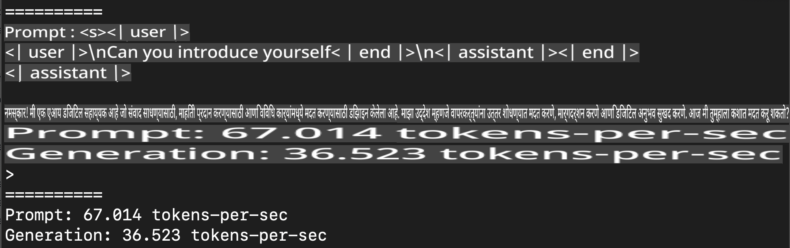
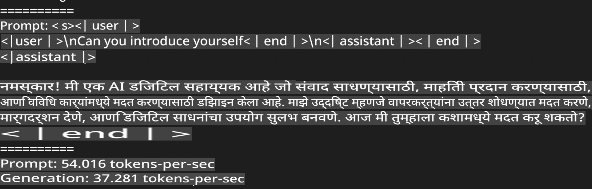
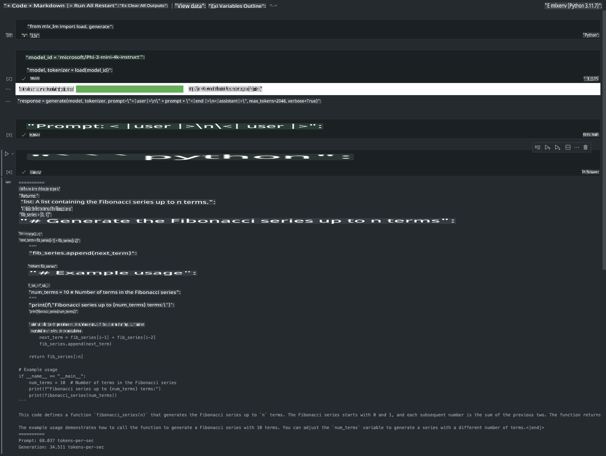

# **Apple MLX फ्रेमवर्कसह Phi-3 चे इनफरन्स**

## **MLX फ्रेमवर्क म्हणजे काय**

MLX हे Apple silicon वर मशीन लर्निंग संशोधनासाठी तयार केलेले एक फ्रेमवर्क आहे, जे Apple च्या मशीन लर्निंग संशोधन विभागाने विकसित केले आहे.

MLX मशीन लर्निंग संशोधकांसाठीच डिझाइन केले गेले आहे. हे फ्रेमवर्क वापरण्यास सोपे आहे, पण तरीही मॉडेल्स ट्रेन आणि डिप्लॉय करण्यासाठी कार्यक्षम आहे. फ्रेमवर्कचे डिझाइनही संकल्पनेने सोपे आहे. संशोधकांना MLX विस्तारण्यासाठी आणि सुधारण्यासाठी प्रोत्साहित करण्याचा उद्देश आहे, जेणेकरून नवीन कल्पना पटकन एक्सप्लोर करता येतील.

Apple Silicon डिव्हाइसवर MLX च्या मदतीने LLMs जलद चालवता येतात, आणि मॉडेल्स स्थानिक पातळीवर सहज चालवता येतात.

## **Phi-3-mini साठी MLX वापरणे**

### **1. तुमचे MLX वातावरण सेट करा**

1. Python 3.11.x
2. MLX लायब्ररी इंस्टॉल करा

```bash

pip install mlx-lm

```

### **2. MLX च्या मदतीने टर्मिनलवर Phi-3-mini चालवा**

```bash

python -m mlx_lm.generate --model microsoft/Phi-3-mini-4k-instruct --max-token 2048 --prompt  "<|user|>\nCan you introduce yourself<|end|>\n<|assistant|>"

```

परिणाम (माझे वातावरण Apple M1 Max, 64GB आहे) असे आहे:



### **3. टर्मिनलमध्ये MLX च्या मदतीने Phi-3-mini चे क्वांटायझेशन करा**

```bash

python -m mlx_lm.convert --hf-path microsoft/Phi-3-mini-4k-instruct

```

***टीप：*** मॉडेल mlx_lm.convert च्या माध्यमातून क्वांटाइज केले जाऊ शकते, आणि डीफॉल्ट क्वांटायझेशन INT4 आहे. या उदाहरणात Phi-3-mini ला INT4 मध्ये क्वांटाइज केले आहे.

mlx_lm.convert च्या मदतीने मॉडेल क्वांटाइज करता येते, आणि डीफॉल्ट क्वांटायझेशन INT4 आहे. हे उदाहरण Phi-3-mini ला INT4 मध्ये क्वांटाइज करण्यासाठी आहे. क्वांटायझेशन नंतर, ते डीफॉल्ट डिरेक्टरी ./mlx_model मध्ये साठवले जाईल.

आपण टर्मिनलमधून MLX सह क्वांटाइज केलेले मॉडेल तपासू शकतो.

```bash

python -m mlx_lm.generate --model ./mlx_model/ --max-token 2048 --prompt  "<|user|>\nCan you introduce yourself<|end|>\n<|assistant|>"

```

परिणाम असे आहे:



### **4. Jupyter Notebook मध्ये MLX सह Phi-3-mini चालवा**



***टीप:*** कृपया हे उदाहरण वाचा [या लिंकवर क्लिक करा](../../../../../code/03.Inference/MLX/MLX_DEMO.ipynb)

## **स्रोत**

1. Apple MLX फ्रेमवर्कबद्दल जाणून घ्या [https://ml-explore.github.io](https://ml-explore.github.io/mlx/build/html/index.html)

2. Apple MLX GitHub रेपो [https://github.com/ml-explore](https://github.com/ml-explore)

**अस्वीकरण**:  
हे दस्तऐवज मशीन-आधारित एआय भाषांतर सेवांचा वापर करून अनुवादित केले आहे. आम्ही अचूकतेसाठी प्रयत्नशील असलो तरी, कृपया लक्षात घ्या की स्वयंचलित भाषांतरांमध्ये त्रुटी किंवा अचूकतेचा अभाव असू शकतो. मूळ भाषेतील मूळ दस्तऐवज अधिकृत स्रोत मानला जावा. महत्त्वाच्या माहितीसाठी व्यावसायिक मानव भाषांतराची शिफारस केली जाते. या भाषांतराच्या वापरामुळे उद्भवलेल्या कोणत्याही गैरसमज किंवा चुकीच्या अर्थासाठी आम्ही जबाबदार नाही.