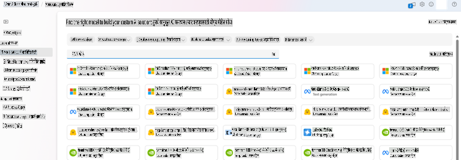
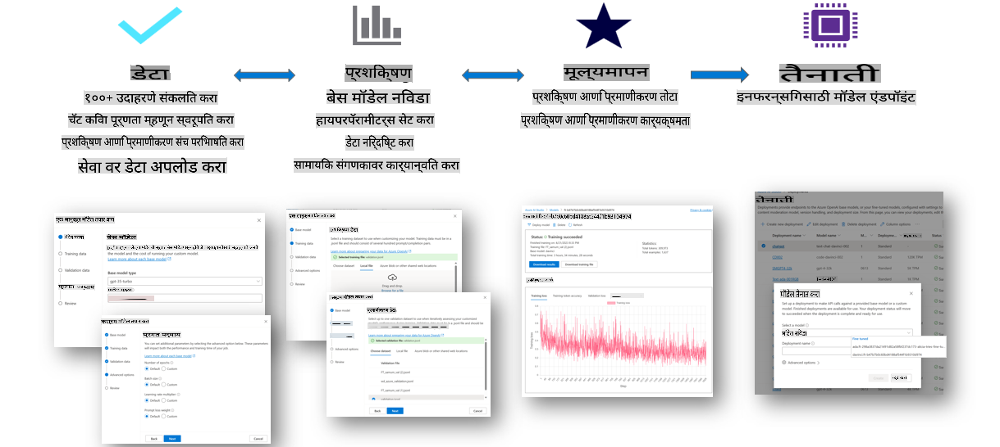
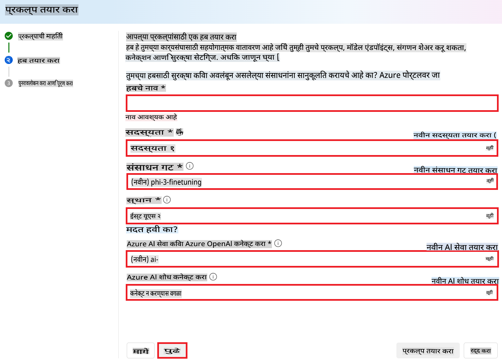
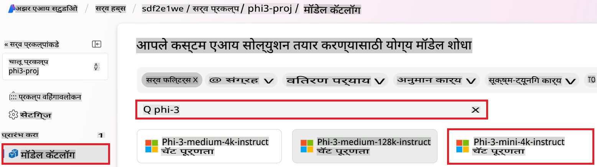
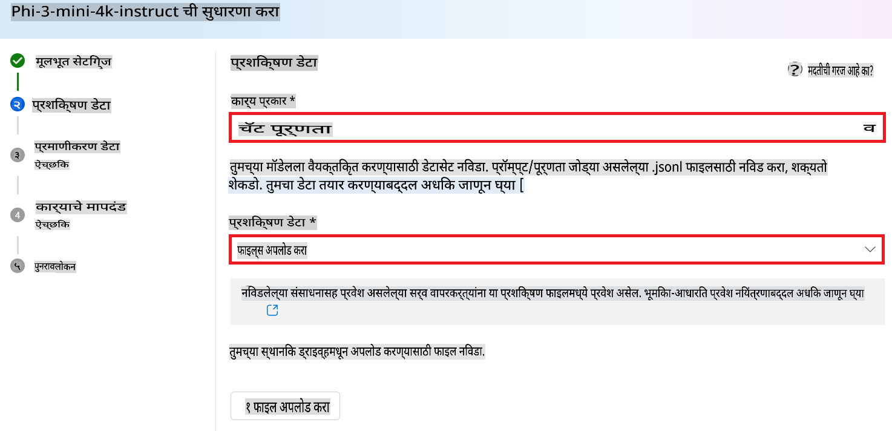
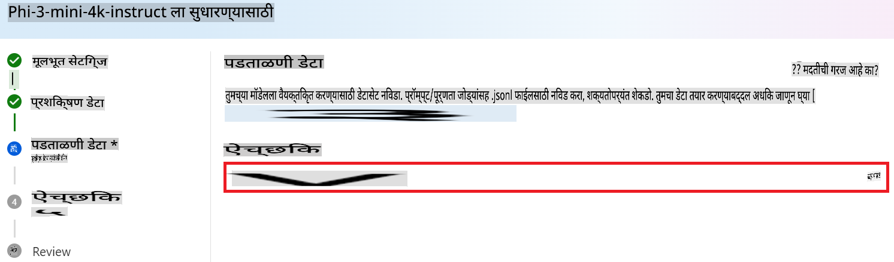
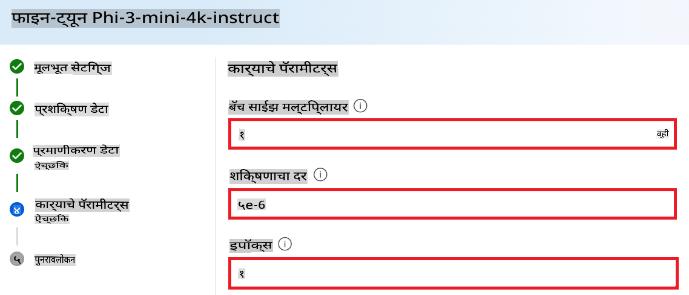
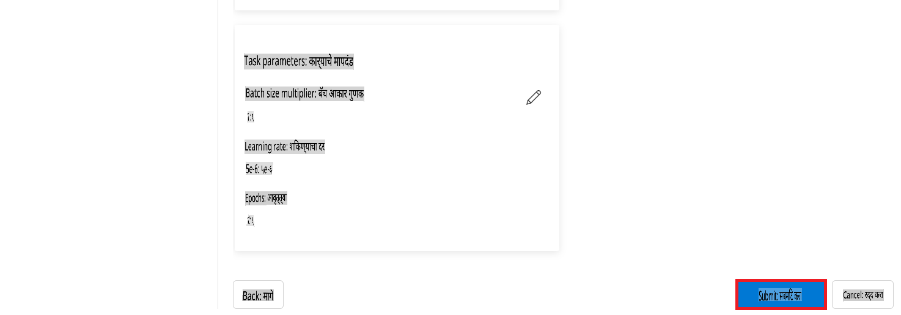
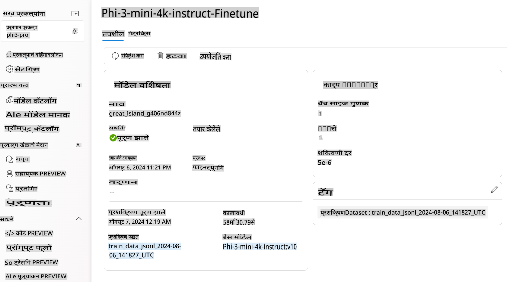

# Azure AI Foundry सह Phi-3 फाइन-ट्यून करणे

Microsoft च्या Phi-3 Mini भाषा मॉडेलला Azure AI Foundry चा वापर करून फाइन-ट्यून कसे करायचे ते शोधूया. फाइन-ट्यूनिंगमुळे Phi-3 Mini विशिष्ट कार्यांसाठी अनुकूल होतो, ज्यामुळे तो अधिक प्रभावी आणि संदर्भ-सजग बनतो.

## विचार करण्यासारखे मुद्दे

- **क्षमता:** कोणती मॉडेल्स फाइन-ट्यून करता येतात? बेस मॉडेलला कोणत्याप्रकारे फाइन-ट्यून करता येते?
- **खर्च:** फाइन-ट्यूनिंगसाठी किंमतीचा मॉडेल काय आहे?
- **सानुकूलता:** बेस मॉडेलमध्ये कितपत बदल करता येतो – आणि कोणत्या प्रकारे?
- **सुलभता:** फाइन-ट्यूनिंग प्रत्यक्षात कसे होते – मला कस्टम कोड लिहिण्याची गरज आहे का? मला स्वतःचा compute आणावा लागतो का?
- **सुरक्षितता:** फाइन-ट्यून केलेल्या मॉडेल्समध्ये काहीवेळा सुरक्षिततेशी संबंधित धोके असतात – अनपेक्षित नुकसान टाळण्यासाठी कोणते उपाययोजना आहेत का?



## फाइन-ट्यूनिंगसाठी तयारी

### पूर्वअट

> [!NOTE]
> Phi-3 कुटुंबातील मॉडेल्ससाठी, पे-एज-यू-गो मॉडेल फाइन-ट्यूनिंग ऑफर फक्त **East US 2** क्षेत्रात तयार केलेल्या हब्ससाठी उपलब्ध आहे.

- Azure सबस्क्रिप्शन. तुमच्याकडे Azure सबस्क्रिप्शन नसल्यास, [पेड Azure खाते तयार करा](https://azure.microsoft.com/pricing/purchase-options/pay-as-you-go) आणि सुरुवात करा.

- एक [AI Foundry प्रकल्प](https://ai.azure.com?WT.mc_id=aiml-138114-kinfeylo).
- Azure रोल-आधारित प्रवेश नियंत्रण (Azure RBAC) Azure AI Foundry मध्ये ऑपरेशन्ससाठी प्रवेश प्रदान करण्यासाठी वापरले जातात. या लेखातील पायऱ्या पूर्ण करण्यासाठी, तुमच्या युजर खात्याला __Azure AI Developer role__ संसाधन गटावर असाइन केलेले असणे आवश्यक आहे.

### सबस्क्रिप्शन प्रोव्हायडर नोंदणी

`Microsoft.Network` रिसोर्स प्रोव्हायडरसाठी सबस्क्रिप्शन नोंदणीकृत आहे का ते तपासा.

1. [Azure पोर्टल](https://portal.azure.com) मध्ये साइन इन करा.
1. डाव्या मेनूमधून **Subscriptions** निवडा.
1. तुम्हाला वापरायचे असलेले सबस्क्रिप्शन निवडा.
1. डाव्या मेनूमधून **AI project settings** > **Resource providers** निवडा.
1. **Microsoft.Network** रिसोर्स प्रोव्हायडर्सच्या यादीत आहे याची खात्री करा. अन्यथा, ते जोडा.

### डेटा तयारी

तुमच्या मॉडेलला फाइन-ट्यून करण्यासाठी प्रशिक्षण आणि पडताळणी डेटा तयार करा. तुमचा प्रशिक्षण डेटा आणि पडताळणी डेटा सेट्समध्ये तुमच्या अपेक्षित कार्यासाठी इनपुट आणि आउटपुट उदाहरणे असतात.

सर्व प्रशिक्षण उदाहरणे इन्फरन्ससाठी अपेक्षित स्वरूपात आहेत याची खात्री करा. मॉडेल्स प्रभावीपणे फाइन-ट्यून करण्यासाठी, संतुलित आणि वैविध्यपूर्ण डेटासेट तयार करा.

यामध्ये डेटा संतुलन राखणे, विविध परिस्थितींचा समावेश करणे आणि प्रशिक्षण डेटा वेळोवेळी सुधारित करणे यांचा समावेश आहे, जेणेकरून वास्तव जीवनातील अपेक्षांशी सुसंगतता साधली जाईल आणि अखेरीस अधिक अचूक आणि संतुलित मॉडेल प्रतिसाद मिळतील.

वेगवेगळ्या मॉडेल प्रकारांसाठी प्रशिक्षण डेटाचे स्वरूप वेगळे असते.

### चॅट पूर्णता

तुम्ही वापरत असलेला प्रशिक्षण आणि पडताळणी डेटा **JSON Lines (JSONL)** स्वरूपात असणे आवश्यक आहे. `Phi-3-mini-128k-instruct` साठी, फाइन-ट्यूनिंग डेटासेटला चॅट पूर्णता API च्या संभाषण स्वरूपात असणे आवश्यक आहे.

### फाईल स्वरूपाचे उदाहरण

```json
    {"messages": [{"role": "system", "content": "You are an Xbox customer support agent whose primary goal is to help users with issues they are experiencing with their Xbox devices. You are friendly and concise. You only provide factual answers to queries, and do not provide answers that are not related to Xbox."}, {"role": "user", "content": "Is Xbox better than PlayStation?"}, {"role": "assistant", "content": "I apologize, but I cannot provide personal opinions. My primary job is to assist you with any issues related to your Xbox device. Do you have any Xbox-related issues that need addressing?"}]}
    {"messages": [{"role": "system", "content": "You are an Xbox customer support agent whose primary goal is to help users with issues they are experiencing with their Xbox devices. You are friendly and concise. You only provide factual answers to queries, and do not provide answers that are not related to Xbox."}, {"role": "user", "content": "Can I play PC games on my Xbox?"}, {"role": "assistant", "content": "While Xbox consoles don't natively support PC games, they can play an array of Xbox games, many of which are also available on PC. Can I assist you with finding games compatible with your Xbox device?"}]}
    {"messages": [{"role": "system", "content": "You are an Xbox customer support agent whose primary goal is to help users with issues they are experiencing with their Xbox devices. You are friendly and concise. You only provide factual answers to queries, and do not provide answers that are not related to Xbox."}, {"role": "user", "content": "I'm having trouble connecting my Xbox to the Wi-Fi."}, {"role": "assistant", "content": "No worries, let's go through the network settings on your Xbox. Can you please tell me what happens when you try to connect it to the Wi-Fi?"}]}
```

समर्थित फाईल प्रकार JSON Lines आहे. फाईल्स डिफॉल्ट डेटास्टोअरमध्ये अपलोड केल्या जातात आणि तुमच्या प्रकल्पात उपलब्ध केल्या जातात.

## Azure AI Foundry सह Phi-3 फाइन-ट्यून करणे

Azure AI Foundry च्या मदतीने, मोठ्या भाषा मॉडेल्सना तुमच्या वैयक्तिक डेटासेट्ससाठी सानुकूलित करता येते, ज्याला फाइन-ट्यूनिंग असे म्हणतात. फाइन-ट्यूनिंगमुळे विशिष्ट कार्ये आणि अनुप्रयोगांसाठी सानुकूलन आणि अनुकूलता मिळते. यामुळे कार्यक्षमता सुधारते, खर्च कमी होतो, विलंब कमी होतो आणि सानुकूलित आउटपुट मिळते.



### नवीन प्रकल्प तयार करा

1. [Azure AI Foundry](https://ai.azure.com) मध्ये साइन इन करा.

1. **+New project** निवडा आणि Azure AI Foundry मध्ये नवीन प्रकल्प तयार करा.

    

1. पुढील कार्ये करा:

    - प्रकल्प **Hub name**. हे एक अद्वितीय मूल्य असले पाहिजे.
    - वापरण्यासाठी **Hub** निवडा (आवश्यक असल्यास नवीन तयार करा).

    

1. नवीन हब तयार करण्यासाठी पुढील कार्ये करा:

    - **Hub name** प्रविष्ट करा. हे एक अद्वितीय मूल्य असले पाहिजे.
    - तुमचे Azure **Subscription** निवडा.
    - वापरण्यासाठी **Resource group** निवडा (आवश्यक असल्यास नवीन तयार करा).
    - वापरण्यासाठी **Location** निवडा.
    - **Connect Azure AI Services** निवडा (आवश्यक असल्यास नवीन तयार करा).
    - **Connect Azure AI Search** निवडा किंवा **Skip connecting** करा.

    

1. **Next** निवडा.
1. **Create a project** निवडा.

### डेटा तयारी

फाइन-ट्यूनिंग करण्यापूर्वी, तुमच्या कार्याशी संबंधित डेटासेट गोळा करा किंवा तयार करा, जसे की चॅट निर्देश, प्रश्न-उत्तर जोड्या, किंवा इतर कोणत्याही संबंधित मजकूर डेटा. आवाज काढून टाकून, गहाळ मूल्ये हाताळून आणि मजकूर टोकनाइझ करून हा डेटा स्वच्छ करा आणि पूर्वप्रक्रिया करा.

### Azure AI Foundry मध्ये Phi-3 मॉडेल्स फाइन-ट्यून करा

> [!NOTE]
> Phi-3 मॉडेल्सचे फाइन-ट्यूनिंग सध्या फक्त East US 2 मध्ये असलेल्या प्रकल्पांसाठी समर्थित आहे.

1. डाव्या बाजूच्या टॅबमधून **Model catalog** निवडा.

1. **search bar** मध्ये *phi-3* टाइप करा आणि तुम्हाला हवे असलेले phi-3 मॉडेल निवडा.

    

1. **Fine-tune** निवडा.

    

1. **Fine-tuned model name** प्रविष्ट करा.

    

1. **Next** निवडा.

1. पुढील कार्ये करा:

    - **task type** म्हणून **Chat completion** निवडा.
    - वापरण्यासाठी तुम्हाला हवा असलेला **Training data** निवडा. तुम्ही तो Azure AI Foundry च्या डेटाद्वारे किंवा तुमच्या स्थानिक वातावरणातून अपलोड करू शकता.

    

1. **Next** निवडा.

1. वापरण्यासाठी **Validation data** अपलोड करा किंवा **Automatic split of training data** निवडा.

    

1. **Next** निवडा.

1. पुढील कार्ये करा:

    - वापरण्यासाठी **Batch size multiplier** निवडा.
    - वापरण्यासाठी **Learning rate** निवडा.
    - वापरण्यासाठी **Epochs** निवडा.

    

1. फाइन-ट्यूनिंग प्रक्रिया सुरू करण्यासाठी **Submit** निवडा.

    

1. एकदा तुमचे मॉडेल फाइन-ट्यून झाले की, स्थिती **Completed** म्हणून दर्शवली जाईल, खालील प्रतिमेत दाखवल्याप्रमाणे. आता तुम्ही मॉडेल डिप्लॉय करू शकता आणि ते तुमच्या स्वतःच्या अनुप्रयोगात, प्लेग्राउंडमध्ये किंवा प्रॉम्प्ट फ्लोमध्ये वापरू शकता. अधिक माहितीसाठी, [Azure AI Foundry सह Phi-3 कुटुंबातील छोटे भाषा मॉडेल्स कसे डिप्लॉय करावे](https://learn.microsoft.com/azure/ai-studio/how-to/deploy-models-phi-3?tabs=phi-3-5&pivots=programming-language-python) पहा.

    

> [!NOTE]
> Phi-3 फाइन-ट्यूनिंगबद्दल अधिक तपशीलवार माहितीसाठी, कृपया [Azure AI Foundry मध्ये Phi-3 मॉडेल्स फाइन-ट्यून करा](https://learn.microsoft.com/azure/ai-studio/how-to/fine-tune-phi-3?tabs=phi-3-mini) येथे भेट द्या.

## फाइन-ट्यून केलेली मॉडेल्स साफ करणे

तुम्ही [Azure AI Foundry](https://ai.azure.com) मधील फाइन-ट्यूनिंग मॉडेल यादीतून किंवा मॉडेल तपशील पृष्ठावरून फाइन-ट्यून केलेले मॉडेल हटवू शकता. फाइन-ट्यूनिंग पृष्ठावरून हटवायचे फाइन-ट्यून केलेले मॉडेल निवडा आणि नंतर डिलीट बटण निवडा.

> [!NOTE]
> जर एखाद्या कस्टम मॉडेलचे विद्यमान डिप्लॉयमेंट असेल तर तुम्ही ते हटवू शकत नाही. कस्टम मॉडेल हटवण्यापूर्वी तुम्हाला तुमचे मॉडेल डिप्लॉयमेंट हटवावे लागेल.

## खर्च आणि कोटा

### Phi-3 मॉडेल्स फाइन-ट्यूनिंगसाठी खर्च आणि कोटा विचार

Phi मॉडेल्स फाइन-ट्यूनिंगसाठी सेवा म्हणून Microsoft द्वारे ऑफर केली जातात आणि Azure AI Foundry सह समाकलित केली जातात. तुम्ही [डिप्लॉय करताना](https://learn.microsoft.com/azure/ai-studio/how-to/deploy-models-phi-3?tabs=phi-3-5&pivots=programming-language-python) किंवा मॉडेल्स फाइन-ट्यून करताना डिप्लॉयमेंट विजार्डवरील Pricing and terms टॅबखाली किंमती शोधू शकता.

## सामग्री फिल्टरिंग

पे-एज-यू-गो सह सेवा म्हणून डिप्लॉय केलेली मॉडेल्स Azure AI Content Safety ने संरक्षित आहेत. वास्तविक-वेळेच्या endpoints वर डिप्लॉय केल्यावर, तुम्ही या क्षमता अक्षम करू शकता. Azure AI सामग्री सुरक्षितता सक्षम असल्यास, प्रॉम्प्ट आणि पूर्णता दोन्ही वर्गीकरण मॉडेल्सच्या एका संचामधून जातात, ज्यामुळे हानिकारक सामग्रीची आउटपुट रोखण्यासाठी कार्यवाही केली जाते. इनपुट प्रॉम्प्ट्स आणि आउटपुट पूर्णता दोन्हीमध्ये संभाव्य हानिकारक सामग्रीच्या विशिष्ट श्रेणी ओळखण्यासाठी आणि त्यावर कार्यवाही करण्यासाठी सामग्री फिल्टरिंग प्रणाली कार्य करते. अधिक जाणून घ्या [Azure AI Content Safety](https://learn.microsoft.com/azure/ai-studio/concepts/content-filtering).

**फाइन-ट्यूनिंग कॉन्फिगरेशन**

हायपरपॅरामीटर्स: लर्निंग रेट, बॅच साइज, आणि प्रशिक्षण epochs ची संख्या परिभाषित करा.

**लॉस फंक्शन**

तुमच्या कार्यासाठी योग्य लॉस फंक्शन निवडा (उदा. क्रॉस-एंट्रॉपी).

**ऑप्टिमायझर**

प्रशिक्षणादरम्यान ग्रेडियंट अपडेट्ससाठी ऑप्टिमायझर निवडा (उदा. Adam).

**फाइन-ट्यूनिंग प्रक्रिया**

- प्री-ट्रेंड मॉडेल लोड करा: Phi-3 Mini चेकपॉईंट लोड करा.
- कस्टम लेअर्स जोडा: टास्क-विशिष्ट लेअर्स जोडा (उदा. चॅट निर्देशांसाठी वर्गीकरण हेड).

**मॉडेल प्रशिक्षित करा**
तुमच्या तयार केलेल्या डेटासेटचा वापर करून मॉडेल फाइन-ट्यून करा. प्रशिक्षण प्रगती निरीक्षण करा आणि आवश्यकतेनुसार हायपरपॅरामीटर्स समायोजित करा.

**मूल्यमापन आणि पडताळणी**

पडताळणी सेट: तुमचा डेटा प्रशिक्षण आणि पडताळणी सेट्समध्ये विभाजित करा.

**कामगिरीचे मूल्यांकन करा**

अचूकता, F1-स्कोअर, किंवा perplexity सारख्या मेट्रिक्स वापरून मॉडेलच्या कामगिरीचे मूल्यांकन करा.

## फाइन-ट्यून केलेले मॉडेल जतन करा

**चेकपॉईंट**
भविष्यातील वापरासाठी फाइन-ट्यून केलेले मॉडेल चेकपॉईंट जतन करा.

## डिप्लॉयमेंट

- वेब सेवा म्हणून डिप्लॉय करा: Azure AI Foundry मध्ये तुमचे फाइन-ट्यून केलेले मॉडेल वेब सेवा म्हणून डिप्लॉय करा.
- Endpoint चाचणी करा: डिप्लॉय केलेल्या Endpoint ला चाचणी क्वेरी पाठवून त्याची कार्यक्षमता सत्यापित करा.

## पुनरावृत्ती आणि सुधारणा

पुनरावृत्ती: जर कार्यक्षमता समाधानकारक नसेल, तर हायपरपॅरामीटर्स समायोजित करून, अधिक डेटा जोडून किंवा अतिरिक्त epochs साठी फाइन-ट्यूनिंग करून पुन्हा प्रयत्न करा.

## निरीक्षण आणि परिष्करण

मॉडेलचे वर्तन सतत निरीक्षण करा आणि आवश्यकतेनुसार परिष्कृत करा.

## सानुकूलित करा आणि विस्तृत करा

सानुकूल कार्ये: Phi-3 Mini ला चॅट निर्देशांव्यतिरिक्त विविध कार्यांसाठी फाइन-ट्यून करता येते. इतर उपयोग प्रकरणे एक्सप्लोर करा!
प्रयोग: कार्यक्षमता वाढवण्यासाठी विविध आर्किटेक्चर्स, लेअर संयोजन, आणि तंत्रांचा प्रयत्न करा.

> [!NOTE]
> फाइन-ट्यूनिंग हा एक पुनरावृत्तीशील प्रक्रिया आहे. प्रयोग करा, शिका, आणि तुमच्या विशिष्ट कार्यासाठी सर्वोत्तम परिणाम साध्य करण्यासाठी तुमच्या मॉडेलला अनुकूलित करा!

**अस्वीकृती**:  
हा दस्तऐवज मशीन-आधारित एआय अनुवाद सेवांचा वापर करून अनुवादित करण्यात आला आहे. आम्ही अचूकतेसाठी प्रयत्नशील असलो तरी, कृपया लक्षात घ्या की स्वयंचलित अनुवादांमध्ये त्रुटी किंवा अचूकतेचा अभाव असू शकतो. मूळ भाषेतील मूळ दस्तऐवज हा प्रामाणिक स्रोत मानला जावा. महत्त्वाच्या माहितीसाठी, व्यावसायिक मानवी अनुवादाची शिफारस केली जाते. या अनुवादाचा वापर करून उद्भवणाऱ्या कोणत्याही गैरसमजुतींसाठी किंवा चुकीच्या अर्थांसाठी आम्ही जबाबदार राहणार नाही.