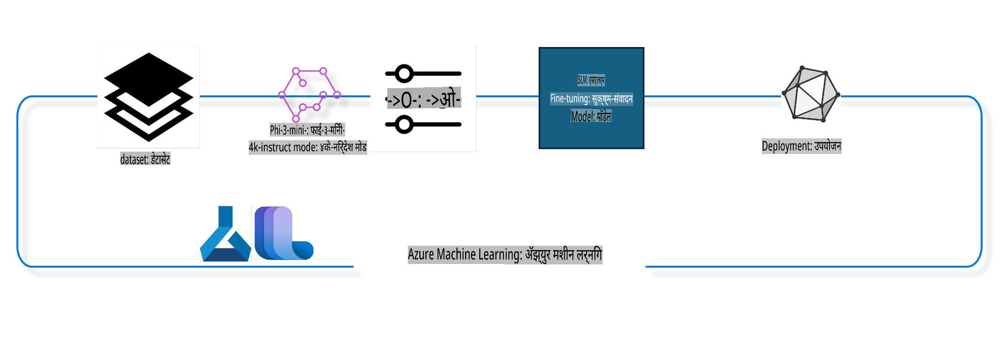

## Azure ML प्रणाली रजिस्ट्रीतून chat-completion घटकांचा वापर करून मॉडेल फाइन ट्यून कसे करावे

या उदाहरणात, आपण Phi-3-mini-4k-instruct मॉडेलचे फाइन ट्यूनिंग करणार आहोत, जेणेकरून दोन व्यक्तींमधील संभाषण पूर्ण करण्यासाठी ultrachat_200k डेटासेट वापरले जाईल.



हे उदाहरण तुम्हाला Azure ML SDK आणि Python चा वापर करून फाइन ट्यूनिंग कसे करावे आणि रिअल-टाइम इनफरन्ससाठी फाइन ट्यून केलेले मॉडेल ऑनलाइन एंडपॉइंटवर कसे डिप्लॉय करावे हे दाखवेल.

### प्रशिक्षण डेटा

आपण ultrachat_200k डेटासेट वापरणार आहोत. हे UltraChat डेटासेटचे अत्यंत फिल्टर केलेले संस्करण आहे आणि हे Zephyr-7B-β, एक अत्याधुनिक 7b चॅट मॉडेल, प्रशिक्षित करण्यासाठी वापरले गेले आहे.

### मॉडेल

आपण Phi-3-mini-4k-instruct मॉडेल वापरणार आहोत, ज्याद्वारे वापरकर्ता chat-completion टास्कसाठी मॉडेल फाइन ट्यून करू शकतो. जर तुम्ही हे नोटबुक एखाद्या विशिष्ट मॉडेल कार्डमधून उघडले असेल, तर विशिष्ट मॉडेल नाव बदलण्याचे लक्षात ठेवा.

### कार्ये

- फाइन ट्यूनसाठी एक मॉडेल निवडा.
- प्रशिक्षण डेटा निवडा आणि तपासा.
- फाइन ट्यूनिंग जॉब कॉन्फिगर करा.
- फाइन ट्यूनिंग जॉब चालवा.
- प्रशिक्षण आणि मूल्यमापन मेट्रिक्स पुनरावलोकन करा.
- फाइन ट्यून केलेले मॉडेल नोंदणी करा.
- फाइन ट्यून केलेले मॉडेल रिअल-टाइम इनफरन्ससाठी डिप्लॉय करा.
- संसाधने साफ करा.

## 1. पूर्वआवश्यकता सेटअप

- आवश्यक गोष्टी इंस्टॉल करा.
- AzureML Workspace शी कनेक्ट व्हा. SDK प्रमाणीकरण सेटअप बद्दल अधिक जाणून घ्या. खाली <WORKSPACE_NAME>, <RESOURCE_GROUP> आणि <SUBSCRIPTION_ID> बदला.
- AzureML प्रणाली रजिस्ट्रीत कनेक्ट व्हा.
- एक वैकल्पिक प्रयोगाचे नाव सेट करा.
- Compute तपासा किंवा तयार करा.

> [!NOTE]
> आवश्यकतेनुसार एक GPU नोडमध्ये अनेक GPU कार्ड्स असू शकतात. उदाहरणार्थ, Standard_NC24rs_v3 च्या एका नोडमध्ये 4 NVIDIA V100 GPUs आहेत, तर Standard_NC12s_v3 मध्ये 2 NVIDIA V100 GPUs आहेत. या माहितीसाठी डॉक्यूमेंट्सचा संदर्भ घ्या. खाली param gpus_per_node मध्ये नोड प्रति GPU कार्ड्सची संख्या सेट केली आहे. ही संख्या योग्यरित्या सेट केल्याने नोडमधील सर्व GPUs चा उपयोग होईल. शिफारस केलेले GPU Compute SKUs येथे आणि येथे सापडतील.

### Python लायब्ररी

खालील सेल चालवून आवश्यक गोष्टी इंस्टॉल करा. नवीन वातावरणात चालवत असल्यास हा टप्पा ऐच्छिक नाही.

```bash
pip install azure-ai-ml
pip install azure-identity
pip install datasets==2.9.0
pip install mlflow
pip install azureml-mlflow
```

### Azure ML शी संवाद साधणे

1. हा Python स्क्रिप्ट Azure Machine Learning (Azure ML) सेवेसोबत संवाद साधण्यासाठी वापरला जातो. त्याचे कार्य खालीलप्रमाणे आहे:

    - हे आवश्यक azure.ai.ml, azure.identity, आणि azure.ai.ml.entities पॅकेजेसमधून मॉड्यूल्स आयात करते. तसेच, time मॉड्यूल आयात करते.

    - DefaultAzureCredential() वापरून प्रमाणीकरण करण्याचा प्रयत्न करते, ज्यामुळे Azure क्लाउडमध्ये अॅप्लिकेशन्स विकसित करणे सोपे होते. जर हे अयशस्वी झाले, तर InteractiveBrowserCredential() वापरते, ज्यामुळे इंटरॅक्टिव्ह लॉगिन प्रॉम्प्ट येतो.

    - from_config पद्धतीचा वापर करून MLClient उदाहरण तयार करण्याचा प्रयत्न करते, जे डिफॉल्ट config.json फाईलमधून कॉन्फिगरेशन वाचते. जर हे अयशस्वी झाले, तर मॅन्युअली subscription_id, resource_group_name, आणि workspace_name प्रदान करून MLClient उदाहरण तयार करते.

    - Azure ML रजिस्ट्रीसाठी "azureml" नावाने आणखी एक MLClient उदाहरण तयार करते. येथे मॉडेल्स, फाइन-ट्यूनिंग पाइपलाइन्स, आणि एन्व्हायरमेंट्स साठवले जातात.

    - experiment_name "chat_completion_Phi-3-mini-4k-instruct" असे सेट करते.

    - एक अद्वितीय टाइमस्टॅम्प तयार करते जो सध्याच्या वेळेला (सेकंदांमध्ये) पूर्णांकात रूपांतरित करून तयार होतो. हा टाइमस्टॅम्प अद्वितीय नावे आणि वर्शन तयार करण्यासाठी वापरला जाऊ शकतो.

    ```python
    # Import necessary modules from Azure ML and Azure Identity
    from azure.ai.ml import MLClient
    from azure.identity import (
        DefaultAzureCredential,
        InteractiveBrowserCredential,
    )
    from azure.ai.ml.entities import AmlCompute
    import time  # Import time module
    
    # Try to authenticate using DefaultAzureCredential
    try:
        credential = DefaultAzureCredential()
        credential.get_token("https://management.azure.com/.default")
    except Exception as ex:  # If DefaultAzureCredential fails, use InteractiveBrowserCredential
        credential = InteractiveBrowserCredential()
    
    # Try to create an MLClient instance using the default config file
    try:
        workspace_ml_client = MLClient.from_config(credential=credential)
    except:  # If that fails, create an MLClient instance by manually providing the details
        workspace_ml_client = MLClient(
            credential,
            subscription_id="<SUBSCRIPTION_ID>",
            resource_group_name="<RESOURCE_GROUP>",
            workspace_name="<WORKSPACE_NAME>",
        )
    
    # Create another MLClient instance for the Azure ML registry named "azureml"
    # This registry is where models, fine-tuning pipelines, and environments are stored
    registry_ml_client = MLClient(credential, registry_name="azureml")
    
    # Set the experiment name
    experiment_name = "chat_completion_Phi-3-mini-4k-instruct"
    
    # Generate a unique timestamp that can be used for names and versions that need to be unique
    timestamp = str(int(time.time()))
    ```

## 2. फाइन ट्यूनसाठी एक फाउंडेशन मॉडेल निवडा

1. Phi-3-mini-4k-instruct हे 3.8B पॅरामीटर्स असलेले, हलके, अत्याधुनिक ओपन मॉडेल आहे, जे Phi-2 साठी वापरलेल्या डेटासेट्सवर आधारित आहे. हे मॉडेल Phi-3 मॉडेल कुटुंबाचे आहे, आणि Mini संस्करण दोन प्रकारांमध्ये येते: 4K आणि 128K, जे कॉन्टेक्स्ट लांबी (टोकनमध्ये) दर्शवतात. आपल्याला आमच्या विशिष्ट उद्देशासाठी मॉडेल फाइन ट्यून करणे आवश्यक आहे. तुम्ही AzureML Studio मधील मॉडेल कॅटलॉगमध्ये chat-completion टास्कसाठी फिल्टर करून ही मॉडेल्स ब्राउज करू शकता. या उदाहरणात, आपण Phi-3-mini-4k-instruct मॉडेल वापरतो. जर तुम्ही हे नोटबुक एखाद्या वेगळ्या मॉडेलसाठी उघडले असेल, तर मॉडेलचे नाव आणि वर्शन तदनुसार बदला.

    > [!NOTE]
    > मॉडेलच्या model id प्रॉपर्टीबद्दल लक्षात ठेवा. हे फाइन ट्यूनिंग जॉबमध्ये इनपुट म्हणून पास केले जाईल. हे AzureML Studio Model Catalog मधील Asset ID फील्ड म्हणून देखील उपलब्ध आहे.

2. हा Python स्क्रिप्ट Azure Machine Learning (Azure ML) सेवेसोबत संवाद साधतो. त्याचे कार्य खालीलप्रमाणे आहे:

    - model_name "Phi-3-mini-4k-instruct" असे सेट करते.

    - registry_ml_client ऑब्जेक्टच्या models प्रॉपर्टीच्या get पद्धतीचा वापर करून Azure ML रजिस्ट्रीतून या नावाचे नवीनतम वर्शन प्राप्त करते. get पद्धत दोन युक्तिवादांसह कॉल केली जाते: मॉडेलचे नाव आणि नवीनतम वर्शन मिळविण्यासाठी लेबल.

    - फाइन ट्यूनिंगसाठी वापरल्या जाणाऱ्या मॉडेलचे नाव, वर्शन, आणि id कन्सोलवर प्रिंट करते. स्ट्रिंगच्या format पद्धतीचा वापर करून हे संदेश तयार केले जातात. मॉडेलचे नाव, वर्शन, आणि id foundation_model ऑब्जेक्टच्या प्रॉपर्टीज म्हणून प्रवेश केले जाते.

    ```python
    # Set the model name
    model_name = "Phi-3-mini-4k-instruct"
    
    # Get the latest version of the model from the Azure ML registry
    foundation_model = registry_ml_client.models.get(model_name, label="latest")
    
    # Print the model name, version, and id
    # This information is useful for tracking and debugging
    print(
        "\n\nUsing model name: {0}, version: {1}, id: {2} for fine tuning".format(
            foundation_model.name, foundation_model.version, foundation_model.id
        )
    )
    ```

## 3. जॉबसाठी Compute तयार करा

फाइन ट्यून जॉब फक्त GPU Compute सोबत कार्य करतो. Compute चा आकार मॉडेलच्या आकारावर अवलंबून असतो, आणि बहुतेक वेळेस योग्य Compute निवडणे कठीण होऊ शकते. या सेलमध्ये, आम्ही वापरकर्त्याला योग्य Compute निवडण्यासाठी मार्गदर्शन करतो.

> [!NOTE]
> खाली सूचीबद्ध Compute सर्वाधिक ऑप्टिमाइझ केलेल्या कॉन्फिगरेशनसोबत कार्य करतात. कॉन्फिगरेशनमध्ये कोणतेही बदल केल्यास Cuda Out Of Memory त्रुटी येऊ शकते. अशा प्रकरणांमध्ये, मोठ्या Compute आकारावर अपग्रेड करण्याचा प्रयत्न करा.

> [!NOTE]
> खाली compute_cluster_size निवडताना, Compute तुमच्या resource group मध्ये उपलब्ध आहे याची खात्री करा. जर एखादे Compute उपलब्ध नसेल, तर Compute संसाधनांचा प्रवेश मिळविण्यासाठी विनंती करू शकता.

### फाइन ट्यूनिंगसाठी मॉडेल तपासणे

1. हा Python स्क्रिप्ट Azure Machine Learning (Azure ML) मॉडेलशी संवाद साधतो. त्याचे कार्य खालीलप्रमाणे आहे:

    - ast मॉड्यूल आयात करते, जे Python abstract syntax grammar ची प्रक्रिया करण्यासाठी फंक्शन्स प्रदान करते.

    - foundation_model ऑब्जेक्टमध्ये finetune_compute_allow_list नावाचा टॅग आहे का ते तपासते. Azure ML मध्ये टॅग हे key-value जोडी असतात, जे मॉडेल्स फिल्टर आणि सॉर्ट करण्यासाठी तयार केले जाऊ शकतात.

    - जर finetune_compute_allow_list टॅग उपस्थित असेल, तर ast.literal_eval फंक्शनचा वापर करून सुरक्षितपणे टॅगचे मूल्य (स्ट्रिंग) Python यादीत रूपांतरित केले जाते. ही यादी computes_allow_list व्हेरिएबलला नियुक्त केली जाते. त्यानंतर एक संदेश प्रिंट होतो, ज्यामध्ये यादीतून Compute तयार करण्याची सूचना दिली जाते.

    - जर finetune_compute_allow_list टॅग उपस्थित नसेल, तर computes_allow_list None सेट केले जाते आणि टॅग मॉडेलच्या टॅगचा भाग नाही याबद्दल संदेश प्रिंट होतो.

    - संक्षेपाने, हा स्क्रिप्ट मॉडेलच्या मेटाडेटामधील विशिष्ट टॅग तपासत आहे, टॅगचे मूल्य यादीत रूपांतरित करत आहे, आणि वापरकर्त्याला तदनुसार फीडबॅक प्रदान करत आहे.

    ```python
    # Import the ast module, which provides functions to process trees of the Python abstract syntax grammar
    import ast
    
    # Check if the 'finetune_compute_allow_list' tag is present in the model's tags
    if "finetune_compute_allow_list" in foundation_model.tags:
        # If the tag is present, use ast.literal_eval to safely parse the tag's value (a string) into a Python list
        computes_allow_list = ast.literal_eval(
            foundation_model.tags["finetune_compute_allow_list"]
        )  # convert string to python list
        # Print a message indicating that a compute should be created from the list
        print(f"Please create a compute from the above list - {computes_allow_list}")
    else:
        # If the tag is not present, set computes_allow_list to None
        computes_allow_list = None
        # Print a message indicating that the 'finetune_compute_allow_list' tag is not part of the model's tags
        print("`finetune_compute_allow_list` is not part of model tags")
    ```

### Compute Instance तपासणे

1. हा Python स्क्रिप्ट Azure Machine Learning (Azure ML) सेवेसोबत संवाद साधतो आणि Compute Instance वर अनेक तपासण्या करतो. त्याचे कार्य खालीलप्रमाणे आहे:

    - compute_cluster नावाच्या Compute Instance ला Azure ML Workspace मधून प्राप्त करण्याचा प्रयत्न करतो. जर Compute Instance चे provisioning state "failed" असेल, तर ValueError फेकतो.

    - computes_allow_list None नाही का ते तपासतो. जर नाही, तर यादीतील सर्व Compute आकार लोअरकेसमध्ये रूपांतरित करतो आणि सध्याच्या Compute Instance च्या आकाराची यादीत उपस्थितता तपासतो. जर नाही, तर ValueError फेकतो.

    - जर computes_allow_list None असेल, तर सध्याच्या Compute Instance चा आकार unsupported GPU VM sizes च्या यादीत आहे का ते तपासतो. जर आहे, तर ValueError फेकतो.

    - Workspace मधील सर्व उपलब्ध Compute आकारांची यादी प्राप्त करतो. यादीतील प्रत्येक Compute आकारावर पुनरावलोकन करतो आणि जर त्याचे नाव सध्याच्या Compute Instance च्या आकाराशी जुळत असेल, तर त्या Compute आकारासाठी GPUs ची संख्या प्राप्त करतो आणि gpu_count_found True सेट करतो.

    - gpu_count_found True असल्यास, Compute Instance मधील GPUs ची संख्या प्रिंट करतो. gpu_count_found False असल्यास, ValueError फेकतो.

    - संक्षेपाने, हा स्क्रिप्ट Azure ML Workspace मधील Compute Instance वर अनेक तपासण्या करतो, ज्यात त्याच्या provisioning state, allow list किंवा deny list विरुद्ध आकार तपासणे, आणि त्याच्याकडे GPUs ची संख्या तपासणे यांचा समावेश आहे.

    ```python
    # Print the exception message
    print(e)
    # Raise a ValueError if the compute size is not available in the workspace
    raise ValueError(
        f"WARNING! Compute size {compute_cluster_size} not available in workspace"
    )
    
    # Retrieve the compute instance from the Azure ML workspace
    compute = workspace_ml_client.compute.get(compute_cluster)
    # Check if the provisioning state of the compute instance is "failed"
    if compute.provisioning_state.lower() == "failed":
        # Raise a ValueError if the provisioning state is "failed"
        raise ValueError(
            f"Provisioning failed, Compute '{compute_cluster}' is in failed state. "
            f"please try creating a different compute"
        )
    
    # Check if computes_allow_list is not None
    if computes_allow_list is not None:
        # Convert all compute sizes in computes_allow_list to lowercase
        computes_allow_list_lower_case = [x.lower() for x in computes_allow_list]
        # Check if the size of the compute instance is in computes_allow_list_lower_case
        if compute.size.lower() not in computes_allow_list_lower_case:
            # Raise a ValueError if the size of the compute instance is not in computes_allow_list_lower_case
            raise ValueError(
                f"VM size {compute.size} is not in the allow-listed computes for finetuning"
            )
    else:
        # Define a list of unsupported GPU VM sizes
        unsupported_gpu_vm_list = [
            "standard_nc6",
            "standard_nc12",
            "standard_nc24",
            "standard_nc24r",
        ]
        # Check if the size of the compute instance is in unsupported_gpu_vm_list
        if compute.size.lower() in unsupported_gpu_vm_list:
            # Raise a ValueError if the size of the compute instance is in unsupported_gpu_vm_list
            raise ValueError(
                f"VM size {compute.size} is currently not supported for finetuning"
            )
    
    # Initialize a flag to check if the number of GPUs in the compute instance has been found
    gpu_count_found = False
    # Retrieve a list of all available compute sizes in the workspace
    workspace_compute_sku_list = workspace_ml_client.compute.list_sizes()
    available_sku_sizes = []
    # Iterate over the list of available compute sizes
    for compute_sku in workspace_compute_sku_list:
        available_sku_sizes.append(compute_sku.name)
        # Check if the name of the compute size matches the size of the compute instance
        if compute_sku.name.lower() == compute.size.lower():
            # If it does, retrieve the number of GPUs for that compute size and set gpu_count_found to True
            gpus_per_node = compute_sku.gpus
            gpu_count_found = True
    # If gpu_count_found is True, print the number of GPUs in the compute instance
    if gpu_count_found:
        print(f"Number of GPU's in compute {compute.size}: {gpus_per_node}")
    else:
        # If gpu_count_found is False, raise a ValueError
        raise ValueError(
            f"Number of GPU's in compute {compute.size} not found. Available skus are: {available_sku_sizes}."
            f"This should not happen. Please check the selected compute cluster: {compute_cluster} and try again."
        )
    ```

## 4. मॉडेल फाइन ट्यून करण्यासाठी डेटासेट निवडा

1. आपण ultrachat_200k डेटासेट वापरणार आहोत. डेटासेटमध्ये चार विभाजने आहेत, जी Supervised fine-tuning (sft) साठी उपयुक्त आहेत.
Generation ranking (gen). प्रत्येक विभाजनातील उदाहरणांची संख्या खालीलप्रमाणे आहे:

    ```bash
    train_sft test_sft  train_gen  test_gen
    207865  23110  256032  28304
    ```

1. पुढील काही सेल्स फाइन ट्यूनिंगसाठी बेसिक डेटा तयारी दाखवतात:

### काही डेटारो पाहा

आम्हाला हे नमुने लवकर चालवायचे आहेत, म्हणून train_sft, test_sft फायली जतन करा ज्यामध्ये आधीच ट्रिम केलेल्या रकान्यांपैकी 5% आहेत. याचा अर्थ फाइन ट्यून केलेल्या मॉडेलची अचूकता कमी असेल, म्हणून ते प्रत्यक्षात वापरण्यासाठी योग्य नाही.
### पाईपलाईन कॉन्फिगर करणे

हे Python स्क्रिप्ट Azure Machine Learning SDK वापरून मशीन लर्निंग पाईपलाईन परिभाषित आणि कॉन्फिगर करते. यामध्ये काय केलं जातं याचा सारांश खाली दिला आहे:

1. Azure AI ML SDK मधून आवश्यक मॉड्यूल्स आयात करते.  
2. "chat_completion_pipeline" नावाचा पाईपलाईन घटक रजिस्ट्रीमधून आणते.  
3. `@pipeline` decorator and the function `create_pipeline`. The name of the pipeline is set to `pipeline_display_name`.

1. Inside the `create_pipeline` function, it initializes the fetched pipeline component with various parameters, including the model path, compute clusters for different stages, dataset splits for training and testing, the number of GPUs to use for fine-tuning, and other fine-tuning parameters.

1. It maps the output of the fine-tuning job to the output of the pipeline job. This is done so that the fine-tuned model can be easily registered, which is required to deploy the model to an online or batch endpoint.

1. It creates an instance of the pipeline by calling the `create_pipeline` function.

1. It sets the `force_rerun` setting of the pipeline to `True`, meaning that cached results from previous jobs will not be used.

1. It sets the `continue_on_step_failure` setting of the pipeline to `False` वापरून पाईपलाईन जॉब परिभाषित करते, ज्याचा अर्थ पाईपलाईनमध्ये एखाद्या स्टेपमध्ये अयशस्वी झाल्यास ती थांबेल.  
4. थोडक्यात, हे स्क्रिप्ट Azure Machine Learning SDK वापरून चॅट पूर्णता टास्कसाठी मशीन लर्निंग पाईपलाईन परिभाषित आणि कॉन्फिगर करते.  

### जॉब सबमिट करा

1. हे Python स्क्रिप्ट Azure Machine Learning वर्कस्पेसवर पाईपलाईन जॉब सबमिट करते आणि नंतर जॉब पूर्ण होईपर्यंत थांबते. यामध्ये काय केलं जातं याचा सारांश खाली दिला आहे:  
   - `workspace_ml_client` च्या `jobs` ऑब्जेक्टचा `create_or_update` मेथड कॉल करून पाईपलाईन जॉब सबमिट करते. चालवायचा पाईपलाईन `pipeline_object` ने निर्दिष्ट केला जातो, आणि ज्या प्रयोगाखाली जॉब चालवला जातो तो `experiment_name` ने निर्दिष्ट केला जातो.  
   - `jobs` ऑब्जेक्टच्या `stream` मेथडला कॉल करून पाईपलाईन जॉब पूर्ण होईपर्यंत थांबते. थांबायचा जॉब `pipeline_job` ऑब्जेक्टच्या `name` अ‍ॅट्रिब्युटने निर्दिष्ट केला जातो.  
   - थोडक्यात, हे स्क्रिप्ट Azure Machine Learning वर्कस्पेसवर पाईपलाईन जॉब सबमिट करते आणि जॉब पूर्ण होईपर्यंत थांबते.  

### वर्कस्पेससोबत फाइन-ट्यून केलेलं मॉडेल रजिस्टर करा

फाइन-ट्यूनिंग जॉबच्या आउटपुटमधून मॉडेल रजिस्टर करू. यामुळे फाइन-ट्यून केलेल्या मॉडेल आणि फाइन-ट्यूनिंग जॉब यांच्यातील लिंक ट्रॅक होईल. फाइन-ट्यूनिंग जॉब फाउंडेशन मॉडेल, डेटा आणि ट्रेनिंग कोडशी लिंक ट्रॅक करतो.

#### ML मॉडेल रजिस्टर करणे

1. हे Python स्क्रिप्ट Azure Machine Learning पाईपलाईनमध्ये ट्रेन केलेलं मशीन लर्निंग मॉडेल रजिस्टर करतं. यामध्ये काय केलं जातं याचा सारांश खाली दिला आहे:  
   - Azure AI ML SDK मधून आवश्यक मॉड्यूल्स आयात करते.  
   - `workspace_ml_client` च्या `jobs` ऑब्जेक्टचा `get` मेथड कॉल करून पाईपलाईन जॉबमधून `trained_model` आउटपुट उपलब्ध आहे का ते तपासते.  
   - पाईपलाईन जॉबच्या नाव आणि "trained_model" आउटपुटच्या नावाचा उपयोग करून मॉडेलचा पथ तयार करते.  
   - मूळ मॉडेलच्या नावाला "-ultrachat-200k" जोडून आणि स्लॅशेस हायफन्सने बदलून फाइन-ट्यून मॉडेलसाठी नाव परिभाषित करते.  
   - मॉडेलचे पथ, प्रकार (MLflow मॉडेल), नाव, आवृत्ती आणि वर्णन यांसारख्या विविध पॅरामीटर्ससह Model ऑब्जेक्ट तयार करून मॉडेल रजिस्टर करण्यासाठी तयार करते.  
   - `workspace_ml_client` च्या `models` ऑब्जेक्टचा `create_or_update` मेथड कॉल करून मॉडेल रजिस्टर करते.  
   - रजिस्टर केलेलं मॉडेल प्रिंट करते.  
   - थोडक्यात, हे स्क्रिप्ट Azure Machine Learning पाईपलाईनमध्ये ट्रेन केलेलं मशीन लर्निंग मॉडेल रजिस्टर करतं.  

### फाइन-ट्यून केलेलं मॉडेल ऑनलाइन एंडपॉइंटवर डिप्लॉय करा

ऑनलाइन एंडपॉइंट्स एक टिकाऊ REST API देतात, ज्याचा उपयोग मॉडेल वापरणाऱ्या ऍप्लिकेशन्ससह एकत्रिकरणासाठी करता येतो.

#### एंडपॉइंट व्यवस्थापित करा

1. हे Python स्क्रिप्ट Azure Machine Learning मध्ये रजिस्टर केलेल्या मॉडेलसाठी एक व्यवस्थापित ऑनलाइन एंडपॉइंट तयार करतं. यामध्ये काय केलं जातं याचा सारांश खाली दिला आहे:  
   - Azure AI ML SDK मधून आवश्यक मॉड्यूल्स आयात करते.  
   - "ultrachat-completion-" स्ट्रिंगला टाईमस्टॅम्प जोडून ऑनलाइन एंडपॉइंटसाठी एक अद्वितीय नाव परिभाषित करते.  
   - एंडपॉइंट तयार करण्यासाठी ManagedOnlineEndpoint ऑब्जेक्ट तयार करते, ज्यामध्ये एंडपॉइंटचे नाव, वर्णन आणि प्रमाणीकरण मोड ("key") यांसारखे विविध पॅरामीटर्स असतात.  
   - `workspace_ml_client` च्या `begin_create_or_update` मेथडला ManagedOnlineEndpoint ऑब्जेक्टसोबत कॉल करून ऑनलाइन एंडपॉइंट तयार करते. नंतर `wait` मेथड कॉल करून तयार होण्याची प्रक्रिया पूर्ण होईपर्यंत थांबते.  
   - थोडक्यात, हे स्क्रिप्ट Azure Machine Learning मध्ये रजिस्टर केलेल्या मॉडेलसाठी एक व्यवस्थापित ऑनलाइन एंडपॉइंट तयार करतं.  

> [!NOTE]  
> तुम्हाला डिप्लॉयमेंटसाठी समर्थन केलेल्या SKU ची यादी येथे सापडेल - [Managed online endpoints SKU list](https://learn.microsoft.com/azure/machine-learning/reference-managed-online-endpoints-vm-sku-list)  

#### ML मॉडेल डिप्लॉय करणे

1. हे Python स्क्रिप्ट Azure Machine Learning मध्ये रजिस्टर केलेलं मशीन लर्निंग मॉडेल एका व्यवस्थापित ऑनलाइन एंडपॉइंटवर डिप्लॉय करतं. यामध्ये काय केलं जातं याचा सारांश खाली दिला आहे:  
   - `ast` मॉड्यूल आयात करते, जे Python abstract syntax grammar चे ट्री प्रोसेस करण्यासाठी फंक्शन्स पुरवते.  
   - डिप्लॉयमेंटसाठी "Standard_NC6s_v3" इंस्टन्स प्रकार सेट करते.  
   - `inference_compute_allow_list` टॅग फाउंडेशन मॉडेलमध्ये आहे का ते तपासते. असल्यास, टॅग व्हॅल्यूला स्ट्रिंगमधून Python यादीमध्ये रूपांतरित करते; नसल्यास, `inference_computes_allow_list` ला None सेट करते.  
   - निर्दिष्ट इंस्टन्स प्रकार अनुमती यादीत आहे का ते तपासते. नसल्यास, अनुमती यादीतून इंस्टन्स प्रकार निवडण्याचा संदेश प्रिंट करते.  
   - ManagedOnlineDeployment ऑब्जेक्ट तयार करून डिप्लॉयमेंट तयार करण्यासाठी तयारी करते.  
   - `workspace_ml_client` च्या `begin_create_or_update` मेथडला ManagedOnlineDeployment ऑब्जेक्टसोबत कॉल करून डिप्लॉयमेंट तयार करते. नंतर `wait` मेथड कॉल करून प्रक्रिया पूर्ण होईपर्यंत थांबते.  
   - "demo" डिप्लॉयमेंटकडे 100% ट्रॅफिक वळवण्यासाठी एंडपॉइंट ट्रॅफिक सेट करते.  
   - एंडपॉइंट अपडेट करण्यासाठी `begin_create_or_update` मेथडला एंडपॉइंट ऑब्जेक्टसोबत कॉल करते. नंतर `result` मेथड कॉल करून प्रक्रिया पूर्ण होईपर्यंत थांबते.  
   - थोडक्यात, हे स्क्रिप्ट Azure Machine Learning मध्ये रजिस्टर केलेलं मशीन लर्निंग मॉडेल एका व्यवस्थापित ऑनलाइन एंडपॉइंटवर डिप्लॉय करतं.  

### सॅम्पल डेटासह एंडपॉइंटची चाचणी करा

आपण चाचणी डेटासेटमधून काही सॅम्पल डेटा आणू आणि इनफरन्ससाठी ऑनलाइन एंडपॉइंटवर सबमिट करू. आपण स्कोर्ड लेबल्स ग्राउंड ट्रुथ लेबल्ससह दाखवू.  

#### निकाल वाचा

1. हे Python स्क्रिप्ट JSON Lines फाईल pandas DataFrame मध्ये वाचतं, एक रँडम सॅम्पल घेतं, आणि इंडेक्स रीसेट करतं. यामध्ये काय केलं जातं याचा सारांश खाली दिला आहे:  
   - `./ultrachat_200k_dataset/test_gen.jsonl` फाईल pandas DataFrame मध्ये वाचते. फाईल JSON Lines स्वरूपात असल्याने `read_json` फंक्शन `lines=True` अर्ग्युमेंटसह वापरते.  
   - DataFrame मधून 1 रँडम रकाने निवडते. `sample` फंक्शन `n=1` अर्ग्युमेंटसह वापरते.  
   - DataFrame चा इंडेक्स रीसेट करते. `reset_index` फंक्शन `drop=True` अर्ग्युमेंटसह वापरते.  
   - DataFrame चे पहिले 2 रकाने दाखवते. मात्र, सॅम्पलिंगनंतर DataFrame मध्ये फक्त एकच रकाना उरतो, त्यामुळे तोच दाखवला जातो.  
   - थोडक्यात, हे स्क्रिप्ट JSON Lines फाईल pandas DataFrame मध्ये वाचतं, 1 रँडम रकाना निवडतं, इंडेक्स रीसेट करतं, आणि पहिला रकाना दाखवतं.  

#### JSON ऑब्जेक्ट तयार करा

1. हे Python स्क्रिप्ट विशिष्ट पॅरामीटर्ससह JSON ऑब्जेक्ट तयार करतं आणि फाईलमध्ये सेव्ह करतं. यामध्ये काय केलं जातं याचा सारांश खाली दिला आहे:  
   - `json` मॉड्यूल आयात करतं, जे JSON डेटा हाताळण्यासाठी फंक्शन्स पुरवते.  
   - मशीन लर्निंग मॉडेलसाठी पॅरामीटर्स दर्शवणाऱ्या की आणि व्हॅल्यूजसह `parameters` नावाचा डिक्शनरी तयार करते.  
   - `test_json` नावाचा आणखी एक डिक्शनरी तयार करते, ज्यामध्ये "input_data" आणि "params" या दोन की असतात.  
   - `sample_score.json` नावाची फाईल उघडते.  

#### एंडपॉइंट कॉल करणे

1. हे Python स्क्रिप्ट Azure Machine Learning मधील ऑनलाइन एंडपॉइंटला JSON फाईल स्कोअर करण्यासाठी कॉल करतं. यामध्ये काय केलं जातं याचा सारांश खाली दिला आहे:  
   - `workspace_ml_client` च्या `online_endpoints` प्रॉपर्टीचा `invoke` मेथड कॉल करते.  
   - एंडपॉइंटचे नाव आणि डिप्लॉयमेंट निर्दिष्ट करते.  
   - स्कोअर करण्यासाठी JSON फाईलचा पथ निर्दिष्ट करते.  
   - एंडपॉइंटकडून आलेला प्रतिसाद `response` व्हेरिएबलमध्ये साठवते.  
   - कच्चा प्रतिसाद प्रिंट करते.  
   - थोडक्यात, हे स्क्रिप्ट Azure Machine Learning मधील ऑनलाइन एंडपॉइंटला JSON फाईल स्कोअर करण्यासाठी कॉल करतं आणि प्रतिसाद प्रिंट करतं.  

### ऑनलाइन एंडपॉइंट हटवा

1. ऑनलाइन एंडपॉइंट हटवायला विसरू नका, अन्यथा एंडपॉइंटने वापरलेल्या संगणकासाठी बिलिंग चालू राहील. हे Python कोड Azure Machine Learning मधील ऑनलाइन एंडपॉइंट हटवतं. यामध्ये काय केलं जातं याचा सारांश खाली दिला आहे:  
   - `workspace_ml_client` च्या `online_endpoints` प्रॉपर्टीचा `begin_delete` मेथड कॉल करते.  
   - हटवायच्या एंडपॉइंटचं नाव निर्दिष्ट करते.  
   - `wait` मेथड कॉल करून हटवण्याची प्रक्रिया पूर्ण होईपर्यंत थांबते.  
   - थोडक्यात, हे कोड Azure Machine Learning मधील ऑनलाइन एंडपॉइंट हटवायला सुरुवात करतं आणि प्रक्रिया पूर्ण होईपर्यंत थांबतो.  

**अस्वीकरण**:  
हे दस्तऐवज मशीन-आधारित एआय अनुवाद सेवांचा वापर करून अनुवादित केले गेले आहे. आम्ही अचूकतेसाठी प्रयत्नशील असलो तरी, कृपया लक्षात घ्या की स्वयंचलित अनुवादांमध्ये त्रुटी किंवा अशुद्धता असू शकते. मूळ भाषेतील मूळ दस्तऐवज हा प्रामाणिक स्रोत मानला जावा. महत्त्वाच्या माहितीसाठी, व्यावसायिक मानवी अनुवादाची शिफारस केली जाते. या अनुवादाच्या वापरामुळे उद्भवणाऱ्या कोणत्याही गैरसमजुतींसाठी किंवा चुकीच्या अर्थ लावण्यासाठी आम्ही जबाबदार नाही.