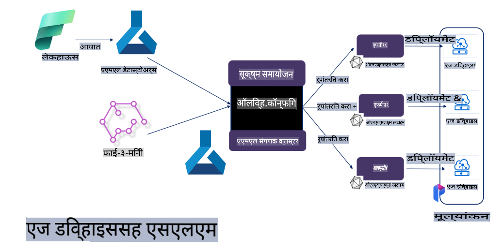

# **मायक्रोसॉफ्ट Olive वापरून Phi-3 फाइन-ट्यूनिंग**

[Olive](https://github.com/microsoft/OLive?WT.mc_id=aiml-138114-kinfeylo) ही हार्डवेअर-आधारित मॉडेल ऑप्टिमायझेशनसाठी सुलभ आणि प्रभावी साधन आहे. हे मॉडेल कम्प्रेशन, ऑप्टिमायझेशन, आणि कम्पायलेशनसाठी उद्योगातील आघाडीच्या तंत्रांचा एकत्रित उपयोग करते.

हे मशीन लर्निंग मॉडेल्स ऑप्टिमाइज करण्याची प्रक्रिया सुलभ करते, जेणेकरून ते विशिष्ट हार्डवेअर आर्किटेक्चरचा सर्वोत्तम उपयोग करू शकतील.

क्लाउड-आधारित ऍप्लिकेशन्स किंवा एज डिव्हाइसेसवर काम करत असाल, Olive आपले मॉडेल्स सहज आणि प्रभावीपणे ऑप्टिमाइज करण्यास मदत करते.

## मुख्य वैशिष्ट्ये:
- Olive हार्डवेअर लक्ष्यांसाठी ऑप्टिमायझेशन तंत्रांचे एकत्रीकरण आणि स्वयंचलन करते.
- प्रत्येक परिस्थितीसाठी एकच ऑप्टिमायझेशन तंत्र लागू होत नाही, त्यामुळे Olive उद्योगातील तज्ञांना त्यांचे नवकल्पना प्लग इन करण्याची सुविधा देते.

## अभियांत्रिकी प्रयत्न कमी करा:
- डेव्हलपर्सना प्रशिक्षित मॉडेल्स डिप्लॉय करण्यासाठी हार्डवेअर विक्रेत्यांच्या विविध टूलचेनचा अभ्यास आणि उपयोग करावा लागतो.
- Olive या अनुभवाला सोपे करते, इच्छित हार्डवेअरसाठी ऑप्टिमायझेशन तंत्र स्वयंचलित करते.

## रेडी-टू-यूज एंड-टू-एंड ऑप्टिमायझेशन सोल्यूशन:

Olive एकात्मिक तंत्रांची रचना आणि ट्यूनिंग करून एंड-टू-एंड ऑप्टिमायझेशनचे एकत्रित समाधान प्रदान करते.
हे मॉडेल्स ऑप्टिमाइज करताना अचूकता आणि लेटन्सी यांसारख्या मर्यादांचा विचार करते.

## मायक्रोसॉफ्ट Olive वापरून फाइन-ट्यूनिंग 

मायक्रोसॉफ्ट Olive हे एक सुलभ ओपन सोर्स मॉडेल ऑप्टिमायझेशन साधन आहे, जे जनरेटिव्ह आर्टिफिशियल इंटेलिजन्स क्षेत्रातील फाइन-ट्यूनिंग आणि संदर्भ दोन्हीसाठी वापरता येते. यासाठी फक्त सोपी कॉन्फिगरेशन आवश्यक आहे. ओपन सोर्स स्मॉल लँग्वेज मॉडेल्स आणि संबंधित रनटाइम वातावरण (AzureML / स्थानिक GPU, CPU, DirectML) यांचा वापर करून, मॉडेलचे फाइन-ट्यूनिंग किंवा संदर्भ स्वयंचलित ऑप्टिमायझेशनद्वारे पूर्ण करता येते. तसेच, हे मॉडेल क्लाउड किंवा एज डिव्हाइसवर डिप्लॉय करण्यासाठी सर्वोत्तम मॉडेल शोधून देते. हे उद्योगांना त्यांच्या स्वतःच्या क्षेत्रनिहाय मॉडेल्स ऑन-प्रिमायसेस आणि क्लाउडवर तयार करण्याची परवानगी देते.


## मायक्रोसॉफ्ट Olive वापरून Phi-3 फाइन-ट्यूनिंग 



## Phi-3 Olive नमुना कोड आणि उदाहरण
या उदाहरणामध्ये Olive वापरून तुम्ही खालील गोष्टी करू शकाल:

- Sad, Joy, Fear, Surprise यांसारख्या भावना वर्गीकरणासाठी LoRA अडॅप्टर फाइन-ट्यून करा.
- अडॅप्टरचे वेट्स बेस मॉडेलमध्ये मर्ज करा.
- मॉडेल ऑप्टिमाइज करा आणि त्याचे INT4 मध्ये क्वांटाइजेशन करा.

[नमुना कोड](../../code/03.Finetuning/olive-ort-example/README.md)

### मायक्रोसॉफ्ट Olive सेटअप करा

मायक्रोसॉफ्ट Olive ची स्थापना अतिशय सोपी आहे आणि CPU, GPU, DirectML, आणि Azure ML साठी सुद्धा करता येते.

```bash
pip install olive-ai
```

जर तुम्हाला CPU सह ONNX मॉडेल चालवायचे असेल, तर तुम्ही वापरू शकता:

```bash
pip install olive-ai[cpu]
```

जर तुम्हाला GPU सह ONNX मॉडेल चालवायचे असेल, तर तुम्ही वापरू शकता:

```python
pip install olive-ai[gpu]
```

Azure ML वापरायचे असल्यास:

```python
pip install git+https://github.com/microsoft/Olive#egg=olive-ai[azureml]
```

**सूचना**
OS आवश्यकता: Ubuntu 20.04 / 22.04 

### **मायक्रोसॉफ्ट Olive चे Config.json**

स्थापनेनंतर, तुम्ही Config फाईलद्वारे विविध मॉडेल-विशिष्ट सेटिंग्ज कॉन्फिगर करू शकता, ज्यामध्ये डेटा, संगणन, प्रशिक्षण, डिप्लॉयमेंट, आणि मॉडेल जनरेशन यांचा समावेश आहे.

**1. डेटा**

मायक्रोसॉफ्ट Olive वर स्थानिक डेटा आणि क्लाउड डेटा दोन्हीवर प्रशिक्षण दिले जाऊ शकते आणि सेटिंग्जमध्ये त्याची कॉन्फिगरेशन करता येते.

*स्थानिक डेटा सेटिंग्ज*

तुम्ही फाइन-ट्यूनिंगसाठी लागणाऱ्या डेटासेटला सेट करू शकता, सहसा JSON स्वरूपात, आणि डेटा टेम्पलेटसह त्याला अडॅप्ट करू शकता. हे मॉडेलच्या गरजेनुसार समायोजित करावे लागेल (उदा. मायक्रोसॉफ्ट Phi-3-mini साठी आवश्यक स्वरूपाशी जुळवून घ्या. इतर मॉडेल्ससाठी, त्यांच्या फाइन-ट्यूनिंग स्वरूपांचा संदर्भ घ्या.)

```json

    "data_configs": [
        {
            "name": "dataset_default_train",
            "type": "HuggingfaceContainer",
            "load_dataset_config": {
                "params": {
                    "data_name": "json", 
                    "data_files":"dataset/dataset-classification.json",
                    "split": "train"
                }
            },
            "pre_process_data_config": {
                "params": {
                    "dataset_type": "corpus",
                    "text_cols": [
                            "phrase",
                            "tone"
                    ],
                    "text_template": "### Text: {phrase}\n### The tone is:\n{tone}",
                    "corpus_strategy": "join",
                    "source_max_len": 2048,
                    "pad_to_max_len": false,
                    "use_attention_mask": false
                }
            }
        }
    ],
```

**क्लाउड डेटा स्रोत सेटिंग्ज**

Azure AI Studio/Azure Machine Learning Service च्या डेटास्टोअरला लिंक करून क्लाउडमधील डेटा जोडता येतो. मायक्रोसॉफ्ट Fabric आणि Azure Data च्या मदतीने विविध डेटा स्रोत जोडून फाइन-ट्यूनिंगसाठी डेटा तयार करता येतो.

```json

    "data_configs": [
        {
            "name": "dataset_default_train",
            "type": "HuggingfaceContainer",
            "load_dataset_config": {
                "params": {
                    "data_name": "json", 
                    "data_files": {
                        "type": "azureml_datastore",
                        "config": {
                            "azureml_client": {
                                "subscription_id": "Your Azure Subscrition ID",
                                "resource_group": "Your Azure Resource Group",
                                "workspace_name": "Your Azure ML Workspaces name"
                            },
                            "datastore_name": "workspaceblobstore",
                            "relative_path": "Your train_data.json Azure ML Location"
                        }
                    },
                    "split": "train"
                }
            },
            "pre_process_data_config": {
                "params": {
                    "dataset_type": "corpus",
                    "text_cols": [
                            "Question",
                            "Best Answer"
                    ],
                    "text_template": "<|user|>\n{Question}<|end|>\n<|assistant|>\n{Best Answer}\n<|end|>",
                    "corpus_strategy": "join",
                    "source_max_len": 2048,
                    "pad_to_max_len": false,
                    "use_attention_mask": false
                }
            }
        }
    ],
    
```

**2. संगणन कॉन्फिगरेशन**

जर तुम्हाला स्थानिक स्तरावर काम करायचे असेल, तर स्थानिक डेटा संसाधने थेट वापरता येतात. Azure AI Studio / Azure Machine Learning Service च्या संसाधनांचा उपयोग करायचा असल्यास, संबंधित Azure पॅरामीटर्स, संगणन क्षमता नाव इत्यादी कॉन्फिगर करावे लागतात.

```json

    "systems": {
        "aml": {
            "type": "AzureML",
            "config": {
                "accelerators": ["gpu"],
                "hf_token": true,
                "aml_compute": "Your Azure AI Studio / Azure Machine Learning Service Compute Name",
                "aml_docker_config": {
                    "base_image": "Your Azure AI Studio / Azure Machine Learning Service docker",
                    "conda_file_path": "conda.yaml"
                }
            }
        },
        "azure_arc": {
            "type": "AzureML",
            "config": {
                "accelerators": ["gpu"],
                "aml_compute": "Your Azure AI Studio / Azure Machine Learning Service Compute Name",
                "aml_docker_config": {
                    "base_image": "Your Azure AI Studio / Azure Machine Learning Service docker",
                    "conda_file_path": "conda.yaml"
                }
            }
        }
    },
```

***सूचना***

Azure AI Studio / Azure Machine Learning Service वर कंटेनरद्वारे चालवल्या जाणाऱ्या प्रक्रियेसाठी आवश्यक वातावरण कॉन्फिगर करावे लागेल. हे conda.yaml वातावरणामध्ये सेट केले जाते.

```yaml

name: project_environment
channels:
  - defaults
dependencies:
  - python=3.8.13
  - pip=22.3.1
  - pip:
      - einops
      - accelerate
      - azure-keyvault-secrets
      - azure-identity
      - bitsandbytes
      - datasets
      - huggingface_hub
      - peft
      - scipy
      - sentencepiece
      - torch>=2.2.0
      - transformers
      - git+https://github.com/microsoft/Olive@jiapli/mlflow_loading_fix#egg=olive-ai[gpu]
      - --extra-index-url https://aiinfra.pkgs.visualstudio.com/PublicPackages/_packaging/ORT-Nightly/pypi/simple/ 
      - ort-nightly-gpu==1.18.0.dev20240307004
      - --extra-index-url https://aiinfra.pkgs.visualstudio.com/PublicPackages/_packaging/onnxruntime-genai/pypi/simple/
      - onnxruntime-genai-cuda

    

```

**3. तुमचे SLM निवडा**

तुम्ही Hugging Face वरून थेट मॉडेल वापरू शकता किंवा Azure AI Studio / Azure Machine Learning च्या मॉडेल कॅटलॉगसह थेट जोडणी करू शकता. खालील कोड उदाहरणामध्ये Microsoft Phi-3-mini चा उपयोग केला आहे.

जर तुमच्याकडे स्थानिक मॉडेल असेल, तर तुम्ही हा पद्धत वापरू शकता:

```json

    "input_model":{
        "type": "PyTorchModel",
        "config": {
            "hf_config": {
                "model_name": "model-cache/microsoft/phi-3-mini",
                "task": "text-generation",
                "model_loading_args": {
                    "trust_remote_code": true
                }
            }
        }
    },
```

Azure AI Studio / Azure Machine Learning Service वरून मॉडेल वापरायचे असल्यास, तुम्ही ही पद्धत वापरू शकता:

```json

    "input_model":{
        "type": "PyTorchModel",
        "config": {
            "model_path": {
                "type": "azureml_registry_model",
                "config": {
                    "name": "microsoft/Phi-3-mini-4k-instruct",
                    "registry_name": "azureml-msr",
                    "version": "11"
                }
            },
             "model_file_format": "PyTorch.MLflow",
             "hf_config": {
                "model_name": "microsoft/Phi-3-mini-4k-instruct",
                "task": "text-generation",
                "from_pretrained_args": {
                    "trust_remote_code": true
                }
            }
        }
    },
```

**सूचना:**
Azure AI Studio / Azure Machine Learning Service सह एकत्रीकरण करताना, मॉडेल सेट करताना आवृत्ती क्रमांक आणि संबंधित नावांचे पालन करा.

Azure वरील सर्व मॉडेल्स PyTorch.MLflow मध्ये सेट करणे आवश्यक आहे.

तुमच्याकडे Hugging Face खाते असणे आणि ते Azure AI Studio / Azure Machine Learning च्या Key Value शी लिंक करणे आवश्यक आहे.

**4. अल्गोरिदम**

मायक्रोसॉफ्ट Olive ने Lora आणि QLora फाइन-ट्यूनिंग अल्गोरिदम्स उत्तम प्रकारे समाविष्ट केले आहेत. तुम्हाला फक्त काही संबंधित पॅरामीटर्स कॉन्फिगर करायचे आहेत. येथे QLora चे उदाहरण दिले आहे.

```json
        "lora": {
            "type": "LoRA",
            "config": {
                "target_modules": [
                    "o_proj",
                    "qkv_proj"
                ],
                "double_quant": true,
                "lora_r": 64,
                "lora_alpha": 64,
                "lora_dropout": 0.1,
                "train_data_config": "dataset_default_train",
                "eval_dataset_size": 0.3,
                "training_args": {
                    "seed": 0,
                    "data_seed": 42,
                    "per_device_train_batch_size": 1,
                    "per_device_eval_batch_size": 1,
                    "gradient_accumulation_steps": 4,
                    "gradient_checkpointing": false,
                    "learning_rate": 0.0001,
                    "num_train_epochs": 3,
                    "max_steps": 10,
                    "logging_steps": 10,
                    "evaluation_strategy": "steps",
                    "eval_steps": 187,
                    "group_by_length": true,
                    "adam_beta2": 0.999,
                    "max_grad_norm": 0.3
                }
            }
        },
```

जर तुम्हाला क्वांटायझेशन कन्वर्जन करायचे असेल, तर मायक्रोसॉफ्ट Olive च्या मुख्य शाखेमध्ये onnxruntime-genai पद्धत आधीच समर्थित आहे. तुम्ही तुमच्या गरजेनुसार सेट करू शकता:

1. अडॅप्टरचे वेट्स बेस मॉडेलमध्ये मर्ज करा.
2. मॉडेलला आवश्यक प्रिसिजनसह onnx मॉडेलमध्ये कन्वर्ट करा, उदा. क्वांटाइज्ड INT4 मध्ये.

```json

        "merge_adapter_weights": {
            "type": "MergeAdapterWeights"
        },
        "builder": {
            "type": "ModelBuilder",
            "config": {
                "precision": "int4"
            }
        }
```

**सूचना** 
- जर तुम्ही QLoRA वापरत असाल, तर ONNXRuntime-genai चे क्वांटायझेशन कन्वर्जन सध्या समर्थित नाही.

- येथे नमूद करायचे आहे की तुम्ही वरील पायऱ्या तुमच्या गरजेनुसार सेट करू शकता. वरील सर्व पायऱ्या पूर्णपणे कॉन्फिगर करण्याची आवश्यकता नाही. तुमच्या गरजेनुसार, तुम्ही थेट अल्गोरिदमच्या पायऱ्यांचा वापर करू शकता. शेवटी, तुम्हाला संबंधित इंजिन्स कॉन्फिगर करावे लागतील.

```json

    "engine": {
        "log_severity_level": 0,
        "host": "aml",
        "target": "aml",
        "search_strategy": false,
        "execution_providers": ["CUDAExecutionProvider"],
        "cache_dir": "../model-cache/models/phi3-finetuned/cache",
        "output_dir" : "../model-cache/models/phi3-finetuned"
    }
```

**5. फाइन-ट्यूनिंग पूर्ण झाले**

कमांड लाइनवर, olive-config.json च्या डायरेक्टरीमध्ये खालीलप्रमाणे चालवा:

```bash
olive run --config olive-config.json  
```

**अस्वीकरण**:  
हे दस्तऐवज मशीन-आधारित एआय अनुवाद सेवांचा वापर करून अनुवादित केले गेले आहे. आम्ही अचूकतेसाठी प्रयत्नशील असलो तरी, कृपया लक्षात घ्या की स्वयंचलित अनुवादांमध्ये त्रुटी किंवा अचूकतेचा अभाव असू शकतो. मूळ भाषेतील मूळ दस्तऐवज अधिकृत स्रोत मानला जावा. महत्त्वाच्या माहितीकरिता व्यावसायिक मानवी अनुवादाची शिफारस केली जाते. या अनुवादाचा वापर केल्यामुळे उद्भवणाऱ्या कोणत्याही गैरसमज किंवा चुकीच्या अर्थासाठी आम्ही जबाबदार नाही.