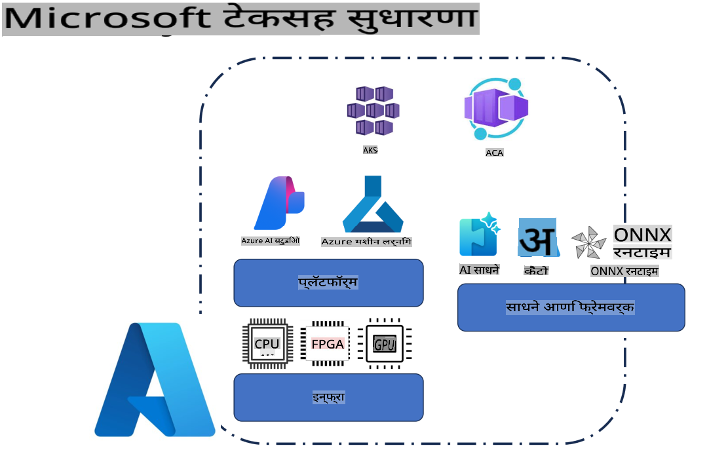
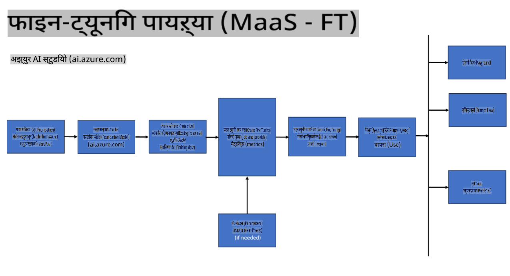
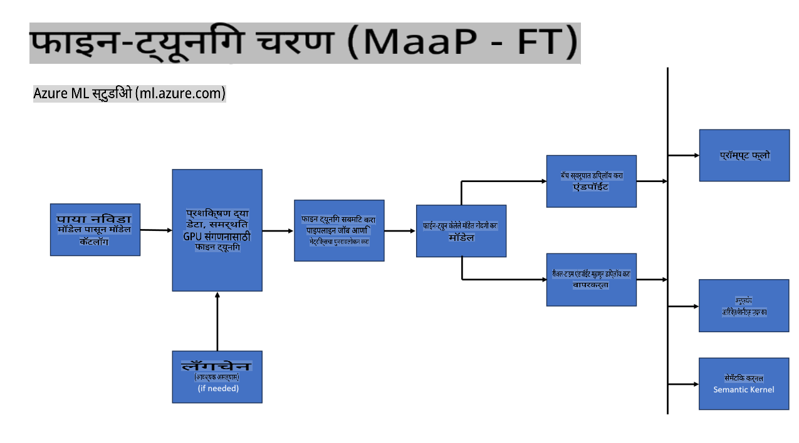
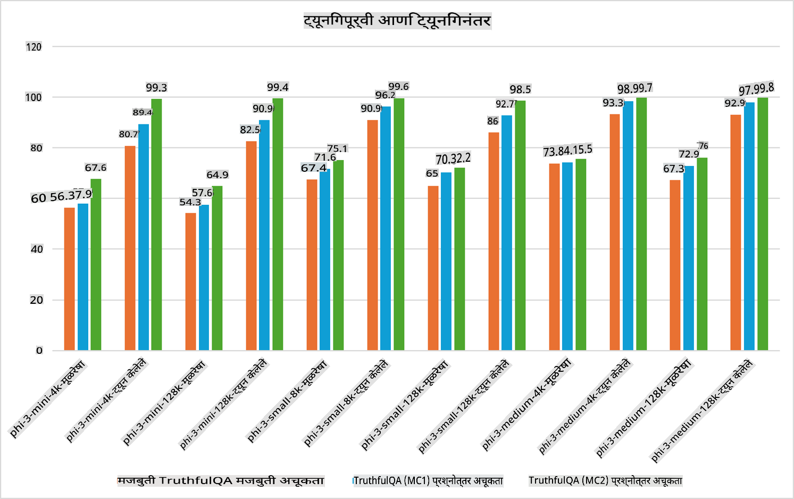

## फाइन-ट्यूनिंगच्या संधी

**प्लॅटफॉर्म** यात Azure AI Foundry, Azure Machine Learning, AI Tools, Kaito, आणि ONNX Runtime यांसारख्या विविध तंत्रज्ञानांचा समावेश आहे.

**इन्फ्रास्ट्रक्चर** यात CPU आणि FPGA यांचा समावेश आहे, जे फाइन-ट्यूनिंग प्रक्रियेसाठी अत्यावश्यक आहेत. या तंत्रज्ञानाचे चिन्ह दाखवतो.

**साधने आणि फ्रेमवर्क** यात ONNX Runtime आणि ONNX Runtime यांचा समावेश आहे. या तंत्रज्ञानाचे चिन्ह दाखवतो.  
[ONNX Runtime आणि ONNX Runtime साठी चिन्ह घाला]

Microsoft तंत्रज्ञानांसह फाइन-ट्यूनिंग प्रक्रिया विविध घटक आणि साधनांचा समावेश करते. या तंत्रज्ञानाचे योग्य प्रकारे आकलन आणि वापर करून, आपण आपल्या अनुप्रयोगांना प्रभावीपणे फाइन-ट्यून करू शकतो आणि अधिक चांगली समाधानं तयार करू शकतो.

## मॉडेल अॅज सर्व्हिस

होस्टेड फाइन-ट्यूनिंग वापरून मॉडेल फाइन-ट्यून करा, ज्यासाठी संगणकीय साधनं तयार करण्याची किंवा व्यवस्थापित करण्याची गरज नाही.

Phi-3-mini आणि Phi-3-medium मॉडेल्ससाठी सर्व्हरलेस फाइन-ट्यूनिंग उपलब्ध आहे, ज्यामुळे डेव्हलपर्सना क्लाउड आणि एज परिस्थितीसाठी मॉडेल्स पटकन आणि सोप्या पद्धतीने कस्टमाइझ करता येतात, संगणकीय साधनं व्यवस्थापित करण्याची गरज नसते. तसेच, Phi-3-small आता Models-as-a-Service ऑफरिंगद्वारे उपलब्ध आहे, ज्यामुळे डेव्हलपर्सना मूलभूत इन्फ्रास्ट्रक्चर व्यवस्थापित न करता AI डेव्हलपमेंट सुरू करण्यासाठी सोपी सुरुवात करता येते.

## मॉडेल अॅज प्लॅटफॉर्म

फाइन-ट्यूनिंगसाठी वापरकर्ते स्वतःचे संगणकीय साधन व्यवस्थापित करतात.

[फाइन-ट्यूनिंग नमुना](https://github.com/Azure/azureml-examples/blob/main/sdk/python/foundation-models/system/finetune/chat-completion/chat-completion.ipynb)

## फाइन-ट्यूनिंगच्या संधी 

| | | | | | | |
|-|-|-|-|-|-|-|
|संधी|LoRA|QLoRA|PEFT|DeepSpeed|ZeRO|DORA|
|विशिष्ट कामे किंवा डोमेनसाठी प्री-ट्रेंड LLMs अॅडॉप्ट करणे|होय|होय|होय|होय|होय|होय|
|NLP कामांसाठी फाइन-ट्यूनिंग जसे की टेक्स्ट वर्गीकरण, नेम्ड एंटिटी रेकग्निशन, आणि मशीन ट्रान्सलेशन|होय|होय|होय|होय|होय|होय|
|QA कामांसाठी फाइन-ट्यूनिंग|होय|होय|होय|होय|होय|होय|
|चॅटबॉट्समध्ये मानवीसारख्या प्रतिसादांसाठी फाइन-ट्यूनिंग|होय|होय|होय|होय|होय|होय|
|संगीत, कला, किंवा इतर सर्जनशील गोष्टींसाठी फाइन-ट्यूनिंग|होय|होय|होय|होय|होय|होय|
|संगणकीय आणि आर्थिक खर्च कमी करणे|होय|होय|नाही|होय|होय|नाही|
|मेमरीचा वापर कमी करणे|नाही|होय|नाही|होय|होय|होय|
|फाइन-ट्यूनिंगसाठी कमी पॅरामीटर्सचा वापर|नाही|होय|होय|नाही|नाही|होय|
|डेटा पॅरॅललिझमचा मेमरी-इफिशियंट प्रकार जो उपलब्ध GPU डिव्हाइसेसच्या एकूण GPU मेमरीचा वापर करण्याची परवानगी देतो|नाही|नाही|नाही|होय|होय|होय|

## फाइन-ट्यूनिंग परफॉर्मन्सचे उदाहरणे

**अस्वीकरण**:  
हे दस्तऐवज मशीन-आधारित एआय भाषांतर सेवांचा वापर करून अनुवादित केले गेले आहे. आम्ही अचूकतेसाठी प्रयत्नशील असलो तरी, कृपया लक्षात घ्या की स्वयंचलित भाषांतरांमध्ये त्रुटी किंवा अचूकतेचा अभाव असू शकतो. मूळ भाषेतील मूळ दस्तऐवज हा अधिकृत स्रोत मानला जावा. महत्त्वाच्या माहितीसाठी, व्यावसायिक मानवी भाषांतराची शिफारस केली जाते. या भाषांतराचा वापर करून उद्भवलेल्या कोणत्याही गैरसमज किंवा चुकीच्या अर्थासाठी आम्ही जबाबदार नाही.