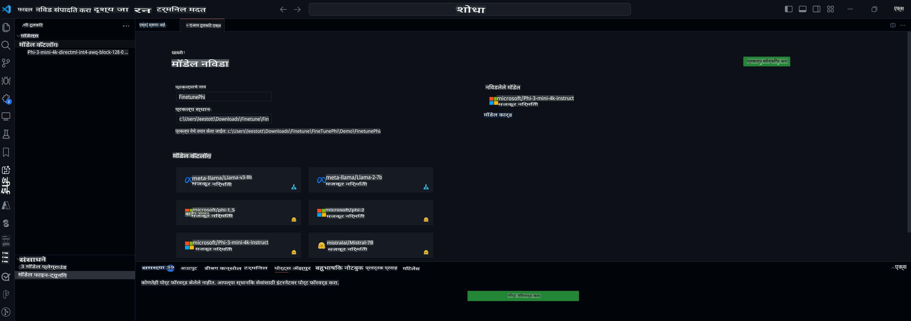

## VS Code साठी AI टूलकिटमध्ये आपले स्वागत आहे

[VS Code साठी AI टूलकिट](https://github.com/microsoft/vscode-ai-toolkit/tree/main) Azure AI Studio Catalog आणि Hugging Face सारख्या इतर कॅटलॉगमधील विविध मॉडेल्स एकत्र आणते. हे टूलकिट जनरेटिव AI टूल्स आणि मॉडेल्ससह AI अ‍ॅप्स तयार करण्यासाठी सामान्य विकास कार्यांना सुलभ करते:
- मॉडेल शोध आणि प्लेग्राउंडसह सुरुवात करा.
- स्थानिक संगणकीय संसाधनांचा वापर करून मॉडेल फाइन-ट्यूनिंग आणि इनफरन्स.
- Azure संसाधनांचा वापर करून रिमोट फाइन-ट्यूनिंग आणि इनफरन्स.

[VS Code साठी AI टूलकिट इंस्टॉल करा](https://marketplace.visualstudio.com/items?itemName=ms-windows-ai-studio.windows-ai-studio)



**[खाजगी पूर्वावलोकन]** क्लाऊडमध्ये मॉडेल फाइन-ट्यूनिंग आणि इनफरन्स चालवण्यासाठी Azure Container Apps साठी वन-क्लिक प्रोव्हिजनिंग.

आता आपल्या AI अ‍ॅप डेव्हलपमेंटला सुरुवात करूया:

- [VS Code साठी AI टूलकिटमध्ये आपले स्वागत आहे](../../../../md/03.FineTuning)
- [स्थानिक विकास](../../../../md/03.FineTuning)
  - [तयारी](../../../../md/03.FineTuning)
  - [Conda सक्रिय करा](../../../../md/03.FineTuning)
  - [फक्त बेस मॉडेल फाइन-ट्यूनिंग](../../../../md/03.FineTuning)
  - [मॉडेल फाइन-ट्यूनिंग आणि इनफरन्सिंग](../../../../md/03.FineTuning)
  - [मॉडेल फाइन-ट्यूनिंग](../../../../md/03.FineTuning)
  - [Microsoft Olive](../../../../md/03.FineTuning)
  - [फाइन-ट्यूनिंग नमुने आणि संसाधने](../../../../md/03.FineTuning)
- [**\[खाजगी पूर्वावलोकन\]** रिमोट विकास](../../../../md/03.FineTuning)
  - [पूर्वअटी](../../../../md/03.FineTuning)
  - [रिमोट विकास प्रकल्प सेट अप करणे](../../../../md/03.FineTuning)
  - [Azure संसाधनांची तरतूद करा](../../../../md/03.FineTuning)
  - [\[पर्यायी\] Huggingface टोकन Azure Container App Secret मध्ये जोडा](../../../../md/03.FineTuning)
  - [फाइन-ट्यूनिंग चालवा](../../../../md/03.FineTuning)
  - [इनफरन्स एंडपॉइंटची तरतूद करा](../../../../md/03.FineTuning)
  - [इनफरन्स एंडपॉइंट डिप्लॉय करा](../../../../md/03.FineTuning)
  - [प्रगत वापर](../../../../md/03.FineTuning)

## स्थानिक विकास
### तयारी

1. यजमान संगणकावर NVIDIA ड्राइव्हर इंस्टॉल आहे याची खात्री करा.  
2. जर तुम्ही डेटासेट वापरण्यासाठी HF वापरत असाल तर `huggingface-cli login` चालवा.  
3. `Olive` की सेटिंग्सचे स्पष्टीकरण, विशेषतः मेमरी वापर बदलण्यासाठी.  

### Conda सक्रिय करा
आम्ही WSL वातावरण वापरत असल्याने, तुम्हाला Conda वातावरण मॅन्युअली सक्रिय करावे लागेल. या चरणानंतर तुम्ही फाइन-ट्यूनिंग किंवा इनफरन्स चालवू शकता.

```bash
conda activate [conda-env-name] 
```

### फक्त बेस मॉडेल फाइन-ट्यूनिंग
जर तुम्हाला फाइन-ट्यूनिंग न करता फक्त बेस मॉडेल वापरून पाहायचे असेल, तर Conda सक्रिय केल्यानंतर हा आदेश चालवा.

```bash
cd inference

# Web browser interface allows to adjust a few parameters like max new token length, temperature and so on.
# User has to manually open the link (e.g. http://0.0.0.0:7860) in a browser after gradio initiates the connections.
python gradio_chat.py --baseonly
```

### मॉडेल फाइन-ट्यूनिंग आणि इनफरन्सिंग

डेव्ह कंटेनरमध्ये वर्कस्पेस उघडल्यानंतर, टर्मिनल उघडा (डीफॉल्ट पथ प्रकल्प मूळ आहे), आणि निवडलेल्या डेटासेटवर LLM फाइन-ट्यून करण्यासाठी खालील आदेश चालवा.

```bash
python finetuning/invoke_olive.py 
```

चेकपॉइंट्स आणि अंतिम मॉडेल `models` folder.

Next run inferencing with the fune-tuned model through chats in a `console`, `web browser` or `prompt flow` मध्ये जतन केले जातील.

```bash
cd inference

# Console interface.
python console_chat.py

# Web browser interface allows to adjust a few parameters like max new token length, temperature and so on.
# User has to manually open the link (e.g. http://127.0.0.1:7860) in a browser after gradio initiates the connections.
python gradio_chat.py
```

`prompt flow` in VS Code, please refer to this [Quick Start](https://microsoft.github.io/promptflow/how-to-guides/quick-start.html).

### Model Fine-tuning

Next, download the following model depending on the availability of a GPU on your device.

To initiate the local fine-tuning session using QLoRA, select a model you want to fine-tune from our catalog.
| Platform(s) | GPU available | Model name | Size (GB) |
|---------|---------|--------|--------|
| Windows | Yes | Phi-3-mini-4k-**directml**-int4-awq-block-128-onnx | 2.13GB |
| Linux | Yes | Phi-3-mini-4k-**cuda**-int4-onnx | 2.30GB |
| Windows<br>Linux | No | Phi-3-mini-4k-**cpu**-int4-rtn-block-32-acc-level-4-onnx | 2.72GB |

**_Note_** You do not need an Azure Account to download the models

The Phi3-mini (int4) model is approximately 2GB-3GB in size. Depending on your network speed, it could take a few minutes to download.

Start by selecting a project name and location.
Next, select a model from the model catalog. You will be prompted to download the project template. You can then click "Configure Project" to adjust various settings.

### Microsoft Olive 

We use [Olive](https://microsoft.github.io/Olive/why-olive.html) to run QLoRA fine-tuning on a PyTorch model from our catalog. All of the settings are preset with the default values to optimize to run the fine-tuning process locally with optimized use of memory, but it can be adjusted for your scenario.

### Fine Tuning Samples and Resoures

- [Fine tuning Getting Started Guide](https://learn.microsoft.com/windows/ai/toolkit/toolkit-fine-tune)
- [Fine tuning with a HuggingFace Dataset](https://github.com/microsoft/vscode-ai-toolkit/blob/main/archive/walkthrough-hf-dataset.md)
- [Fine tuning with Simple DataSet](https://github.com/microsoft/vscode-ai-toolkit/blob/main/archive/walkthrough-simple-dataset.md)

## **[Private Preview]** Remote Development

### Prerequisites

1. To run the model fine-tuning in your remote Azure Container App Environment, make sure your subscription has enough GPU capacity. Submit a [support ticket](https://azure.microsoft.com/support/create-ticket/) to request the required capacity for your application. [Get More Info about GPU capacity](https://learn.microsoft.com/azure/container-apps/workload-profiles-overview)
2. If you are using private dataset on HuggingFace, make sure you have a [HuggingFace account](https://huggingface.co/?WT.mc_id=aiml-137032-kinfeylo) and [generate an access token](https://huggingface.co/docs/hub/security-tokens?WT.mc_id=aiml-137032-kinfeylo)
3. Enable Remote Fine-tuning and Inference feature flag in the AI Toolkit for VS Code
   1. Open the VS Code Settings by selecting *File -> Preferences -> Settings*.
   2. Navigate to *Extensions* and select *AI Toolkit*.
   3. Select the *"Enable Remote Fine-tuning And Inference"* option.
   4. Reload VS Code to take effect.

- [Remote Fine tuning](https://github.com/microsoft/vscode-ai-toolkit/blob/main/archive/remote-finetuning.md)

### Setting Up a Remote Development Project
1. Execute the command palette `AI Toolkit: Focus on Resource View`.
2. Navigate to *Model Fine-tuning* to access the model catalog. Assign a name to your project and select its location on your machine. Then, hit the *"Configure Project"* button.
3. Project Configuration
    1. Avoid enabling the *"Fine-tune locally"* option.
    2. The Olive configuration settings will appear with pre-set default values. Please adjust and fill in these configurations as required.
    3. Move on to *Generate Project*. This stage leverages WSL and involves setting up a new Conda environment, preparing for future updates that include Dev Containers.
4. Click on *"Relaunch Window In Workspace"* to open your remote development project.

> **Note:** The project currently works either locally or remotely within the AI Toolkit for VS Code. If you choose *"Fine-tune locally"* during project creation, it will operate exclusively in WSL without remote development capabilities. On the other hand, if you forego enabling *"Fine-tune locally"*, the project will be restricted to the remote Azure Container App environment.

### Provision Azure Resources
To get started, you need to provision the Azure Resource for remote fine-tuning. Do this by running the `AI Toolkit: Provision Azure Container Apps job for fine-tuning` from the command palette.

Monitor the progress of the provision through the link displayed in the output channel.

### [Optional] Add Huggingface Token to the Azure Container App Secret
If you're using private HuggingFace dataset, set your HuggingFace token as an environment variable to avoid the need for manual login on the Hugging Face Hub.
You can do this using the `AI Toolkit: Add Azure Container Apps Job secret for fine-tuning command`. With this command, you can set the secret name as [`HF_TOKEN`](https://huggingface.co/docs/huggingface_hub/package_reference/environment_variables#hftoken) and use your Hugging Face token as the secret value.

### Run Fine-tuning
To start the remote fine-tuning job, execute the `AI Toolkit: Run fine-tuning` command.

To view the system and console logs, you can visit the Azure portal using the link in the output panel (more steps at [View and Query Logs on Azure](https://aka.ms/ai-toolkit/remote-provision#view-and-query-logs-on-azure)). Or, you can view the console logs directly in the VSCode output panel by running the command `AI Toolkit: Show the running fine-tuning job streaming logs`. 
> **Note:** The job might be queued due to insufficient resources. If the log is not displayed, execute the `AI Toolkit: Show the running fine-tuning job streaming logs` command, wait for a while and then execute the command again to re-connect to the streaming log.

During this process, QLoRA will be used for fine-tuning, and will create LoRA adapters for the model to use during inference.
The results of the fine-tuning will be stored in the Azure Files.

### Provision Inference Endpoint
After the adapters are trained in the remote environment, use a simple Gradio application to interact with the model.
Similar to the fine-tuning process, you need to set up the Azure Resources for remote inference by executing the `AI Toolkit: Provision Azure Container Apps for inference` from the command palette.

By default, the subscription and the resource group for inference should match those used for fine-tuning. The inference will use the same Azure Container App Environment and access the model and model adapter stored in Azure Files, which were generated during the fine-tuning step. 


### Deploy the Inference Endpoint
If you wish to revise the inference code or reload the inference model, please execute the `AI Toolkit: Deploy for inference` command. This will synchronize your latest code with Azure Container App and restart the replica.  

Once deployment is successfully completed, you can access the inference API by clicking on the "*Go to Inference Endpoint*" button displayed in the VSCode notification. Or, the web API endpoint can be found under `ACA_APP_ENDPOINT` in `./infra/inference.config.json` आणि आउटपुट पॅनेलमध्ये वापरण्यास तयार आहात. या एंडपॉइंटचा वापर करून मॉडेलचे मूल्यमापन करण्यास सज्ज व्हा.

### प्रगत वापर
AI टूलकिटसह रिमोट विकासाबद्दल अधिक माहितीसाठी, [रिमोटली मॉडेल्स फाइन-ट्यूनिंग](https://aka.ms/ai-toolkit/remote-provision) आणि [फाइन-ट्यून मॉडेलसह इनफरन्सिंग](https://aka.ms/ai-toolkit/remote-inference) दस्तऐवज पहा.

**अस्वीकरण**:  
हे दस्तऐवज मशीन-आधारित एआय अनुवाद सेवांचा वापर करून भाषांतरित करण्यात आले आहे. आम्ही अचूकतेसाठी प्रयत्नशील असलो तरी कृपया लक्षात घ्या की स्वयंचलित भाषांतरे त्रुटी किंवा अचूकतेच्या अभावामुळे चुकीची असू शकतात. मूळ भाषेतील मूळ दस्तऐवज हा अधिकृत स्रोत मानला जावा. महत्त्वाच्या माहितीसाठी, व्यावसायिक मानवी भाषांतराची शिफारस केली जाते. या भाषांतराच्या वापरामुळे उद्भवलेल्या कोणत्याही गैरसमजुतीसाठी किंवा चुकीच्या अर्थासाठी आम्ही जबाबदार नाही.