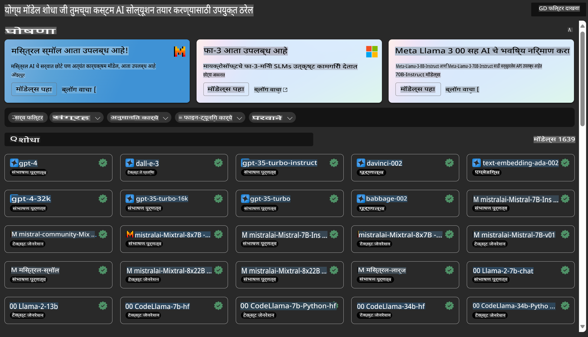

# **Azure Machine Learning सेवा ओळख**

[Azure Machine Learning](https://ml.azure.com?WT.mc_id=aiml-138114-kinfeylo) ही मशीन लर्निंग (ML) प्रकल्पांचा जीवनचक्र वेगाने पूर्ण करण्यासाठी आणि व्यवस्थापित करण्यासाठी एक क्लाउड सेवा आहे.

ML व्यावसायिक, डेटा वैज्ञानिक, आणि अभियंते त्यांच्या दैनंदिन कामकाजात हे वापरू शकतात:

- मॉडेल्स प्रशिक्षित करा आणि तैनात करा.  
- मशीन लर्निंग ऑपरेशन्स (MLOps) व्यवस्थापित करा.  
- तुम्ही Azure Machine Learning मध्ये मॉडेल तयार करू शकता किंवा PyTorch, TensorFlow, किंवा scikit-learn सारख्या ओपन-सोर्स प्लॅटफॉर्मवरून तयार केलेले मॉडेल वापरू शकता.  
- MLOps साधने तुम्हाला मॉडेल्सचे निरीक्षण, पुनःप्रशिक्षण, आणि पुनःतैनाती करण्यात मदत करतात.  

## Azure Machine Learning कोणासाठी आहे?

**डेटा वैज्ञानिक आणि ML अभियंते**

त्यांना त्यांच्या दैनंदिन कामकाजाचा वेग वाढवण्यासाठी आणि स्वयंचलित करण्यासाठी साधने वापरता येतात.  
Azure ML मध्ये निष्पक्षता, स्पष्टता, ट्रॅकिंग, आणि ऑडिट क्षमतांसाठी वैशिष्ट्ये आहेत.  

**अॅप्लिकेशन डेव्हलपर्स**

त्यांना मॉडेल्स सहजपणे अॅप्लिकेशन्स किंवा सेवांमध्ये समाकलित करता येतात.  

**प्लॅटफॉर्म डेव्हलपर्स**

त्यांना मजबूत साधनांचा सेट मिळतो जो टिकाऊ Azure Resource Manager API द्वारे समर्थित असतो.  
ही साधने प्रगत ML साधने तयार करण्यासाठी परवानगी देतात.  

**उद्योग**

मायक्रोसॉफ्ट Azure क्लाउडमध्ये काम करताना, उद्योगांना परिचित सुरक्षा आणि भूमिका-आधारित प्रवेश नियंत्रणाचा लाभ होतो.  
संरक्षित डेटा आणि विशिष्ट ऑपरेशन्सवर प्रवेश नियंत्रित करण्यासाठी प्रकल्प सेट अप करा.  

## टीममधील प्रत्येकासाठी उत्पादकता
ML प्रकल्प तयार करण्यासाठी आणि देखभाल करण्यासाठी अनेक कौशल्य संच असलेल्या टीमची आवश्यकता असते.

Azure ML खालील गोष्टींसाठी साधने प्रदान करते:  
- सामायिक नोटबुक, संगणन संसाधने, सर्व्हरलेस संगणन, डेटा, आणि वातावरणाद्वारे तुमच्या टीमसोबत सहयोग करा.  
- निष्पक्षता, स्पष्टता, ट्रॅकिंग, आणि ऑडिट क्षमतांसह मॉडेल्स विकसित करा, जे वंशावळ आणि ऑडिट अनुपालन आवश्यकता पूर्ण करतात.  
- मोठ्या प्रमाणावर ML मॉडेल्स त्वरीत आणि सहज तैनात करा आणि MLOps सह त्यांचे कार्यक्षमतेने व्यवस्थापन आणि प्रशासन करा.  
- अंगभूत शासन, सुरक्षा, आणि अनुपालनासह कुठेही मशीन लर्निंग वर्कलोड चालवा.  

## क्रॉस-कॉम्पॅटिबल प्लॅटफॉर्म साधने

ML टीममधील कोणीही आपली आवडती साधने वापरून काम पूर्ण करू शकतो.  
तुम्ही जलद प्रयोग, हायपरपॅरामीटर ट्यूनिंग, पाइपलाइन्स तयार करणे, किंवा अनुमान व्यवस्थापित करत असलात तरी, तुम्ही परिचित इंटरफेस वापरू शकता, जसे की:  
- Azure Machine Learning Studio  
- Python SDK (v2)  
- Azure CLI (v2)  
- Azure Resource Manager REST APIs  

मॉडेल्स परिष्कृत करताना आणि विकास चक्रादरम्यान सहयोग करताना, तुम्ही Azure Machine Learning studio UI मध्ये अॅसेट्स, संसाधने, आणि मेट्रिक्स सामायिक करू शकता आणि शोधू शकता.  

## **Azure ML मध्ये LLM/SLM**

Azure ML ने अनेक LLM/SLM संबंधित फंक्शन्स जोडल्या आहेत, LLMOps आणि SLMOps एकत्र करून एंटरप्राइझ-स्तरीय जनरेटिव्ह कृत्रिम बुद्धिमत्ता तंत्रज्ञान प्लॅटफॉर्म तयार केला आहे.  

### **मॉडेल कॅटलॉग**

एंटरप्राइझ वापरकर्ते विविध व्यवसाय परिस्थितीनुसार विविध मॉडेल्स तैनात करू शकतात आणि Model as Service म्हणून सेवा प्रदान करू शकतात, ज्यामुळे एंटरप्राइझ डेव्हलपर्स किंवा वापरकर्त्यांना प्रवेश मिळतो.  

Azure Machine Learning studio मधील मॉडेल कॅटलॉग जनरेटिव्ह AI अॅप्लिकेशन्स तयार करण्यासाठी तुम्हाला विविध मॉडेल्स शोधण्याचे आणि वापरण्याचे केंद्र आहे. मॉडेल कॅटलॉगमध्ये Azure OpenAI सेवा, Mistral, Meta, Cohere, Nvidia, Hugging Face, आणि Microsoft द्वारे प्रशिक्षित मॉडेल्स यांसारख्या मॉडेल प्रदात्यांमधील शेकडो मॉडेल्स समाविष्ट आहेत. Microsoft व्यतिरिक्त इतर प्रदात्यांचे मॉडेल्स Microsoft च्या उत्पादन अटींमध्ये परिभाषित केल्याप्रमाणे Non-Microsoft Products आहेत आणि त्यांच्यासोबत दिलेल्या अटींना अधीन आहेत.  

### **जॉब पाइपलाइन**

मशीन लर्निंग पाइपलाइनचे मुख्य कार्य म्हणजे पूर्ण मशीन लर्निंग कार्य एका बहुपदरी वर्कफ्लोमध्ये विभाजित करणे.  
प्रत्येक पायरी ही एक व्यवस्थापनीय घटक असते जी स्वतंत्रपणे विकसित, अनुकूलित, कॉन्फिगर, आणि स्वयंचलित केली जाऊ शकते.  
पायऱ्या परिभाषित इंटरफेसद्वारे जोडलेल्या असतात. Azure Machine Learning पाइपलाइन सेवा स्वयंचलितपणे पाइपलाइन पायऱ्यांमधील सर्व अवलंबित्वांचे समन्वय करते.  

SLM / LLM च्या फाइन-ट्यूनिंगमध्ये, आम्ही पाइपलाइनद्वारे आमच्या डेटा, प्रशिक्षण, आणि निर्मिती प्रक्रियेचे व्यवस्थापन करू शकतो.  

### **प्रॉम्प्ट फ्लो**

Azure Machine Learning प्रॉम्प्ट फ्लो वापरण्याचे फायदे  
Azure Machine Learning प्रॉम्प्ट फ्लो वापरकर्त्यांना संकल्पनेपासून प्रयोगांपर्यंत आणि शेवटी उत्पादन-सिद्ध LLM-आधारित अॅप्लिकेशन्सपर्यंत संक्रमण करण्यात मदत करणारे अनेक फायदे प्रदान करते:  

**प्रॉम्प्ट इंजिनिअरिंग चपळता**

- परस्परसंवादी लेखन अनुभव: Azure Machine Learning प्रॉम्प्ट फ्लो फ्लोच्या संरचनेचे दृश्य प्रतिनिधित्व प्रदान करते, ज्यामुळे वापरकर्त्यांना त्यांच्या प्रकल्पांचा सहजपणे आढावा घेता येतो आणि त्यात नेव्हिगेट करता येते. तसेच, प्रवाह विकास आणि डीबगिंगसाठी नोटबुकसारखा कोडिंग अनुभव देते.  
- प्रॉम्प्ट ट्यूनिंगसाठी प्रकार: वापरकर्ते अनेक प्रॉम्प्ट प्रकार तयार करू शकतात आणि तुलना करू शकतात, ज्यामुळे पुनरावृत्तीपूर्ण परिष्करण प्रक्रिया सुलभ होते.  
- मूल्यांकन: अंगभूत मूल्यांकन प्रवाह वापरकर्त्यांना त्यांच्या प्रॉम्प्ट्स आणि फ्लोजची गुणवत्ता आणि परिणामकारकता मूल्यांकन करण्यास सक्षम करतो.  
- व्यापक संसाधने: Azure Machine Learning प्रॉम्प्ट फ्लोमध्ये अंगभूत साधनांची लायब्ररी, नमुने, आणि टेम्पलेट्स समाविष्ट आहेत, जी विकासासाठी प्रारंभिक बिंदू म्हणून काम करतात, सर्जनशीलतेला प्रेरणा देतात आणि प्रक्रिया वेगवान करतात.  

**LLM-आधारित अॅप्लिकेशन्ससाठी एंटरप्राइझ तयारी**

- सहयोग: Azure Machine Learning प्रॉम्प्ट फ्लो टीम सहयोगास समर्थन देते, ज्यामुळे अनेक वापरकर्त्यांना प्रॉम्प्ट इंजिनिअरिंग प्रकल्पांवर एकत्र काम करण्याची, ज्ञान सामायिक करण्याची, आणि आवृत्ती नियंत्रण राखण्याची परवानगी मिळते.  
- सर्व-इन-वन प्लॅटफॉर्म: Azure Machine Learning प्रॉम्प्ट फ्लो प्रॉम्प्ट इंजिनिअरिंग प्रक्रियेची संपूर्ण साखळी सुलभ करते, विकास आणि मूल्यांकनापासून तैनात आणि निरीक्षणापर्यंत. वापरकर्ते सहजपणे त्यांच्या फ्लोजना Azure Machine Learning endpoints म्हणून तैनात करू शकतात आणि त्यांच्या कामगिरीचे रिअल-टाइममध्ये निरीक्षण करू शकतात, सर्वोत्तम कार्य सुनिश्चित करत सतत सुधारणा करत.  
- Azure Machine Learning एंटरप्राइझ तयारी सोल्यूशन्स: प्रॉम्प्ट फ्लो Azure Machine Learning च्या मजबूत एंटरप्राइझ तयारी सोल्यूशन्सचा लाभ घेतो, प्रवाह विकास, प्रयोग, आणि तैनातीसाठी सुरक्षित, स्केलेबल, आणि विश्वासार्ह पाया प्रदान करतो.  

Azure Machine Learning प्रॉम्प्ट फ्लोसह, वापरकर्ते त्यांची प्रॉम्प्ट इंजिनिअरिंग चपळता मुक्त करू शकतात, प्रभावीपणे सहयोग करू शकतात, आणि यशस्वी LLM-आधारित अॅप्लिकेशन विकास आणि तैनातीसाठी एंटरप्राइझ-ग्रेड सोल्यूशन्सचा लाभ घेऊ शकतात.  

Azure ML ची संगणकीय क्षमता, डेटा, आणि विविध घटक एकत्र करून, एंटरप्राइझ डेव्हलपर्स त्यांचे स्वतःचे कृत्रिम बुद्धिमत्ता अॅप्लिकेशन्स सहज तयार करू शकतात.  

**अस्वीकरण**:  
हे दस्तऐवज मशीन-आधारित एआय भाषांतर सेवा वापरून अनुवादित केले गेले आहे. आम्ही अचूकतेसाठी प्रयत्नशील असलो तरी, कृपया लक्षात घ्या की स्वयंचलित भाषांतरांमध्ये त्रुटी किंवा अचूकतेचा अभाव असू शकतो. मूळ भाषेतील मूळ दस्तऐवज प्राधिकृत स्रोत मानला पाहिजे. गंभीर माहितीसाठी, व्यावसायिक मानवी भाषांतराची शिफारस केली जाते. या भाषांतराच्या वापरामुळे उद्भवणाऱ्या कोणत्याही गैरसमजुती किंवा चुकीच्या अर्थासाठी आम्ही जबाबदार राहणार नाही.