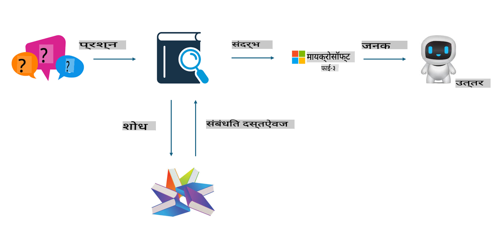
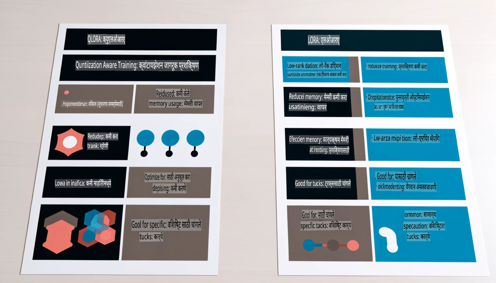

# **Phi-3 ला उद्योग क्षेत्रातील तज्ज्ञ बनवा**

Phi-3 मॉडेलला उद्योगात आणण्यासाठी, तुम्हाला उद्योगातील व्यवसाय डेटा Phi-3 मॉडेलमध्ये समाविष्ट करावा लागेल. यासाठी आपल्याकडे दोन पर्याय आहेत: RAG (Retrieval Augmented Generation) आणि Fine Tuning.

## **RAG विरुद्ध Fine-Tuning**

### **Retrieval Augmented Generation**

RAG म्हणजे डेटा पुनर्प्राप्ती + मजकूर निर्मिती. एंटरप्राइझचा संरचित आणि असंरचित डेटा व्हेक्टर डेटाबेसमध्ये साठवला जातो. जेव्हा संबंधित सामग्री शोधली जाते, तेव्हा संबंधित सारांश आणि सामग्री शोधून संदर्भ तयार केला जातो, आणि LLM/SLM च्या मजकूर पूर्ण करण्याच्या क्षमतेसह सामग्री तयार केली जाते.

### **Fine-tuning**

Fine-tuning म्हणजे एखाद्या विशिष्ट मॉडेलचे सुधारित रूप. यासाठी मॉडेल अल्गोरिदमपासून सुरुवात करण्याची गरज नसते, पण डेटा सतत साठवणे आवश्यक असते. जर तुम्हाला उद्योगातील अॅप्लिकेशन्समध्ये अधिक अचूक शब्दावली आणि भाषा अभिव्यक्ती हवी असेल, तर Fine-tuning हा सर्वोत्तम पर्याय आहे. परंतु जर तुमचा डेटा वारंवार बदलत असेल, तर Fine-tuning जटिल होऊ शकते.

### **कसे निवडायचे**

1. जर आपल्याला उत्तरासाठी बाह्य डेटा समाविष्ट करावा लागत असेल, तर RAG हा सर्वोत्तम पर्याय आहे.

2. जर तुम्हाला स्थिर आणि अचूक उद्योग ज्ञान तयार करायचे असेल, तर Fine-tuning चांगला पर्याय ठरेल. RAG संबंधित सामग्री ओढण्याला प्राधान्य देतो, पण तो नेहमीच विशिष्ट सूक्ष्मतांमध्ये परिपूर्ण नसतो.

3. Fine-tuning साठी उच्च-गुणवत्तेचा डेटासेट आवश्यक आहे, आणि जर डेटा फक्त एका छोट्या मर्यादेत असेल, तर त्याने फारसा फरक पडणार नाही. RAG अधिक लवचिक आहे.

4. Fine-tuning एक ब्लॅक बॉक्स आहे, एक गूढ प्रक्रिया, आणि त्याचा अंतर्गत यंत्रणा समजणे कठीण आहे. पण RAG डेटाचा स्रोत शोधणे सोपे करते, त्यामुळे भ्रम किंवा सामग्रीतील चुका प्रभावीपणे सुधारता येतात आणि अधिक पारदर्शकता मिळते.

### **परिस्थिती**

1. उभ्या उद्योगांना विशिष्ट व्यावसायिक शब्दावली आणि अभिव्यक्ती आवश्यक असल्यास, ***Fine-tuning*** हा सर्वोत्तम पर्याय आहे.

2. प्रश्नोत्तर प्रणाली, जी विविध ज्ञान बिंदूंच्या संयोजनाचा समावेश करते, त्यासाठी ***RAG*** सर्वोत्तम पर्याय आहे.

3. स्वयंचलित व्यवसाय प्रवाहाचे संयोजन ***RAG + Fine-tuning*** हा सर्वोत्तम पर्याय आहे.

## **RAG कसे वापरावे**

व्हेक्टर डेटाबेस म्हणजे गणिती स्वरूपात साठवलेला डेटाचा संग्रह. व्हेक्टर डेटाबेस मशीन लर्निंग मॉडेल्सना मागील इनपुट लक्षात ठेवणे सोपे करतो, ज्यामुळे शोध, शिफारसी, आणि मजकूर निर्मितीसारख्या उपयोग प्रकरणांना समर्थन देण्यासाठी मशीन लर्निंगचा वापर करता येतो. डेटा अचूक जुळण्याऐवजी साम्य मेट्रिक्सच्या आधारे ओळखला जाऊ शकतो, ज्यामुळे संगणक मॉडेल्सना डेटाचा संदर्भ समजणे शक्य होते.

व्हेक्टर डेटाबेस RAG साकारण्यासाठी महत्त्वाचा आहे. आपण text-embedding-3, jina-ai-embedding यांसारख्या व्हेक्टर मॉडेल्सद्वारे डेटा व्हेक्टर स्टोरेजमध्ये रूपांतरित करू शकतो.

RAG अॅप्लिकेशन तयार करण्याबद्दल अधिक जाणून घ्या [https://github.com/microsoft/Phi-3CookBook](https://github.com/microsoft/Phi-3CookBook?WT.mc_id=aiml-138114-kinfeylo)

## **Fine-tuning कसे वापरावे**

Fine-tuning मध्ये सामान्यतः वापरले जाणारे अल्गोरिदम Lora आणि QLora आहेत. कोणता निवडायचा?
- [या नमुना नोटबुकसह अधिक जाणून घ्या](../../../../code/04.Finetuning/Phi_3_Inference_Finetuning.ipynb)
- [Python FineTuning च्या नमुना स्क्रिप्टचे उदाहरण](../../../../code/04.Finetuning/FineTrainingScript.py)

### **Lora आणि QLora**

LoRA (Low-Rank Adaptation) आणि QLoRA (Quantized Low-Rank Adaptation) हे मोठ्या भाषा मॉडेल्स (LLMs) ला Parameter Efficient Fine Tuning (PEFT) वापरून ट्यून करण्यासाठी वापरले जाणारे तंत्र आहेत. PEFT तंत्र पारंपरिक पद्धतींपेक्षा मॉडेल अधिक कार्यक्षमतेने प्रशिक्षण देण्यासाठी डिझाइन केले गेले आहे.  
LoRA हे एक स्वतंत्र Fine-tuning तंत्र आहे, जे वेट अपडेट मॅट्रिक्सवर लो-रँक अंदाज लागू करून मेमरीचा वापर कमी करते. हे जलद प्रशिक्षण वेळा प्रदान करते आणि पारंपरिक Fine-tuning पद्धतींशी जवळपास कामगिरी राखते.  

QLoRA हे LoRA चे एक विस्तारित संस्करण आहे, जे क्वांटायझेशन तंत्रांचा समावेश करून मेमरीचा वापर आणखी कमी करते. QLoRA प्री-ट्रेंड LLM मधील वेट पॅरामीटर्सची अचूकता 4-बिट अचूकतेपर्यंत क्वांटायझ करते, जे LoRA पेक्षा अधिक मेमरी कार्यक्षम आहे. तथापि, QLoRA प्रशिक्षण LoRA प्रशिक्षणापेक्षा सुमारे 30% हळू आहे, कारण अतिरिक्त क्वांटायझेशन आणि डी-क्वांटायझेशन पायऱ्यांमुळे.  

QLoRA क्वांटायझेशन दरम्यान येणाऱ्या त्रुटी दुरुस्त करण्यासाठी LoRA चा पूरक म्हणून वापर करते. QLoRA मोठ्या मॉडेल्सना, ज्यात अब्जावधी पॅरामीटर्स असतात, तुलनेने लहान आणि सहज उपलब्ध GPUs वर Fine-tuning करण्यास सक्षम करते. उदाहरणार्थ, QLoRA 70B पॅरामीटर मॉडेलला, ज्यासाठी 36 GPUs आवश्यक असतात, फक्त 2 GPUs वर Fine-tune करू शकते. 

**अस्वीकरण**:  
हा दस्तऐवज मशीन-आधारित AI भाषांतर सेवांचा वापर करून अनुवादित केला गेला आहे. आम्ही अचूकतेसाठी प्रयत्नशील असलो तरी कृपया लक्षात घ्या की स्वयंचलित भाषांतरांमध्ये त्रुटी किंवा अचूकतेचा अभाव असू शकतो. मूळ भाषेतील मूळ दस्तऐवज अधिकृत स्रोत मानावा. महत्त्वाच्या माहितीसाठी व्यावसायिक मानवी भाषांतराची शिफारस केली जाते. या भाषांतराच्या वापरामुळे उद्भवणाऱ्या कोणत्याही गैरसमजुतीसाठी किंवा चुकीच्या अर्थासाठी आम्ही जबाबदार नाही.