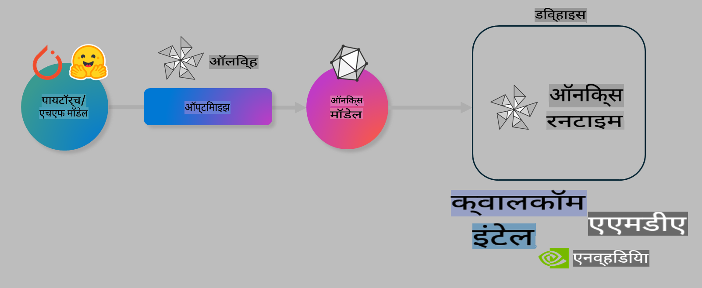

# लॅब. ऑन-डिव्हाइस इनफरन्ससाठी AI मॉडेल्स ऑप्टिमाइझ करा

## परिचय

> [!IMPORTANT]
> या लॅबसाठी **Nvidia A10 किंवा A100 GPU** आणि संबंधित ड्रायव्हर्स आणि CUDA टूलकिट (आवृत्ती 12+) आवश्यक आहेत.

> [!NOTE]
> हा **35 मिनिटांचा** लॅब आहे जो तुम्हाला OLIVE वापरून ऑन-डिव्हाइस इनफरन्ससाठी मॉडेल ऑप्टिमायझेशनच्या मुख्य संकल्पनांमध्ये प्रत्यक्ष अनुभव देईल.

## शिकण्याची उद्दिष्टे

या लॅबच्या शेवटी, तुम्ही OLIVE वापरून खालील गोष्टी करू शकाल:

- AWQ क्वांटायझेशन पद्धती वापरून AI मॉडेल क्वांटायझ करा.
- विशिष्ट कार्यासाठी AI मॉडेल फाइन-ट्यून करा.
- ONNX Runtime वर कार्यक्षम ऑन-डिव्हाइस इनफरन्ससाठी LoRA अॅडॉप्टर्स (फाइन-ट्यून केलेले मॉडेल) तयार करा.

### Olive म्हणजे काय

Olive (*O*NNX *live*) हे एक मॉडेल ऑप्टिमायझेशन टूलकिट आहे ज्यामध्ये CLI आहे, ज्यामुळे तुम्ही ONNX runtime +++https://onnxruntime.ai+++ साठी मॉडेल्स तयार करू शकता.



Olive साठी इनपुट प्रामुख्याने PyTorch किंवा Hugging Face मॉडेल असतो आणि आउटपुट एक ऑप्टिमाइज्ड ONNX मॉडेल असतो, जे डिव्हाइस (डिप्लॉयमेंट टार्गेट) वर चालते, ONNX runtime वापरते. Olive मॉडेल डिप्लॉयमेंट टार्गेटच्या AI अॅक्सेलरेटरसाठी (NPU, GPU, CPU) मॉडेल ऑप्टिमाइज करते, जे हार्डवेअर विक्रेते जसे की Qualcomm, AMD, Nvidia किंवा Intel द्वारे प्रदान केलेले असते.

Olive एक *workflow* चालवते, जी मॉडेल ऑप्टिमायझेशन टास्कच्या क्रमानुसार क्रमबद्ध मालिका असते, ज्याला *passes* म्हणतात - उदाहरणार्थ: मॉडेल कॉम्प्रेशन, ग्राफ कॅप्चर, क्वांटायझेशन, ग्राफ ऑप्टिमायझेशन. प्रत्येक pass मध्ये एक संच असतो जो सर्वोत्तम मेट्रिक्स मिळवण्यासाठी ट्यून केला जाऊ शकतो, जसे अचूकता आणि लेटन्सी, जे संबंधित evaluator द्वारे मोजले जातात. Olive एक शोध धोरण वापरते, जे प्रत्येक pass किंवा passes च्या संचासाठी शोध अल्गोरिदम वापरून ऑटो-ट्यून करते.

#### Olive चे फायदे

- **वेळ आणि त्रास वाचवा:** ग्राफ ऑप्टिमायझेशन, कॉम्प्रेशन आणि क्वांटायझेशनसाठी विविध तंत्रांचा ट्रायल-एंड-एरर टाळा. तुमच्या गुणवत्ता आणि कार्यक्षमता मर्यादा सेट करा आणि Olive तुमच्यासाठी सर्वोत्तम मॉडेल शोधू दे.
- **40+ अंगभूत मॉडेल ऑप्टिमायझेशन घटक:** क्वांटायझेशन, कॉम्प्रेशन, ग्राफ ऑप्टिमायझेशन आणि फाइन-ट्यूनिंगसाठी अत्याधुनिक तंत्रांचा समावेश.
- **सोपे CLI:** सामान्य मॉडेल ऑप्टिमायझेशन टास्कसाठी. उदाहरणार्थ, olive quantize, olive auto-opt, olive finetune.
- मॉडेल पॅकेजिंग आणि डिप्लॉयमेंट अंगभूत.
- **मल्टी LoRA सर्व्हिंग** साठी मॉडेल्स तयार करण्यास समर्थन.
- YAML/JSON वापरून वर्कफ्लो तयार करा, मॉडेल ऑप्टिमायझेशन आणि डिप्लॉयमेंट टास्कचे समन्वयन करा.
- **Hugging Face** आणि **Azure AI** सह एकत्रीकरण.
- **कॅशिंग** मेकॅनिझममुळे **खर्च वाचतो**.

## लॅब सूचना
> [!NOTE]
> कृपया सुनिश्चित करा की तुम्ही Azure AI Hub आणि Project तयार केले आहे आणि Lab 1 प्रमाणे A100 कॉम्प्युट सेटअप केला आहे.

### स्टेप 0: Azure AI Compute शी कनेक्ट करा

तुम्ही **VS Code** मधील रिमोट फीचर वापरून Azure AI कॉम्प्युटशी कनेक्ट कराल.

1. तुमचा **VS Code** डेस्कटॉप अॅप्लिकेशन उघडा:
1. **Shift+Ctrl+P** वापरून **कमांड पॅलेट** उघडा.
1. कमांड पॅलेटमध्ये **AzureML - remote: Connect to compute instance in New Window** शोधा.
1. ऑन-स्क्रीन सूचना फॉलो करा. यात Azure Subscription, Resource Group, Project आणि Compute नाव निवडणे समाविष्ट आहे, जे तुम्ही Lab 1 मध्ये सेटअप केले आहे.
1. Azure ML Compute नोडशी कनेक्ट झाल्यानंतर, हे **Visual Code च्या तळात डाव्या बाजूला** दिसेल `><Azure ML: Compute Name`

### स्टेप 1: हे रिपॉझिटरी क्लोन करा

VS Code मध्ये, **Ctrl+J** वापरून नवीन टर्मिनल उघडा आणि हे रिपॉझिटरी क्लोन करा:

टर्मिनलमध्ये तुम्हाला खालीलप्रमाणे प्रॉम्प्ट दिसेल:

```
azureuser@computername:~/cloudfiles/code$ 
```
रिपॉझिटरी क्लोन करा 

```bash
cd ~/localfiles
git clone https://github.com/microsoft/phi-3cookbook.git
```

### स्टेप 2: VS Code मध्ये फोल्डर उघडा

VS Code मध्ये संबंधित फोल्डर उघडण्यासाठी, टर्मिनलमध्ये खालील कमांड चालवा, ज्यामुळे नवीन विंडो उघडेल:

```bash
code phi-3cookbook/code/04.Finetuning/Olive-lab
```

किंवा, **File** > **Open Folder** निवडून फोल्डर उघडा.

### स्टेप 3: Dependencies

Azure AI Compute Instance मध्ये VS Code मध्ये टर्मिनल उघडा (टीप: **Ctrl+J**) आणि डिपेंडन्सी इन्स्टॉल करण्यासाठी खालील कमांड्स चालवा:

```bash
conda create -n olive-ai python=3.11 -y
conda activate olive-ai
pip install -r requirements.txt
az extension remove -n azure-cli-ml
az extension add -n ml
```

> [!NOTE]
> सर्व डिपेंडन्सी इन्स्टॉल होण्यासाठी ~5 मिनिटे लागतील.

या लॅबमध्ये तुम्ही Azure AI Model catalog मध्ये मॉडेल्स डाउनलोड आणि अपलोड कराल. मॉडेल कॅटलॉगमध्ये प्रवेश करण्यासाठी, तुम्हाला Azure मध्ये लॉगिन करावे लागेल:

```bash
az login
```

> [!NOTE]
> लॉगिन करताना तुम्हाला तुमचे सबस्क्रिप्शन निवडावे लागेल. सुनिश्चित करा की तुम्ही या लॅबसाठी दिलेले सबस्क्रिप्शन निवडले आहे.

### स्टेप 4: Olive कमांड्स चालवा

Azure AI Compute Instance मध्ये VS Code मध्ये टर्मिनल उघडा (टीप: **Ctrl+J**) आणि `olive-ai` कॉन्डा एन्व्हायर्नमेंट सक्रिय असल्याचे सुनिश्चित करा:

```bash
conda activate olive-ai
```

यानंतर, खालील Olive कमांड्स कमांड लाइनमध्ये चालवा.

1. **डेटा तपासा:** या उदाहरणात, तुम्ही Phi-3.5-Mini मॉडेल फाइन-ट्यून करणार आहात, ज्यामुळे ते प्रवासाशी संबंधित प्रश्नांची उत्तरे देण्यासाठी विशेषीकृत होईल. खालील कोड डेटासेटच्या पहिल्या काही नोंदी प्रदर्शित करतो, ज्या JSON lines स्वरूपात आहेत:

    ```bash
    head data/data_sample_travel.jsonl
    ```
1. **मॉडेल क्वांटायझ करा:** मॉडेल ट्रेनिंग करण्यापूर्वी, तुम्ही खालील कमांड वापरून Active Aware Quantization (AWQ) +++https://arxiv.org/abs/2306.00978+++ तंत्र वापरून क्वांटायझ करता. AWQ मॉडेलच्या वेट्सना क्वांटायझ करते, इन्फरन्स दरम्यान तयार होणाऱ्या अॅक्टिव्हेशन्सचा विचार करून. पारंपरिक वेट क्वांटायझेशन पद्धतींच्या तुलनेत, अॅक्टिव्हेशनमधील वास्तविक डेटा वितरण लक्षात घेऊन, मॉडेल अचूकता चांगल्या प्रकारे टिकवून ठेवते.

    ```bash
    olive quantize \
       --model_name_or_path microsoft/Phi-3.5-mini-instruct \
       --trust_remote_code \
       --algorithm awq \
       --output_path models/phi/awq \
       --log_level 1
    ```
    
    AWQ क्वांटायझेशन पूर्ण होण्यासाठी **~8 मिनिटे** लागतात, ज्यामुळे **मॉडेलचा आकार ~7.5GB वरून ~2.5GB वर कमी होतो.**

   या लॅबमध्ये, आम्ही तुम्हाला Hugging Face मधून मॉडेल्स इनपुट कसे करायचे हे दाखवत आहोत (उदाहरणार्थ: `microsoft/Phi-3.5-mini-instruct`). However, Olive also allows you to input models from the Azure AI catalog by updating the `model_name_or_path` argument to an Azure AI asset ID (for example:  `azureml://registries/azureml/models/Phi-3.5-mini-instruct/versions/4`). 

1. **Train the model:** Next, the `olive finetune` कमांड क्वांटायझ केलेले मॉडेल फाइन-ट्यून करते. फाइन-ट्यूनिंग प्रक्रियेमुळे क्वांटायझेशनमुळे झालेला काही तोटा पुनर्प्राप्त होतो.

    ```bash
    olive finetune \
        --method lora \
        --model_name_or_path models/phi/awq \
        --data_files "data/data_sample_travel.jsonl" \
        --data_name "json" \
        --text_template "<|user|>\n{prompt}<|end|>\n<|assistant|>\n{response}<|end|>" \
        --max_steps 100 \
        --output_path ./models/phi/ft \
        --log_level 1
    ```
    
    फाइन-ट्यूनिंग पूर्ण होण्यासाठी (100 स्टेप्ससह) **~6 मिनिटे** लागतात.

1. **ऑप्टिमायझ करा:** मॉडेल ट्रेन केल्यानंतर, आता Olive च्या `auto-opt` command, which will capture the ONNX graph and automatically perform a number of optimizations to improve the model performance for CPU by compressing the model and doing fusions. It should be noted, that you can also optimize for other devices such as NPU or GPU by just updating the `--device` and `--provider` arguments वापरून मॉडेल ऑप्टिमायझ करा - परंतु या लॅबसाठी आपण CPU वापरू.

    ```bash
    olive auto-opt \
       --model_name_or_path models/phi/ft/model \
       --adapter_path models/phi/ft/adapter \
       --device cpu \
       --provider CPUExecutionProvider \
       --use_ort_genai \
       --output_path models/phi/onnx-ao \
       --log_level 1
    ```
    
    ऑप्टिमायझेशन पूर्ण होण्यासाठी **~5 मिनिटे** लागतात.

### स्टेप 5: मॉडेल इनफरन्स जलद चाचणी

मॉडेलची इनफरन्स चाचणी करण्यासाठी, तुमच्या फोल्डरमध्ये **app.py** नावाची Python फाइल तयार करा आणि खालील कोड कॉपी-पेस्ट करा:

```python
import onnxruntime_genai as og
import numpy as np

print("loading model and adapters...", end="", flush=True)
model = og.Model("models/phi/onnx-ao/model")
adapters = og.Adapters(model)
adapters.load("models/phi/onnx-ao/model/adapter_weights.onnx_adapter", "travel")
print("DONE!")

tokenizer = og.Tokenizer(model)
tokenizer_stream = tokenizer.create_stream()

params = og.GeneratorParams(model)
params.set_search_options(max_length=100, past_present_share_buffer=False)
user_input = "what is the best thing to see in chicago"
params.input_ids = tokenizer.encode(f"<|user|>\n{user_input}<|end|>\n<|assistant|>\n")

generator = og.Generator(model, params)

generator.set_active_adapter(adapters, "travel")

print(f"{user_input}")

while not generator.is_done():
    generator.compute_logits()
    generator.generate_next_token()

    new_token = generator.get_next_tokens()[0]
    print(tokenizer_stream.decode(new_token), end='', flush=True)

print("\n")
```

कोड चालवण्यासाठी:

```bash
python app.py
```

### स्टेप 6: Azure AI वर मॉडेल अपलोड करा

मॉडेल Azure AI मॉडेल रिपॉझिटरीवर अपलोड केल्याने ते तुमच्या विकास संघातील इतर सदस्यांसोबत शेअर करता येते आणि मॉडेलची व्हर्जनिंग देखील हाताळली जाते. मॉडेल अपलोड करण्यासाठी खालील कमांड चालवा:

> [!NOTE]
> `{}` placeholders with the name of your resource group and Azure AI Project Name. 

To find your resource group `"resourceGroup" आणि Azure AI Project नाव अपडेट करा आणि खालील कमांड चालवा:

```
az ml workspace show
```

किंवा +++ai.azure.com+++ वर जाऊन **management center** **project** **overview** निवडा.

`{}` प्लेसहोल्डर्स तुमच्या रिसोर्स ग्रुप आणि Azure AI प्रोजेक्ट नावाने अपडेट करा.

```bash
az ml model create \
    --name ft-for-travel \
    --version 1 \
    --path ./models/phi/onnx-ao \
    --resource-group {RESOURCE_GROUP_NAME} \
    --workspace-name {PROJECT_NAME}
```
यानंतर तुम्ही तुमचे अपलोड केलेले मॉडेल पाहू शकता आणि तुमचे मॉडेल https://ml.azure.com/model/list येथे डिप्लॉय करू शकता.

**अस्वीकरण**:  
हे दस्तऐवज मशीन-आधारित एआय भाषांतर सेवा वापरून अनुवादित केले गेले आहे. आम्ही अचूकतेसाठी प्रयत्नशील असलो तरी, कृपयाआधी लक्षात घ्या की स्वयंचलित भाषांतरांमध्ये चुका किंवा अचूकतेचा अभाव असू शकतो. मूळ भाषेतील दस्तऐवज हा अधिकृत स्रोत मानला जावा. महत्त्वाच्या माहितीसाठी व्यावसायिक मानवी भाषांतराचा सल्ला घेतला जाणे शिफारसीय आहे. या भाषांतराचा वापर केल्यामुळे उद्भवणाऱ्या कोणत्याही गैरसमज किंवा चुकीच्या अर्थ लावण्यास आम्ही जबाबदार राहणार नाही. 