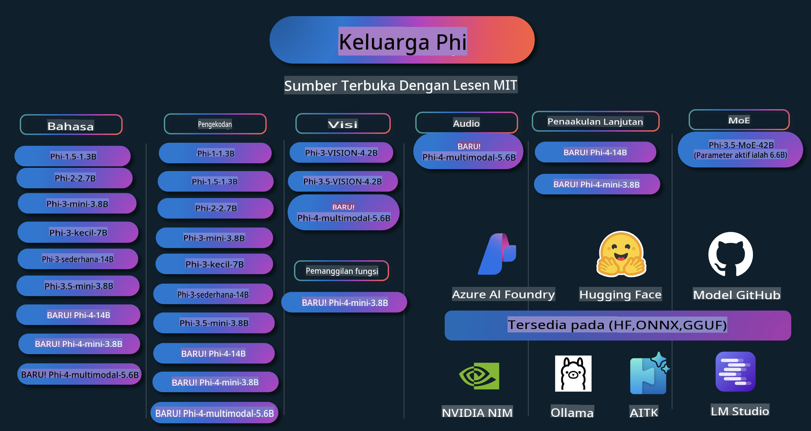

# Buku Panduan Phi: Contoh Praktis dengan Model Phi dari Microsoft

  

  
  
  

  
  

Phi adalah serangkaian model AI sumber terbuka yang dikembangkan oleh Microsoft.

Phi saat ini merupakan model bahasa kecil (SLM) yang paling kuat dan hemat biaya, dengan performa sangat baik dalam berbagai bahasa, penalaran, pembuatan teks/chat, pengkodean, gambar, audio, dan skenario lainnya.

Anda dapat menerapkan Phi di cloud atau perangkat edge, dan Anda dapat dengan mudah membangun aplikasi AI generatif dengan daya komputasi yang terbatas.

Ikuti langkah-langkah ini untuk memulai menggunakan sumber daya ini:
1. **Fork Repositori**: Klik   
2. **Clone Repositori**:   `git clone https://github.com/microsoft/PhiCookBook.git`  
3. [**Bergabunglah dengan Komunitas Discord AI Microsoft dan temui para ahli serta pengembang lainnya**](https://discord.com/invite/ByRwuEEgH4?WT.mc_id=aiml-137032-kinfeylo)

## Daftar Isi

- Pengantar  
  - [Selamat Datang di Keluarga Phi](./md/01.Introduction/01/01.PhiFamily.md)  
  - [Menyiapkan Lingkungan Anda](./md/01.Introduction/01/01.EnvironmentSetup.md)  
  - [Memahami Teknologi Utama](./md/01.Introduction/01/01.Understandingtech.md)  
  - [Keamanan AI untuk Model Phi](./md/01.Introduction/01/01.AISafety.md)  
  - [Dukungan Perangkat Keras untuk Phi](./md/01.Introduction/01/01.Hardwaresupport.md)  
  - [Model Phi & Ketersediaannya di Berbagai Platform](./md/01.Introduction/01/01.Edgeandcloud.md)  
  - [Menggunakan Guidance-ai dan Phi](./md/01.Introduction/01/01.Guidance.md)  
  - [Model di GitHub Marketplace](https://github.com/marketplace/models)  
  - [Katalog Model Azure AI](https://ai.azure.com)  

- Inferensi Phi di Berbagai Lingkungan  
    -  [Hugging Face](./md/01.Introduction/02/01.HF.md)  
    -  [Model GitHub](./md/01.Introduction/02/02.GitHubModel.md)  
    -  [Katalog Model Azure AI Foundry](./md/01.Introduction/02/03.AzureAIFoundry.md)  
    -  [Ollama](./md/01.Introduction/02/04.Ollama.md)  
    -  [AI Toolkit VSCode (AITK)](./md/01.Introduction/02/05.AITK.md)  
    -  [NVIDIA NIM](./md/01.Introduction/02/06.NVIDIA.md)  

- Inferensi Keluarga Phi  
    - [Inferensi Phi di iOS](./md/01.Introduction/03/iOS_Inference.md)  
    - [Inferensi Phi di Android](./md/01.Introduction/03/Android_Inference.md)  
- [Inferens Phi dalam Jetson](./md/01.Introduction/03/Jetson_Inference.md)
    - [Inferens Phi dalam AI PC](./md/01.Introduction/03/AIPC_Inference.md)
    - [Inferens Phi dengan Apple MLX Framework](./md/01.Introduction/03/MLX_Inference.md)
    - [Inferens Phi dalam Server Lokal](./md/01.Introduction/03/Local_Server_Inference.md)
    - [Inferens Phi dalam Server Jauh menggunakan AI Toolkit](./md/01.Introduction/03/Remote_Interence.md)
    - [Inferens Phi dengan Rust](./md/01.Introduction/03/Rust_Inference.md)
    - [Inferens Phi--Vision secara Lokal](./md/01.Introduction/03/Vision_Inference.md)
    - [Inferens Phi dengan Kaito AKS, Azure Containers (dukungan resmi)](./md/01.Introduction/03/Kaito_Inference.md)
- [Kuantifikasi Keluarga Phi](./md/01.Introduction/04/QuantifyingPhi.md)
    - [Kuantifikasi Phi-3.5 / 4 menggunakan llama.cpp](./md/01.Introduction/04/UsingLlamacppQuantifyingPhi.md)
    - [Kuantifikasi Phi-3.5 / 4 menggunakan ekstensi Generative AI untuk onnxruntime](./md/01.Introduction/04/UsingORTGenAIQuantifyingPhi.md)
    - [Kuantifikasi Phi-3.5 / 4 menggunakan Intel OpenVINO](./md/01.Introduction/04/UsingIntelOpenVINOQuantifyingPhi.md)
    - [Kuantifikasi Phi-3.5 / 4 menggunakan Apple MLX Framework](./md/01.Introduction/04/UsingAppleMLXQuantifyingPhi.md)

- Evaluasi Phi
    - [AI yang Bertanggung Jawab](./md/01.Introduction/05/ResponsibleAI.md)
    - [Azure AI Foundry untuk Evaluasi](./md/01.Introduction/05/AIFoundry.md)
    - [Menggunakan Promptflow untuk Evaluasi](./md/01.Introduction/05/Promptflow.md)
 
- RAG dengan Azure AI Search
    - [Cara menggunakan Phi-4-mini dan Phi-4-multimodal (RAG) dengan Azure AI Search](https://github.com/microsoft/PhiCookBook/blob/main/code/06.E2E/E2E_Phi-4-RAG-Azure-AI-Search.ipynb)

- Contoh pengembangan aplikasi Phi
  - Aplikasi Teks & Chat
    - Contoh Phi-4 🆕
      - [📓] [Chat dengan Model Phi-4-mini ONNX](./md/02.Application/01.TextAndChat/Phi4/ChatWithPhi4ONNX/README.md)
      - [Chat dengan Model Phi-4 lokal ONNX .NET](../../md/04.HOL/dotnet/src/LabsPhi4-Chat-01OnnxRuntime)
      - [Aplikasi Konsol .NET Chat dengan Phi-4 ONNX menggunakan Semantic Kernel](../../md/04.HOL/dotnet/src/LabsPhi4-Chat-02SK)
    - Contoh Phi-3 / 3.5
      - [Chatbot Lokal di browser menggunakan Phi3, ONNX Runtime Web, dan WebGPU](https://github.com/microsoft/onnxruntime-inference-examples/tree/main/js/chat)
      - [Chat OpenVino](./md/02.Application/01.TextAndChat/Phi3/E2E_OpenVino_Chat.md)
      - [Multi Model - Interaktif Phi-3-mini dan OpenAI Whisper](./md/02.Application/01.TextAndChat/Phi3/E2E_Phi-3-mini_with_whisper.md)
      - [MLFlow - Membangun pembungkus dan menggunakan Phi-3 dengan MLFlow](./md//02.Application/01.TextAndChat/Phi3/E2E_Phi-3-MLflow.md)
      - [Optimasi Model - Cara mengoptimalkan model Phi-3-min untuk ONNX Runtime Web dengan Olive](https://github.com/microsoft/Olive/tree/main/examples/phi3)
      - [Aplikasi WinUI3 dengan Phi-3 mini-4k-instruct-onnx](https://github.com/microsoft/Phi3-Chat-WinUI3-Sample/)
      - [Contoh Aplikasi Catatan Bertenaga AI Multi Model WinUI3](https://github.com/microsoft/ai-powered-notes-winui3-sample)
      - [Fine-tune dan Integrasi model Phi-3 kustom dengan Prompt flow](./md/02.Application/01.TextAndChat/Phi3/E2E_Phi-3-FineTuning_PromptFlow_Integration.md)
      - [Fine-tune dan Integrasi model Phi-3 kustom dengan Prompt flow di Azure AI Foundry](./md/02.Application/01.TextAndChat/Phi3/E2E_Phi-3-FineTuning_PromptFlow_Integration_AIFoundry.md)
      - [Evaluasi Model Phi-3 / Phi-3.5 yang telah di-Fine-tune di Azure AI Foundry dengan Fokus pada Prinsip AI Bertanggung Jawab Microsoft](./md/02.Application/01.TextAndChat/Phi3/E2E_Phi-3-Evaluation_AIFoundry.md)
- [📓] [Contoh ramalan bahasa Phi-3.5-mini-instruct (Cina/Inggeris)](../../md/02.Application/01.TextAndChat/Phi3/phi3-instruct-demo.ipynb)
      - [Chatbot RAG WebGPU Phi-3.5-Instruct](./md/02.Application/01.TextAndChat/Phi3/WebGPUWithPhi35Readme.md)
      - [Menggunakan GPU Windows untuk mencipta penyelesaian Prompt flow dengan Phi-3.5-Instruct ONNX](./md/02.Application/01.TextAndChat/Phi3/UsingPromptFlowWithONNX.md)
      - [Menggunakan Microsoft Phi-3.5 tflite untuk mencipta aplikasi Android](./md/02.Application/01.TextAndChat/Phi3/UsingPhi35TFLiteCreateAndroidApp.md)
      - [Contoh Soal Jawab .NET menggunakan model Phi-3 ONNX tempatan dengan Microsoft.ML.OnnxRuntime](../../md/04.HOL/dotnet/src/LabsPhi301)
      - [Aplikasi chat konsol .NET dengan Semantic Kernel dan Phi-3](../../md/04.HOL/dotnet/src/LabsPhi302)

  - Sampel Kod SDK Inferensi Azure AI 
    - Sampel Phi-4 🆕
      - [📓] [Hasilkan kod projek menggunakan Phi-4-multimodal](./md/02.Application/02.Code/Phi4/GenProjectCode/README.md)
    - Sampel Phi-3 / 3.5
      - [Bina Chat Copilot Visual Studio Code anda sendiri dengan Microsoft Phi-3 Family](./md/02.Application/02.Code/Phi3/VSCodeExt/README.md)
      - [Cipta Agen Chat Copilot Visual Studio Code anda sendiri dengan Phi-3.5 menggunakan Model GitHub](/md/02.Application/02.Code/Phi3/CreateVSCodeChatAgentWithGitHubModels.md)

  - Sampel Penaakulan Lanjutan
    - Sampel Phi-4 🆕
      - [📓] [Sampel Penaakulan Mini Phi-4](./md/02.Application/03.AdvancedReasoning/Phi4/AdvancedResoningPhi4mini/README.md)
  
  - Demo
      - [Demo Phi-4-mini dihoskan di Hugging Face Spaces](https://huggingface.co/spaces/microsoft/phi-4-mini?WT.mc_id=aiml-137032-kinfeylo)
      - [Demo Phi-4-multimodal dihoskan di Hugging Face Spaces](https://huggingface.co/spaces/microsoft/phi-4-multimodal?WT.mc_id=aiml-137032-kinfeylo)
  - Sampel Vision
    - Sampel Phi-4 🆕
      - [📓] [Gunakan Phi-4-multimodal untuk membaca imej dan menjana kod](./md/02.Application/04.Vision/Phi4/CreateFrontend/README.md) 
    - Sampel Phi-3 / 3.5
      -  [📓][Phi-3-vision-Image teks ke teks](../../md/02.Application/04.Vision/Phi3/E2E_Phi-3-vision-image-text-to-text-online-endpoint.ipynb)
      - [Phi-3-vision-ONNX](https://onnxruntime.ai/docs/genai/tutorials/phi3-v.html)
      - [📓][Phi-3-vision CLIP Embedding](../../md/02.Application/04.Vision/Phi3/E2E_Phi-3-vision-image-text-to-text-online-endpoint.ipynb)
      - [DEMO: Phi-3 Kitar Semula](https://github.com/jennifermarsman/PhiRecycling/)
      - [Phi-3-vision - Pembantu bahasa visual - dengan Phi3-Vision dan OpenVINO](https://docs.openvino.ai/nightly/notebooks/phi-3-vision-with-output.html)
      - [Phi-3 Vision Nvidia NIM](./md/02.Application/04.Vision/Phi3/E2E_Nvidia_NIM_Vision.md)
      - [Phi-3 Vision OpenVino](./md/02.Application/04.Vision/Phi3/E2E_OpenVino_Phi3Vision.md)
      - [📓][Contoh multi-bingkai atau multi-imej Phi-3.5 Vision](../../md/02.Application/04.Vision/Phi3/phi3-vision-demo.ipynb)
      - [Model ONNX Tempatan Phi-3 Vision menggunakan Microsoft.ML.OnnxRuntime .NET](../../md/04.HOL/dotnet/src/LabsPhi303)
      - [Model ONNX Tempatan Phi-3 Vision Berasaskan Menu menggunakan Microsoft.ML.OnnxRuntime .NET](../../md/04.HOL/dotnet/src/LabsPhi304)

  - Sampel Audio
    - Sampel Phi-4 🆕
      - [📓] [Ekstrak transkrip audio menggunakan Phi-4-multimodal](./md/02.Application/05.Audio/Phi4/Transciption/README.md)
      - [📓] [Sampel Audio Phi-4-multimodal](../../md/02.Application/05.Audio/Phi4/Siri/demo.ipynb)
      - [📓] [Sampel Terjemahan Ucapan Phi-4-multimodal](../../md/02.Application/05.Audio/Phi4/Translate/demo.ipynb)
      - [Aplikasi konsol .NET menggunakan Phi-4-multimodal Audio untuk menganalisis fail audio dan menjana transkrip](../../md/04.HOL/dotnet/src/LabsPhi4-MultiModal-02Audio)

  - Sampel MOE
    - Sampel Phi-3 / 3.5
      - [📓] [Sampel Media Sosial Model MoE (Mixture of Experts) Phi-3.5](../../md/02.Application/06.MoE/Phi3/phi3_moe_demo.ipynb)
      - [📓] [Membina Saluran Retrieval-Augmented Generation (RAG) dengan NVIDIA NIM Phi-3 MOE, Azure AI Search, dan LlamaIndex](../../md/02.Application/06.MoE/Phi3/azure-ai-search-nvidia-rag.ipynb)
  - Sampel Pemanggilan Fungsi
    - Sampel Phi-4 🆕
      -  [📓] [Menggunakan Pemanggilan Fungsi Dengan Phi-4-mini](./md/02.Application/07.FunctionCalling/Phi4/FunctionCallingBasic/README.md)
  - Sampel Pencampuran Multimodal
    - Sampel Phi-4 🆕
- [📓] [Menggunakan Phi-4-multimodal sebagai Wartawan Teknologi](../../md/02.Application/08.Multimodel/Phi4/TechJournalist/phi_4_mm_audio_text_publish_news.ipynb)  
      - [Aplikasi konsol .NET menggunakan Phi-4-multimodal untuk menganalisis gambar](../../md/04.HOL/dotnet/src/LabsPhi4-MultiModal-01Images)

- Fine-tuning Sampel Phi  
  - [Senario Fine-tuning](./md/03.FineTuning/FineTuning_Scenarios.md)  
  - [Fine-tuning vs RAG](./md/03.FineTuning/FineTuning_vs_RAG.md)  
  - [Fine-tuning Membolehkan Phi-3 menjadi pakar industri](./md/03.FineTuning/LetPhi3gotoIndustriy.md)  
  - [Fine-tuning Phi-3 dengan AI Toolkit untuk VS Code](./md/03.FineTuning/Finetuning_VSCodeaitoolkit.md)  
  - [Fine-tuning Phi-3 dengan Azure Machine Learning Service](./md/03.FineTuning/Introduce_AzureML.md)  
  - [Fine-tuning Phi-3 dengan Lora](./md/03.FineTuning/FineTuning_Lora.md)  
  - [Fine-tuning Phi-3 dengan QLora](./md/03.FineTuning/FineTuning_Qlora.md)  
  - [Fine-tuning Phi-3 dengan Azure AI Foundry](./md/03.FineTuning/FineTuning_AIFoundry.md)  
  - [Fine-tuning Phi-3 dengan Azure ML CLI/SDK](./md/03.FineTuning/FineTuning_MLSDK.md)  
  - [Fine-tuning dengan Microsoft Olive](./md/03.FineTuning/FineTuning_MicrosoftOlive.md)  
  - [Fine-tuning dengan Microsoft Olive Hands-On Lab](./md/03.FineTuning/olive-lab/readme.md)  
  - [Fine-tuning Phi-3-vision dengan Weights and Bias](./md/03.FineTuning/FineTuning_Phi-3-visionWandB.md)  
  - [Fine-tuning Phi-3 dengan Kerangka Kerja Apple MLX](./md/03.FineTuning/FineTuning_MLX.md)  
  - [Fine-tuning Phi-3-vision (sokongan rasmi)](./md/03.FineTuning/FineTuning_Vision.md)  
  - [Fine-Tuning Phi-3 dengan Kaito AKS, Azure Containers (Sokongan Rasmi)](./md/03.FineTuning/FineTuning_Kaito.md)  
  - [Fine-Tuning Phi-3 dan 3.5 Vision](https://github.com/2U1/Phi3-Vision-Finetune)  

- Hands on Lab  
  - [Meneroka model terkini: LLMs, SLMs, pembangunan tempatan dan banyak lagi](https://github.com/microsoft/aitour-exploring-cutting-edge-models)  
  - [Membuka Potensi NLP: Fine-Tuning dengan Microsoft Olive](https://github.com/azure/Ignite_FineTuning_workshop)  

- Kertas Penyelidikan Akademik dan Penerbitan  
  - [Textbooks Are All You Need II: laporan teknikal phi-1.5](https://arxiv.org/abs/2309.05463)  
  - [Laporan Teknikal Phi-3: Model Bahasa Berkemampuan Tinggi Secara Tempatan di Telefon Anda](https://arxiv.org/abs/2404.14219)  
  - [Laporan Teknikal Phi-4](https://arxiv.org/abs/2412.08905)  
  - [Mengoptimumkan Model Bahasa Kecil untuk Pemanggilan Fungsi Dalam Kenderaan](https://arxiv.org/abs/2501.02342)  
  - [(WhyPHI) Fine-Tuning PHI-3 untuk Menjawab Soalan Pilihan Berganda: Metodologi, Keputusan, dan Cabaran](https://arxiv.org/abs/2501.01588)  

## Menggunakan Model Phi  

### Phi di Azure AI Foundry  

Anda boleh belajar bagaimana menggunakan Microsoft Phi dan membina penyelesaian E2E pada pelbagai peranti perkakasan anda. Untuk mencuba Phi sendiri, mulakan dengan bermain dengan model dan menyesuaikan Phi untuk senario anda menggunakan [Katalog Model Azure AI Foundry](https://aka.ms/phi3-azure-ai). Anda boleh belajar lebih lanjut di Memulakan [Azure AI Foundry](/md/02.QuickStart/AzureAIFoundry_QuickStart.md).  

**Playground**  
Setiap model mempunyai ruang ujian khas untuk mencuba model [Azure AI Playground](https://aka.ms/try-phi3).  

### Phi di Model GitHub  

Anda boleh belajar bagaimana menggunakan Microsoft Phi dan membina penyelesaian E2E pada pelbagai peranti perkakasan anda. Untuk mencuba Phi sendiri, mulakan dengan bermain dengan model dan menyesuaikan Phi untuk senario anda menggunakan [Katalog Model GitHub](https://github.com/marketplace/models?WT.mc_id=aiml-137032-kinfeylo). Anda boleh belajar lebih lanjut di Memulakan [Katalog Model GitHub](/md/02.QuickStart/GitHubModel_QuickStart.md).  

**Playground**  
Setiap model mempunyai [ruang uji khas untuk menguji model](/md/02.QuickStart/GitHubModel_QuickStart.md).

### Phi di Hugging Face

Anda juga boleh menemui model ini di [Hugging Face](https://huggingface.co/microsoft)

**Ruang Uji**
 [Hugging Chat playground](https://huggingface.co/chat/models/microsoft/Phi-3-mini-4k-instruct)

## AI Bertanggungjawab 

Microsoft komited untuk membantu pelanggan menggunakan produk AI kami secara bertanggungjawab, berkongsi pembelajaran kami, dan membina kerjasama berasaskan kepercayaan melalui alat seperti Transparency Notes dan Impact Assessments. Banyak sumber ini boleh didapati di [https://aka.ms/RAI](https://aka.ms/RAI).
Pendekatan Microsoft terhadap AI bertanggungjawab berlandaskan prinsip AI kami iaitu keadilan, kebolehpercayaan dan keselamatan, privasi dan keselamatan, keterangkuman, ketelusan, dan akauntabiliti.

Model bahasa semula jadi, imej, dan pertuturan berskala besar - seperti yang digunakan dalam sampel ini - berpotensi berkelakuan dengan cara yang tidak adil, tidak boleh dipercayai, atau menyinggung, yang seterusnya boleh menyebabkan kemudaratan. Sila rujuk [nota ketelusan perkhidmatan Azure OpenAI](https://learn.microsoft.com/legal/cognitive-services/openai/transparency-note?tabs=text) untuk mengetahui tentang risiko dan batasan.

Pendekatan yang disyorkan untuk mengurangkan risiko ini ialah dengan memasukkan sistem keselamatan dalam seni bina anda yang boleh mengesan dan mencegah tingkah laku berbahaya. [Azure AI Content Safety](https://learn.microsoft.com/azure/ai-services/content-safety/overview) menyediakan lapisan perlindungan bebas, yang mampu mengesan kandungan berbahaya yang dihasilkan pengguna atau AI dalam aplikasi dan perkhidmatan. Azure AI Content Safety termasuk API teks dan imej yang membolehkan anda mengesan bahan yang berbahaya. Dalam Azure AI Foundry, perkhidmatan Content Safety membolehkan anda melihat, meneroka dan mencuba kod contoh untuk mengesan kandungan berbahaya merentasi pelbagai mod. [Dokumentasi permulaan pantas](https://learn.microsoft.com/azure/ai-services/content-safety/quickstart-text?tabs=visual-studio%2Clinux&pivots=programming-language-rest) berikut membimbing anda membuat permintaan kepada perkhidmatan tersebut.

Satu lagi aspek yang perlu diambil kira ialah prestasi keseluruhan aplikasi. Dengan aplikasi multi-modal dan multi-model, kami menganggap prestasi bermaksud bahawa sistem berfungsi seperti yang anda dan pengguna anda harapkan, termasuk tidak menghasilkan output yang berbahaya. Adalah penting untuk menilai prestasi keseluruhan aplikasi anda menggunakan [penilai Prestasi dan Kualiti serta Risiko dan Keselamatan](https://learn.microsoft.com/azure/ai-studio/concepts/evaluation-metrics-built-in). Anda juga mempunyai keupayaan untuk mencipta dan menilai dengan [penilai tersuai](https://learn.microsoft.com/azure/ai-studio/how-to/develop/evaluate-sdk#custom-evaluators).

Anda boleh menilai aplikasi AI anda dalam persekitaran pembangunan anda menggunakan [Azure AI Evaluation SDK](https://microsoft.github.io/promptflow/index.html). Sama ada dengan set data ujian atau sasaran, penjanaan aplikasi AI generatif anda diukur secara kuantitatif dengan penilai terbina dalam atau penilai tersuai pilihan anda. Untuk memulakan dengan azure ai evaluation sdk bagi menilai sistem anda, anda boleh mengikuti [panduan permulaan pantas](https://learn.microsoft.com/azure/ai-studio/how-to/develop/flow-evaluate-sdk). Setelah anda melaksanakan larian penilaian, anda boleh [memvisualisasikan hasilnya di Azure AI Foundry](https://learn.microsoft.com/azure/ai-studio/how-to/evaluate-flow-results). 

## Tanda Dagangan

Projek ini mungkin mengandungi tanda dagangan atau logo untuk projek, produk, atau perkhidmatan. Penggunaan tanda dagangan atau logo Microsoft yang dibenarkan tertakluk kepada dan mesti mematuhi [Garis Panduan Tanda Dagangan & Jenama Microsoft](https://www.microsoft.com/legal/intellectualproperty/trademarks/usage/general).
Penggunaan tanda dagangan atau logo Microsoft dalam versi yang diubah suai daripada projek ini tidak boleh menyebabkan kekeliruan atau menyiratkan penajaan oleh Microsoft. Sebarang penggunaan tanda dagangan atau logo pihak ketiga adalah tertakluk kepada dasar pihak ketiga tersebut.

**Penafian**:  
Dokumen ini telah diterjemahkan menggunakan perkhidmatan terjemahan AI berasaskan mesin. Walaupun kami berusaha untuk ketepatan, sila ambil maklum bahawa terjemahan automatik mungkin mengandungi kesilapan atau ketidaktepatan. Dokumen asal dalam bahasa asalnya harus dianggap sebagai sumber yang berwibawa. Untuk maklumat yang kritikal, terjemahan manusia profesional adalah disyorkan. Kami tidak bertanggungjawab atas sebarang salah faham atau salah tafsir yang timbul daripada penggunaan terjemahan ini.