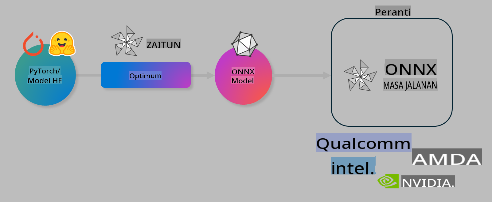

# Makmal: Optimumkan Model AI untuk Inferens Peranti

## Pengenalan

> [!IMPORTANT]
> Makmal ini memerlukan **GPU Nvidia A10 atau A100** dengan pemacu berkaitan dan toolkit CUDA (versi 12+) yang telah dipasang.

> [!NOTE]
> Ini adalah makmal selama **35 minit** yang akan memberi anda pengenalan praktikal kepada konsep asas mengoptimumkan model untuk inferens peranti menggunakan OLIVE.

## Objektif Pembelajaran

Pada akhir makmal ini, anda akan dapat menggunakan OLIVE untuk:

- Kuantisasi model AI menggunakan kaedah kuantisasi AWQ.
- Melaras model AI untuk tugas tertentu.
- Menjana LoRA adapters (model yang telah dilaras) untuk inferens peranti yang cekap pada ONNX Runtime.

### Apa itu Olive

Olive (*O*NNX *live*) ialah toolkit pengoptimuman model dengan CLI yang disertakan, yang membolehkan anda menghantar model untuk ONNX runtime +++https://onnxruntime.ai+++ dengan kualiti dan prestasi yang optimum.



Input kepada Olive biasanya ialah model PyTorch atau Hugging Face, dan outputnya ialah model ONNX yang telah dioptimumkan untuk dilaksanakan pada peranti (sasaran penyebaran) yang menjalankan ONNX runtime. Olive akan mengoptimumkan model untuk pemecut AI sasaran penyebaran (NPU, GPU, CPU) yang disediakan oleh pembekal perkakasan seperti Qualcomm, AMD, Nvidia, atau Intel.

Olive melaksanakan *workflow*, iaitu urutan tugas pengoptimuman model individu yang teratur dipanggil *passes*. Contoh *passes* termasuk: pemampatan model, penangkapan graf, kuantisasi, dan pengoptimuman graf. Setiap *pass* mempunyai set parameter yang boleh disesuaikan untuk mencapai metrik terbaik seperti ketepatan dan kependaman, yang dinilai oleh penilai masing-masing. Olive menggunakan strategi carian yang menggunakan algoritma carian untuk melaras secara automatik setiap *pass* satu demi satu atau sekumpulan *passes* bersama-sama.

#### Kelebihan Olive

- **Mengurangkan tekanan dan masa** akibat percubaan dan kesilapan dalam eksperimen manual dengan pelbagai teknik untuk pengoptimuman graf, pemampatan, dan kuantisasi. Tetapkan kekangan kualiti dan prestasi anda dan biarkan Olive secara automatik mencari model terbaik untuk anda.
- **40+ komponen pengoptimuman model terbina dalam** yang meliputi teknik terkini dalam kuantisasi, pemampatan, pengoptimuman graf, dan pelarasan.
- **CLI yang mudah digunakan** untuk tugas pengoptimuman model yang biasa. Contohnya, olive quantize, olive auto-opt, olive finetune.
- Pembungkusan dan penyebaran model terbina dalam.
- Menyokong penjanaan model untuk **Multi LoRA serving**.
- Membina workflow menggunakan YAML/JSON untuk mengatur tugas pengoptimuman dan penyebaran model.
- Integrasi dengan **Hugging Face** dan **Azure AI**.
- Mekanisme **caching** terbina dalam untuk **menjimatkan kos**.

## Arahan Makmal
> [!NOTE]
> Pastikan anda telah menyediakan Azure AI Hub dan Projek anda serta menyediakan pengkomputeran A100 seperti dalam Makmal 1.

### Langkah 0: Sambung ke Azure AI Compute anda

Anda akan menyambung ke Azure AI compute menggunakan ciri jarak jauh dalam **VS Code.**

1. Buka aplikasi desktop **VS Code** anda:
1. Buka **command palette** menggunakan **Shift+Ctrl+P**.
1. Dalam command palette cari **AzureML - remote: Connect to compute instance in New Window**.
1. Ikuti arahan di skrin untuk menyambung ke Compute. Ini akan melibatkan pemilihan Langganan Azure, Kumpulan Sumber, Projek, dan Nama Compute yang anda sediakan dalam Makmal 1.
1. Setelah anda disambungkan ke nod Azure ML Compute, ini akan dipaparkan di **bahagian bawah kiri Visual Code** `><Azure ML: Compute Name`.

### Langkah 1: Klon repositori ini

Dalam VS Code, anda boleh membuka terminal baharu dengan **Ctrl+J** dan klon repositori ini:

Dalam terminal, anda sepatutnya melihat prompt:

```
azureuser@computername:~/cloudfiles/code$ 
```
Klonkan penyelesaian:

```bash
cd ~/localfiles
git clone https://github.com/microsoft/phi-3cookbook.git
```

### Langkah 2: Buka Folder dalam VS Code

Untuk membuka VS Code dalam folder yang berkaitan, laksanakan arahan berikut dalam terminal, yang akan membuka tetingkap baharu:

```bash
code phi-3cookbook/code/04.Finetuning/Olive-lab
```

Sebagai alternatif, anda boleh membuka folder dengan memilih **File** > **Open Folder**.

### Langkah 3: Kebergantungan

Buka tetingkap terminal dalam VS Code dalam Instans Azure AI Compute anda (tip: **Ctrl+J**) dan laksanakan arahan berikut untuk memasang kebergantungan:

```bash
conda create -n olive-ai python=3.11 -y
conda activate olive-ai
pip install -r requirements.txt
az extension remove -n azure-cli-ml
az extension add -n ml
```

> [!NOTE]
> Ia akan mengambil masa ~5 minit untuk memasang semua kebergantungan.

Dalam makmal ini, anda akan memuat turun dan memuat naik model ke katalog Model Azure AI. Untuk mengakses katalog model, anda perlu log masuk ke Azure menggunakan:

```bash
az login
```

> [!NOTE]
> Semasa log masuk, anda akan diminta untuk memilih langganan anda. Pastikan anda menetapkan langganan kepada yang disediakan untuk makmal ini.

### Langkah 4: Laksanakan arahan Olive 

Buka tetingkap terminal dalam VS Code dalam Instans Azure AI Compute anda (tip: **Ctrl+J**) dan pastikan persekitaran `olive-ai` conda diaktifkan:

```bash
conda activate olive-ai
```

Seterusnya, laksanakan arahan Olive berikut dalam baris perintah.

1. **Periksa data:** Dalam contoh ini, anda akan melaras model Phi-3.5-Mini supaya ia menjadi pakar dalam menjawab soalan berkaitan perjalanan. Kod di bawah memaparkan beberapa rekod pertama dalam set data, yang berada dalam format JSON lines:
   
    ```bash
    head data/data_sample_travel.jsonl
    ```
1. **Kuantisasi model:** Sebelum melatih model, anda terlebih dahulu melakukan kuantisasi dengan arahan berikut yang menggunakan teknik yang dipanggil Active Aware Quantization (AWQ) +++https://arxiv.org/abs/2306.00978+++. AWQ mengkuantisasi berat model dengan mempertimbangkan aktivasi yang dihasilkan semasa inferens. Ini bermakna proses kuantisasi mengambil kira taburan data sebenar dalam aktivasi, yang membawa kepada pemeliharaan ketepatan model yang lebih baik berbanding kaedah kuantisasi berat tradisional.
    
    ```bash
    olive quantize \
       --model_name_or_path microsoft/Phi-3.5-mini-instruct \
       --trust_remote_code \
       --algorithm awq \
       --output_path models/phi/awq \
       --log_level 1
    ```
    
    Ia mengambil masa **~8 minit** untuk melengkapkan kuantisasi AWQ, yang akan **mengurangkan saiz model daripada ~7.5GB kepada ~2.5GB**.
   
   Dalam makmal ini, kami menunjukkan kepada anda cara memasukkan model daripada Hugging Face (contohnya: `microsoft/Phi-3.5-mini-instruct`). However, Olive also allows you to input models from the Azure AI catalog by updating the `model_name_or_path` argument to an Azure AI asset ID (for example:  `azureml://registries/azureml/models/Phi-3.5-mini-instruct/versions/4`). 

1. **Train the model:** Next, the `olive finetune` arahan melaras model yang telah dikuantisasi. Melakukan kuantisasi model *sebelum* pelarasan berbanding selepasnya memberikan ketepatan yang lebih baik kerana proses pelarasan memulihkan sebahagian kehilangan daripada kuantisasi.
    
    ```bash
    olive finetune \
        --method lora \
        --model_name_or_path models/phi/awq \
        --data_files "data/data_sample_travel.jsonl" \
        --data_name "json" \
        --text_template "<|user|>\n{prompt}<|end|>\n<|assistant|>\n{response}<|end|>" \
        --max_steps 100 \
        --output_path ./models/phi/ft \
        --log_level 1
    ```
    
    Ia mengambil masa **~6 minit** untuk melengkapkan pelarasan (dengan 100 langkah).

1. **Optimumkan:** Dengan model yang telah dilatih, anda kini mengoptimumkan model menggunakan argumen `auto-opt` command, which will capture the ONNX graph and automatically perform a number of optimizations to improve the model performance for CPU by compressing the model and doing fusions. It should be noted, that you can also optimize for other devices such as NPU or GPU by just updating the `--device` and `--provider` Olive - tetapi untuk tujuan makmal ini, kita akan menggunakan CPU.

    ```bash
    olive auto-opt \
       --model_name_or_path models/phi/ft/model \
       --adapter_path models/phi/ft/adapter \
       --device cpu \
       --provider CPUExecutionProvider \
       --use_ort_genai \
       --output_path models/phi/onnx-ao \
       --log_level 1
    ```
    
    Ia mengambil masa **~5 minit** untuk melengkapkan pengoptimuman.

### Langkah 5: Ujian pantas inferens model

Untuk menguji inferens model, cipta fail Python dalam folder anda bernama **app.py** dan salin-tampal kod berikut:

```python
import onnxruntime_genai as og
import numpy as np

print("loading model and adapters...", end="", flush=True)
model = og.Model("models/phi/onnx-ao/model")
adapters = og.Adapters(model)
adapters.load("models/phi/onnx-ao/model/adapter_weights.onnx_adapter", "travel")
print("DONE!")

tokenizer = og.Tokenizer(model)
tokenizer_stream = tokenizer.create_stream()

params = og.GeneratorParams(model)
params.set_search_options(max_length=100, past_present_share_buffer=False)
user_input = "what is the best thing to see in chicago"
params.input_ids = tokenizer.encode(f"<|user|>\n{user_input}<|end|>\n<|assistant|>\n")

generator = og.Generator(model, params)

generator.set_active_adapter(adapters, "travel")

print(f"{user_input}")

while not generator.is_done():
    generator.compute_logits()
    generator.generate_next_token()

    new_token = generator.get_next_tokens()[0]
    print(tokenizer_stream.decode(new_token), end='', flush=True)

print("\n")
```

Laksanakan kod menggunakan:

```bash
python app.py
```

### Langkah 6: Muat naik model ke Azure AI

Memuat naik model ke repositori model Azure AI menjadikan model boleh dikongsi dengan ahli pasukan pembangunan anda yang lain dan juga mengendalikan kawalan versi model. Untuk memuat naik model, jalankan arahan berikut:

> [!NOTE]
> Kemas kini `{}` placeholders with the name of your resource group and Azure AI Project Name. 

To find your resource group `"resourceGroup"dan nama Projek Azure AI, jalankan arahan berikut:

```
az ml workspace show
```

Atau dengan pergi ke +++ai.azure.com+++ dan memilih **management center** **project** **overview**.

Kemas kini `{}` dengan nama kumpulan sumber dan Nama Projek Azure AI anda.

```bash
az ml model create \
    --name ft-for-travel \
    --version 1 \
    --path ./models/phi/onnx-ao \
    --resource-group {RESOURCE_GROUP_NAME} \
    --workspace-name {PROJECT_NAME}
```
Anda kemudian boleh melihat model yang telah dimuat naik dan menyebarkan model anda di https://ml.azure.com/model/list

**Penafian**:  
Dokumen ini telah diterjemahkan menggunakan perkhidmatan terjemahan AI berasaskan mesin. Walaupun kami berusaha untuk memastikan ketepatan, sila ambil maklum bahawa terjemahan automatik mungkin mengandungi kesilapan atau ketidaktepatan. Dokumen asal dalam bahasa asalnya harus dianggap sebagai sumber yang berwibawa. Untuk maklumat penting, terjemahan manusia profesional adalah disyorkan. Kami tidak bertanggungjawab terhadap sebarang salah faham atau salah tafsir yang timbul daripada penggunaan terjemahan ini.