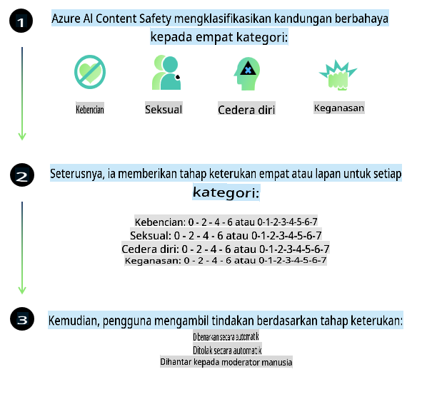
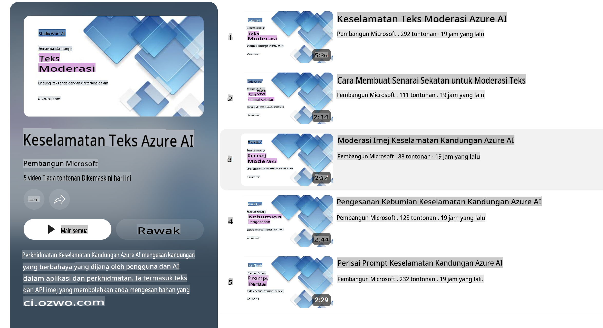

# Keselamatan AI untuk Model Phi  
Keluarga model Phi dibangunkan selaras dengan [Microsoft Responsible AI Standard](https://query.prod.cms.rt.microsoft.com/cms/api/am/binary/RE5cmFl), iaitu satu set keperluan di seluruh syarikat berdasarkan enam prinsip berikut: akauntabiliti, ketelusan, keadilan, kebolehpercayaan dan keselamatan, privasi dan keselamatan, serta keterangkuman yang membentuk [Prinsip AI Bertanggungjawab Microsoft](https://www.microsoft.com/ai/responsible-ai).  

Seperti model Phi sebelumnya, pendekatan penilaian keselamatan pelbagai aspek dan latihan keselamatan pasca telah diterapkan, dengan langkah tambahan diambil untuk mengambil kira keupayaan pelbagai bahasa dalam keluaran ini. Pendekatan kami terhadap latihan dan penilaian keselamatan, termasuk ujian merentasi pelbagai bahasa dan kategori risiko, dihuraikan dalam [Kertas Latihan Keselamatan Phi Pasca](https://arxiv.org/abs/2407.13833). Walaupun model Phi mendapat manfaat daripada pendekatan ini, pembangun harus menerapkan amalan terbaik AI bertanggungjawab, termasuk memetakan, mengukur, dan mengurangkan risiko yang berkaitan dengan kes penggunaan tertentu serta konteks budaya dan linguistik mereka.  

## Amalan Terbaik  

Seperti model lain, keluarga model Phi berpotensi untuk berkelakuan dengan cara yang tidak adil, tidak boleh dipercayai, atau menyinggung.  

Beberapa tingkah laku yang perlu diberi perhatian termasuk:  

- **Kualiti Perkhidmatan:** Model Phi dilatih terutamanya menggunakan teks dalam bahasa Inggeris. Bahasa selain Inggeris mungkin mengalami prestasi yang lebih rendah. Varieti bahasa Inggeris dengan kurang perwakilan dalam data latihan mungkin mengalami prestasi yang lebih rendah berbanding bahasa Inggeris Amerika standard.  
- **Perwakilan Bahaya & Pengukuhan Stereotaip:** Model ini boleh melebihkan atau mengurangkan perwakilan kumpulan tertentu, menghapuskan perwakilan sesetengah kumpulan, atau mengukuhkan stereotaip yang merendahkan atau negatif. Walaupun terdapat latihan keselamatan pasca, batasan ini mungkin masih wujud kerana tahap perwakilan kumpulan yang berbeza atau kelaziman contoh stereotaip negatif dalam data latihan yang mencerminkan pola dunia nyata dan bias masyarakat.  
- **Kandungan Tidak Sesuai atau Menyinggung:** Model ini mungkin menghasilkan kandungan lain yang tidak sesuai atau menyinggung, yang mungkin menjadikannya tidak sesuai untuk digunakan dalam konteks sensitif tanpa mitigasi tambahan yang khusus untuk kes penggunaan tersebut.  
- **Kebolehpercayaan Maklumat:** Model bahasa boleh menghasilkan kandungan yang tidak masuk akal atau mencipta kandungan yang mungkin kelihatan munasabah tetapi sebenarnya tidak tepat atau sudah ketinggalan zaman.  
- **Skop Terhad untuk Kod:** Majoriti data latihan Phi-3 berdasarkan Python dan menggunakan pakej biasa seperti "typing, math, random, collections, datetime, itertools". Jika model menghasilkan skrip Python yang menggunakan pakej lain atau skrip dalam bahasa lain, kami sangat mengesyorkan pengguna untuk mengesahkan secara manual semua penggunaan API.  

Pembangun harus menerapkan amalan terbaik AI bertanggungjawab dan bertanggungjawab untuk memastikan kes penggunaan tertentu mematuhi undang-undang dan peraturan yang relevan (contohnya, privasi, perdagangan, dll.).  

## Pertimbangan AI Bertanggungjawab  

Seperti model bahasa lain, siri model Phi berpotensi untuk berkelakuan dengan cara yang tidak adil, tidak boleh dipercayai, atau menyinggung. Beberapa tingkah laku yang perlu diberi perhatian termasuk:  

**Kualiti Perkhidmatan:** Model Phi dilatih terutamanya menggunakan teks dalam bahasa Inggeris. Bahasa selain Inggeris mungkin mengalami prestasi yang lebih rendah. Varieti bahasa Inggeris dengan kurang perwakilan dalam data latihan mungkin mengalami prestasi yang lebih rendah berbanding bahasa Inggeris Amerika standard.  

**Perwakilan Bahaya & Pengukuhan Stereotaip:** Model ini boleh melebihkan atau mengurangkan perwakilan kumpulan tertentu, menghapuskan perwakilan sesetengah kumpulan, atau mengukuhkan stereotaip yang merendahkan atau negatif. Walaupun terdapat latihan keselamatan pasca, batasan ini mungkin masih wujud kerana tahap perwakilan kumpulan yang berbeza atau kelaziman contoh stereotaip negatif dalam data latihan yang mencerminkan pola dunia nyata dan bias masyarakat.  

**Kandungan Tidak Sesuai atau Menyinggung:** Model ini mungkin menghasilkan kandungan lain yang tidak sesuai atau menyinggung, yang mungkin menjadikannya tidak sesuai untuk digunakan dalam konteks sensitif tanpa mitigasi tambahan yang khusus untuk kes penggunaan tersebut.  

**Kebolehpercayaan Maklumat:** Model bahasa boleh menghasilkan kandungan yang tidak masuk akal atau mencipta kandungan yang mungkin kelihatan munasabah tetapi sebenarnya tidak tepat atau sudah ketinggalan zaman.  

**Skop Terhad untuk Kod:** Majoriti data latihan Phi-3 berdasarkan Python dan menggunakan pakej biasa seperti "typing, math, random, collections, datetime, itertools". Jika model menghasilkan skrip Python yang menggunakan pakej lain atau skrip dalam bahasa lain, kami sangat mengesyorkan pengguna untuk mengesahkan secara manual semua penggunaan API.  

Pembangun harus menerapkan amalan terbaik AI bertanggungjawab dan bertanggungjawab untuk memastikan kes penggunaan tertentu mematuhi undang-undang dan peraturan yang relevan (contohnya, privasi, perdagangan, dll.). Kawasan penting untuk dipertimbangkan termasuk:  

**Peruntukan:** Model mungkin tidak sesuai untuk senario yang boleh memberi kesan besar terhadap status undang-undang atau peruntukan sumber atau peluang hidup (contohnya, perumahan, pekerjaan, kredit, dll.) tanpa penilaian lanjut dan teknik pengurangan bias tambahan.  

**Senario Berisiko Tinggi:** Pembangun harus menilai kesesuaian penggunaan model dalam senario berisiko tinggi di mana output yang tidak adil, tidak boleh dipercayai, atau menyinggung boleh menjadi sangat mahal atau membawa kepada kemudaratan. Ini termasuk memberikan nasihat dalam domain sensitif atau pakar di mana ketepatan dan kebolehpercayaan adalah kritikal (contohnya, nasihat undang-undang atau kesihatan). Langkah perlindungan tambahan harus dilaksanakan di peringkat aplikasi mengikut konteks pelaksanaan.  

**Maklumat Salah:** Model mungkin menghasilkan maklumat yang tidak tepat. Pembangun harus mengikuti amalan terbaik ketelusan dan memaklumkan pengguna akhir bahawa mereka berinteraksi dengan sistem AI. Di peringkat aplikasi, pembangun boleh membina mekanisme maklum balas dan saluran untuk mengasaskan respons dalam maklumat kontekstual khusus kes penggunaan, teknik yang dikenali sebagai Retrieval Augmented Generation (RAG).  

**Penghasilan Kandungan Berbahaya:** Pembangun harus menilai output berdasarkan konteksnya dan menggunakan pengelas keselamatan yang tersedia atau penyelesaian khusus yang sesuai dengan kes penggunaan mereka.  

**Penyalahgunaan:** Bentuk penyalahgunaan lain seperti penipuan, spam, atau penghasilan perisian hasad mungkin boleh berlaku, dan pembangun harus memastikan bahawa aplikasi mereka tidak melanggar undang-undang dan peraturan yang berkenaan.  

### Penalaan dan Keselamatan Kandungan AI  

Selepas menala model, kami sangat mengesyorkan menggunakan langkah-langkah [Azure AI Content Safety](https://learn.microsoft.com/azure/ai-services/content-safety/overview) untuk memantau kandungan yang dihasilkan oleh model, mengenal pasti dan menyekat potensi risiko, ancaman, dan isu kualiti.  

  

[Azure AI Content Safety](https://learn.microsoft.com/azure/ai-services/content-safety/overview) menyokong kandungan teks dan imej. Ia boleh dilaksanakan di awan, kontena yang terputus, dan pada peranti edge/terbenam.  

## Gambaran Keseluruhan Keselamatan Kandungan AI Azure  

Azure AI Content Safety bukanlah penyelesaian yang sesuai untuk semua; ia boleh disesuaikan dengan dasar khusus perniagaan. Selain itu, model pelbagai bahasanya membolehkan ia memahami pelbagai bahasa secara serentak.  

  

- **Keselamatan Kandungan AI Azure**  
- **Microsoft Developer**  
- **5 video**  

Perkhidmatan Keselamatan Kandungan AI Azure mengesan kandungan berbahaya yang dihasilkan oleh pengguna dan AI dalam aplikasi dan perkhidmatan. Ia termasuk API teks dan imej yang membolehkan anda mengesan bahan berbahaya atau tidak sesuai.  

[Senarai Main Keselamatan Kandungan AI](https://www.youtube.com/playlist?list=PLlrxD0HtieHjaQ9bJjyp1T7FeCbmVcPkQ)  

**Penafian**:  
Dokumen ini telah diterjemahkan menggunakan perkhidmatan terjemahan AI berasaskan mesin. Walaupun kami berusaha untuk memastikan ketepatan, sila ambil perhatian bahawa terjemahan automatik mungkin mengandungi kesilapan atau ketidaktepatan. Dokumen asal dalam bahasa asalnya harus dianggap sebagai sumber yang berwibawa. Untuk maklumat penting, terjemahan manusia profesional adalah disyorkan. Kami tidak bertanggungjawab ke atas sebarang salah faham atau salah tafsir yang timbul daripada penggunaan terjemahan ini.