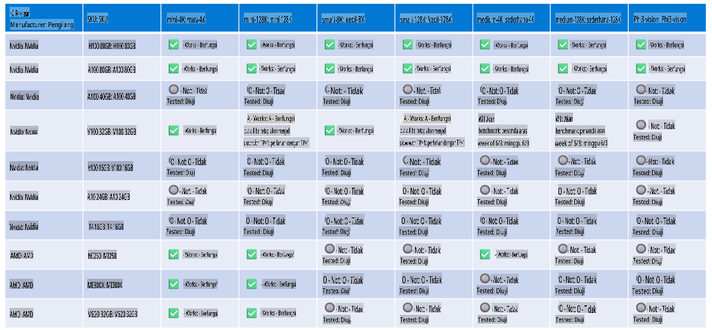

# Sokongan Perkakasan Phi

Microsoft Phi telah dioptimumkan untuk ONNX Runtime dan menyokong Windows DirectML. Ia berfungsi dengan baik pada pelbagai jenis perkakasan, termasuk GPU, CPU, dan juga peranti mudah alih.

## Perkakasan Peranti
Secara khusus, perkakasan yang disokong termasuk:

- GPU SKU: RTX 4090 (DirectML)
- GPU SKU: 1 A100 80GB (CUDA)
- CPU SKU: Standard F64s v2 (64 vCPUs, 128 GiB memori)

## SKU Mudah Alih

- Android - Samsung Galaxy S21
- Apple iPhone 14 atau pemproses A16/A17 yang lebih tinggi

## Spesifikasi Perkakasan Phi

- Konfigurasi Minimum Diperlukan.
- Windows: GPU yang menyokong DirectX 12 dan sekurang-kurangnya 4GB RAM gabungan

CUDA: NVIDIA GPU dengan Compute Capability >= 7.02



## Menjalankan onnxruntime pada pelbagai GPU

Model Phi ONNX yang tersedia sekarang hanya untuk 1 GPU. Ia mungkin untuk menyokong multi-gpu bagi model Phi, tetapi ORT dengan 2 GPU tidak menjamin bahawa ia akan memberikan lebih banyak throughput berbanding dengan 2 instance ORT. Sila rujuk [ONNX Runtime](https://onnxruntime.ai/) untuk kemas kini terkini.

Di [Build 2024 the GenAI ONNX Team](https://youtu.be/WLW4SE8M9i8?si=EtG04UwDvcjunyfC) mengumumkan bahawa mereka telah mengaktifkan multi-instance dan bukannya multi-gpu untuk model Phi.

Pada masa ini, ini membolehkan anda menjalankan satu instance onnxruntime atau onnxruntime-genai dengan pembolehubah persekitaran CUDA_VISIBLE_DEVICES seperti berikut.

```Python
CUDA_VISIBLE_DEVICES=0 python infer.py
CUDA_VISIBLE_DEVICES=1 python infer.py
```

Jangan ragu untuk meneroka Phi dengan lebih lanjut di [Azure AI Foundry](https://ai.azure.com)

**Penafian**:  
Dokumen ini telah diterjemahkan menggunakan perkhidmatan terjemahan AI berasaskan mesin. Walaupun kami berusaha untuk memastikan ketepatan, sila ambil maklum bahawa terjemahan automatik mungkin mengandungi kesilapan atau ketidaktepatan. Dokumen asal dalam bahasa asalnya harus dianggap sebagai sumber yang berwibawa. Untuk maklumat penting, terjemahan manusia profesional adalah disyorkan. Kami tidak bertanggungjawab atas sebarang salah faham atau salah tafsir yang timbul daripada penggunaan terjemahan ini.