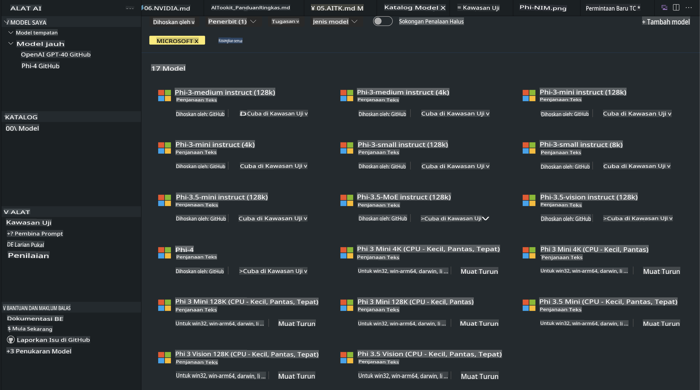
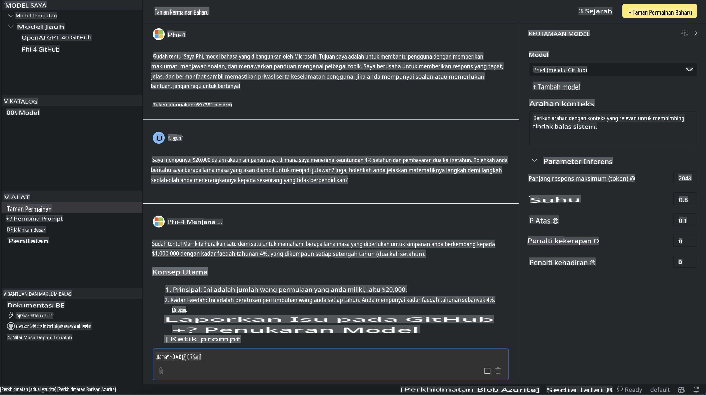

# Keluarga Phi dalam AITK

[AI Toolkit untuk VS Code](https://marketplace.visualstudio.com/items?itemName=ms-windows-ai-studio.windows-ai-studio) mempermudah pengembangan aplikasi AI generatif dengan menggabungkan alat pengembangan AI terkini dan model dari Azure AI Foundry Catalog serta katalog lain seperti Hugging Face. Anda dapat menjelajahi katalog model AI yang didukung oleh GitHub Models dan Azure AI Foundry Model Catalogs, mengunduhnya secara lokal atau jarak jauh, melakukan fine-tuning, menguji, dan menggunakannya dalam aplikasi Anda.

AI Toolkit Preview akan berjalan secara lokal. Untuk inference atau fine-tuning lokal, tergantung pada model yang Anda pilih, Anda mungkin memerlukan GPU seperti NVIDIA CUDA GPU. Anda juga dapat menjalankan GitHub Models langsung dengan AITK.

## Memulai

[Pelajari cara menginstal Windows Subsystem for Linux](https://learn.microsoft.com/windows/wsl/install?WT.mc_id=aiml-137032-kinfeylo)

dan [mengubah distribusi default](https://learn.microsoft.com/windows/wsl/install#change-the-default-linux-distribution-installed).

[Repositori GitHub AI Toolkit](https://github.com/microsoft/vscode-ai-toolkit/)

- Windows, Linux, macOS
  
- Untuk melakukan fine-tuning di Windows dan Linux, Anda memerlukan Nvidia GPU. Selain itu, **Windows** memerlukan subsystem untuk Linux dengan distribusi Ubuntu versi 18.4 atau lebih baru. [Pelajari cara menginstal Windows Subsystem for Linux](https://learn.microsoft.com/windows/wsl/install) dan [mengubah distribusi default](https://learn.microsoft.com/windows/wsl/install#change-the-default-linux-distribution-installed).

### Menginstal AI Toolkit

AI Toolkit tersedia sebagai [Ekstensi Visual Studio Code](https://code.visualstudio.com/docs/setup/additional-components#_vs-code-extensions), jadi Anda perlu menginstal [VS Code](https://code.visualstudio.com/docs/setup/windows?WT.mc_id=aiml-137032-kinfeylo) terlebih dahulu, dan mengunduh AI Toolkit dari [VS Marketplace](https://marketplace.visualstudio.com/items?itemName=ms-windows-ai-studio.windows-ai-studio). 
[AI Toolkit tersedia di Visual Studio Marketplace](https://marketplace.visualstudio.com/items?itemName=ms-windows-ai-studio.windows-ai-studio) dan dapat diinstal seperti ekstensi VS Code lainnya.

Jika Anda belum familiar dengan cara menginstal ekstensi VS Code, ikuti langkah-langkah berikut:

### Masuk

1. Di Activity Bar pada VS Code, pilih **Extensions**.
1. Di bilah pencarian Extensions, ketik "AI Toolkit".
1. Pilih "AI Toolkit for Visual Studio Code".
1. Pilih **Install**.

Sekarang, Anda siap menggunakan ekstensi ini!

Anda akan diminta untuk masuk ke GitHub, jadi klik "Allow" untuk melanjutkan. Anda akan diarahkan ke halaman masuk GitHub.

Silakan masuk dan ikuti langkah-langkah prosesnya. Setelah selesai, Anda akan diarahkan kembali ke VS Code.

Setelah ekstensi berhasil diinstal, ikon AI Toolkit akan muncul di Activity Bar Anda.

Mari kita eksplorasi aksi-aksi yang tersedia!

### Aksi yang Tersedia

Sidebar utama AI Toolkit diorganisasikan ke dalam  

- **Models**
- **Resources**
- **Playground**  
- **Fine-tuning**
- **Evaluation**

Semuanya tersedia di bagian Resources. Untuk memulai, pilih **Model Catalog**.

### Mengunduh Model dari Katalog

Setelah meluncurkan AI Toolkit dari sidebar VS Code, Anda dapat memilih dari opsi berikut:



- Cari model yang didukung dari **Model Catalog** dan unduh secara lokal
- Uji inference model di **Model Playground**
- Lakukan fine-tuning model secara lokal atau jarak jauh di **Model Fine-tuning**
- Deploy model yang telah di-fine-tune ke cloud melalui command palette AI Toolkit
- Evaluasi model

> [!NOTE]
>
> **GPU vs CPU**
>
> Anda akan melihat bahwa kartu model menunjukkan ukuran model, platform, dan jenis akselerator (CPU, GPU). Untuk performa yang optimal pada **perangkat Windows yang memiliki setidaknya satu GPU**, pilih versi model yang hanya menargetkan Windows.
>
> Ini memastikan Anda memiliki model yang dioptimalkan untuk akselerator DirectML.
>
> Nama model menggunakan format
>
> - `{model_name}-{accelerator}-{quantization}-{format}`.
>
>Untuk memeriksa apakah perangkat Windows Anda memiliki GPU, buka **Task Manager** dan pilih tab **Performance**. Jika Anda memiliki GPU, akan terdaftar dengan nama seperti "GPU 0" atau "GPU 1".

### Menjalankan Model di Playground

Setelah semua parameter diatur, klik **Generate Project**.

Setelah model Anda diunduh, pilih **Load in Playground** pada kartu model di katalog:

- Memulai unduhan model
- Menginstal semua prasyarat dan dependensi
- Membuat workspace di VS Code



### Menggunakan REST API dalam Aplikasi Anda

AI Toolkit dilengkapi dengan server REST API lokal **di port 5272** yang menggunakan format [OpenAI chat completions](https://platform.openai.com/docs/api-reference/chat/create). 

Ini memungkinkan Anda untuk menguji aplikasi secara lokal tanpa harus bergantung pada layanan model AI cloud. Sebagai contoh, file JSON berikut menunjukkan bagaimana mengonfigurasi body dari permintaan:

```json
{
    "model": "Phi-4",
    "messages": [
        {
            "role": "user",
            "content": "what is the golden ratio?"
        }
    ],
    "temperature": 0.7,
    "top_p": 1,
    "top_k": 10,
    "max_tokens": 100,
    "stream": true
}
```

Anda dapat menguji REST API menggunakan (misalnya) [Postman](https://www.postman.com/) atau utilitas CURL (Client URL):

```bash
curl -vX POST http://127.0.0.1:5272/v1/chat/completions -H 'Content-Type: application/json' -d @body.json
```

### Menggunakan Library Klien OpenAI untuk Python

```python
from openai import OpenAI

client = OpenAI(
    base_url="http://127.0.0.1:5272/v1/", 
    api_key="x" # required for the API but not used
)

chat_completion = client.chat.completions.create(
    messages=[
        {
            "role": "user",
            "content": "what is the golden ratio?",
        }
    ],
    model="Phi-4",
)

print(chat_completion.choices[0].message.content)
```

### Menggunakan Library Klien Azure OpenAI untuk .NET

Tambahkan [Azure OpenAI client library untuk .NET](https://www.nuget.org/packages/Azure.AI.OpenAI/) ke proyek Anda menggunakan NuGet:

```bash
dotnet add {project_name} package Azure.AI.OpenAI --version 1.0.0-beta.17
```

Tambahkan file C# bernama **OverridePolicy.cs** ke proyek Anda dan tempelkan kode berikut:

```csharp
// OverridePolicy.cs
using Azure.Core.Pipeline;
using Azure.Core;

internal partial class OverrideRequestUriPolicy(Uri overrideUri)
    : HttpPipelineSynchronousPolicy
{
    private readonly Uri _overrideUri = overrideUri;

    public override void OnSendingRequest(HttpMessage message)
    {
        message.Request.Uri.Reset(_overrideUri);
    }
}
```

Selanjutnya, tempelkan kode berikut ke file **Program.cs** Anda:

```csharp
// Program.cs
using Azure.AI.OpenAI;

Uri localhostUri = new("http://localhost:5272/v1/chat/completions");

OpenAIClientOptions clientOptions = new();
clientOptions.AddPolicy(
    new OverrideRequestUriPolicy(localhostUri),
    Azure.Core.HttpPipelinePosition.BeforeTransport);
OpenAIClient client = new(openAIApiKey: "unused", clientOptions);

ChatCompletionsOptions options = new()
{
    DeploymentName = "Phi-4",
    Messages =
    {
        new ChatRequestSystemMessage("You are a helpful assistant. Be brief and succinct."),
        new ChatRequestUserMessage("What is the golden ratio?"),
    }
};

StreamingResponse<StreamingChatCompletionsUpdate> streamingChatResponse
    = await client.GetChatCompletionsStreamingAsync(options);

await foreach (StreamingChatCompletionsUpdate chatChunk in streamingChatResponse)
{
    Console.Write(chatChunk.ContentUpdate);
}
```

## Fine-Tuning dengan AI Toolkit

- Mulai dengan penemuan model dan playground.
- Fine-tuning model dan inference menggunakan sumber daya komputasi lokal.
- Fine-tuning jarak jauh dan inference menggunakan sumber daya Azure.

[Fine-Tuning dengan AI Toolkit](../../03.FineTuning/Finetuning_VSCodeaitoolkit.md)

## Sumber Daya Q&A AI Toolkit

Silakan lihat [halaman Q&A kami](https://github.com/microsoft/vscode-ai-toolkit/blob/main/archive/QA.md) untuk masalah dan solusi yang paling umum.

**Penafian**:  
Dokumen ini telah diterjemahkan menggunakan perkhidmatan terjemahan AI berasaskan mesin. Walaupun kami berusaha untuk memastikan ketepatan, sila ambil perhatian bahawa terjemahan automatik mungkin mengandungi kesilapan atau ketidaktepatan. Dokumen asal dalam bahasa asalnya harus dianggap sebagai sumber yang berwibawa. Untuk maklumat penting, terjemahan manusia profesional adalah disyorkan. Kami tidak bertanggungjawab terhadap sebarang salah faham atau salah tafsir yang timbul daripada penggunaan terjemahan ini.