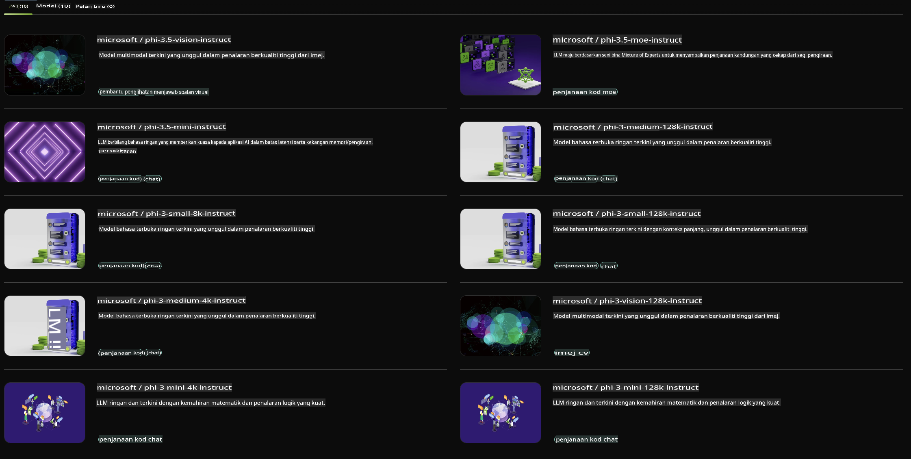

## Keluarga Phi dalam NVIDIA NIM

NVIDIA NIM adalah sekumpulan mikroservis yang mudah digunakan, dirancang untuk mempercepat penerapan model AI generatif di awan, pusat data, dan workstation. NIM dikategorikan berdasarkan keluarga model dan per model tertentu. Sebagai contoh, NVIDIA NIM untuk model bahasa besar (LLM) membawa kekuatan model LLM terkini ke aplikasi perusahaan, memberikan kemampuan pemrosesan dan pemahaman bahasa alami yang tak tertandingi.

NIM mempermudah tim IT dan DevOps untuk meng-host model bahasa besar (LLM) di lingkungan yang mereka kelola sendiri sambil tetap menyediakan API standar industri kepada pengembang, memungkinkan mereka membangun copilots, chatbot, dan asisten AI yang kuat yang dapat mentransformasi bisnis mereka. Dengan memanfaatkan akselerasi GPU NVIDIA yang mutakhir dan penerapan yang skalabel, NIM menawarkan jalur tercepat untuk inferensi dengan performa yang luar biasa.

Anda dapat menggunakan NVIDIA NIM untuk melakukan inferensi Model Keluarga Phi.



### **Contoh - Phi-3-Vision dalam NVIDIA NIM**

Bayangkan Anda memiliki sebuah gambar (`demo.png`) dan Anda ingin menghasilkan kode Python yang memproses gambar tersebut dan menyimpan versi barunya (`phi-3-vision.jpg`).

Kode di atas mengotomatiskan proses ini dengan:

1. Menyiapkan lingkungan dan konfigurasi yang diperlukan.
2. Membuat prompt yang menginstruksikan model untuk menghasilkan kode Python yang diperlukan.
3. Mengirimkan prompt ke model dan mengumpulkan kode yang dihasilkan.
4. Mengekstrak dan menjalankan kode yang dihasilkan.
5. Menampilkan gambar asli dan gambar yang telah diproses.

Pendekatan ini memanfaatkan kekuatan AI untuk mengotomatiskan tugas pemrosesan gambar, sehingga lebih mudah dan cepat mencapai tujuan Anda.

[Solusi Kode Contoh](../../../../../code/06.E2E/E2E_Nvidia_NIM_Phi3_Vision.ipynb)

Mari kita uraikan langkah demi langkah apa yang dilakukan seluruh kode:

1. **Menginstal Paket yang Diperlukan**:
    ```python
    !pip install langchain_nvidia_ai_endpoints -U
    ```
    Perintah ini menginstal paket `langchain_nvidia_ai_endpoints`, memastikan versinya adalah yang terbaru.

2. **Mengimpor Modul yang Diperlukan**:
    ```python
    from langchain_nvidia_ai_endpoints import ChatNVIDIA
    import getpass
    import os
    import base64
    ```
    Impor ini membawa modul-modul yang diperlukan untuk berinteraksi dengan endpoint AI NVIDIA, menangani kata sandi dengan aman, berinteraksi dengan sistem operasi, dan melakukan encoding/decoding data dalam format base64.

3. **Mengatur API Key**:
    ```python
    if not os.getenv("NVIDIA_API_KEY"):
        os.environ["NVIDIA_API_KEY"] = getpass.getpass("Enter your NVIDIA API key: ")
    ```
    Kode ini memeriksa apakah variabel lingkungan `NVIDIA_API_KEY` sudah diatur. Jika tidak, pengguna diminta untuk memasukkan API key mereka dengan aman.

4. **Menentukan Model dan Path Gambar**:
    ```python
    model = 'microsoft/phi-3-vision-128k-instruct'
    chat = ChatNVIDIA(model=model)
    img_path = './imgs/demo.png'
    ```
    Ini menentukan model yang akan digunakan, membuat instance `ChatNVIDIA` dengan model yang ditentukan, dan mendefinisikan path ke file gambar.

5. **Membuat Prompt Teks**:
    ```python
    text = "Please create Python code for image, and use plt to save the new picture under imgs/ and name it phi-3-vision.jpg."
    ```
    Ini mendefinisikan prompt teks yang menginstruksikan model untuk menghasilkan kode Python untuk memproses gambar.

6. **Menyandikan Gambar dalam Base64**:
    ```python
    with open(img_path, "rb") as f:
        image_b64 = base64.b64encode(f.read()).decode()
    image = f''
    ```
    Kode ini membaca file gambar, menyandikannya dalam base64, dan membuat tag gambar HTML dengan data yang telah disandikan.

7. **Menggabungkan Teks dan Gambar ke dalam Prompt**:
    ```python
    prompt = f"{text} {image}"
    ```
    Ini menggabungkan prompt teks dan tag gambar HTML ke dalam satu string.

8. **Menghasilkan Kode Menggunakan ChatNVIDIA**:
    ```python
    code = ""
    for chunk in chat.stream(prompt):
        print(chunk.content, end="")
        code += chunk.content
    ```
    Kode ini mengirimkan prompt ke `ChatNVIDIA` dan menyimpan konten yang dihasilkan dalam string `code`.

9. **Mengekstrak Kode Python dari Konten yang Dihasilkan**:
    ```python
    begin = code.index('```python') + 9
    code = code[begin:]
    end = code.index('```')
    code = code[:end]
    ```
    Ini mengekstrak kode Python sebenarnya dari konten yang dihasilkan dengan menghapus format markdown.

10. **Menjalankan Kode yang Dihasilkan**:
    ```python
    import subprocess
    result = subprocess.run(["python", "-c", code], capture_output=True)
    ```
    Ini menjalankan kode Python yang diekstrak sebagai subprocess dan menangkap outputnya.

11. **Menampilkan Gambar**:
    ```python
    from IPython.display import Image, display
    display(Image(filename='./imgs/phi-3-vision.jpg'))
    display(Image(filename='./imgs/demo.png'))
    ```
    Baris-baris ini menampilkan gambar menggunakan modul `IPython.display`.

**Penafian**:  
Dokumen ini telah diterjemahkan menggunakan perkhidmatan terjemahan AI berasaskan mesin. Walaupun kami berusaha untuk memastikan ketepatan, sila maklum bahawa terjemahan automatik mungkin mengandungi kesilapan atau ketidaktepatan. Dokumen asal dalam bahasa asalnya harus dianggap sebagai sumber yang berwibawa. Untuk maklumat kritikal, terjemahan manusia profesional adalah disyorkan. Kami tidak bertanggungjawab ke atas sebarang salah faham atau salah tafsir yang timbul daripada penggunaan terjemahan ini.