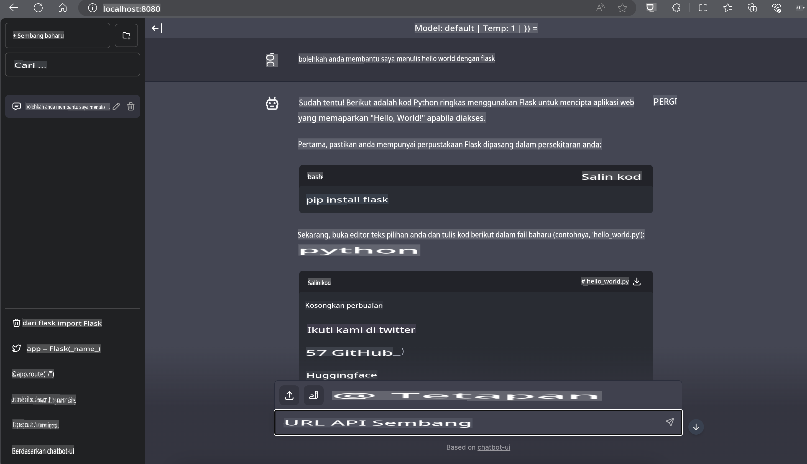

# **Inference Phi-3 dalam Nvidia Jetson**

Nvidia Jetson adalah siri papan pengkomputeran tertanam daripada Nvidia. Model Jetson TK1, TX1, dan TX2 semuanya menggunakan pemproses Tegra (atau SoC) daripada Nvidia yang mengintegrasikan unit pemprosesan pusat (CPU) seni bina ARM. Jetson adalah sistem berkuasa rendah dan direka untuk mempercepatkan aplikasi pembelajaran mesin. Nvidia Jetson digunakan oleh pembangun profesional untuk mencipta produk AI yang inovatif dalam pelbagai industri, serta oleh pelajar dan peminat untuk pembelajaran AI secara praktikal dan mencipta projek-projek hebat. SLM digunakan dalam peranti edge seperti Jetson, yang akan membolehkan pelaksanaan yang lebih baik untuk senario aplikasi AI generatif industri.

## Penggunaan pada NVIDIA Jetson:
Pembangun yang bekerja dengan robotik autonomi dan peranti tertanam boleh memanfaatkan Phi-3 Mini. Saiz Phi-3 yang agak kecil menjadikannya ideal untuk penggunaan pada peranti edge. Parameter telah diselaraskan dengan teliti semasa latihan, memastikan ketepatan tinggi dalam tindak balas.

### Pengoptimuman TensorRT-LLM:
Perpustakaan [TensorRT-LLM NVIDIA](https://github.com/NVIDIA/TensorRT-LLM?WT.mc_id=aiml-138114-kinfeylo) mengoptimumkan inferens model bahasa berskala besar. Ia menyokong tetingkap konteks panjang Phi-3 Mini, meningkatkan throughput dan latensi. Pengoptimuman termasuk teknik seperti LongRoPE, FP8, dan inflight batching.

### Ketersediaan dan Penggunaan:
Pembangun boleh meneroka Phi-3 Mini dengan tetingkap konteks 128K di [NVIDIA's AI](https://www.nvidia.com/en-us/ai-data-science/generative-ai/). Ia dibungkus sebagai NVIDIA NIM, sebuah mikroservis dengan API standard yang boleh digunakan di mana-mana. Selain itu, terdapat [pelaksanaan TensorRT-LLM di GitHub](https://github.com/NVIDIA/TensorRT-LLM).

## **1. Persediaan**

a. Jetson Orin NX / Jetson NX

b. JetPack 5.1.2+
   
c. Cuda 11.8
   
d. Python 3.8+

## **2. Menjalankan Phi-3 di Jetson**

Kita boleh memilih [Ollama](https://ollama.com) atau [LlamaEdge](https://llamaedge.com).

Jika anda ingin menggunakan gguf di awan dan peranti edge pada masa yang sama, LlamaEdge boleh difahami sebagai WasmEdge (WasmEdge adalah runtime WebAssembly yang ringan, berprestasi tinggi, dan berskala, sesuai untuk aplikasi cloud native, edge, dan desentralisasi. Ia menyokong aplikasi serverless, fungsi tertanam, mikroservis, kontrak pintar, dan peranti IoT. Anda boleh menggunakan model kuantitatif gguf ke peranti edge dan awan melalui LlamaEdge).


Berikut adalah langkah-langkah untuk menggunakannya:

1. Pasang dan muat turun perpustakaan dan fail berkaitan

```bash

curl -sSf https://raw.githubusercontent.com/WasmEdge/WasmEdge/master/utils/install.sh | bash -s -- --plugin wasi_nn-ggml

curl -LO https://github.com/LlamaEdge/LlamaEdge/releases/latest/download/llama-api-server.wasm

curl -LO https://github.com/LlamaEdge/chatbot-ui/releases/latest/download/chatbot-ui.tar.gz

tar xzf chatbot-ui.tar.gz

```

**Nota**: llama-api-server.wasm dan chatbot-ui perlu berada dalam direktori yang sama

2. Jalankan skrip dalam terminal

```bash

wasmedge --dir .:. --nn-preload default:GGML:AUTO:{Your gguf path} llama-api-server.wasm -p phi-3-chat

```

Berikut adalah hasilnya:



***Kod Contoh*** [Phi-3 mini WASM Notebook Sample](https://github.com/Azure-Samples/Phi-3MiniSamples/tree/main/wasm)

Kesimpulannya, Phi-3 Mini mewakili lonjakan ke hadapan dalam pemodelan bahasa, menggabungkan kecekapan, kesedaran konteks, dan kepakaran pengoptimuman NVIDIA. Sama ada anda sedang membina robot atau aplikasi edge, Phi-3 Mini adalah alat yang berkuasa untuk dimanfaatkan.

**Penafian**:  
Dokumen ini telah diterjemahkan menggunakan perkhidmatan terjemahan AI berasaskan mesin. Walaupun kami berusaha untuk memastikan ketepatan, sila ambil maklum bahawa terjemahan automatik mungkin mengandungi kesilapan atau ketidaktepatan. Dokumen asal dalam bahasa asalnya hendaklah dianggap sebagai sumber yang berwibawa. Untuk maklumat kritikal, terjemahan manusia profesional adalah disyorkan. Kami tidak bertanggungjawab ke atas sebarang salah faham atau salah tafsir yang timbul daripada penggunaan terjemahan ini.